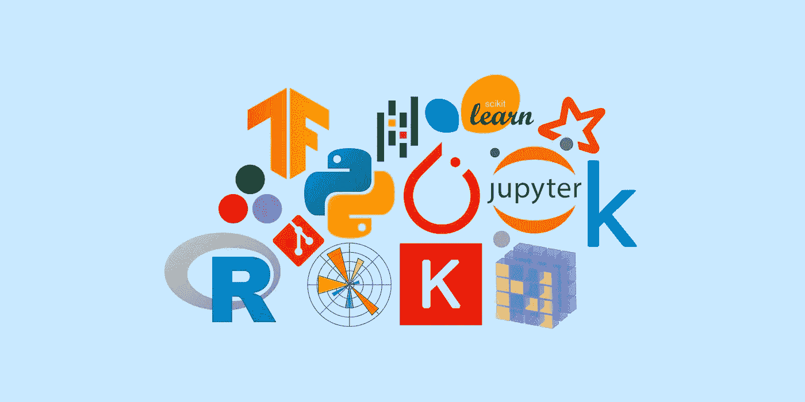

# 👨‍🎓️📊数据科学家—从初学者到专家的 12 个步骤

> 原文：<https://blog.devgenius.io/%EF%B8%8F-data-scientist-12-steps-from-beginner-to-pro-dc461e40b68?source=collection_archive---------2----------------------->

那些希望从零开始在数据科学领域建立职业生涯的人的 12 个步骤。下面是行动指南和一些有用资源的链接。

来源: [proglib.io](https://proglib.io/)

# 1.决定你想成为谁💭

数据科学领域正在蓬勃发展。但是数据科学**不仅仅是神经网络**，还有经典统计学和机器学习算法(这对于业务流程来说更容易理解)，以及与数字形式的信息的分析、处理和呈现相关的所有事物。

现在还不能说数据科学有明确的分工——这是非专业化的职业。打个粗略的比方:就像曾经有纯粹的 [**计算机科学家**](https://en.wikipedia.org/wiki/Computer_scientist) (计算机科学家和程序员)了解与计算机有关的一切一样，现在也有**数据科学家**从事与数据有关的一切。劳动专业化的第一个标志是在线教育领域。

不管怎样，数据科学家在几个领域的交叉领域工作:

*   ▶️ **数学**(包括线性代数、机器学习算法)
*   ▶️ **编程**(例如 Python、r、SQL 通常是最低要求)
*   ▶️ **业务问题**(是的，除了计算机科学，你还应该了解什么是业务流程，以及如何改进它)

根据你在团队中的角色，有些事情需要做得更多。当选择发展的载体时，从你自己的兴趣开始——学习需要大量的资源，如果没有对工作的热爱，你会很快耗尽精力。数学基础是必要的，但很可能个人的任务圈将会减少到使用现有的工具和知识，而不是发明新的东西。正如 K. V .沃龙佐夫在的一次采访中所说:

> 知道如何使用现成算法的人需要多 50-100-500 倍。似乎如何教授计算机科学的问题和“更多数学还是更多工程”的问题有了以下答案:你两者都需要，但你必须将数学教授给一群精心挑选的人，他们意识到自己是新方法的创造者和设计者

# 2.拉起➕的数学基础

如果你想真正理解机器学习算法，你需要先理解[线性代数](https://en.wikipedia.org/wiki/Linear_algebra)、[多元微积分](https://en.wikipedia.org/wiki/Multivariable_calculus)、[概率论](https://en.wikipedia.org/wiki/Probability_theory)和[数理统计](https://en.wikipedia.org/wiki/Mathematical_statistics)。

Stepik 为每个知识测试领域提供了合适的免费视频课程:

*   [线性代数](https://stepik.org/course/2461) **(17 小时的课)**
*   [微积分入门](https://stepik.org/course/95) **(26 学时)**
*   [概率论](https://stepik.org/course/3089) **(38 小时)**
*   [统计学基础](https://stepik.org/course/76)，[第二部分](https://stepik.org/course/524)，[第三部分](https://stepik.org/course/2152) **(共 43 小时)**

如果插图、可视化还不够，强烈推荐看一下精彩频道 [**3Blue1Brown**](https://www.youtube.com/channel/UCYO_jab_esuFRV4b17AJtAw) 。有[线性代数](https://www.youtube.com/watch?v=fNk_zzaMoSs&list=PLZHQObOWTQDPD3MizzM2xVFitgF8hE_ab)、[解析](https://www.youtube.com/watch?v=WUvTyaaNkzM&list=PLZHQObOWTQDMsr9K-rj53DwVRMYO3t5Yr)、[微分方程](https://www.youtube.com/watch?v=p_di4Zn4wz4&list=PLZHQObOWTQDNPOjrT6KVlfJuKtYTftqH6)的播放列表。

对了，**可汗学院频道** 上有多元数学分析[175 个视频的](https://www.youtube.com/watch?v=TrcCbdWwCBc&list=PLSQl0a2vh4HC5feHa6Rc5c0wbRTx56nF7)[详细课程。](https://www.youtube.com/watch?v=TrcCbdWwCBc&list=PLSQl0a2vh4HC5feHa6Rc5c0wbRTx56nF7)

在进行视频讲座时，不要忘记快进的可能性。要使用运动记忆并更深入地研究材料，请做笔记。

# 3.学习编程👨‍💻️

除了数学，你还需要会编程。通常选择 Python 或 R 作为数据分析师的主要语言。Stepik 在这两种语言上都有很好的课程，包括强调数据分析:

*   Python 编程[第一部分](https://stepik.org/course/67/promo)和[第二部分](https://stepik.org/course/512/promo)。
*   [R 中的编程基础](https://stepik.org/course/497)。
*   [分析 R](https://stepik.org/course/129) 、[第二部分](https://stepik.org/course/724)中的数据。

数据科学的新手经常会有一个问题，关于选择哪种语言为主——专门为数据处理创建的****R 还是通用 Python** 。虽然这是一个热门话题，但我个人从 R 开始(在计算生物学中人们更喜欢它)，然而，现在我知道这两种语言，并强烈推荐从 Python 开始的**，因为与向后方向相比，从 Python - > R 的过渡更加平滑。****

****简而言之:**如果你打算从事数据科学，我建议[你精通两种语言](https://proglib.io/p/r-and-python/)。了解 R 概念和库会让你比只使用 Python 的用户领先一步，反之亦然。以下是数据分析师[伊琳娜·戈洛沙波娃](https://habr.com/ru/users/efaldgent/) [对此的描述:](https://habr.com/ru/company/ods/blog/348260/)**

> **通过在某些情况下结合最强大和稳定的 R 和 Python 库，可以提高计算的效率，或者避免为实现任何统计模型而发明自行车。**
> 
> **其次，如果你的团队中不同的人(或者你自己)对不同的语言有很好的了解，这将增加项目执行的速度和便利性。现有 R 和 Python 编程技能的合理组合会有所帮助。**

**但是如果你想去，虽然不是一个简单但更容易的方法，那么一个 Python 就足够了——你会在它上面找到更多的课程和各种问题的答案。**

# **4.学会使用工具🛠️**

**Jupyter 笔记本是最受欢迎的数据分析结果共享工具之一:**

**Jupyter 笔记本和 Jupyter 实验室平台允许您将代码、Markdown 中的文本和 LaTeX 中的公式、测试和分析合并到一个文档中。或者，你可以使用[的谷歌实验室](https://colab.research.google.com/)或[的 JupyterHub](https://jupyter.org/hub) 在笔记本上合作。**

**尽快学会[使用 Git](https://proglib.io/p/git-for-half-an-hour) 。在这个过程中，您将不得不在各种模型和架构解决方案之间进行选择——版本控制在这里非常有用。**

**另外，GitHub 上有许多伟大的数据科学项目。请记住，开源是获得必要的团队合作经验和为共同事业做出贡献的最简单的方法之一。**

**随着课程的进展，您会自然而然地遇到其他流行的工具。比如在 Python 中对于数据数组的高速处理，需要 [NumPy](https://proglib.io/p/illyustrirovannoe-rukovodstvo-po-izmeneniyu-formy-mnogomernyh-massivov-numpy-2020-01-12) 的知识，对于表格数据呈现，通常使用 [Pandas](https://proglib.io/p/pandas-tricks) dataframes，对于可视化——从 [Scikit-learn](https://scikit-learn.org/stable/) 导入 [MatplotLib](https://matplotlib.org/) 或 [Plotly](https://proglib.io/p/plotly/) 流行机器学习模型的现成类。**

**很少有课程关注这一点，但在实践中，数据通常存储在数据库中——SQL 或 NoSQL。对于进一步的工作，你需要学习如何与他们沟通:**

*   **[数据库介绍](https://stepik.org/course/551/syllabus)**
*   **[交互式 SQL 训练器](https://stepik.org/course/63054/syllabus)**
*   **[Hadoop。处理大量数据的系统](https://stepik.org/course/150/syllabus)**

**对于深度学习，你需要熟悉框架——tensor flow 或者 PyTorch。还有其他的——我们在文章[“深度学习框架:选择前 10 名”](https://proglib.io/p/dl-frameworks)中对它们进行了比较。**

# **5.尽可能多地学习数据科学课程🎓**

**英语语言课程:**

*   **[吴恩达在 Coursera](https://www.coursera.org/course/ml) 上的机器学习课程是最受欢迎的 MOOCs 之一。仅仅因为它经常被引用到其他高级课程中，它就值得一学。但是用的是 Octave / Matlab，而不是标准的 Python 和 r。**
*   **深入学习:免费互动书籍，包含代码、数学和讨论 [http://d2l.ai](https://vk.com/away.php?to=http%3A%2F%2Fd2l.ai&post=-91453124_3675&cc_key=)**
*   **Leskovets 等人[挖掘海量数据集](http://www.mmds.org/)。有按章节的分类:pdf，练习，演示，视频。**
*   **[黑客的概率编程和贝叶斯方法](https://camdavidsonpilon.github.io/Probabilistic-Programming-and-Bayesian-Methods-for-Hackers/)**
*   **关于[数据营](https://learn.datacamp.com/)的课程**
*   **[哈佛数据科学](https://www.edx.org/course/subject/data-science)课程(eDX)**

**英语教科书:**

*   **Hasti 等人[统计学习的要素](https://web.stanford.edu/~hastie/ElemStatLearn//printings/ESLII_print10.pdf) (pdf)**
*   **[哈尔·多梅三世](http://ciml.info/)学术[机器学习课程](http://ciml.info/)**
*   **沙莱夫-施瓦茨和本-大卫。理解机器学习:从理论到算法**
*   **大卫·巴伯。[贝叶斯决策理论和机器学习](http://web4.cs.ucl.ac.uk/staff/D.Barber/textbook/181115.pdf) (pdf)**
*   **汤姆·米切尔。[机器学习](http://profsite.um.ac.ir/~monsefi/machine-learning/pdf/Machine-Learning-Tom-Mitchell.pdf) (pdf)**
*   **Devroy 等[模式识别的概率理论](https://www.szit.bme.hu/~gyorfi/pbook.pdf) (pdf)**
*   **设计简洁的版本，易于复制 [R](https://www.manning.com/books/r-in-action) 代码[运行:数据分析和绘图，R](https://www.manning.com/books/r-in-action) 和[机器学习运行](https://www.manning.com/books/machine-learning-in-action)**
*   **[100 多本免费的数据科学书籍](https://www.learndatasci.com/free-data-science-books/)**
*   **[来自 O'Reilly 的免费数据科学书籍](https://www.oreilly.com/data/free/archive.html)**
*   **[关于关键概念和机器学习算法的备忘单](https://github.com/soulmachine/machine-learning-cheat-sheet/raw/master/machine-learning-cheat-sheet.pdf)**

# **6.加入开放数据科学社区👥**

**从数据科学领域的英语新闻聚合器中可以学到很多有趣的东西:**

*   **[/ r /数据科学](http://www.reddit.com/r/datascience)**
*   **[走向数据科学](https://towardsdatascience.com/)**
*   **[KDnuggets](https://www.kdnuggets.com/)**
*   **[DataTau](http://www.datatau.com/)**
*   **[数据科学周刊](http://www.datascienceweekly.org/)**

# **7.参加🤼的比赛**

**在 [Kaggle](https://www.kaggle.com/) 上注册。它不仅是最著名的[机器学习竞赛](https://www.kaggle.com/competitions)平台[，还有现金奖励](https://www.kaggle.com/competitions)，它还是一个拥有[数据集](https://www.kaggle.com/datasets)、 [Jupyter 笔记本](https://www.kaggle.com/notebooks)、[迷你课程](https://www.kaggle.com/learn/overview)、以及[讨论](https://www.kaggle.com/discussion)的大型社区。参与简历上的 Kaggle 排名可以为你的面试加分。**

# **8.探索具体的数据科学问题👁️‍🗨️**

**数据科学是一个非常广泛的跨学科领域，需要特殊的技能来解决特定的问题。在熟悉 Kaggle 之后，你会更清楚自己在哪些知识上有差距。**

**请注意以下 Stepik 课程:**

*   **[生物信息学](https://stepik.org/course/401)课程研究所的神经网络。**
*   **MIPT 深度学习学院深度学习课程:[基础流](https://stepik.org/course/65388/promo)和[高级流](https://stepik.org/course/65389/promo)。**
*   **[神经网络和计算机视觉](https://stepik.org/course/50352/syllabus)。**
*   **[神经网络和文本处理](https://stepik.org/course/54098/syllabus)。**
*   **[自然语言处理入门](https://stepik.org/course/1233/syllabus)。**
*   **[概率图模型](https://stepik.org/course/55453/promo)。**
*   **[数据结构课程](https://stepik.org/course/579)**
*   **[计算机图形学:基础知识](https://stepik.org/course/419/promo)(对处理图像的模型有用)。**

**YouTube 频道也很有用:**

*   **在[计算机科学中心的 YouTube 频道上，专题板块的](https://www.youtube.com/channel/UC0YHNueF-3Nh3uQT0P4YQZw)课程被方便地组织成播放列表:[机器学习](https://www.youtube.com/watch?v=pkI64ocefFU&list=PLlb7e2G7aSpSWVExpq74FnwFnWgLby56L) ( [第二部分](https://www.youtube.com/watch?v=TEyEWTYII64&list=PLlb7e2G7aSpSSsCeUMLN-RxYOLAI9l2ld))[图像与视频分析](https://www.youtube.com/watch?v=zNCvTcoM1I4&list=PLlb7e2G7aSpR6L3pqVh8124ZITsmWckQZ) ( [第二部分](https://www.youtube.com/watch?v=azkzDWi8X64&list=PLlb7e2G7aSpQ4C5ykr2Ce1mfxM01l6_HV))[自然语言处理入门](https://www.youtube.com/watch?v=1lICvMHJ8RE&list=PLlb7e2G7aSpRTcBciP6VBJJPvdH_DXRXQ)，[示例与任务中的 Python 数据分析](https://www.youtube.com/watch?v=enpPFqcIFj8&list=PLlb7e2G7aSpRb95_Wi7lZ-zA6fOjV3_l7) ( [续](https://www.youtube.com/watch?v=enpPFqcIFj8&list=PLlb7e2G7aSpRb95_Wi7lZ-zA6fOjV3_l7))[R 中的数据分析](https://www.youtube.com/watch?v=8mwJ3mEjdIg&list=PLlb7e2G7aSpSSa_PlFEwnd6-3gzAa08_m)，**

**不要停止学习。浏览顶部和侧边栏子编辑，了解与机器学习相关的主题:**

*   **[/ r / analyzit](https://www.reddit.com/r/analyzit)**
*   **[/ r / bigdata](https://www.reddit.com/r/bigdata)**
*   **[/ r /计算机视觉](https://www.reddit.com/r/computervision)**
*   **[/ r /数据清理](https://www.reddit.com/r/datacleaning)**
*   **[/ r / datagangsta](https://www.reddit.com/r/datagangsta)**
*   **[/ r / dataisbeautiful](https://www.reddit.com/r/dataisbeautiful)**
*   **[/ r / dataisugly](https://www.reddit.com/r/dataisugly)**
*   **[/ r /数据科学](https://www.reddit.com/r/datascience)**
*   **[/ r /数据集](https://www.reddit.com/r/datasets)**
*   **[/ r / dataviz](https://www.reddit.com/r/dataviz)**
*   **[/ r / JupyterNotebooks](https://www.reddit.com/r/JupyterNotebooks)**
*   **[/ r / LanguageTechnology](https://www.reddit.com/r/LanguageTechnology)**
*   **[/r/learn 机器学习](https://www.reddit.com/r/learnmachinelearning)**
*   **[/ r / MachineLearning](https://www.reddit.com/r/MachineLearning)**
*   **[/ r / opendata](https://www.reddit.com/r/opendata)**
*   **[/ r / rstats](https://www.reddit.com/r/rstats)**
*   **[/ r /概率论](https://www.reddit.com/r/probabilitytheory)**
*   **[/ r / pystats](https://www.reddit.com/r/pystats)**
*   **[/ r / SampleSize](https://www.reddit.com/r/SampleSize)**
*   **[/ r / semanticweb](https://www.reddit.com/r/semanticweb)**
*   **[/ r /统计](https://www.reddit.com/r/statistics)**
*   **[/ r / textdatamining](https://www.reddit.com/r/textdatamining)**

# **9.在每门课程结束时，做一个项目🏗️**

**利用数据科学领域的新知识造福自己和他人。创造出能让别人说“哇”的东西！在[**awesome-ai-用例**](https://github.com/JosPolfliet/awesome-ai-usecases) 、 [**51 玩具数据问题**](https://www.quora.com/Data-Science/What-are-some-good-toy-problems-can-be-done-over-a-weekend-by-a-single-coder-in-data-science-Im-studying-machine-learning-and-statistics-and-looking-for-something-socially-relevant-using-publicly-available-datasets-APIs/answer/Alex-Kamil) 、 [**实用-熊猫-项目**](https://github.com/schlende/practical-pandas-projects) 中列出了大量的项目创意。**

**你可以不从项目开始，而是从一个有趣的数据集开始。常用注册表列表:**

*   **[data.gov.ru 开放数据注册中心](http://data.gov.ru/opendata)**
*   **[谷歌公共数据集](https://cloud.google.com/bigquery/public-data/)**
*   **[Kaggle 数据集(4 万个)](https://www.kaggle.com/datasets)**
*   **[Reddit / r / datasets 分支](https://www.reddit.com/r/datasets)**
*   **[UCI 机器学习知识库](http://archive.ics.uci.edu/ml/)**
*   **[开源数据集汇总列表 awesome-public-datasets](https://github.com/caesar0301/awesome-public-datasets)**
*   **[大型公共数据集列表](http://www.quora.com/Where-can-I-find-large-datasets-open-to-the-public)**
*   **[质量 Webhose.io 数据集列表](https://webhose.io/datasets)**
*   **[IEEE 协会的数据集](https://ieee-dataport.org/documents)**
*   **[Wolfram 数据下降累加器](https://datadrop.wolframcloud.com/)**
*   **[金融、体育、地理、行业统计数据库](http://www.statisticbrain.com/)**

**Quora 上有很多关于项目想法的讨论:**

*   **[一个程序员可以在一个周末解决哪些数据科学问题？我正在学习机器学习和统计学，并且正在使用公共数据集和 API 寻找一些有社会意义的东西](https://www.quora.com/What-are-some-good-toy-problems-can-be-done-over-a-weekend-by-a-single-coder-in-data-science-Im-studying-machine-learning-and-statistics-and-looking-for-something-socially-relevant-using-publicly-available-datasets-APIs)**
*   **[我如何开始建立一个推荐系统？什么工具/技术/算法最适合用来构建引擎？如何检查建议的有效性？](https://www.quora.com/How-can-I-start-building-a-recommendation-engine-Where-can-I-find-an-interesting-data-set-What-tools-technologies-algorithms-are-best-to-build-the-engine-with-How-do-I-check-the-effectiveness-of-recommendations)**

**在 GitHub 上为每个项目创建一个公共存储库。整理结果，在你的博客和社区上分享。贡献给副业，发表你的想法和想法。所有这些都将帮助你建立一个投资组合，并结识从事相关工作的人。**

# **10.阅读科学文章🔬**

**数据科学的主要语言不是 Python 或者 R，而是英语和数学的语言。**

**文章的预印本发表在 **ArXiv 网站**上。对数据科学家最有用的部分:**

*   **[统计。ML](https://arxiv.org/list/stat.ML/)**
*   **[统计](https://arxiv.org/list/stat/recent)**
*   **[cs。LG](https://arxiv.org/list/cs.LG/recent)**

**跟踪所有的出版物简直是不可能的。上面列出的 Reddit 分支将有助于隔离最重要的文本(自从作者成为特斯拉人工智能部门的负责人以来，该网站开始更频繁地崩溃，但它仍然是最好的工具)。还有[这样一个带有评论的文章列表](https://github.com/shagunsodhani/papers-I-read)和 YouTube 频道 Kaggle [的网络研讨会记录，其中解析了与数据科学算法](https://www.youtube.com/watch?v=PhTF7yJNR70&list=PLqFaTIg4myu8t5ycqvp7I07jTjol3RCl9)相关的科学文章。**

# **11.参加数据科学实习/ Job🕴**

**数据科学是一个需求竞争非常激烈的职业。但即使是采访的结果也被社区成员转化为数据。数据科学家面试需要准备许多问题:**

*   **[数据科学面试问题](https://www.itshared.org/2015/10/data-science-interview-questions.html)**
*   **[我该如何准备数据科学面试](https://www.quora.com/How-do-I-prepare-for-a-data-scientist-interview)**
*   **[如何准备统计题](https://www.quora.com/How-should-I-prepare-for-statistics-questions-for-a-data-science-interview-What-topics-should-I-brush-up-on)**
*   **[面试中会出现哪些类型的 A / B 测试问题](https://www.quora.com/What-kind-of-A-B-testing-questions-should-I-expect-in-a-data-scientist-interview-and-how-should-I-prepare-for-such-questions)**

**今年难度更大，但我们希望暑期学校和实习能很快恢复:**

*   **[哪些公司为学生提供数据科学实习](https://www.quora.com/What-companies-have-data-science-internships-for-undergraduates)**
*   **[如果我想申请数据科学或软件工程领域的实习，需要遵循哪些技巧](https://www.quora.com/What-are-some-tips-to-choose-whether-I-want-to-apply-for-a-Data-Science-or-Software-Engineering-internship)**
*   **[申请暑期数据科学实习的最佳时间是什么时候](https://www.quora.com/When-is-the-best-time-to-apply-for-data-science-summer-internships)**

**一定要使用你的数据挖掘技能来分析就业市场——分析哪些技能在工作中更常见，以尽可能多地磨练它们。估计一下你的预期收入，考虑到在网站上的花费，租房，和搬到另一个城市。**

# **12.与社区分享您的经验📢**

**与数据科学社区共享您的项目或查找它。准备一次演讲，并在当地集会上发言。创建一个博客，分享你的发现、你自己的想法和知识库。**

**最后但同样重要的是，享受你的技能如何帮助世界变得更美好！**

# **13.阅读更多**

***如果您觉得本文有帮助，请单击💚或者👏按钮或分享关于脸书的文章，这样你的朋友也可以从中受益。***