# 利用张量流♻️构建卷积神经网络的♻️Waste 分类

> 原文：<https://blog.devgenius.io/%EF%B8%8Fwaste-classification-by-building-convolutional-neural-network-cnn-using-tensorflow-%EF%B8%8F-8dca408a0c0b?source=collection_archive---------10----------------------->

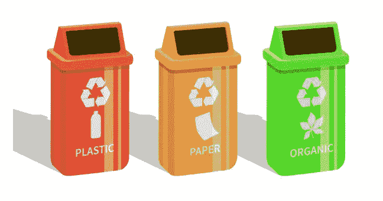

废物分类

# 问题:-垃圾分类

> 废物管理在我国是一个大问题。大多数废物最终被填埋。这导致了许多问题，例如:
> 
> *垃圾填埋场增加
> 富营养化
> 动物消耗有毒废物
> 渗滤液
> 毒素增加
> 土地、水和空气污染*

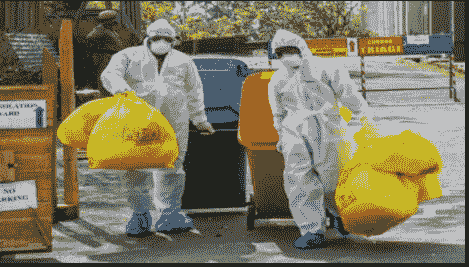

废物倾倒

> **方法:通过使用物联网和机器学习/深度来自动化流程**


**任务:垃圾图像分类**

数据集包含废物图像，即有机和可回收物品。

数据集取自 Kaggle : [ [数据集链接](https://www.kaggle.com/datasets/techsash/waste-classification-data) ]


数据集分为训练数据(85%)和测试数据(15%)

训练数据— 22564 张图像测试数据— 2513 张图像

让我们试着解决图像分类的这个问题陈述；精确的二值图像分类，因为只有两个类别。

我们可以用深度学习来解决二值图像分类问题。

具体可以用卷积神经网络(CNN)s 来解决。

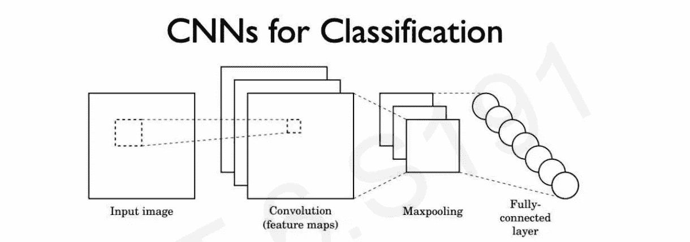

图片摘自[http://introtodeeplearning . com/slides/6s 191 _ MIT _ deep learning _ L3 . pdf](http://introtodeeplearning.com/slides/6S191_MIT_DeepLearning_L3.pdf)

如果你一般不知道什么是深度学习或者 CNN，可以参考这个视频:[【链接】](https://www.youtube.com/watch?v=uapdILWYTzE) &我们将使用 [Tensorflow](https://www.tensorflow.org/) 构建一个 CNN


Tensorflow:一个端到端的开源机器学习平台

步骤 1-加载依赖项并浏览目录

```
import numpy as np 
import pandas as pd
import matplotlib.pyplot as plt
import matplotlib.image as mpimg
import os
for dir_path, dir_names, filenames **in** os.walk("../input/waste-classification-data/"):
    print(f"There are **{**len(dir_names)**}** directories & **{**len(filenames)**}** images in the **{**dir_path**}** directory")
```

步骤 2-深入探索数据

```
*# class_names*
import pathlib
train_dir = r"../input/waste-classification-data/dataset/DATASET/TRAIN/"
test_dir = r"../input/waste-classification-data/dataset/DATASET/TEST/"
train_path = pathlib.Path(train_dir)
class_names = np.array(sorted([item.name for item **in** train_path.glob("*")]))
class_names
```

```
array(['O', 'R'], dtype='<U1')
```

这里‘O’:代表有机类&‘R’:代表可回收物类

```
*# Create a function to view the images from train & test directories*
import random
def view_random_image(target_dir,target_class):
    *# set the path*
    target_folder = target_dir+"/"+target_class
    *# get a random image* 
    random_img = random.sample(os.listdir(target_folder), 1)
    print(random_img)

    *# plot the image using matplotlib*
    img = mpimg.imread(target_folder + "/" + random_img[0])
    plt.imshow(img)
    plt.title(f"**{**target_class**}**")
    plt.axis("off");
    print(f"Image shape : **{**img.shape**}**")
```

```
img = view_random_image(target_dir=train_dir,target_class="O")
```

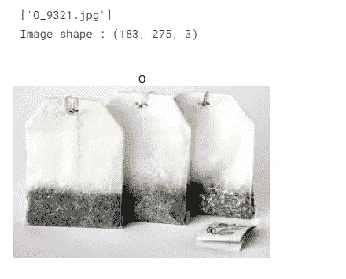

上述函数的输出

```
img = view_random_image(target_dir=train_dir,target_class="R")
```

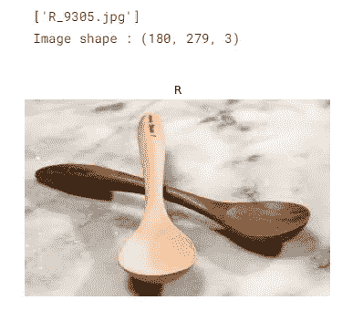

上述函数的输出

步骤 3-让我们通过以下步骤构建一个端到端的 CNN:

> 加载数据
> 
> 创建数据加载器和小型批处理
> 
> 创建/建立有线电视新闻网
> 
> 评价
> 
> 重复直到满意为止

```
import tensorflow as tf
from tensorflow.keras.preprocessing.image import ImageDataGenerator
```

> [ImageDataGenerator](https://www.tensorflow.org/api_docs/python/tf/keras/preprocessing/image/ImageDataGenerator) :通过实时数据增强生成批量的张量图像数据。

```
train_data_gen = ImageDataGenerator(rescale=1./255)
test_data_gen = ImageDataGenerator(rescale=1./255)
```

> 重新调整因子。默认为无。如果无或为 0，则不应用重缩放，否则我们将数据乘以所提供的值(在应用所有其他变换之后)。

```
train_data = train_data_gen.flow_from_directory(directory=train_dir,
                                             target_size=(224, 224),
                                             batch_size=32,
                                             class_mode="binary")

test_data = train_data_gen.flow_from_directory(directory=test_dir,
                                             target_size=(224,224),
                                             batch_size=32,
                                             class_mode="binary")
```

> `directory`字符串，目标目录的路径。每个类应该包含一个子目录。任何 PNG，JPG，BMP，PPM 或 TIF 图像在每个子目录下的目录树将包括在生成器中。
> 
> `target_size`整数元组`(height, width)`，默认为`(256,256)`。找到的所有图像将被调整到的尺寸。在我们的例子中，我们认为它是(224，224)
> 
> `class_mode`“分类”、“二元”、“稀疏”、“输入”或无之一。默认:“分类”。在我们的例子中，我们认为是“二进制”
> 
> `batch_size`数据批次的大小(默认为 32)。

```
Found 22564 images belonging to 2 classes.
Found 2513 images belonging to 2 classes.
```

```
from tensorflow.keras.layers import Dense, Flatten, Conv2D, MaxPool2D
from tensorflow.keras import Sequential
from tensorflow.keras.activations import relu,sigmoid, softmax
from tensorflow.keras.optimizers import Adam, SGD
```

```
model_1 = tf.keras.Sequential([
    Conv2D(10, 3, input_shape=(224,224,3), activation="relu"),
    MaxPool2D(2),
    Conv2D(10, 3, activation="relu"),
    MaxPool2D(2),
    Flatten(),
    Dense(1, activation="sigmoid")
])

model_1.compile(loss="binary_crossentropy",
               optimizer=Adam(),
               metrics=["accuracy"])

history_1 = model_1.fit(train_data,
                       epochs=5,
                       steps_per_epoch=len(train_data),
                       validation_data=test_data,
                       validation_steps = len(test_data))
```

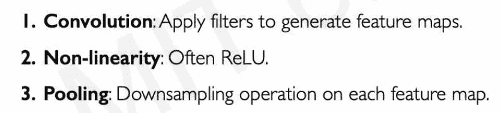

图片摘自[http://introtodeeplearning . com/slides/6s 191 _ MIT _ deep learning _ L3 . pdf](http://introtodeeplearning.com/slides/6S191_MIT_DeepLearning_L3.pdf)

```
model_1.summary()
```

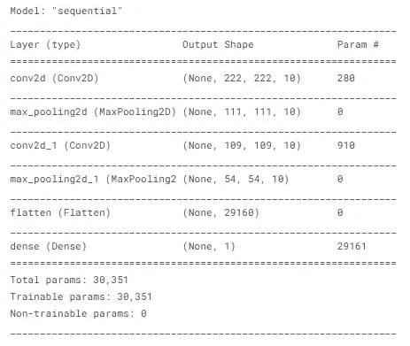

```
model_1.evaluate(test_data)
```

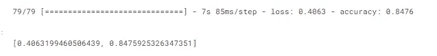

```
*# plot accuracy & loss curves*
def plot_loss_curves(history):
    *# get loss*
    loss = history.history["loss"]
    val_loss = history.history["val_loss"]
    *# get accuracy*
    accuracy = history.history["accuracy"]
    val_accuracy = history.history["val_accuracy"]

    *# epochs*
    epochs =range(len(history.history["loss"]))
    *# plot loss*
    plt.plot(epochs, loss, label="Training Loss")
    plt.plot(epochs, val_loss, label="Val Loss")
    plt.title("Loss Curves")
    plt.xlabel("Epcohs")
    plt.legend()

    *# plot accuracy*
    plt.figure()
    plt.plot(epochs, accuracy, label="Training Accuracy")
    plt.plot(epochs, val_accuracy, label="Val Accuracy")
    plt.title("Accuracy Curves")
    plt.xlabel("Epochs")
    plt.legend(); 
```

```
plot_loss_curves(history_1)
```

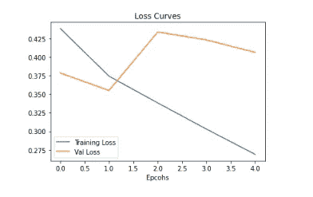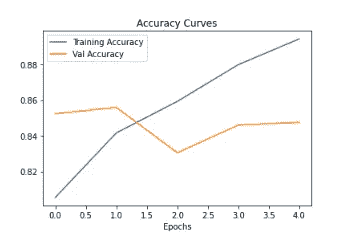

# 让我们建立一个简单的 CNN/小 VGG 模型:2

```
model_2 = Sequential([
    Conv2D(10, 3, input_shape=(224, 224, 3), activation="relu"),
    Conv2D(10, 3, activation="relu"),
    MaxPool2D(2),
    Conv2D(10, 3, activation="relu"),
    Conv2D(10, 3, activation="relu"),
    MaxPool2D(2),
    Flatten(),
    Dense(1, activation="sigmoid")
])

model_2.compile(loss="binary_crossentropy",
               optimizer=tf.keras.optimizers.Adam(),
               metrics=["accuracy"])

history_2 = model_2.fit(train_data,
                       epochs=5,
                       steps_per_epoch = len(train_data),
                       validation_data=test_data,
                       validation_steps=len(test_data))
```

```
model_2.evaluate(test_data)
```

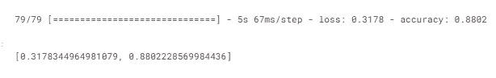

这足以让 CNN 入门，然后执行一系列实验，直到达到所需的性能指标。

为了获得更多改进，我们可以尝试训练:

> 更多时代
> 
> 随着数据的增加
> 
> 有更多层
> 
> 有更多的神经元
> 
> 具有不同的激活功能

我们能够用仅仅 2 个简单的 CNN 模型和仅仅 5 个时期得到好的结果。


**参考文献:**

[](https://www.tensorflow.org/) [## 张量流

### 一个面向所有人的端到端开源机器学习平台。探索 TensorFlow 灵活的工具生态系统…

www.tensorflow.org](https://www.tensorflow.org/) [](http://introtodeeplearning.com/) [## 麻省理工深度学习 6。S191

### 麻省理工学院关于深度学习方法的入门课程，应用于计算机视觉，自然语言处理…

introtodeeplearning.com](http://introtodeeplearning.com/) 

[https://www . udemy . com/course/tensor flow-开发者-证书-机器学习-零到精通/](https://www.udemy.com/course/tensorflow-developer-certificate-machine-learning-zero-to-mastery/)