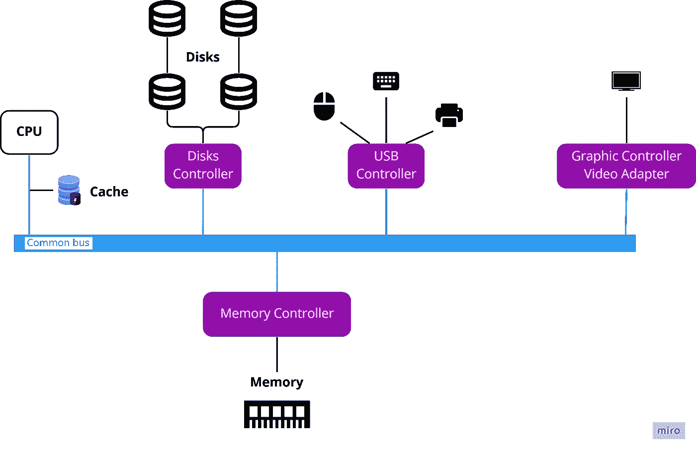

# 计算机系统如何运行

> 原文：<https://blog.devgenius.io/02-how-computer-system-operates-ebe3e6454fdf?source=collection_archive---------13----------------------->

## 查看我在[我的技术文章](https://yumingchang1991.medium.com/technical-article-structure-on-medium-954850e1ef4d)中的所有其他帖子

该图显示了计算机系统的典型结构；这并不意味着所有的计算机系统都具有这里描述的完全相同的结构。

在我们深入研究操作系统的细节之前，最好先了解一下计算机系统的基本操作。它将帮助我们更好地理解未来的操作系统概念。简单地说，我们可以把计算机系统描述为:

> 现代通用计算机系统由一个或多个 CPU 和多个设备控制器组成，这些设备控制器通过一条公共总线连接，该总线提供对共享内存的访问

太多了，对吧？别担心。我将逐一分解这些术语，稍后您会发现它们对您更有意义。

## *1)通用*

我们所知的现代计算机通常可以提供多种功能，包括处理信息、保存相机中的照片、在显示器上显示信息、连接互联网等等。提供许多功能的计算机被称为通用计算机。

也就是说，有专门处理信息或保存信息的计算机。这类产品常用于企业数据中心。没错，就是我这里说的服务器。

## 2)中央处理器

CPU 代表核心处理单元。它通常被称为计算机的大脑，因为它是计算信息的地方。

> 在上图中，CPU 旁边有一个叫做缓存的东西。
> 
> **高速缓存**是一种物理位置非常靠近处理器的内存设备。处理器可以以比从共享存储器更有效的方式从高速缓冲存储器获得数据，因为它不需要通过长的公共总线。查看我的另一篇文章，了解更多:[用简单英语解释的存储结构](/03-storage-structure-explained-in-plain-english-c6db1b785a60)

## 3)设备控制器

设备控制器是一个标准化的接口，它管理通过该控制器的输入/输出信息。它通过将信息调整为某种格式来管理各种外设，以便该控制器与操作系统通信，或者该控制器与设备通信操作系统信息。控制器的一些例子是 USB 控制器、C 型控制器、磁盘控制器和视频适配器。

> 通常，每个设备控制器都有自己的设备驱动程序。设备驱动程序通常存储在操作系统中，以便该系统知道如何以该控制器可以解释的方式向该控制器发送消息。

## 4)公共总线

所有设备控制器都连接到计算机中的一条公共总线上，这条总线是信息在设备和内存之间传递的高速公路。

> 如果你最近买了一台笔记本，你可能会在它的说明书中读到 PCIe，而在旧电脑中，他们使用 PCI。PCI 和 PCIe 都是计算机总线标准。PCIe 比 PCI 快得多，它可以在相同的时间间隔内处理更多的数据传输。因此，在现代计算机系统中，PCIe 正在取代 PCI。PCI 现在已经过时了。

## 5)共享内存

内存还连接到内存控制器，其功能是同步对共享内存的访问，以便按顺序处理来自公共总线的信息。

记住**所有的计算只能在内存**中进行，所以信息需要首先加载到内存中。此外，CPU 和设备控制器可以并发执行，竞争内存周期。

下一篇文章将介绍存储的[结构](/03-storage-structure-explained-in-plain-english-c6db1b785a60)。

*参考*

*   [【YouTube】OS(计算机系统操作)基础](https://www.youtube.com/watch?v=VjPgYcQqqN0&list=PL9hkZBQk8d1zEGbY7ShWCZ2n1gtxqkRrS&index=2)