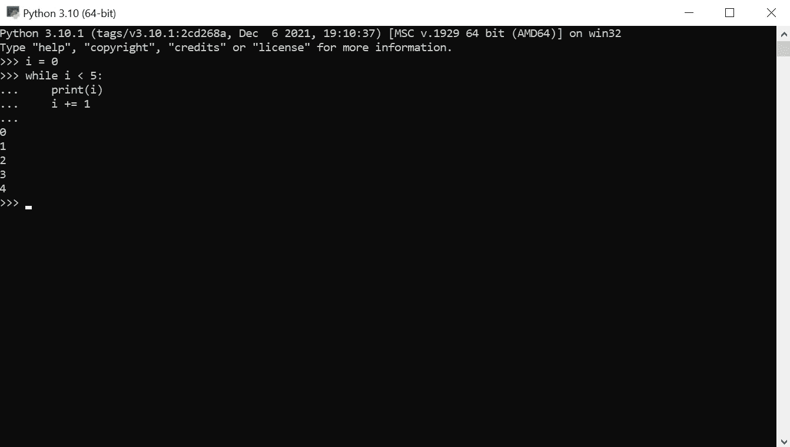
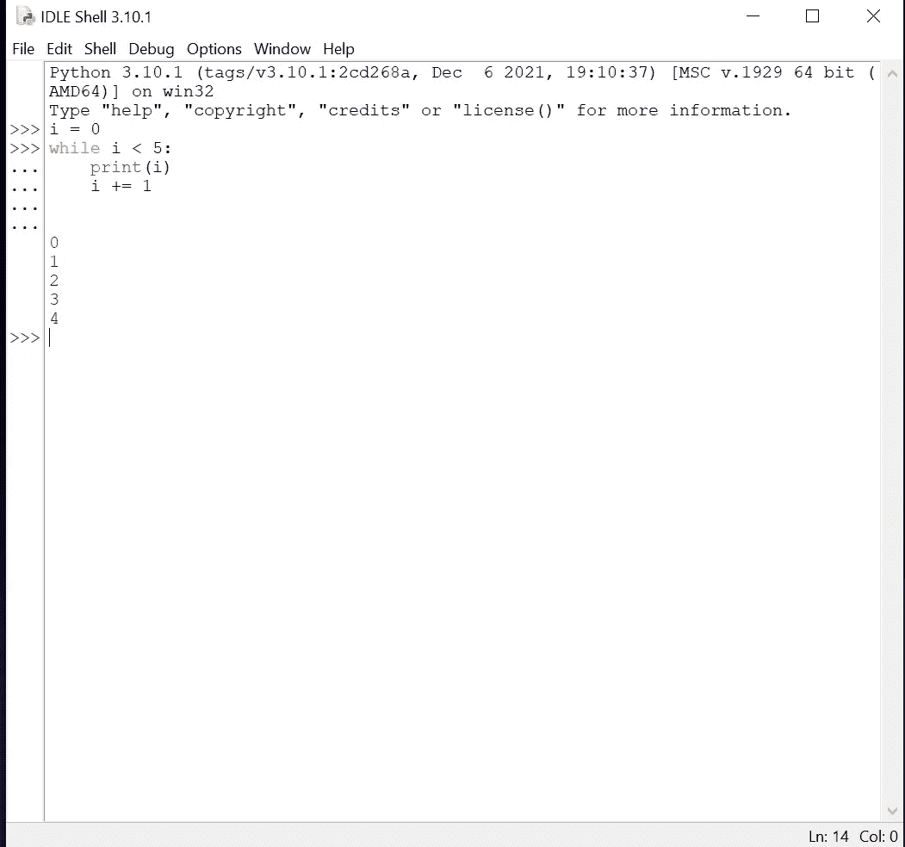
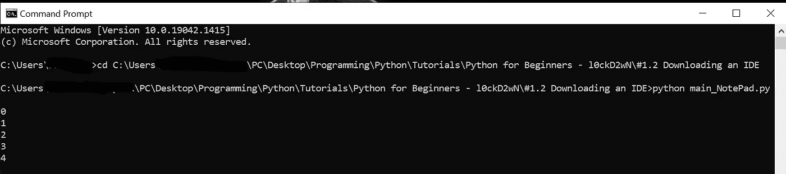
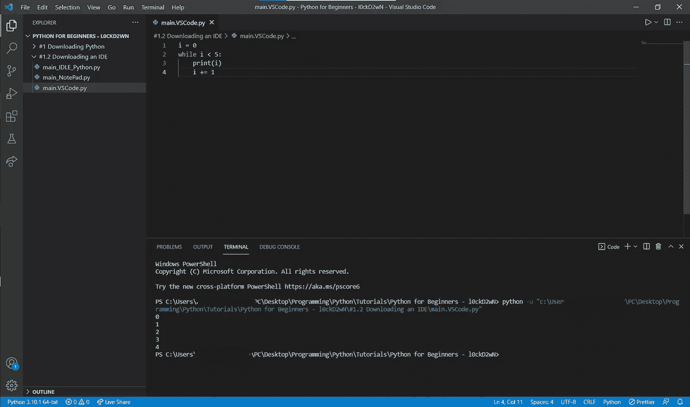
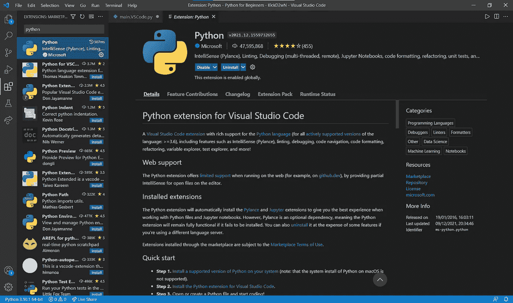
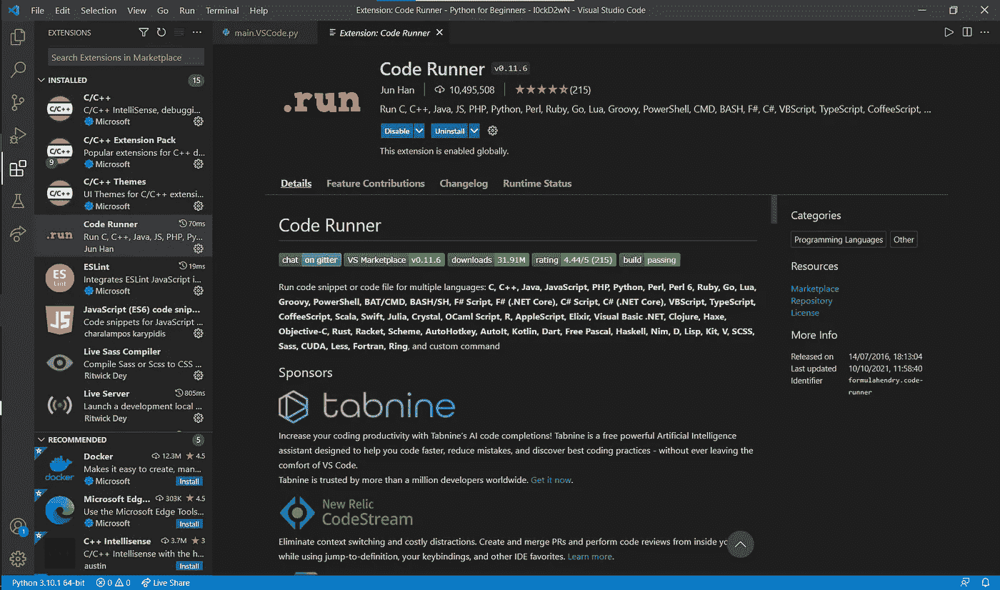

# #1.2 为初学者安装代码编辑器(IDE)-Python

> 原文：<https://blog.devgenius.io/1-2-installing-a-code-editor-ide-python-for-beginners-7146d9c5f4b5?source=collection_archive---------13----------------------->

## 让我们的编码生活变得更加容易

晚上好，早上好，或者中午好，或者任何你认为合适的时间！我们又回来了，直接进入我们的下一个主题，IDE。哇哦。所以你可能会问这是什么？

**我会在这篇文章里给你解释！**

照片由 [**扬·kopřiva**](https://www.pexels.com/@koprivakart?utm_content=attributionCopyText&utm_medium=referral&utm_source=pexels)发自 [**Pexels**](https://www.pexels.com/photo/photo-of-a-red-snake-3280908/?utm_content=attributionCopyText&utm_medium=referral&utm_source=pexels)

# 什么是 IDE？

让我先给你解释一下什么是 IDE。IDE 是指**I**I**D**E**E**ngine。不，我在开玩笑 IDE 是集成的 T21 开发环境的缩写，是一个应用程序，你可以在其中编写、运行和调试你的源代码。IDE 还提供了一些其他非常有用的功能，有时也被称为*代码编辑器*(但是 IDE 有更多的功能，这你是知道的；我有时候会用 word Code Editor，即使我说的是 IDEs 但是 IDE 是代码编辑器，但是代码编辑器并不总是 IDE；我希望你明白我的意思，但这并不重要…)。

总之:使用 IDE 绝对可以让你的程序员生活变得更加轻松愉快。

# IDE vs 记事本 vs Python IDLE

首先，让我先解释一下外来词:IDE =**I**integrated**D**development**E**environment；IDLE = **I** 集成了 **D** 开发和 **L** 收益 **E** 环境

让我们从比较开始:

首先，我们有一个文本编辑器——我在其中放了一些示例代码，以便您可以看到编辑器之间的差异——理解代码的作用并不重要:

所以…，是的，我是说那看起来很丑。我的意思是，如果你喜欢，好吧，那就没问题。你可以用它。但是正如你所看到的，记事本并不是为代码编辑器而创建的。因此，我认为这不是我们所寻求的。

但是我们上次使用的好看的 Python Shell 呢？—好主意，但是因为我们不能保存用 Python Shell 编写的代码，所以这不是最好的主意。你还必须自己制作*缩进*，这在 Python 中非常重要。如果你还不明白这一点，在本系列的后面，当我们谈到*循环*等等时，你会明白我的意思(在上面的例子中，你可以看到一个简单的 ***while 循环*** )。

让一个已经安装的编辑器保持打开状态。我之前提到的 Python IDLE。下面是示例代码在 Python IDLE 中的样子:

我知道，我知道看起来很丑像记事本编辑器，但它有更多的功能，代码中有颜色，可以帮助您阅读代码！您也可以将代码保存在其中。

记事本编辑器的一点额外功能:

在这里您可以看到如何运行您在记事本编辑器中编写的代码。首先，您必须将目录更改为您的 Python(.py)文件是。您可以通过键入命令 cd [directory]来完成此操作。变量目录当然是目录。然后你得输入 python [file.py]。当然，变量 file.py 是您想要执行的 Python 文件。所以在这个例子中，它是 main_NotePad.py 文件。

**。py 是普通 Python 文件的结尾。就像。文本文件。**

现在我将向你展示美妙的想法。嗯，有这么多想法。我想你可能知道记事本++代码编辑器。顾名思义，这是一个更好的记事本版本。它不是一个专业的代码编辑器，所以我向你推荐另一个 IDE，但我只是想提一下，因为你可以在互联网上搜索和观看，如果你喜欢它。你可以在这里得到它:[https://notepad-plus-plus.org/downloads/](https://notepad-plus-plus.org/downloads/)。

下一个 IDE 是一个更基础的，但是对于初学者来说是一个很棒的代码编辑器。**穆主编**。绝对值得一分钟，看看你是否喜欢这个编辑[https://codewith.mu/en/download](https://codewith.mu/en/download)。

这里我要提到的最后两个 ide 是 Visual Studio 代码编辑器(VS Code)和 PyCharm 代码编辑器。首先对 PyCharm 代码编辑器说几句话:我使用了大约半年，我不得不说它对我来说工作得非常好，但是在我想与我的朋友和其他人分享代码 live 之后，我转向了 VS Code，因为你可以在 VS Code 中用一个**扩展**来分享代码 live。VS Code 的另一个很好的特性是，当你为其他编码语言安装了扩展后，你也可以运行它们。所以我会向你推荐 **VS Code** ，但是 **PyCharm** 也很好共事。别忘了！—你也可以使用 **MU** 或 **Notepad++** ，甚至是普通的**记事本**或 **IDLE** 。这取决于你，但是在这个系列中我将使用 VS 代码。也许我会在 MU 编辑器中或者用 MU 编辑器向你展示一些东西，但是我将主要使用 VS 代码，因为我也在我的“正常编码生活”中使用它。

我还将向您展示如何在 VS 代码中使用 Python:

安装并打开 VS 代码后，你必须导航到扩展部分，快捷键是 **CTRL+SHIFT+X** 。在那里你搜索 Python。你点击微软的那个，然后点击蓝色的**安装**按钮。现在应该开始安装了。您还将拥有一个名为 Pylance 的**扩展**。它将帮助我们编写带有自动完成功能的代码。

如果你不知道什么是扩展，简而言之:扩展是你可以下载的特性(在 VS 代码中)，这样你就可以扩展你可以做的事情(在 VS 代码中)。例如，如果你想用 C++编程，你必须下载 C++扩展，这是一种著名的编程语言。还有键盘快捷键扩展，所以你可以使用不同的键盘快捷键。VS 代码以它的许多扩展而闻名。

我还建议您下载代码运行器扩展，如下所示。与安装 Python 扩展的过程相同。

您不必使用它，因为我还将向您展示如何在没有这个扩展的终端中运行您的代码，但是我建议您使用它。这将使你更容易运行你的代码。你只需要点击一个按钮或使用键盘快捷键，而不需要在终端或命令提示符下输入任何东西。

这就是我今天想谈的一切。我希望你喜欢今天的“课”！

最后，我想给你一些下一课的展望。下一课 **我们将编写第一个程序**！你兴奋吗？我很兴奋！

不管怎样，我希望你一切都好，度过愉快的一天，度过愉快的圣诞节和新年！

下节课再见，

*l0ckD2wN*