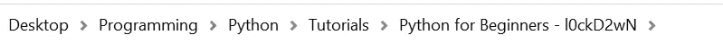
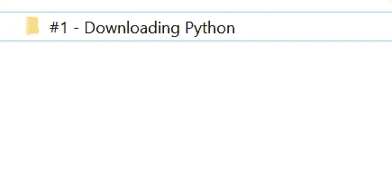
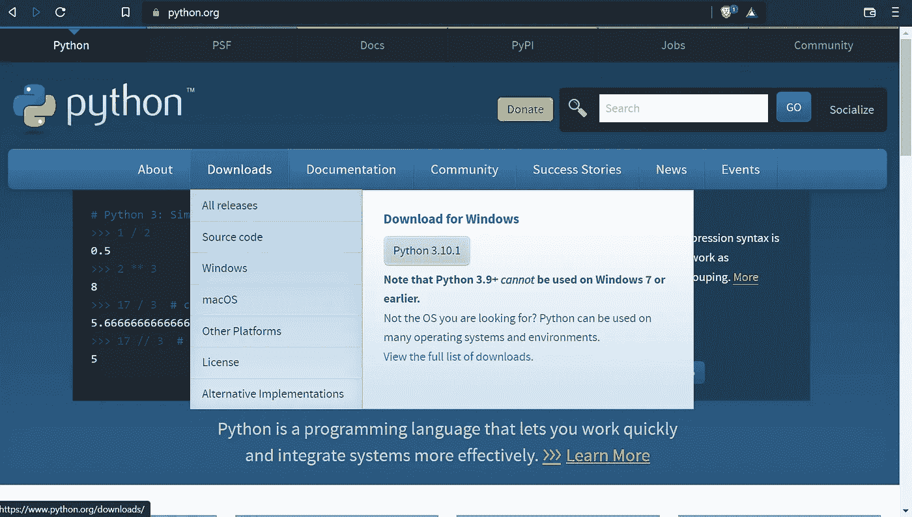
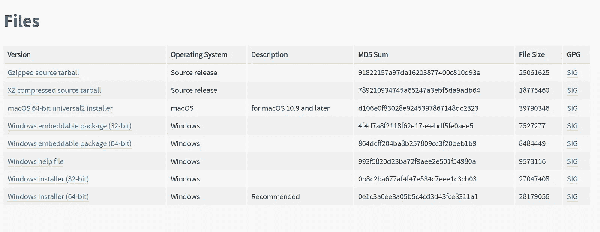
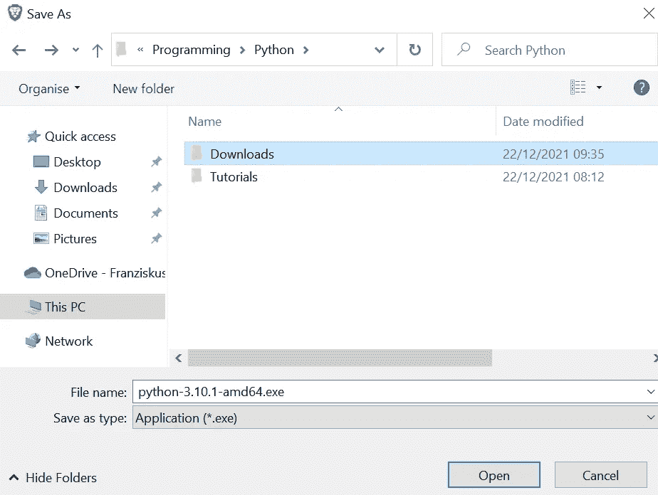
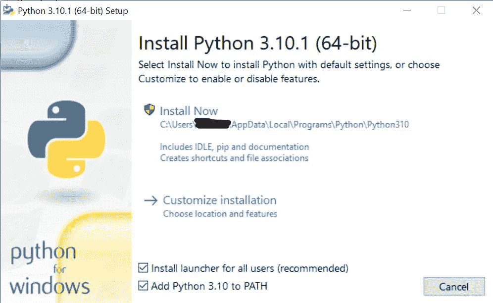
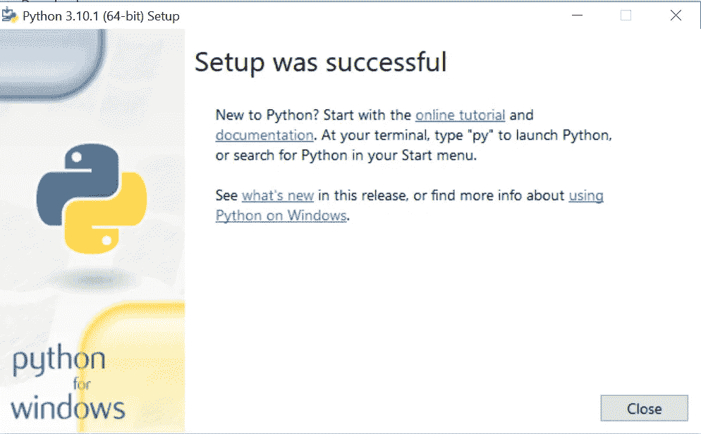
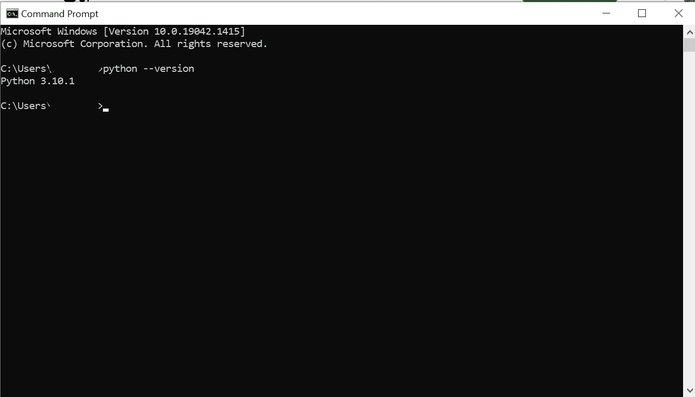
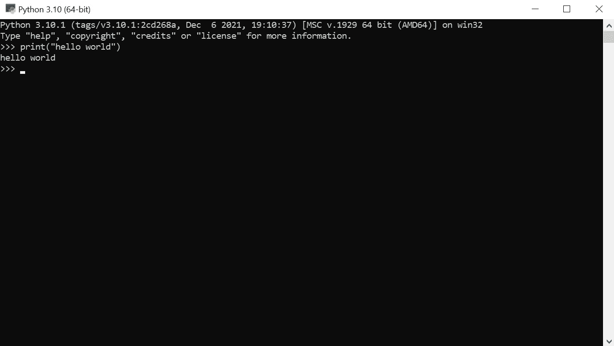

# #1 下载 Python——面向初学者的 Python

> 原文：<https://blog.devgenius.io/1-downloading-python-python-for-beginners-48e260557c09?source=collection_archive---------12----------------------->

## 在您的计算机上下载并设置 Python

又见面了！在我对 Python 和一般编码的简短介绍之后，我们今天将从在我们的计算机上下载和设置 Python 开始。本教程主要面向 Windows 用户。

**那么让我们开始吧！**

照片由[简·kopřiva](https://www.pexels.com/@koprivakart?utm_content=attributionCopyText&utm_medium=referral&utm_source=pexels)从[派克斯](https://www.pexels.com/photo/photo-of-a-red-snake-3280908/?utm_content=attributionCopyText&utm_medium=referral&utm_source=pexels)拍摄

# 整理您的计算机

如果你想的话，你可以跳过这一步，但是我建议你，当你想编码的时候，你应该整理你的电脑。当你回到编码的时候，它会让你更容易找到你想要的东西。在我看来，一台有条理的电脑是值得的，因为你不需要花几个小时在你的电脑上搜索东西。如果您已经整理了电脑，也可以跳过这一步。

让我们开始吧，我们将在桌面上创建一个“文件夹-结构-系统”:

1.  在你的桌面上创建一个文件夹，叫它**编程**
2.  在这个文件夹中创建另一个文件夹，叫它 **Python**
3.  重复两次，调用第一个文件夹**教程，**调用第二个文件夹类似于 **Python for 初学者——l0 CKD 2 wn**
4.  创建第五个文件夹，把这个文件夹叫做类似于 **#1 下载** **Python** 的东西。在这里，您将放入本系列中的每一课，例如，当一课在 Python 中被称为**# 2 Numbers**时，您将把它放入 **Python 初学者-l0 CKD 2 wn**文件夹，紧挨着 **#1 下载** **Python** 文件夹。

最后，它应该看起来像这样。现在你有了一个保存一切的好地方。**完美！**

# 下载 Python

Python 可以在[https://www.python.org/](https://www.python.org/)上免费下载。你还可以在那里找到*文档*和更多关于 Python 的信息。由于 Python 有很好的文档记录，如果您需要帮助，我建议您查阅文档。但就像我之前说的，如果你有问题，我也会在这里帮助你，这里还有一个很棒、很大、很好的社区在任何情况下帮助你。

Python 可用于许多操作系统。你可以在 https://www.python.org/download/other/的[找到可用(操作)系统的完整列表。](https://www.python.org/download/other/)

现在让我们进入这篇文章的主要部分。下面是在 Windows 上下载 Python 的步骤。

1.首先，如果你在 Python 网站的主页上，将鼠标悬停在**下载**上。然后会弹出一个菜单。在那里你应该点击**所有发布**。

2.在那里你向下滚动到**寻找一个特定的版本？**然后搜索想要安装的版本。对我来说，2021 年年底写的最新版本是 3.10.1。**选择 Python 3.x 版本很重要，因为在 Python 2.x 中有一些东西无法工作，因为 Python 3.x 和 Python 2.x 之间有一些巨大的变化。**现在就看你选择哪个版本了。许多程序员选择 3.7 或 3.6，因为不再有 bug，或者几乎没有 bug。你也可以选择 Python 3.10 版本，我将在这里选择这个系列。还有，值得一提的是，这个版本有一个新的语句，叫做 match-case-statement，你可以在很多其他语言像 JavaScript，C++等等里面找到(switch-case-statement)。它还处于错误修复期，所以可能会有一些变化。但是就像我说的，我会选择 Python 3.10 作为这个教程系列，我也推荐给你。

3.转到下一步，您已经点击了您的首选版本。然后你必须向下滚动到页面的底部，直到你看到下载选项/文件。如果您使用的是 Mac，请单击 macOS 64 位 universal2 安装程序(适用于 macOS 10.9 及更高版本)。如果你在 Windows 上，你需要多做一步，因为你需要安装你的位系统。有 32 位和 64 位系统。如果你在 2007 年之后购买电脑，它可能是 64 位系统。但是这里有一个简单的方法来确定您使用的是 32 位还是 64 位系统。→打开您的设置→点击系统→向下滚动到信息并点击它→您应该在系统类型下看到您得到的是 32 位系统还是 64 位系统。

4.我有一个 64 位系统，为什么我选择 Windows installer (64 位)(最后一个)。点击它。

5.现在应该会弹出一个小窗口，你可以选择保存你的**Python.exe**的位置。在 Python 文件夹中创建一个名为 Downloads 的新文件夹。点击文件夹，在那里下载你的 Python。

6.在你安装了 Python 之后，你可以点击你文件夹中的程序，这个程序应该叫做**python-3.10.1-amd64.exe 之类的东西。点击后，一个小窗口会再次弹出。**在这里，重要的是你点击添加 Python 3.x 到路径，不要改变其他任何东西！**应该是这样的。您还应该记住在哪里安装 Python。以后可能会有用。**

7.然后点击蓝色的**现在安装**按钮。这可能需要一段时间。是时候去拿些新的水或茶了。完成安装后，你应该会看到另一个弹出窗口，显示**安装成功**。

8.点击**关闭**即可关闭窗口。现在，为了检查所有东西是否安装正确，通过在*搜索栏*中搜索 *CMD* ，打开*命令提示符*。type*python——version*(*python MINUS version*)(不好意思，我不知道介质上怎么写两个减。有人知道怎么做吗？).它应该会输出您的 Python 版本。这是它的照片:

如果你得到了这个输出。不错！你在电脑上安装了 Python。

如果您没有得到预期的输出，那么再次检查一切。你做了和解释的完全一样的事情吗？但是不用担心！我是来帮忙的！写个消息，我会尽量帮你的。社区也在那里提供帮助。请记住，你不是一个人有你的问题！

如果你想确定，你也可以用另一种方式来确定。当然，我会告诉你怎么做；)!

通过搜索栏搜索 Python 3.x，for me Python 3.10。你点击它，一个看起来类似于命令提示符窗口的窗口会自动打开。打印类型**(“hello world”)**。它应该输出 **hello world** 。如果是这样的话——很好，您已经完成了 Python 在您计算机上的安装过程。

这就是把 Python 安装到你的电脑上并设置好的整个过程。我希望你一切顺利！如果没有，你可以通过中号联系到我。

本系列的下一篇文章将是一个幻灯片部分，我将向您展示如何下载和使用代码编辑器/IDE。这将帮助我们更快地编写代码，更好、更容易地编译代码。当然，我会告诉你没有 IDE 和有 IDE 的区别。你必须选择你想用哪种方式做这件事。

祝您愉快！

**到时见，**

*l0ckD2wN*