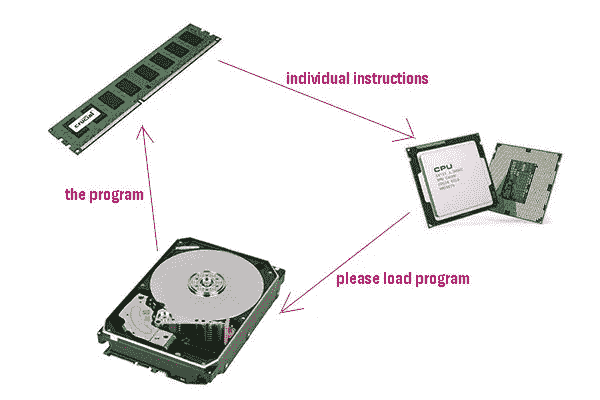
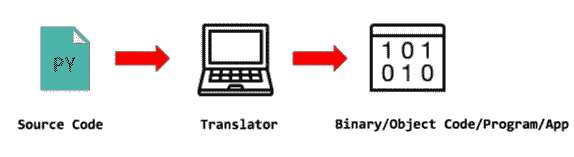
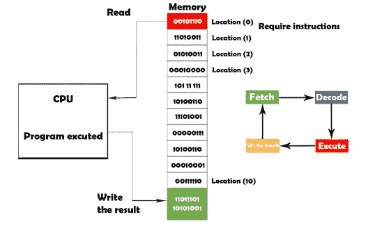

# 编程术语快速介绍:Python 完整教程—第 1 部分

> 原文：<https://blog.devgenius.io/1-introduction-to-programming-633ba4b94cba?source=collection_archive---------10----------------------->

[https://unsplash.com/](https://unsplash.com/)

**在我们开始之前，让我告诉你:**

*   这篇文章是 Python 完全初学者到专家课程
    的一部分，你可以在这里[找到它](https://medium.com/@samersallam92/python-complete-beginner-to-expert-course-f7626916df30)。
*   这篇文章在 YouTube 上也有视频[点击这里](https://youtu.be/YC1j68e4ySY)。

[https://www.youtube.com/channel/UCLgZT-sYFPgxo4TLWtzU7lQ](https://l.facebook.com/l.php?u=https%3A%2F%2Fwww.youtube.com%2Fchannel%2FUCLgZT-sYFPgxo4TLWtzU7lQ%3Ffbclid%3DIwAR2BEEpnt9mv7O-gUyOrtcoDvF1f9il4oJTIUUo7Q_HlDNsqnTkrO7XOcdc&h=AT0ErgHWGnrwITobxpZMyQ2bWeDPBdOnlg89yh9zXHBKv9v8tE3cHi2l7U3prJAbTMQ6sKO3JgqeMz5HYsfHnB8ubAm_Rq3yAlukcNFkZOJ7OFLsRhS9v4l-E11fzn86b7Nd&__tn__=-UK-R&c[0]=AT0gxLxKmidJxDG4WO6Rl1_5notF0oa4ai-8kR-jVIu6u-0hs7MK68_bZd4rAMHYrXiTUDuwg6Aar4pEc3D0ufijZ7D5GTSzCsv7b1GIIXJ1IVME1GrvnZAFowswt3jQwSs2)

## 介绍

在这篇文章中，我将定义什么是计算机，向您展示计算机的主要组件，并讨论计算机可以理解的语言。

之后，将定义一些重要的概念，如编程语言、程序和翻译器。最后，我们将看到程序是如何在计算机上执行的。

**因此，本文将涵盖以下要点:**

1.  [什么是电脑](#d3ec)
2.  [电脑主要部件](#60c3)
3.  [计算机自然语言](#7f9c)
4.  [什么是编程语言](#c3ab)
5.  [什么是程序](#3624)
6.  [翻译器类型](#1e2a)
7.  程序是如何在计算机上执行的

**注:**本文是针对第一次想学习编程的绝对初学者。因此，如果您发现这些大纲对您来说非常熟悉，请随意阅读这里的下一篇文章(一旦下一篇文章发表，链接将可用)。

## 1.什么是电脑

计算机是一种电子设备，它能够根据程序给出的指令存储和处理数据，但是计算机如何理解要做什么呢？

简单来说，我们通过一些提供的食谱来告诉计算机做什么，这些食谱被称为程序。

多梅尼科·洛亚在 [Unsplash](https://unsplash.com/s/photos/computer?utm_source=unsplash&utm_medium=referral&utm_content=creditCopyText) 上拍摄的照片

## 2.主要计算机组件

计算机做两项主要工作:存储数据和处理数据。

然而，计算机怎么能做到这一点呢？
计算机有几个组件，使它能够做到这一点。

计算机在许多方面与人脑非常相似:

*   通常，人类用大脑处理通过眼睛、耳朵等接收的数据。另一方面，计算机有一个 CPU 中央处理器。因此， **CPU** 代表计算机大脑，它完成所有需要的计算和处理。
*   人类有短期记忆。另一方面，计算机有内存。因此， **RAM** 代表短期内存，我们称之为短期内存，因为一旦电脑关闭，它就会变空。
*   此外，还有长期记忆，我们通常使用这种记忆来存储我们想保留的数据，即使在我们关闭计算机后。硬盘代表计算机中的长期存储器。

因此，CPU 处理数据。RAM 和硬盘存储这些数据。参考图 1

图 1:主要的计算机组件

## 3.计算机的自然语言

计算机只能理解二进制语言，换句话说，计算机只能理解**1**和**0**。

例如，如果我想将一个数与另一个数相加，我必须发送加法指令，该指令应该以二进制语言编码，例如 **000011100010** ，但是如果我想将一个数从另一个数中减去，我必须发送减法指令，该指令也应该以二进制语言编码，例如**00001011001**。

因此，人类很难记住所有这些指令，而且使用二进制语言与计算机交流也非常麻烦。

为了克服这个问题，人们开发了我们所说的高级编程语言。

## 4.什么是编程语言

它是我们用来编写应该由计算机执行的程序的工具，而这种编程语言是高级的，因为我们用英文关键词与计算机交流。

逻辑问题是:如果计算机只理解 0 和 1，它如何理解英文关键词？

要知道答案，我们首先要定义什么是程序。

## 5.什么是程序

程序是用特定的编程语言按照逻辑顺序编写的一组命令，用来解决特定的问题。

通常，我们编写程序来解决问题，计算机可以理解英语关键字，因为当人们开发一种编程语言时，他们也开发了我们所说的翻译器，翻译器的工作是将我们用英语关键字编写的程序翻译成二进制代码或计算机可以理解的语言。

简而言之，我们编写的程序被称为**源代码**，它将进入翻译器，翻译器将翻译它并将其转换成二进制语言。用二进制语言编写的程序被称为**二进制代码**或**目标代码**。参考图 2

图 2:程序翻译器(作者截图)

## 6.翻译类型

主要有两种类型的翻译器:

*   **编译器:**它扫描整个源代码，一次翻译整个程序，然后这个程序会被送到 CPU 执行。
*   **解释器**:它逐行翻译源代码。换句话说，它一次翻译一行，将这一行发送给执行，然后它会翻译另一行，并将这一行再次发送给执行，如此类推，直到执行完整个程序。

编译器和解释器之间的详细比较超出了本文的范围。

## 7.程序如何在计算机上执行

假设我们有一个程序，它已经被翻译成机器语言或二进制语言。

首先，程序将被加载到内存中。

之后，CPU 将读取第一条指令，解码它，然后执行它。

最后，它会再次将该指令的执行结果写入内存。参考图 3

图 3:计算机指令执行周期(图片由作者提供)

这个周期(获取/解码/执行/存储)被称为**指令执行周期**。

因此，CPU 将对程序中的每条指令重复这个循环，直到整个程序执行完毕。

## **现在，让我们总结一下我们在这篇文章中学到的内容:**

照片由[安 H](https://www.pexels.com/@ann-h-45017/) 在[像素](https://www.pexels.com/)上拍摄

*   计算机有两项主要工作:存储和处理数据。
*   电脑主要部件是 **CPU — RAM —硬盘。**
*   计算机的自然语言是**二进制语言(0–1)。**
*   编程语言的发展使得人类和计算机之间的交流变得容易。
*   **程序:**是用特定的编程语言按照逻辑顺序编写的一组命令，用来解决特定的问题。
*   在计算机上执行的程序**(取—解码—执行—写回结果)。**

***附言*** *:万分感谢您花时间阅读我的故事。在你离开之前，让我快速地提两点*

*   *首先，要直接在您的收件箱中获得我的帖子，请在这里订阅***并且您可以在这里关注我***。***
*   ***第二，作家在媒介上制造了数以千计的****$*$***。为了无限制地访问媒体故事并开始赚钱，* [***现在就注册成为媒体会员***](https://medium.com/@samersallam92/membership)**，其中* *每月只需花费 5 美元。报名* [***有了这个链接***](https://medium.com/@samersallam92/membership) *，可以直接支持我，不需要你额外付费。****

**

[萨梅尔萨拉姆](https://medium.com/@samersallam92?source=post_page-----633ba4b94cba--------------------------------)** 

## **Python 初学者到专家的完整课程**

**[View list](https://medium.com/@samersallam92/list/python-complete-beginner-to-expert-course-32d3a941c05e?source=post_page-----633ba4b94cba--------------------------------)****21 stories**************

**要回到上一篇文章，您可以使用以下链接:**

**[Python 完全初学者到专家教程](https://medium.com/@samersallam92/python-complete-beginner-to-expert-course-f7626916df30)**

**要阅读下一篇文章，您可以使用以下链接:**

**第二部分:计算机算法**