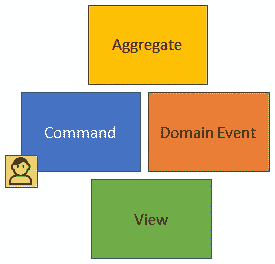

# 避免遗留代码的 1 个简单技巧

> 原文：<https://blog.devgenius.io/1-simple-tip-to-avoid-legacy-code-28d430f9d2?source=collection_archive---------2----------------------->

## 遗留代码会留下终生的伤疤。以下是避免的方法。

Clem Onojeghuo 在 [Unsplash](https://unsplash.com?utm_source=medium&utm_medium=referral) 拍摄的照片

如何处理遗留代码？没有完美的软件系统。所有的软件系统都有遗留代码，我们的工作就是减少遗留代码的增加。

“截止日期”开发人员将实施他们的更改并离开。伟大的开发者有广阔的视野。它们激发了更好的理解，并为共同特征创造了工具。

你能为项目带来的一件事是共同的愿景。你需要创造一个项目可以发展的环境。

# 你知道什么是事件风暴吗？

> 事件风暴是一种快速的、轻量级的、不受重视的群体建模技术，它是紧张的、有趣的，并且对于加速开发团队是有用的。— [谷歌产品技术经理史蒂文·a·劳](https://techbeacon.com/contributors/steven-lowe)

事件风暴是帮助你创建项目领域的系统。这将有助于创建思维导图，提供新的见解，并提出新的问题。

## 事件风暴给项目带来了什么？

那么事件风暴是如何运作的呢？

您首先需要合适的人，包括 IT 和业务人员，来获得正确的答案。然后，您布局所有可能的事件，并用命令将它们连接起来。

命令是事件的触发点。连接事件和命令后，可以将事件与反应连接起来。反应发生在事件发生之后。这就是高层事件强攻的要诀。

事件风暴带来了很多问题。团队将进行富有成效的交谈，从而获得有价值的信息。

你从事件风暴中得到的答案是:

*   摩擦点
*   域视图
*   英国国会下院

## 你需要视觉事件展示

[https://en . Wikipedia . org/wiki/Event _ storming #/media/File:Event _ storming _ layout . png](https://en.wikipedia.org/wiki/Event_storming#/media/File:Event_storming_layout.png)

完成事件风暴后，创建一个可视化表示。这将揭示上帝对领域的看法。

获得视觉表现引发了新的问题。团队需要遵循这一愿景。共同的愿景可以揭示未来的瓶颈。有经验的工程师可以从事件布局中看到更好的软件解决方案。

然后，团队可以看到什么是公共的，并在公共区域加倍下注。有经验的开发人员需要为常见的东西创建一个框架。

创建引擎后，您将减少工作量。更好的是，您将保持一致，并根除遗留代码。

## 你需要一个普通事物的引擎

减少遗留代码的一个方法是找到共同的东西。

避免多次实现公共元素。这个过程会产生更多的 bug，而且很难维护。

> 为 commons 创建引擎。弗雷德里克·克里斯滕森

假设事件风暴指出你会有很多表格。围绕表单创建一个框架，该框架将基于配置创建表单。

网站上有很多页面也很常见。我开发过一个引擎，它创建的页面脱离了配置。您可以根据需要配置页面并保存配置。有问题的项目是一个自定义数据连接的管理面板。

# 感谢阅读！相关链接如下。

 [## 如何使用事件风暴实现领域驱动设计

### 事件风暴是一种快速、轻量级且不受重视的群体建模技术，它是一种紧张、有趣且有用的技术…

techbeacon.com](https://techbeacon.com/devops/introduction-event-storming-easy-way-achieve-domain-driven-design)  [## 事件风暴

### 事件风暴是一种基于研讨会的方法，可以快速发现软件程序领域中正在发生的事情…

en.wikipedia.org](https://en.wikipedia.org/wiki/Event_storming)  [## SLA vs. SLO vs. SLI -差异| Atlassian

### 如果说每家科技公司都有一个共同点，那就是:用户。无论你是谷歌的搜索引擎，服务…

www.atlassian.com](https://www.atlassian.com/incident-management/kpis/sla-vs-slo-vs-sli)