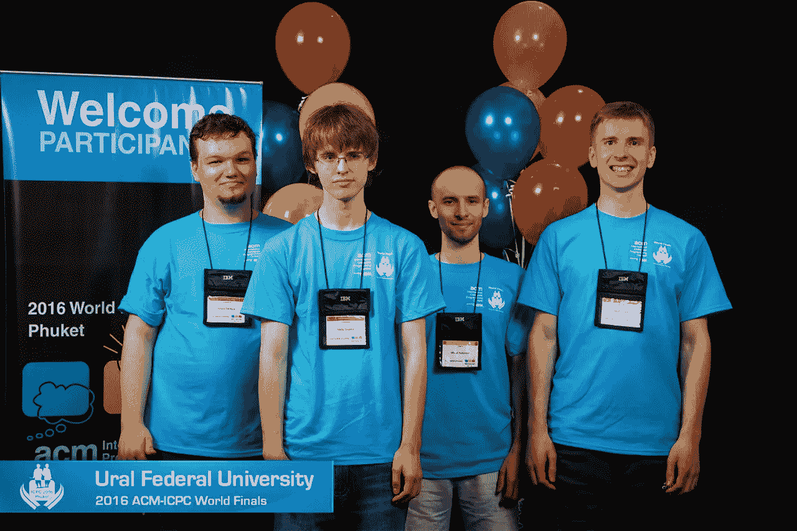

# 零成本学习代码的 10 个神奇网站

> 原文：<https://blog.devgenius.io/10-amazing-websites-for-learning-code-at-zero-cost-810d879ca8a2?source=collection_archive---------5----------------------->

## 通过这些很酷的网站提高你的编程技能

[图像来源](https://icpcnews.tumblr.com/post/144337358749/team-preview-ural-fu-dandelion)

如果你想学习如何编写代码来创建软件应用程序，网站和互联网上的许多地方都会教你所需的技能并帮助你入门，而且许多都是免费的。

这些网站大多教你编码的基础。对于那些想学习这个项目的人来说，这是一个很好的起点。我重点列出了这些顶级网站，从绝对基础的编程开始。所以让我们开始-

# 1.自由代码营

该网站有一个交互式学习平台，旨在让任何人都可以学习 web 开发。有几种技能可供选择，包括 HTML5、CSS3 javascript 以及许多其他技能。

如果你需要帮助，他们有一个活跃的论坛，你可以从其他程序员那里得到帮助。我们需要开始自由代码营的课程。你只需阅读并按照这个网站屏幕上的指示去做。

 [## freeCodeCamp.org

### 免费学习编码

www.freecodecamp.org](https://www.freecodecamp.org/learn) 

# 2.奥丁计划

下一个是 Odin 项目，由维京代码学校创建，主要关注 web 开发。他们会按照逻辑顺序教你开发网站所需的技能，从简单的脚本一直到功能齐全的网站。

沿着这条路，你将最终学会 Ruby 和 Rails javascript jquery 等等。在奥丁项目上，其实最好是按照课程和顺序来。

从顶级网站开发 101 开始，共有 36 课。

 [## 你的网页开发生涯从这里开始

### 这是我们自学时希望拥有的网站。我们搜索互联网，只寻找最好的…

www.theodinproject.com](https://www.theodinproject.com/) 

# 3.可汗学院

可汗学院是最受欢迎的网站之一，拥有从数学到经济学以及其他学科的内容；他们还提供 javascript HTML、CSS 和 SQL 的计算机编程初学者课程。

他们也提供高级课程，就像许多已经提到的网站一样。可汗学院的教程遵循类似的格式。

 [## 可汗学院|免费在线课程、课程和练习

### 免费学习数学、艺术、计算机编程、经济学、物理学、化学、生物学、医学、金融…

www.khanacademy.org](https://www.khanacademy.org/) 

# 4.黑客银行

我特别用这些网站。首先，你必须选择一个部分；然后，你可以在一节下面练习。有很多语言像你可以练习算法，数据结构，Java 等等。这个网站对初学者来说是完美的，因为它是用户友好的，它的界面简单易用。

 [## 黑客银行

### HackerRank 是面向招聘开发人员的市场领先的技术评估和远程面试解决方案。学习如何…

www.hackerrank.com](https://www.hackerrank.com/) 

# 5.编码游戏

这个有用的网站是一个很好的方法，可以用一种很酷很有趣的方式来提高你的编程水平；有超过 25 种语言可供选择，您一定会找到您想要学习的编程技能。

还可以参加国际编程大赛，和别人一起玩多人编程游戏。当你开始一个编码游戏时，你会有一个教程让你更熟悉编码环境。

 [## 编码游戏和更好编码的编程挑战

### 通过用 25 种以上的语言解决有趣的挑战来学习新概念，解决所有热门的编程话题。就…而言

www.codingame.com](https://www.codingame.com/start) 

# 6.Sololearn

Sololearn 是学习编码的组织和结构较好的网站之一。它和你们很多人熟悉的叫做 Code Academy 的其他网站非常相似。

Sololearn 是完全免费的，它的任何功能都不会被锁在付费墙后面。他们提供 12 门编程学科的教程，包括 C++、Python、Ruby、PHP、CSS 等等。sololearn 最棒的一点是，你的进度也可以与他们的 android 和 iOS 应用程序同步。

 [## Sololearn:学习编码

### 立即加入，学习基础知识或提升现有技能

www.sololearn.com](https://www.sololearn.com/home) 

# 7.w3 学校

有最古老和最受欢迎的网站，每月有超过 1000 万的访问者。在这里，您可以学习 HTML、CSS、Javascript 和许多其他内容。他们还提供了广泛的免费响应 HTML 模板选择。首先，只需选择一个教程，然后阅读并遵循说明。

 [## W3Schools 在线网络教程

### HTML 教程这是一个标题，这是一个段落。亲身体验身体{ background-color:浅蓝色；} h1 { color…

www.w3schools.com](https://www.w3schools.com/) 

# 8.黑客地球

黑客地球是最好的实践平台之一。没有实践，你可以在这里参加像黑客马拉松，编程挑战，编码比赛这样的在线比赛。所以它同时也是一个令人兴奋的平台；可以学代码，还可以赢钱。

 [## HackerEarth |帮助 500 多万开发人员升级，1000 多名招聘人员雇佣顶尖技术人才。

### 准确评估、面试和远程聘用所有角色的开发人员。受到 1000 多名招聘人员的信任。500 多万人的家…

www.hackerearth.com](https://www.hackerearth.com/) 

# 9.技能提升

他们为 web 开发提供了一个全面的课程列表，每月都会添加新的内容。他们的教学风格是交谈式的，让你感觉像在向朋友学习。

基本的网络开发课程，他们也称之为他们的新兵训练营。他们的训练营涵盖了全栈 web 开发。Bootcamp 的目的是让初学者成为能够完成开发过程中几乎所有任务的高级 web 开发人员。

 [## 主页|技能提升

### 一家全球咨询公司，专注于为金融机构和资本市场提供 IT 解决方案…

www.upskills.com](https://www.upskills.com/) 

# 10.代码力

Codeforces 非常适合练习，初学者可以从这里轻松学习基本代码。这个网站也给你评级。这样你就能判断自己，提高自己。

 [## 代码力

### 你好 Codeforces！2021 年 7 月 30 日 17:35(莫斯科时间)教育代码部队第 112 轮(分级为 Div。2)将开始…

codeforces.com](https://codeforces.com/) 

# 最后的想法

我提到的代码是最好的学习和练习网站，可以学习和利用。其中许多你可能已经知道了，但是我已经提到了那些对我有用的网站，所以去看看吧。

感谢您的阅读。😊