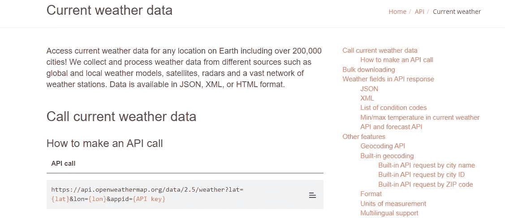
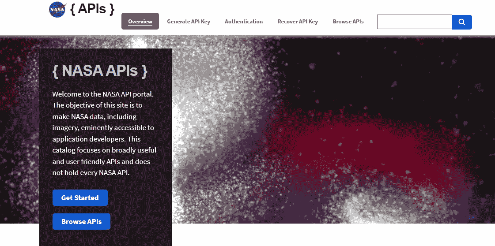
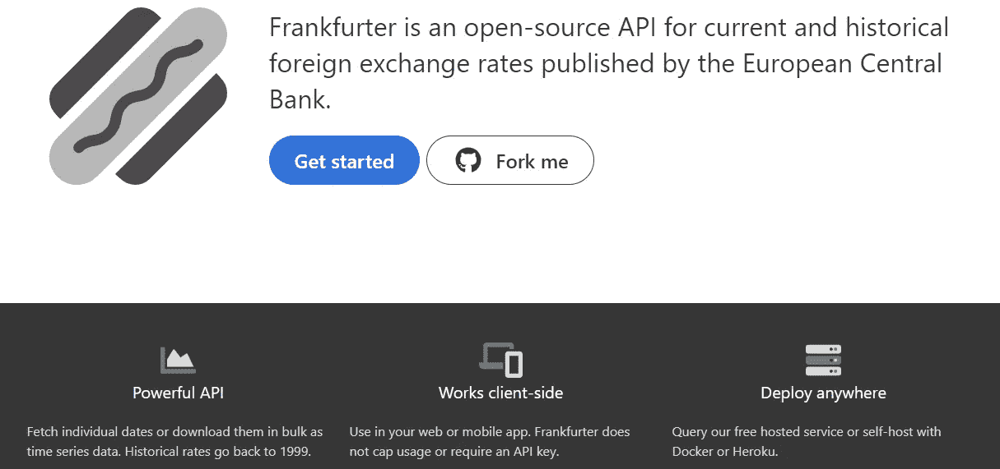
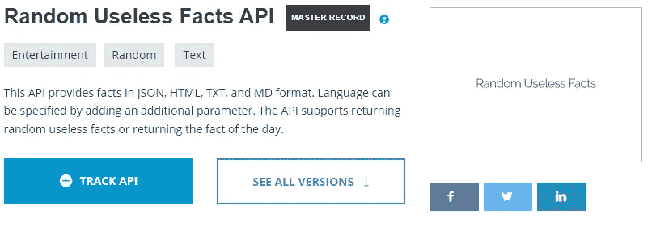
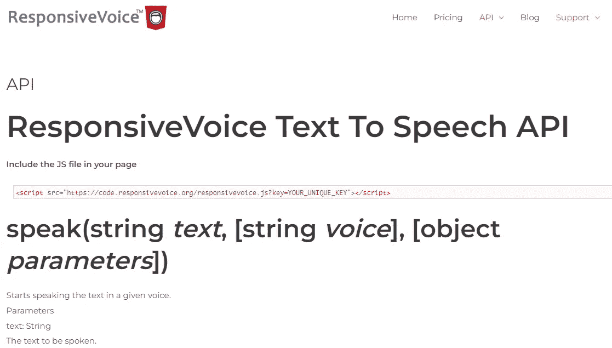
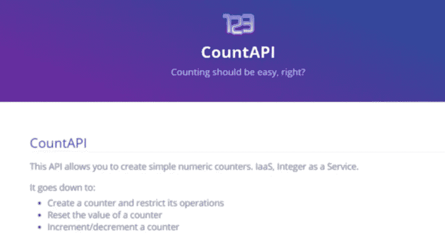

# 2022 年为每个 Web 开发者提供 10 个令人敬畏的 API

> 原文：<https://blog.devgenius.io/10-awesome-apis-for-every-web-developer-in-2022-be1a7acb73ad?source=collection_archive---------0----------------------->

## 一个非常有用的 API 列表，您可以在下一个 web 项目中使用。

照片由 [Unsplash](https://unsplash.com?utm_source=medium&utm_medium=referral) 上的[静止不动](https://unsplash.com/@stillnes_in_motion?utm_source=medium&utm_medium=referral)

如今，API 无处不在，并且在 web 开发中非常有用。作为 web 开发人员，API 或所谓的应用程序编程接口是在 web 项目中访问特定数据并与之交互的一种很好的方式。

API 可以让我们在应用程序的前端和后端之间进行通信。这是访问外部数据并在我们的网站或应用程序上显示它的一个很好的方式。

作为一名 web 开发人员，使用 API 有很多好处。好的一面是，它可以让你的网站或应用程序更有活力，拥有 API 可以给你的特性。除此之外，这也是一种不用写太多代码就能节省时间的方法。

在这篇文章中，我们将会看到一些非常有用和有趣的 API，可以用在你的下一个项目中。所以让我们开始吧。

# 1.Giphy API

[Giphy API](https://developers.giphy.com/) 是一个非常有用和令人敬畏的 API，它可以让你访问丰富的 GIF 和视频库。Giphy 令人惊叹的 API 的美妙之处在于，只需几行代码，它们就能让您在应用程序中增强参与度。

作者从 GIPHY 开发人员处获取。

Giphy 为您提供一切，让您的应用程序对用户更具吸引力。所有这些都是通过提供一个专属的 gif、贴纸和剪辑库实现的。除此之外，你还可以使用他们强大的搜索算法，这将允许你的用户用他们正在寻找的精确 GIF 来激活他们的对话。

# 2.OpenWeatherMap API

OpenWeatherMap 是另一个很棒的 API，它允许你访问任何地方的当前天气数据。除此之外，你还可以得到很多关于你正在寻找的特定地点的天气信息。这个 API 有很多你可以使用的很酷的特性。

由作者从 OpenWeatherMap 捕获。

您可以轻松地进行 API 调用，并且可以获得 HTML、JSON 或 XML 格式的数据。

# 3.美国宇航局 API

NASA 为软件开发人员提供了一系列令人敬畏且有用的 API。这些 API 可以让你访问大量的 NASA 数据，包括月球、太空天气、天文学、火星等等。

由美国国家航空航天局的作者拍摄。

我强烈建议您查看他们的文档，了解更多关于如何在项目中使用 API 的信息和指南。

# 4.MealDB API

如果你想访问食谱和随机的膳食数据，MealDB 是另一个有用的 API。它为您提供多种类型的膳食数据，如配料、膳食图像、膳食类别、视频等等。

作者从 MealDB API 捕获。

# 5.法兰克福 API

[Frankfurter API](https://www.frankfurter.app/) 是一个非常有用的开源 API，可以让你获得欧洲央行发布的大量外汇汇率数据。

由作者从法兰克福 API 捕获。

因此，您可以轻松地获得当前和历史汇率，也可以获得或跟踪货币数据。API 不需要开发者密钥。

# 6.随机事实 API

这个惊人的 [API](https://www.programmableweb.com/api/random-useless-facts) 允许你访问大量随机事实，并在你的项目中使用它们。您可以获得 JSON、HTML、MD 和 TXT 格式的随机事实。

作者从随机事实 API 中捕获。

使用 API 时，您还可以指定事实的语言。除此之外，这个 API 还允许您获取随机的无用事实数据，并返回当天的事实。

# 7.响应语音 API

有了[响应式语音 API](https://responsivevoice.org/api/) ，你可以将任何文本转换成语音。这个 API 有很多强大的特性，你可以从中受益，比如改变语言、音量、说话者的口音和性别。

我强烈建议您查看文档，了解更多关于如何在您的下一个项目中使用 API 的信息。

由作者从响应式语音 API 捕获。

这是一个我们使用 API 的简单例子。查看下面的代码笔:

由作者从 [Codepen](https://codepen.io/) 创作。

# 8.Youtube API

[Youtube API](https://developers.google.com/youtube/v3) 让你可以访问许多 Youtube 特性和数据，你可以将它们添加到你的网站或应用程序中。如果您要在项目中嵌入 Youtube 视频，这将非常有用。API 为您提供了许多有用的特性。

由作者从谷歌开发者那里捕获。

# 9.漫威 API

漫威 API 是一个很棒很有用的漫画 API，它给开发者提供了很多关于漫威漫画图书馆的信息。你将获得 1000 部漫威漫画。

由作者从漫威漫画 API 捕捉。

# 10.计数 API

Count API 允许你跟踪一个页面被访问的次数，并生成数字计数器。例如，这个 API 也可以用于确定用户点击按钮的频率。

由作者从 Count API 捕获。

所以这个 API 是有用的，它允许你跟踪你的 web 项目中的许多东西。文档也简单明了。

# 结论

从上面的列表中可以看出，这些是您可以在项目中使用的一些最有用的 API。它们为开发人员提供了有用的信息。我强烈建议使用 API，因为它们节省时间，让生活更轻松。

*感谢您阅读这篇文章。此外，如果您发现我的内容有用，而您不是媒体会员，您可以在此处获取您的媒体会员资格***(媒体推荐链接)以获得无限制的* ***访问媒体上的所有内容*** *并支持我们作为作家。**

* [## 通过我的推荐链接加入 Medium-Mehdi Aoussiad

### 阅读 Mehdi Aoussiad(以及媒体上成千上万的其他作家)的每一个故事。您的会员费直接支持…

mehdiouss.medium.com](https://mehdiouss.medium.com/membership) 

**更多阅读:**

 [## 7 个非常有用的 JavaScript 一行程序

### 每个 JavaScript 开发人员都应该知道的强大的一行程序列表。

blog.devgenius.io](/7-javascript-one-liners-that-are-insanely-useful-705b520b9160)  [## 学习 React 之前应该了解的 JavaScript 特性

### 在做出反应之前，先学习这些 JavaScript 特性

javascript.plainenglish.io](https://javascript.plainenglish.io/8-javascript-features-to-know-before-learning-reactjs-aac8b7748b30)*