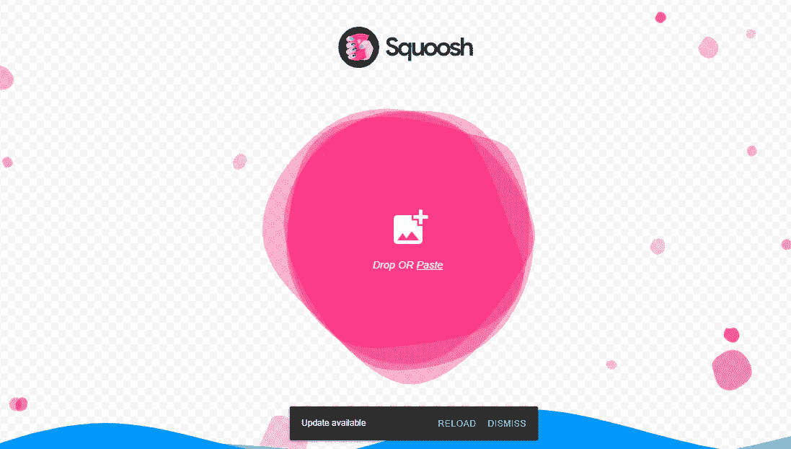

# 面向所有 Web 开发人员的 10 大免费资源

> 原文：<https://blog.devgenius.io/10-awesome-free-resources-for-all-web-developers-a9f63855e97f?source=collection_archive---------0----------------------->

## 你应该知道的有用资源列表。

妮可·沃尔夫在 [Unsplash](https://unsplash.com?utm_source=medium&utm_medium=referral) 上的照片

无论你是哪种类型的开发人员，你都需要使用一些资源来帮助你提高编码任务的效率和工作效率。网上有很多免费的强大工具和资源。

作为一名 web 开发人员，您需要利用在线资源和工具来简化您的工作。这可以帮助你加快发展，更快地完成高质量的工作。

这就是为什么在这篇文章中，我想和你分享一些很棒的免费资源，你可以作为一个 web 开发者来使用。让我们开始吧。

# 1.拉开

[Undraw](https://undraw.co/) 是一个很棒的资源，它提供了一系列免费的 SVG 插图，你可以在你的项目中使用。您可以搜索适合您品牌的插图，还可以定义插图的颜色。这是一个很好的资源，试一试吧。

由作者从 [Undraw](https://undraw.co/) 中截取。

# 2.404 幅插图

[Error 404](https://error404.fun/) 是另一个资源，您可以在其中找到专门针对您的 404 页面的插图。

作者从[错误 404](https://error404.fun/) 中捕获。

# 3.Squoosh

Squoosh 是一个非常棒的免费工具，它可以让你轻松地压缩图像，并针对网络进行优化。

作者从 [Squoosh](https://squoosh.app/) 截取。

# 4.DevDocs

[DevDocs](https://devdocs.io/) 是 web 开发技术文档的头号资源。DevDocs 使用 API 文档为多种 web 技术创建文档。

作为一名 web 开发人员，当您想要学习或重新学习任何概念时，这是一个很好的参考资源。

作者从 [DevDocs](https://devdocs.io/) 中截取。

# 5.iHateRegex

如果您正在纠结于正则表达式或者不想自己创建它们，iHateRegex 是一个有用的工具。这个工具允许你找到不同类型的带有解释的正则表达式。你可以复制你需要的正则表达式并在你的代码中使用它。

由作者从 [iHateRegex](https://ihateregex.io/) 捕捉。

# 6.碳

[Carbon](https://carbon.now.sh/) 是另一个有用的工具，可以让你轻松地为你的代码片段创建图像，并在线与其他开发者分享。你可以在推特上发布和下载 PNG 或 SVG 格式的图片。

作者捕捉自[碳](https://carbon.now.sh/)。

# 7.滴水不漏

Dribbble 是我用来为我的项目提供设计灵感的另一个平台。有很多顶级设计师贴出来的设计，就是为了启发你。

作者从 [Dribbble](https://dribbble.com/) 中截取。

# 8.泛灵论者

Animista 是一个很棒的网络应用程序，它给你一个预先制作的 CSS 动画的集合，你可以在你的项目中使用。该应用程序包含不同类型的动画，您只需复制 CSS 代码即可使用。

作者从 [Animista](https://animista.net/) 捕捉。

# 9.形状分割器

[形状分割线](https://www.shapedivider.app/)允许你轻松地为你的网站生成和创建自定义的分割线形状。这些形状是 SVG 格式的，您可以获得用于您的项目的代码。

作者从[外形分割器](https://www.shapedivider.app/)中截取。

# 10.概念

观念是另一个伟大的生产力平台，帮助你轻松地写博客和做笔记。

由作者从[观念](https://www.notion.so/)中捕捉。

# 结论

正如你在上面看到的，这些是你作为一个 web 开发者可以使用的一些资源和工具。它们非常有用，可以帮助你加快工作速度，提高工作效率。

感谢您阅读这篇文章。希望你觉得有用。

**更多阅读:**

 [## 你可能不知道的 6 个强大的 JavaScript 控制台方法

### JavaScript 中你应该知道的有用的控制台方法。

javascript.plainenglish.io](https://javascript.plainenglish.io/6-powerful-javascript-console-methods-that-you-probably-dont-know-a20952bac33c)  [## 你应该避免的 5 个常见 HTML 错误

### 如果您想编写高质量的代码，请避免这些 HTML 错误。

javascript.plainenglish.io](https://javascript.plainenglish.io/5-common-html-mistakes-that-you-should-avoid-bdbc28fe39d7)