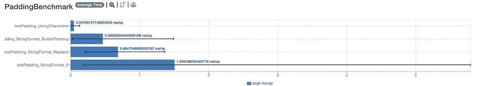

# 让你快乐的 10 个糟糕的 Java 片段

> 原文：<https://blog.devgenius.io/10-bad-java-snippets-to-make-your-day-9e1c6e32bb46?source=collection_archive---------0----------------------->

## 你需要看到的 10 个糟糕的 Java 片段

照片由来自 [Pexels](https://www.pexels.com/photo/upset-young-black-guy-covering-face-with-hand-while-working-remotely-on-netbook-5699826/?utm_content=attributionCopyText&utm_medium=referral&utm_source=pexels) 的[亚历克斯·格林](https://www.pexels.com/@alex-green?utm_content=attributionCopyText&utm_medium=referral&utm_source=pexels)拍摄

# 1.如何生成填充？

*不良开发者如何生成填充？以下是方法。*

虚拟空白生成

这是一台发电机。要生成填充，您可以使用`String.format`。使用填充字符以获得更好的性能。

以下是你可以填充琴弦的方法。

[投票最多的填充解决方案](https://gist.github.com/zivce/6bb9f8c9a3efc71540be68ed5b933969)

你应该用字符填充字符串。*为什么？*因为你没有创建新的字符串。使用**字符**填充字符串是**性能最好的**。

`String.format`有一点开销，因为它与`String`一起工作。`String.format`代码更容易阅读、维护和理解。就性能而言，这不是最佳的填充解决方案。

[基准测试结果](https://jmh.morethan.io/?gist=07c1c3b428184101986be64a35fd28f3)

# 2.你的班级名字有多长？

这个名字看起来不可能。然而它就在 AspectJ 的库中。

更有趣的是什么？类的方法，`[wellHasItThen](https://www.javadoc.io/doc/org.aspectj/aspectjweaver/1.8.10/org/aspectj/weaver/patterns/HasThisTypePatternTriedToSneakInSomeGenericOrParameterizedTypePatternMatchingStuffAnywhereVisitor.html#wellHasItThen--)`。整个班级看起来像个笑话。

[来源](https://www.javadoc.io/doc/org.aspectj/aspectjweaver/1.8.10/org/aspectj/weaver/patterns/HasThisTypePatternTriedToSneakInSomeGenericOrParameterizedTypePatternMatchingStuffAnywhereVisitor.html)

# 3.你创造日期吗？

你不应该创造自己的`Date`逻辑。你对时间的所有假设都是不正确的。

你不应该相信这些神话。一天持续 24 小时。时间没有起点也没有终点。世界上的国家比时区还多。一个国家的时区从不改变。还有更多[神话](https://gist.github.com/timvisee/fcda9bbdff88d45cc9061606b4b923ca)。

这个片段不适合创建日期。*为什么？二月的整数值是多少？1 还是 2？有人为了`iMonth`过了 30 怎么办？这是冰山一角。加上时区、闰年，你会得到一个灾难的配方。使用久经考验的代码来创建日期。*

错误的日期逻辑

使用`LocalDate`创建整数之外的日期。

LocalDate 创建日期

# 4.创建链接很难

*为什么这段代码不好？*您可能会得到一个格式错误的 URL。附加查询参数会导致讨厌的错误。你不应该自己创建链接。

*你应该用什么？*事实上的 URI 生成器:[Java . net . uri。URI 可以转换成网址。应该用这个类别配置参数、协议和其他 URI 属性。](https://docs.oracle.com/javase/7/docs/api/java/net/URI.html)

糟糕的代码既不灵活也不健壮。您需要追加每个参数。要添加 SSL，您需要设置`_UseSSL`。不要多此一举。使用现有的发电机。

[来源](https://github.com/ip2location/ip2location-java/blob/master/com/ip2location/IP2LocationWebService.java)

以下是你如何使用 URI 创建一个网址。

# 5.如何设置请求的状态？

*你是不是有很多条件要查？需要满足一定的条件吗？不要这样做。*

[不良状况检查](https://www.govnokod.ru/java)

你应该使用规格型号。Evan [建议](https://www.martinfowler.com/apsupp/spec.pdf)如果你需要选择、验证或构建，这是最好的模式。该规范将删除 if-else 块，使您的代码可读，并且更易于维护。

# 6.你如何验证？

规格模式也应该是正确的解决方案。条件应该被包装在规范中，并根据规范进行验证。该规范将减少代码块，并使您的代码更好。

[来源](https://github.com/ip2location/ip2location-java/blob/master/com/ip2location/IP2LocationWebService.java)

# 7.你帮助垃圾收集者吗？

我们不是在 C++时代。收垃圾的不需要我们的帮助。移除未使用的对象有不同的算法。*不需要设置变量为* `*null*` *。*

[来源](https://www.govnokod.ru/java)

# 8.你正确地创建了你的 Dao 吗？

不需要创建自己的道工厂。使用弹簧。使用 Spring 创建和管理 beans。*避免定制实例容器。*

[来源](https://www.govnokod.ru/java)

# 9.你使用日期常量吗？

任何日期假设都是错误的。

*   一年不会持续 365 天
*   一分钟不会持续 60 秒
*   一秒 1000 毫秒也不是
*   一天不会持续 24 小时。

*使用现成的常数，不要对时间做任何假设。*

[来源](https://www.govnokod.ru/java)

# 10.你如何找到重复的？

以下是如何避免重复的方法。

[来源](https://www.govnokod.ru/java)

这里有一个更好的方法来找到重复的。集合只包含唯一的项目，根据定义，您不能添加重复的项目。如果`add`方法返回 false，则是重复项。

[来源](https://stackoverflow.com/a/58159562/5999670)

# 偷我的电子书

我已经写了很多糟糕的 Java 片段。你可以从我的口香糖店里偷。

给一两美元小费可以帮助我免费创作更好的电子书！