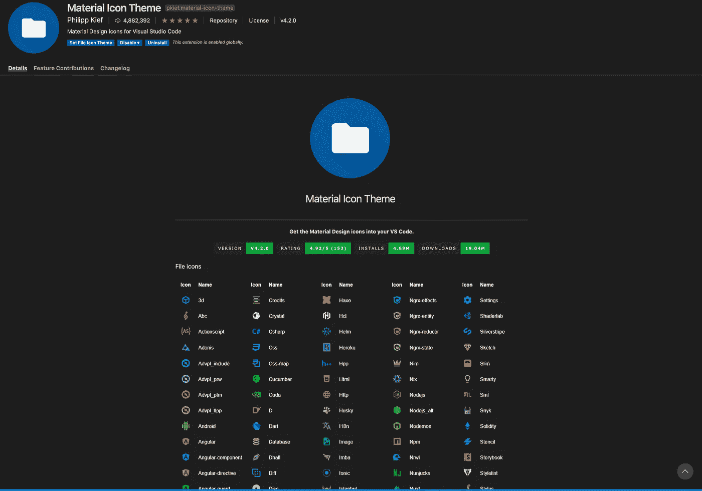
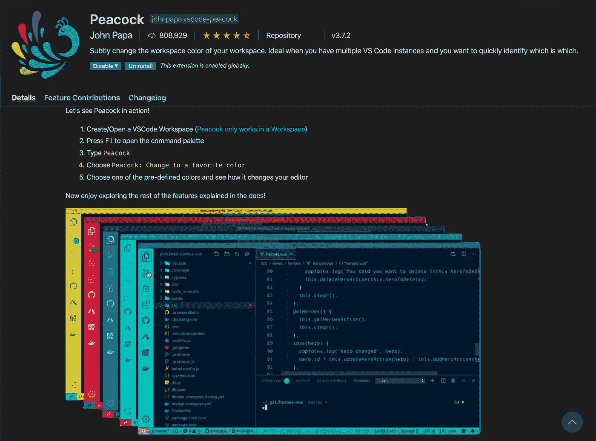
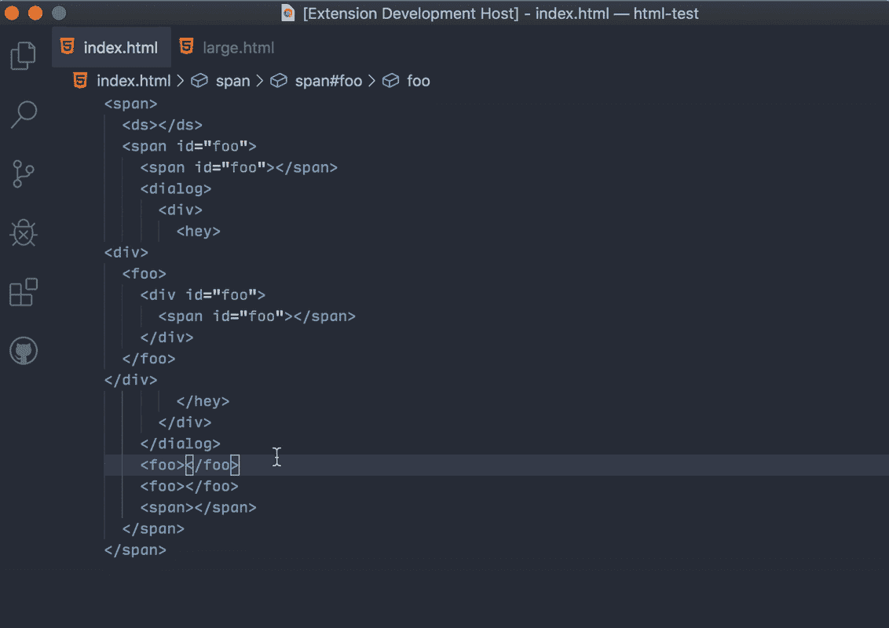
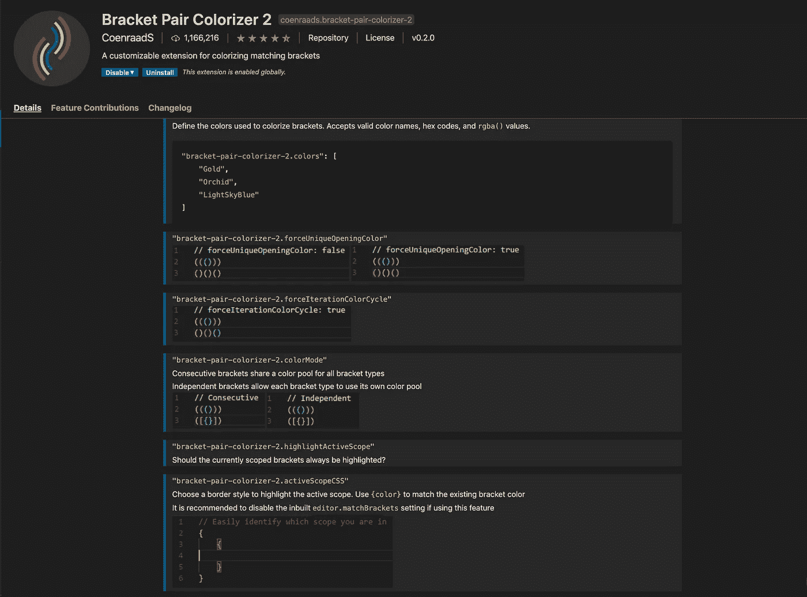
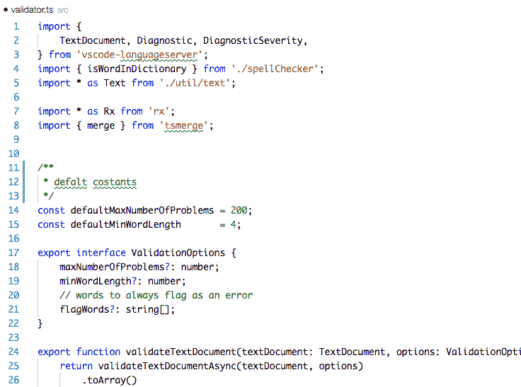
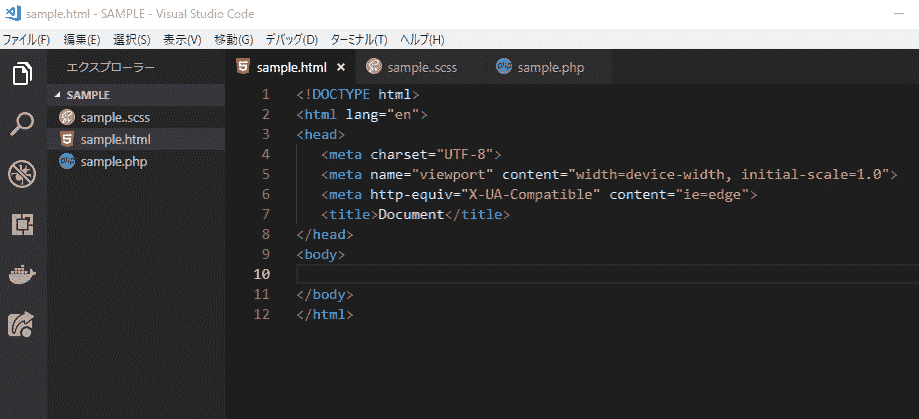
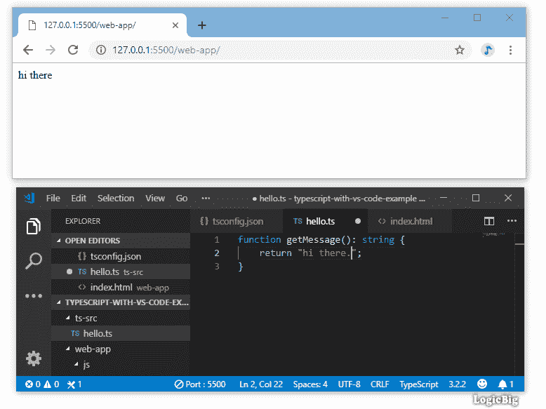
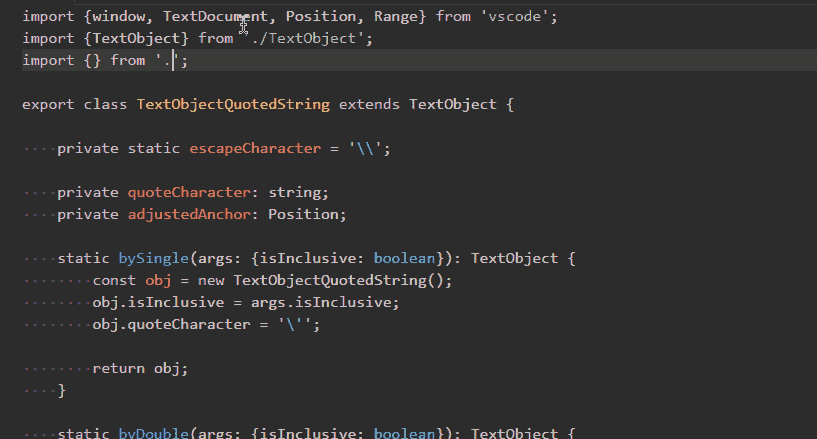

# 面向初学者的 10 个基本 VS 代码(Visual Studio 代码)扩展。

> 原文：<https://blog.devgenius.io/10-basic-vs-code-visual-studio-code-extensions-for-beginners-5f2b2aac7c3f?source=collection_archive---------2----------------------->

Visual Studio 代码

Visual Studio 代码中有大量有用的扩展。我将在这里为初学者介绍 10 个最基本的有用且必须安装的扩展。

**如何安装扩展**–打开“Visual Studio Code”—>进入“Setting”—>选择“extensions”，你就可以在这里开始市场搜索了。或者，一个快捷的方法是打开“Visual Studio Code ”,在左边栏的底部，有一个扩展的标志，它会把你带到搜索标签。

1.  **素材图标主题**:这是自动用图标改变你的普通目录。它让你的目录和文件更加清晰可见。

2.**孔雀**:这将在你打开几个项目时给你不同的 VSCode 框架颜色。一眼就能看出你想接手哪个项目，这一定会提高你的工作效率。

雄孔雀

3.**自动关闭标签**:这是它的名字，但是如果你输入开始标签名，自动关闭标签名。

自动关闭标签

4.**自动重命名标签**:如果您更改开始标签名称，配对结束标签会自动重命名。这是一个非常方便的工具，可以避免忘记重命名。

自动重命名标签

5.**括号对着色程序 2 :** 这个扩展将对括号进行着色，这对于识别哪些是匹配的标签非常有用，尤其是当你用 JavaScript 或其他编程语言编码时。

括号对着色程序 2

6.代码拼写检查器:当你记录代码时，查找错别字是一件困难的工作，但是这个扩展可以直接检测到错别字，并且很容易修复。

代码拼写检查器

7.**高亮匹配标签**:这个扩展高亮匹配标签，这样有助于你的开发，并且很容易找到垃圾标签。

突出显示匹配的标签

8.这个扩展帮助你输入更少的 HTML 代码，如下所示。如果您键入快捷标签名称，它会识别并自动修复您的标签名称。

HTML 片段

9. **Live Server :** 这个扩展是针对前端开发者的。当你开发的时候，你可以在 web 浏览器上实时查看它的样子。安装扩展，在你正在开发的文件上，“右击”并按“用 Live Server 打开”，你会在网络浏览器上看到结果。

实时服务器

10.路径自动完成:这有助于你编码正确的路径。当您指定第一个路径时，它会自动显示下一个路径可能是什么。

路径自动完成

这一次，我只介绍了 10 个 VS 代码扩展，但是还有更多有用的扩展，所以如果您感兴趣，可以自己探索更多:)我希望本文对您有所帮助。

🍀感谢阅读！🍀

🍀由 Sanae 撰写🍀

🍀2020 年 8 月 9 日星期日🍀