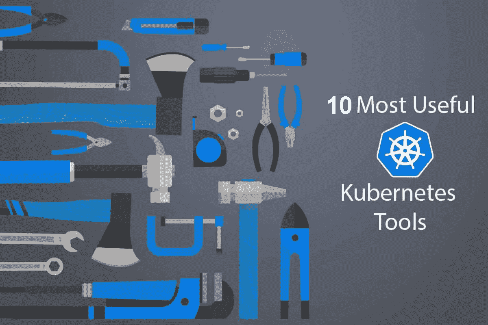

# 2020 年 10 款最佳 kubernetes 工具

> 原文：<https://blog.devgenius.io/10-best-kubernetes-tools-for-2020-1146896b410f?source=collection_archive---------11----------------------->

Kubernetes 是容器编排事实上的标准。Kubernetes 已经作为首选的容器解决方案而广受欢迎。

我们将看看 10 个最好的 Kubernetes 工具。这些应用程序将补充 K8s 并增强您的开发工作，因此您可以从您的 Kubernetes 获得更多。利用这些 Kubernetes 伙伴来简化应用程序定义、迁移集群、简化云部署等

全文:[http://entradasoft . com/blogs/10-best-kubernetes-tools-for-2020](http://entradasoft.com/blogs/10-best-kubernetes-tools-for-2020)

## 1 个 Kubernetes 仪表板

Kubernetes Dashboard 是一个基于 web 的 Kubernetes 监控工具，更适合小型集群。它提供了一个 UI 来管理 Kubernetes。这些任务包括发现、负载平衡和监控。
许多选项可用于故障排除。仪表板允许监控 CPU 和内存的总使用量。它可以监控工作负载的运行状况。安装非常简单，因为有现成的 YAML 模板可用。小屋是 Kubernetes 仪表盘的移动版。它为 Android 和 iOS 提供了类似的功能。

## 2 库伯莱

这些是在 Kubernetes 集群的每个节点上运行的“节点代理”。他们可以向中央 API 服务器注册节点。“PodSpec”，这是一个用于描述每个 pod 的 YAML 或 JSON 对象。Kubelet 因此能够通过它们的 PodSpecs 来监控这些节点。

## 3 舵

Kubernetes Helm 是一个管理预先配置的 Kubernetes 资源包的工具，也称为 Kubernetes 图表。
**使用 Helm 来:**
查找并使用打包为 Kubernetes 图表的流行软件
以 Kubernetes 图表的形式共享您自己的应用程序
创建您的 Kubernetes 应用程序的可复制版本
智能管理您的 Kubernetes 清单文件
管理 Helm 包的发布

## 4 重力

如果你想在 Kubernetes 中部署一个应用程序，许多应用程序都有导航图来指导和自动化这个过程。但是，如果您想将 Kubernetes 集群按原样部署到其他地方，该怎么办呢？
Gravity 拍摄 Kubernetes 集群、它们的容器注册中心以及它们正在运行的应用程序的快照，称为“应用程序包”这个包只是一个. tar 文件，可以在 Kubernetes 运行的任何地方复制集群。
Gravity 还确保目标基础设施能够支持与源相同的行为需求，并且目标上的 Kubernetes 运行时符合标准。

## 5 Minikube

Minikube 允许您在本地安装和试用 Kubernetes。该工具是 Kubernetes 探索的良好起点。在笔记本电脑上的虚拟机(VM)中轻松启动单节点 Kubernetes 集群。Minikube 可以在 Windows、Linux 和 OSX 上使用。只需 5 分钟，您就可以探索 Kubernetes 的主要功能。只需一个命令即可启动 Minikube 仪表盘。

## 6 Kubespray

Kubespray 为 Kubernetes 的部署和配置提供了一组可行的角色。Kubespray 可以使用 AWS、GCE、Azure、OpenStack 或裸机基础设施即服务(IaaS)平台。Kubespray 是一个开源项目，采用开放的开发模式。对于已经了解 Ansible 的人来说，该工具是一个很好的选择，因为不需要使用另一个工具来进行供应和编排。

## 7 扭锁

Twistlock 是一个全生命周期的容器安全解决方案。它有一个 VMS，可以扫描任何易受攻击的区域。它会持续扫描 Kubernetes。还有一个自动防火墙。扫描容器图像是 Twistlock 的另一个重要功能。支持 Node.js 组件和 Docker 映像。Twistlock 关注容器安全性的两个基本方面。首先，它持续扫描集装箱图像。原因是每天都有新的威胁数据出现。接下来，它关注运行容器的安全性。必须首先设定正常行为的基线。之后，可以很容易地对其进行监控。

## 8 库贝克特尔

Kubectl 是 Kubernetes 的默认 CLI 工具。它支持与 Kubernetes 相关的所有操作。通过$HOME 目录中的配置文件来检测节点。kubectl 也接受其他 kubeconfig 文件。只需设置相关的环境变量。也可以用 kubeconfig 标志来完成。Docker 用户可以使用 kubectl 与 API 服务器进行交互。kubectl 命令类似于 Docker 命令。只有一些小的不同。

## 9 阿尔西德·考迪特

Alicide kAudit 通过扫描 Kubernetes 审计日志，自动实时分析多集群部署的违规、滥用和异常行为。
该解决方案为客户提供检测到的异常情况摘要，以及访问、使用和性能趋势。

## 10 无底洞

这个工具是一个用于部署小型应用程序的本地 Kubernetes 工具。它使用 Kubernetes 资源来支持许多任务。这些有助于自动扩展、路由 API、监控和故障排除。Kubeless 脱颖而出，因为它支持自定义资源定义。这个特性允许 Kubeless 创建定制的 Kubernetes 资源。然后，您可以使用集群内控制器来监控它们。它允许您根据需要启动运行时。然后，它通过 HTTP 提供这些运行时。此外，还有一个 PubSub 机制。

了解更多:[http://entradasoft . com/blogs/10-best-kubernetes-tools-for-2020](http://entradasoft.com/blogs/10-best-kubernetes-tools-for-2020)