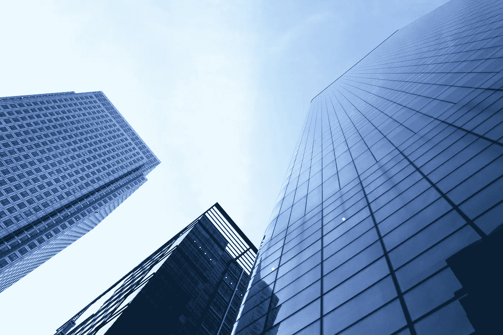

# 美国 10 家最佳软件测试公司

> 原文：<https://blog.devgenius.io/10-best-software-testing-company-in-the-usa-1118b403772d?source=collection_archive---------11----------------------->

你正在寻找美国最好的软件测试公司吗？由于美国的 IT 公司越来越多，企业主很难选择领先的服务提供商。

另一个原因是，拥有内部 QA 团队的成熟公司也会从外部聘请软件测试公司，因此最好从美国不同地区挑选经验丰富的 QA 顾问。

为了让您省心，我们还为您的企业策划了美国 10 家最佳软件测试公司的名单。请记住，我们的名单是经过广泛研究后制定的，并确保这些都是美国顶尖的 IT 公司，专注于软件测试的最新技术，所以你可以一个一个地审查，以做出最终决定。

# 美国十大软件测试公司

# 1.臭虫猛禽

BugRaptors 是 Seasia Group (CMMI 第五级公司)的一部分，是一家知名的独立软件测试公司。

它在全球范围内提供从移动应用、功能测试、web 测试、安全测试、游戏到自动化测试的各种 QA 解决方案和软件测试服务。

你可以从美国的这家 IT 公司获得卓越的质量。他们的专家对最新的软件测试技术和工具非常了解，并且使用几个敏捷和连续的模型来将质量交付到多个领域。

成立于:2016 年

总部:美国加州

员工:501-1000 人

核心服务:标准化 QA 服务、专业化 QA 服务、自动化测试服务、测试咨询服务、DevOps 测试、AI 测试。

收入:400 万至 500 万美元

客户:WayBack Machine，2toLead，SimTutor，Key Rider，Wherefor 等。

网址:【https://www.bugraptors.com/ T3

# 2.ImpactQA

ImpactQA 是另一家软件测试公司，在美国排名前十。它提供在软件开发生命周期中实施的全面的自动化测试和持续测试服务。

ImpactQA 的专业人员使用面向客户和特定领域的测试流程和自动化工具来制作一致的高质量软件产品。

该组织使用最新的测试技术为多个业务领域提供最佳的测试解决方案，包括医疗保健、教育、媒体、金融科技、初创企业等。

成立于:2011 年

总部:美国纽约

员工:250-999 人

核心服务:全周期软件测试、QA/软件测试咨询、测试自动化、移动应用测试、功能测试、医疗设备测试、安全和渗透测试、性能测试、DevOps 测试、AI 测试、Web 应用测试等等。

收入:500 万至 1000 万美元

客户:施耐德电气、德勤、松下、火箭互联网、特雷克斯、NYRR、百胜餐饮集团

网址:[https://www.impactqa.com/](https://www.impactqa.com/)

# 3.用心问答

Mindful QA 为各种规模的企业和非营利组织提供灵活的按需软件测试服务。

您可以在这里获得 100%经验丰富的测试人员提供的屡获殊荣的 QA 服务。无论你是想雇一个全职的 QA 测试员，还是每个月 20 个小时，他们所有的质量保证测试服务都是随叫随到的，你可能会觉得很愉快。

成立时间:2018 年

总部:加利福尼亚州洛杉矶(所有员工都在美国)

员工:50-200 人

核心服务:手动测试、自动化测试、性能测试、移动应用测试、软件测试、网站测试、API 测试等等。

其他服务:快速测试、敏捷咨询、QA 招聘、回归测试、数字代理 QA、备份覆盖、用户体验咨询等等。

客户:谷歌、Zillow、微软、Clorox、塔可钟、H&R 街区等。

网址:【https://www.mindfulqa.com/ T3

# 4.酱油实验室

Sauce Labs 精通自动化测试、持续和实时测试服务。如果你需要一个基于云的测试平台，这家美国的软件测试解决方案提供商是你的最佳选择。

Sauce Labs 提供了提供难忘的数字体验所需的分析、可见性和专业知识。他们为许多软件测试网站工作，并且总是试图给他们的客户更好的输出。

成立于:2018 年

总部:美国加州

员工:201-500 人

核心服务:真实设备跨浏览器测试、云、添加仿真器和模拟器、可视化测试、测试分析等。

收入:5000 万至 5100 万美元

客户:VISA、沃尔玛、Splunk、Zillow。

网址:【https://saucelabs.com/ 

# 5.QASource

QASource 是美国最优秀的 IT 服务公司之一，专注于为法律保健、金融、网络安全、创业和零售等行业提供全套 QA 解决方案。

QASource 可以帮助您满足 Salesforce 开发需求。它的外包团队遵循 DevOps 实践来减少代码集成问题，并确保及早发现 bug。该公司在流行的编程语言方面积累了经验，如 Apache、Java、VBScript、MySQL 等。

成立于:2002 年

总部:美国加利福尼亚州普莱森顿

员工:501-1000 人

核心服务:自动化测试、手动测试、安全测试、API 测试、移动 QA、性能测试、Salesforce 测试、QA 分析等。

收入:500 万至 1000 万美元

客户:易贝、福特、IBM、TechSmith、脸书等。

网址:[https://www.qasource.com/](https://www.qasource.com/)

# 6.科学软件

你是否厌倦了在软件测试网站上寻找合适的软件测试服务提供商？您的等待结束了，因为 ScienceSoft 提供软件测试、应用服务、软件开发、it 咨询等服务。

据该网站称，ScienceSoft 拥有一个拥有相关领域专业知识的知识丰富的团队。它确保敏感数据的安全授权和保护。

成立于:1989 年

总部:美国德克萨斯州

员工:501-1000 人

核心服务:QA 咨询、测试自动化、QA 外包、质量评估、性能测试、移动和 Web 应用测试等。

收入:2000 万至 2500 万美元

客户:雀巢，易贝，美国宇航局 JPL，帮助热线，T-Mobile，M&T 银行，百特等。

网址:[https://www.scnsoft.com/](https://www.scnsoft.com/)

# 7.测试字节

Testbytes 可以成为你在美国最好的软件测试公司，因为他们提供各种测试服务，从游戏测试，安全测试到移动测试解决方案。

该公司拥有 ISO、基于 CMMI 的流程、敏捷的最佳实践和方法，能够为您的网站和应用程序提供高质量的测试。无论你想要软件测试的最新成果还是想要检查现有的应用程序，Testbytes 都适合你。

成立于:2013 年

总部:美国纽约

员工:51-200 人

核心服务:移动应用测试、Web 应用测试、自动化测试、游戏测试、安全测试。

收入:1900 万至 2000 万美元

客户:Hey Digital，Fixle，Sixth Gear，Greenno Market，Weevil 等。

网址:【https://www.testbytes.net/ T3

# 8.TestMatick

TestMatick 是您的软件测试实验室，它提供许多服务，包括灵活性、移动性、优惠折扣和无官僚作风。

该组织满足各种行业的日常需求，如教育、银行、金融等。技术技能和特定行业业务流程的完美结合使其成为美国最好的软件测试公司之一。

成立于:2009 年

总部:美国纽约。

员工:51-200 人

核心服务:移动测试、功能测试、SEO 测试服务、自动化测试、游戏测试等。

收入:100 万至 200 万美元

客户:Hubrick、Subscribe Pro、Dahmakan、Negotiation、VeraCloud 等。

网址:【https://testmatick.com/ 

# 9.A1QA

A1QA 是一家为多个业务领域提供 IT 软件质量保证和测试服务的公司。它致力于最新的策略，理解独特的业务需求，并在测试项目中交付一致性。

作为美国最好的测试公司之一，A1QA 旨在帮助人们获得全套 SQA 服务。它愿意在可调整的时区工作。

成立于:2003 年

**总部:**美国科罗拉多州。

**员工:**501–1000 人

**核心服务:**全周期测试、Web 应用、咨询、自动化等。

收入:1000 万美元

**客户:**阿迪达斯、培生、QIWI、卡巴斯基、Equisys、InterCall、ForexClub 等。

网址:[https://www.a1qa.com/](https://www.a1qa.com/)

# 10.LogiGear 公司

LogiGear 在新旧软件测试服务方面拥有近 25 年的经验。从小型到大型公司，LogiGear 都有与测试相关的全套解决方案。

你可以从美国的 LogiGear 公司获得 selenium 自动化、持续测试、测试架构和测试自动化，以及移动测试。

成立于:1994 年

总部:美国加州

员工:501-1000 人

核心服务:API 测试、功能测试、游戏测试、自动化测试、负载和性能测试。

收入:700 万至 800 万美元

客户:迪士尼、ADP、亚马逊、思科、Evernote、安利、LinkedIn、迈克菲等。

网址:[https://www.logigear.com/](https://www.logigear.com/)

# 结论

同样，在美国找到一家值得信赖的独立测试公司有点困难。市场上充斥着各种各样的软件开发人员、开发人员、手工测试人员和自动化测试人员，当你决定选择一个最好的美国软件测试时，他们会让你感到困惑。不过，没有必要担心，因为我们已经为您提供了 10 家顶级测试服务提供商的名单，您可以在找到正确的提供商之前进行彻底的研究。