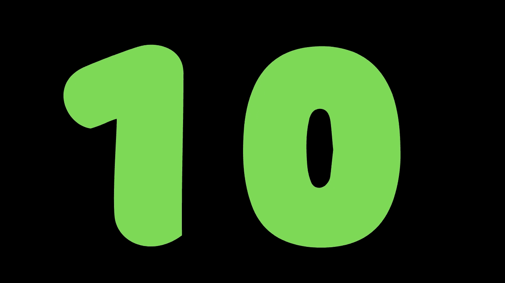

# 我每天使用的 10 种很酷的产品

> 原文：<https://blog.devgenius.io/10-cool-products-i-use-every-day-8c86d32f3311?source=collection_archive---------8----------------------->

视觉效果，Youtube 视频，网页设计

## 在后台

这个清单可以一直列下去，科技发展如此迅速，我相信你也有一个日常使用和喜爱的产品清单。欢迎把你日常用过的产品放在评论里，让我们互相帮助，共同成长。

## 菲格玛

从 youtube 视频缩略图到视觉效果到我的文章横幅到网页设计。

Figma 是一款日常 go 产品。它简单易学，易于设计和分享，并为 Twitter，LinkedIn，youtube，桌面和移动下载并给出不同大小的设计。

[https://www.figma.com/](https://www.figma.com/)

## 不溅

使用 unsplash 提供横幅图像集合。Figma 使用一个 unsplash 插件来提供用于设计目的的图像。当设计原型和缩略图时，我喜欢这个产品。

https://unsplash.com/

## 滴水不漏

如果你是一个网页开发者或设计师，那么 dribbble 是一个很好的灵感来源。他们有成吨的灵感设计来开始工作。

【https://dribbble.com/ 

## Pexels

他们提供了一些我在 Youtube 视频中使用的图片和视频。它易于使用，免费，易于下载。

[https://www.pexels.com/](https://www.pexels.com/)

## 概念

我通过理念本身管理整个 youtube 频道。这里有一个故事来理解这个概念是如何帮助每天发布内容的。

[https://www.notion.so/](https://www.notion.so/)

## 中等

不仅仅因为我是一名作家，还因为我使用媒体来消费好的内容。帮助我增长理解和知识的内容。我已经购买了 medium 年度订阅，这是我一年来唯一购买的订阅，这是我对 medium 的一种爱。

 [## shrey vijayvargiya -中等

### 阅读 shrey vijayvargiya 在介质上的作品。开发者||设计师||企业家||记者||创始人在…

medium.com](https://medium.com/@shreyvijayvargiya26) 

## 推特

另一个获取知识的平台，看看人们在开发、学习和分享什么。获取信息的一个好而快速的方法，大多数时候 medium，Instagram，youtube 是继 Twitter 之后的第二个信息揭示平台，因为它很容易在 Twitter 和其他平台上分享。

[推特账号](https://twitter.com/treyvijay)

 [## 4 种保持方式让自己了解最新技术#短片

### 4 种方法让自己了解最新的技术、编程、软件和技术。======网站= = = = = =中等…

youtube.com](https://youtube.com/shorts/SkANij_SoIw) 

## 商务化人际关系网

和市场上的一些专业人士保持联系是很好的。谁筹集了多少钱，谁在写作，谁在学习，谁在哪里学习，都可以通过 LinkedIn 轻松访问。

你可以在 LinkedIn 上关注我我定期在 LinkedIn 上写文章。

## 流行的声音

这是一个为你的视频获取音乐的付费平台。我喜欢它，他们有一个很好的收藏，加上他们的建议小组和音效是有用的。

[你可以在这里订阅](https://share.epidemicsound.com/y5uq8s)。

## 坎瓦

这是最易于使用的平台，可以创建缩略图、视频、Instagram 故事、短片、海报等等。它可以免费使用，并提供了大量优秀的功能来突出你的社交媒体形象。

【https://www.canva.com/ 

## 结论

下次见，祝你愉快。
Shrey
IHA tereading