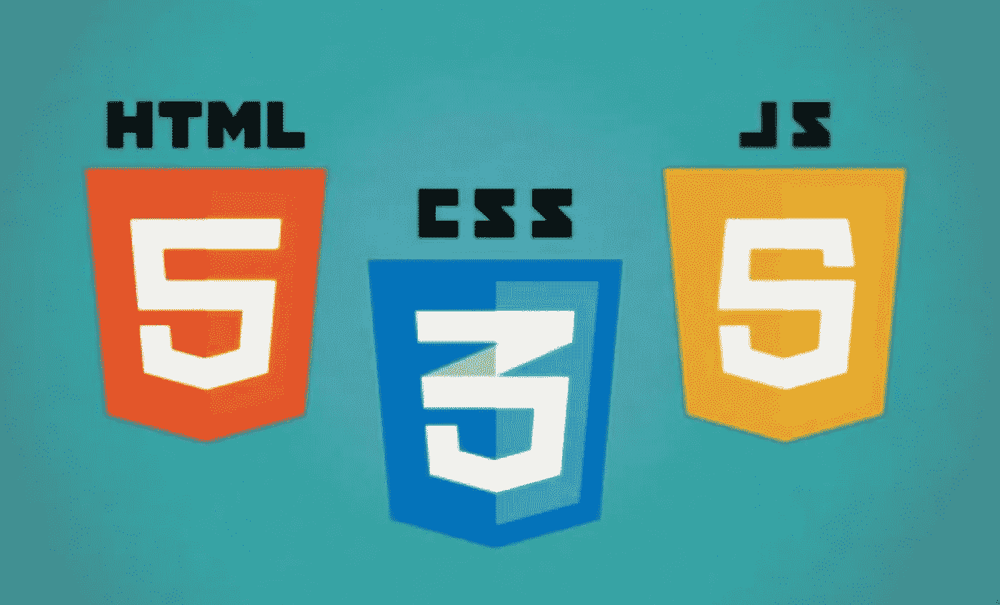
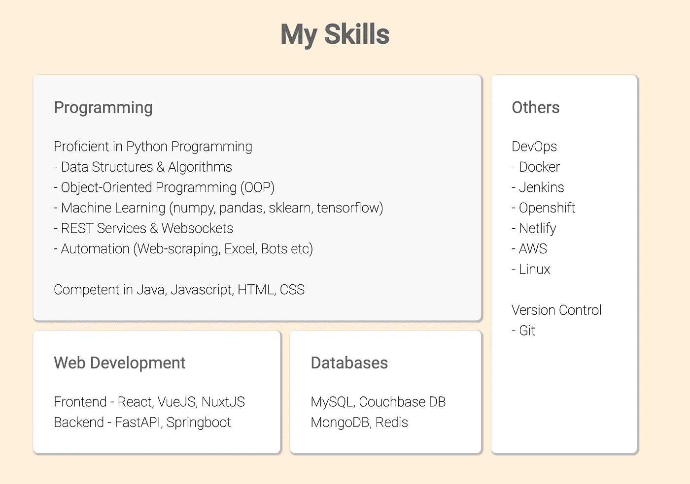
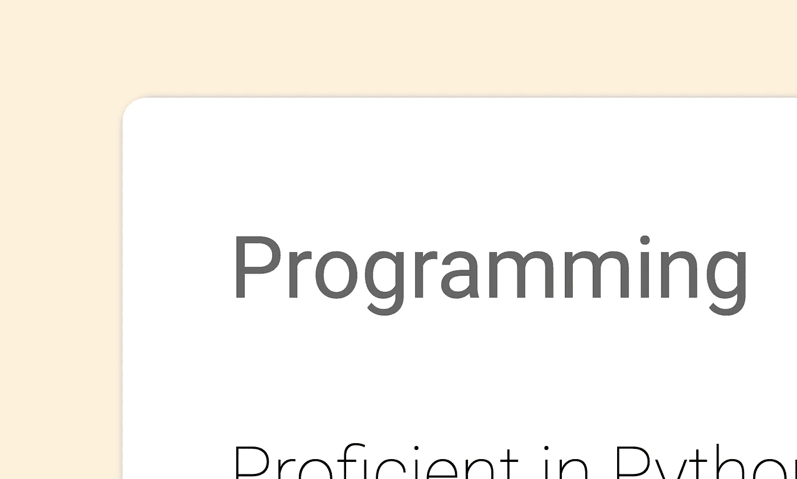
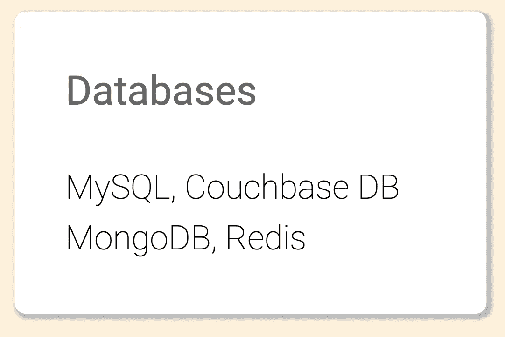

# 我希望我能早点知道的 10 个 CSS 特性

> 原文：<https://blog.devgenius.io/10-css-features-i-wish-i-had-known-much-earlier-2f2522dc63b3?source=collection_archive---------11----------------------->



让我先说我对 CSS 很感兴趣——无论何时我用 CSS 做事情，都是一大堆的谷歌搜索和随机实验。我最近试图在 React 中重建我的作品集网站，并重新学习了很多关于 CSS 的知识。(我也把它们放在这里，这样当我几个月后忘记它们时，我可以很容易地参考它们)

# 1) CSS 尺寸单位— em、vw 和 vh

除了`px`和`%`，我们还可以用`em`、`vw`和`vh`来控制大小。

*   `em` —相对于当前字体大小。`height: 1.5em`表示您正在将高度设置为当前字体大小的 1.5 倍。
*   `vw` —相对于视口宽度的 1%。`width: 40vw`表示宽度设置为窗口大小的 40%。(注意`1vw`是 1%)
*   `vh` —相对于视口高度的 1%。`height: 70vh`表示高度设置为窗口大小的 70%。

# 2)响应性设计的媒体查询

对于那些不知道的人来说，*响应式设计*仅仅意味着你的应用程序针对不同的屏幕尺寸显示不同的内容。我们可以使用 CSS 媒体查询来实现这一点。

```
/* applies only to screens below 600px */
@media only screen and (min-width: 600px) {
    #hello {
        color: red;
    }
}/* applies only to screens above 600px */
@media only screen and (max-width: 600px) {
    #hello {
        color: green;
    }
}
```

这里，宽度小于 600 像素的屏幕的`#hello`颜色为红色，而宽度大于 600 像素的屏幕的`#hello`颜色为绿色。

# 3)该！重要财产

```
#hello {
    background-color: red !important;
}
```

`!important`使当前属性更重要，从而覆盖其他先前设置的样式规则。当我的一些风格因为一些奇怪的原因被其他风格覆盖时，我通常用这个作为快速修复。

# 4)悬停选择器

```
#hello {
    background-color: red;
}#hello:hover {
    background-color: green;
}
```

`:hover`选择器用于选择鼠标经过的元素。在上面的例子中，元素`#hello`通常是红色的，但是当我们将鼠标移到它上面时，选择器`:hover`开始工作，它变成绿色。

# 5)显示屏:柔性

有时候`display: inline-block`的行为非常怪异。所以我用`display:flex`把元素并排放置(这样比较不痛苦！)

```
<div class="row">
    <div class="left">left stuff</div>
    <div class="right">right stuff</div>
</div><style>.row {display: flex}
.left {flex: 3}       /* takes up 60% of width */
.right {flex: 2}      /* takes up 40% of width */</style>
```

在上面的例子中，`.left`格占据了`.row`宽度的 60%(3/(3+2))，而`.right`格占据了 40% (2/(3+2))。

注意——或者我们也可以使用`flex: 66%`告诉 CSS 我们的 div 应该占据 66%的宽度。

# 6)显示:网格



如果我们希望我们的盒子看起来像这样，我们可能需要使用`display: grid`。

```
#parent .grid {
        width: 100%;
        display: grid;
        grid-template-areas:
            'programming programming others'
            'web-dev databases others';
        gap: 1vw;
    }#child1 {grid-area: programming;}
#child2 {grid-area: web-dev;}
#child3 {grid-area: databases;}
#child4 {grid-area: others;}
```

注意在`grid-template-areas`中，我们实际上可以‘画’出我们想要的网格的样子。记住稍后在各自的子 div 中填写`grid-area`即可。

# 7)框尺寸:边框

有时，当我们给一个 div 添加边距或填充时，它的大小会改变，并破坏我们的外观(边距和填充被添加到元素的高度和宽度)。

```
#hello {
    box-sizing: border-box;
}
```

`box-sizing: border-box`解决了这个问题——当使用时，边距和填充包含在*元素的高度和宽度内——这意味着添加边距和填充不会影响元素的大小。*

# 8)图像-适合对象:封面

当你有多张尺寸略有不同的图片时，我们可以使用`object-fit: cover`强制它们都是相同的尺寸

```
img {
    height: 20vh;
    width: 20vw;
    object-fit: cover;
}
```

请注意，图像的某些部分可能会被剪掉，但我会随时处理这个问题，而不是处理不同大小的图像。

# 9)边界半径

属性控制我们的 divs 图像的角有多圆。



我的分区的特写视图

我通常为我的东西设置`border-radius: 8px`，但这是你的偏好。

# 10)方框阴影

属性给你的元素添加了一些阴影，有点像一个很酷的优雅的边框。注意下面 div 周围的阴影:



```
#hello {
    box-shadow: 2px 2px 4px 4px #bbbbbb;
}
```

# 结论

希望这是有帮助的和有益的！

# 一些最后的话

*如果这篇文章有价值，并且你希望支持我，请考虑注册一个 Medium 会员——每月 5 美元，你可以无限制地访问 Medium 上的文章。如果你用我下面的链接注册，我会给你零额外费用赚一点佣金。*

[***注册使用我的链接在这里阅读无限媒体文章***](https://zl-liu.medium.com/membership) ***。***

我写编码文章(主要是 Python ),我认为这些文章可能会帮助年轻的我加快我的学习曲线。请加入我的电子邮件列表，以便在我发布时收到通知。

[](https://zl-liu.medium.com/subscribe) [## 每当 Zlliu 发布时收到一封电子邮件。

### 每当 Zlliu 发布时收到一封电子邮件。注册后，如果您还没有中型帐户，您将创建一个…

zl-liu.medium.com](https://zl-liu.medium.com/subscribe)