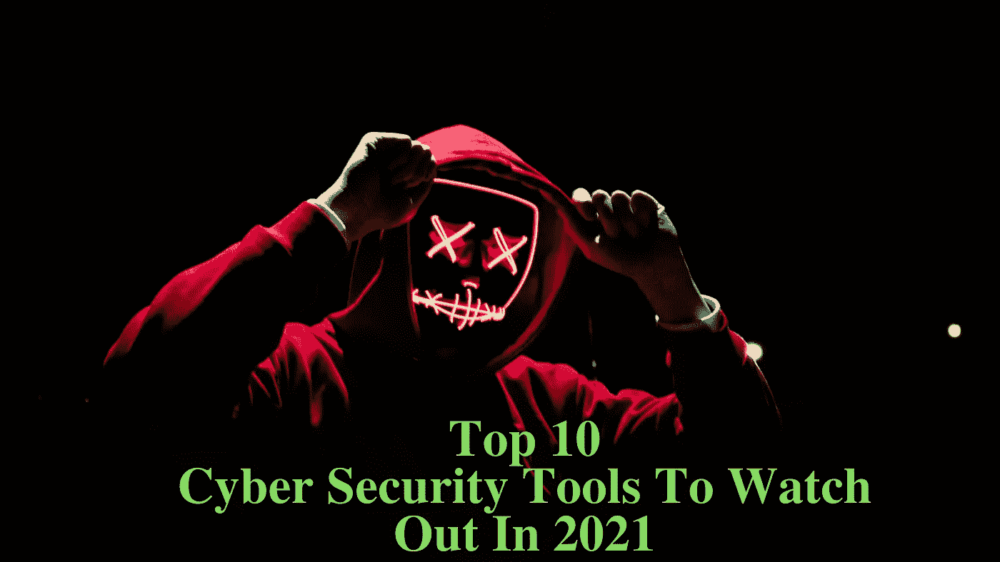
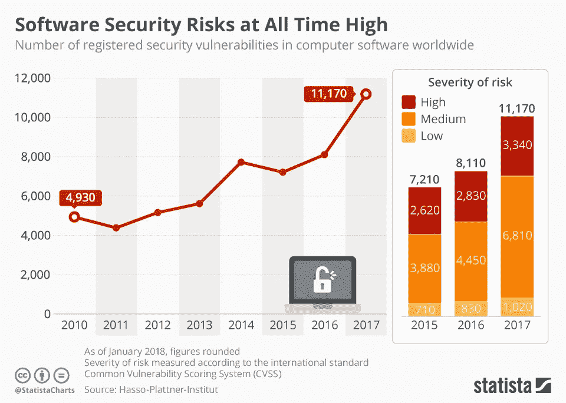
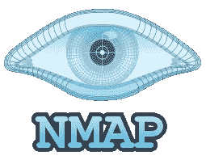
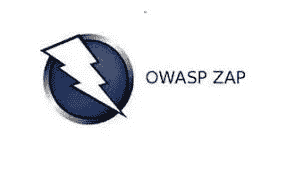
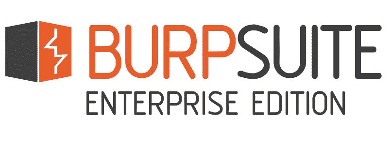

# 2021 年需要警惕的 10 种网络安全工具

> 原文：<https://blog.devgenius.io/10-cyber-security-tools-to-watch-out-for-in-2021-d541dc55d8ca?source=collection_archive---------6----------------------->

随着大量公司和实体加入到数字潮流中，网络安全问题已经成为人们关注的焦点。此外，大数据、物联网和人工智能/机器学习等新技术正在逐渐更多地侵入我们的日常生活，与网络犯罪相关的威胁也在增加。此外，移动和网络应用在金融信息交易中的使用使完整的数字内容暴露在网络安全漏洞之下。

攻击者或网络犯罪分子可以利用此类应用程序中发现的固有风险和漏洞来获取计算金钱的关键信息数据。在国际上，网络安全漏洞在 2019 年造成了 2038 万美元的年度损失(来源:Statista)。此外，网络犯罪导致了全球国内生产总值 0.80%的损失，总计约为。仅 2019 年一年就达 2.1 万亿美元(来源:Cybriant.com)。

[***Statista 报告 2018***](https://www.statista.com/chart/12805/software-security-risks-at-all-time-high/) ***“安全威胁空前高”。各种信息技术软件中的安全威胁或漏洞的数量处于历史最高水平。***

甚至螺旋式上升的疫情也给世界范围内的一些企业和公司带来了令人沮丧的影响，大多数公司武断地试图或将其业务部门转移到未被触及或未受影响的数字空间。然而，大多数安全基金也因经济全面下滑而遭受重创。预算缩减主要加剧了创伤性的数字化转型，因为它严重忽视了这一微妙过程中的隐私和网络安全因素。

为了阻止腐败和预先防范网络威胁或犯罪的不利惩罚，如失去客户信任和品牌声誉，网络安全测试应该成为强制性的。尽管如此，网络安全费用预计将反弹，并在 2021 年再次受到冲击，从而缓解筋疲力尽的 CISOs 及其支离破碎的 it 网络安全团队的压力。同时，我想让你了解一系列最好的网络安全工具，它们可以为你的整体安全计划和 2021 年预算计划带来明显的差异。

# 什么是渗透测试？

渗透测试是一种安全测试，用于评估系统(软件、硬件、信息系统或网络环境)的安全性。这种测试的主要目的是通过恶意技术评估系统的安全性来仔细检查应用程序中发现的所有安全风险或漏洞，并保护数据免受黑客攻击和管理系统的功能。渗透测试是一种非功能性测试，旨在正式尝试破坏系统的安全性。它也被称为笔测试或笔测试，执行此测试的 QA 工程师或测试人员被视为笔测试人员，也称为道德黑客。

# 2021 年最好的网络安全工具有哪些？

任何 app 安全测试方法都需要进行功能测试。通过这种方式，可以检测到一些安全问题和漏洞，如果不及时纠正，可能会导致黑客攻击。市场上有大量的付费和开源测试工具。让我们来讨论一下 2021 年十大网络安全测试工具:

# 1.NMap

NMap 是网络映射器的简称。NMap 是一款开源的免费安全扫描工具，用于安全审计和网络探索。它可以在 Windows、Linux、惠普-UX、Solaris、BSD 变体(包括 Mac OS)、AmigaOS 上运行。NMap 用于检测网络上可访问的主机、它们运行的版本和操作系统、这些主机提供的服务、使用的防火墙/包过滤类型等。一些网络和系统管理员发现它有利于常规工作，如检查打开的端口、维护服务升级计划、网络库存以及监控服务或主机正常运行时间。它带有 GUI 界面和命令行

**核心功能:**

*   确定网络上的主机
*   它用于确定网络清单、网络映射、维护和资产管理
*   生成网络上主机的流量、响应时间测量和响应分析
*   用于在审核安排中识别目标主机上的开放端口
*   搜索和利用网络中的风险和漏洞

**下载:** [**NMap**](https://nmap.org/)

# 2.Wireshark

它是最好的工具之一，也是可免费访问的开源笔测试工具。一般来说，它是一个网络协议分析器，它允许您捕获和协调浏览系统网络上运行的流量。它可以在 Linux、Windows、Unix、Solaris、Mac OS、NetBSD、FreeBSD 和其他几个平台上运行。Wireshark 可以被教育工作者、安全专家、网络专业人员和开发人员广泛使用。通过 Wireshark 软件测试工具恢复的信息可以通过图形用户界面或 TTY 模式的 TShark 实用程序查看。

**核心功能:**

*   丰富的 VoIP 分析
*   实时捕捉和离线审查
*   对数以百计的协议进行深入研究
*   可以在 UNIX、Linux、Windows、Solaris、macOS、NetBSD、FreeBSD 和其他各种平台上运行
*   可以通过 GUI 或 TTY 模式的 TShark 实用程序浏览捕获的系统或网络数据
*   读/写几种不同的捕获文件格式
*   通过 gzip 压缩的捕获文件可以同时解压缩
*   可以将着色规则应用于数据包列表，以便进行直观快速的分析
*   可以从蓝牙、PPP/HDLC、互联网、ATM、令牌环、USB 等设备读取实时数据。,
*   结果可以导出为 PostScript、CSV、XML 或纯文本

**下载:**[Wireshark](https://www.wireshark.org/)

# 3.Metasploit

这是一个计算机安全项目，为用户提供有关安全风险或漏洞的重要信息。这个框架是一个开源的 pen 测试和开发平台，它为您提供了几个应用程序、平台和操作系统的最新漏洞利用代码。从 pen 测试的角度来看，Metasploit 中可以完成的一些工作包括漏洞扫描、监听和利用已知的漏洞、项目报告和证据收集。它有一个命令行和图形用户界面可点击的界面，可以在 Linux、Windows 以及苹果 Mac OS 上运行。Metasploit 是一个商业工具，但它附带了一个开源的有限试用版。

**核心功能:**

*   网络发现
*   它有一个命令行和 GUI 界面
*   在 Windows、Linux 和 Mac OS X 上运行
*   模块浏览器
*   基本剥削
*   手工开采
*   漏洞扫描程序导入
*   Metasploit community edition 免费提供给 InfoSec 社区

**下载:**[**Metasploit**](https://www.metasploit.com/)

# 4.网络火花

这个商业安全测试工具是一个 web app 安全扫描器。Netsparker 是一个非常准确、自动、简单易用的 web 应用程序安全扫描器。这个神奇的工具主要用于自动识别安全风险，如 web 服务、web 应用程序和网站中的跨站点脚本(XSS)和 SQL 注入。其基于证据的扫描技术不仅仅是报告风险；它还会生成一个概念证明，以确认它们不是误报。因此，在扫描结束后手动验证检测漏洞是没有意义的。

**核心功能:**

*   高级 web 扫描
*   脆弱性评估
*   HTTP 请求生成器
*   Web 服务扫描
*   以证据为中心的扫描技术，可准确发现威胁和扫描结果
*   完全支持 HTML5
*   SDLC 集成
*   剥削
*   报告
*   手动测试
*   自动识别自定义 404 错误页面
*   反跨站点请求伪造(CSRF)令牌支持
*   反 CSRF 的象征性支持
*   REST API 支持

**下载:**

# **5.Acunetix**

****

**这是一个完全自动的 web 漏洞扫描器，可以识别和报告超过 4500 个 web 应用程序漏洞，包括 XSS XXE、SSRF、主机标头注入和 SQL 注入的所有变体。Acunetix 智能检测大约 4500 个网络漏洞。Acunetix 是一个商业工具。它的 DeepScan 爬虫扫描 AJAX 为主的客户端 spa 和 HTML5 网站。它使用户能够将检测到的漏洞导出到问题跟踪器，如 GitHub、Atlassian JIRA、微软 TFS (Team Foundation Server)。它可以在 Linux、Windows 和网上获得。**

****核心功能:****

*   **风险和漏洞检测率高，误报率低**
*   **集成漏洞管理—组织和控制风险**
*   **深度抓取和审查—自动扫描所有网站**
*   **与流行的 WAFs 和问题跟踪器集成，如 GitHub、JIRA、TFS**
*   **开源网络安全扫描和手动测试工具**
*   **在 Linux、Windows 和在线上运行**

****下载:**[**Acunetix**](https://www.acunetix.com/)**

# **6.涅索斯**

****

**这是一个针对安全从业者的漏洞评估解决方案，由一家名为 Tenable Network Security 的公司创建和维护。Nessus 有助于检测和修复各种操作系统、应用程序和设备的漏洞，如软件缺陷、恶意软件、缺失补丁和错误配置。它支持 Windows、Linux、Mac、Solaris 等。它专门从事 IPs 扫描、网站扫描、合规性检查、敏感数据搜索等。，并帮助检测“弱点”。**

****核心功能:****

*   **配置审计**
*   **移动设备审计**
*   **可以简单地定制报告，按主机或漏洞进行排序，生成执行摘要，或比较扫描结果以突出变化**
*   **检测使远程攻击者能够从系统访问机密数据的漏洞**
*   **识别网络上主机的远程故障及其本地缺陷和缺失的补丁**

****下载:** [**内修斯**](http://www.tenable.com/products/nessus)**

# **7.W3af**

****

**这是一个 Web 应用攻击和审计框架。W3af 是一个免费工具。W3af 通过搜索和利用所有 web 应用程序漏洞来保护 web 应用程序。它确定 200 个或更多的漏洞，并控制您在网站上的整体风险暴露。它检测各种漏洞，如跨站点脚本(XSS)、SQL 注入、未处理的应用程序错误、可猜测的凭据和 PHP 错误配置。它既有控制台又有图形用户界面。它可以在 Mac、Linux 和 Windows 操作系统上运行。**

****核心功能:****

*   **将 web 和代理服务器融入代码中**
*   **代理支持**
*   **将有效负载注入 HTTP 请求的几乎每个部分**
*   **HTTP 基本和摘要式身份验证**
*   **Cookie 处理**
*   **用户代理伪造**
*   **HTTP 响应缓存**
*   **DNS 缓存**
*   **使用多部分上传文件**
*   **向请求添加自定义标题**

****下载链接:** [**W3af**](http://w3af.org/)**

# **8.Zed 攻击代理**

****

**Zed Attack Proxy 是一款免费的开源安全测试工具，由 OWASP 开发。ZAP 通常被称为 ZAP，受 Unix/Linux、Windows 和 Mac OS 支持，它允许您发现 web 应用程序中的一系列安全风险和漏洞，即使是在开发和测试阶段。这个工具使用简单，即使你是笔测试的新手。**

****核心功能:****

*   **认证支持**
*   **AJAX 蜘蛛**
*   **自动扫描器**
*   **强制浏览**
*   **动态 SSL 证书**
*   **Web 套接字支持**
*   **即插即用支持**
*   **截取代理**
*   **基于 REST 的 API 等等**

****下载链接:**T12**ZAP****

# **9.硬石膏**

****

**它本质上也是一个扫描器(带有受限的“入侵者”工具)，即使几位安全测试专家发誓，没有这个工具的渗透测试是不可想象的。它不是免费的，但非常有利可图。它通常在抓取内容和功能，拦截代理，web 应用程序扫描等方面有着惊人的效果。人们可以在 Mac OS X、Windows 和 Linux 环境中使用它。**

****核心功能:****

*   **支持跨平台**
*   **重量非常轻且稳定**
*   **几乎可以在所有浏览器上运行。**
*   **执行定制攻击**
*   **油井设计用户界面**
*   **可以协助抓取网站**
*   **帮助扫描 Https/ HTTP 请求和响应**

****网址:** [**打嗝组曲**](http://portswigger.net/burp/)**

# **10.Sqlninja**

****

**它是最好的开源渗透测试工具之一。Sqlninja 的目的是利用 web 应用程序上的 SQL 注入威胁和漏洞。这个自动化测试工具利用 Microsoft SQL Server 作为后端。Sqlninja 有一个命令行界面。Sqlninja 可以在 Linux 和苹果 Mac OS X 上运行，它提供了大量的描述性功能，包括远程命令、数据库指纹识别和检测引擎。**

****核心功能:****

*   **直接和反向外壳，适用于 UDP 和 TCP**
*   **远程 SQL Server 的指纹识别**
*   **当原来的 XP cmdshell 被禁用时，形成一个自定义的 XP cmdshell**
*   **从远程数据库中提取数据**
*   **远程数据库服务器上的操作系统权限提升**
*   **反向扫描以寻找可用于反向外壳的端口**

****下载:**[Sqlninja](http://sqlninja.sourceforge.net/)**

# **包扎**

**这些是顶级的网络安全测试工具，将为您的个人数据提供安全保护，降低数据泄露率以及硬件失窃率。这些工具的其他优势包括更严格的安全性和更大的隐私性。这些必备的安全工具将帮助您规避网络攻击，保护您的 IT 基础设施。最后，这种安全软件需要升级和维护，以保持一流的安全性。**