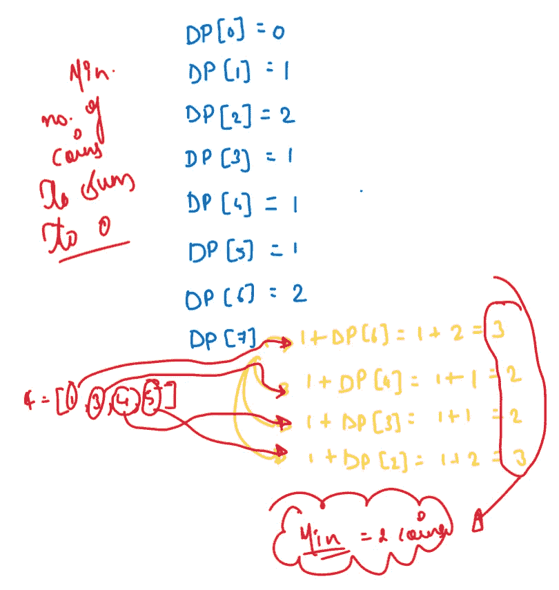
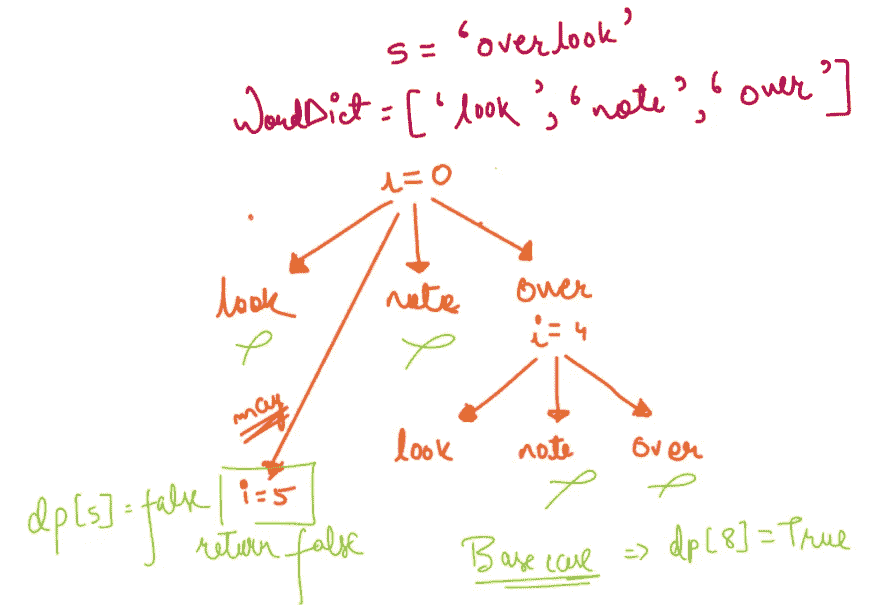
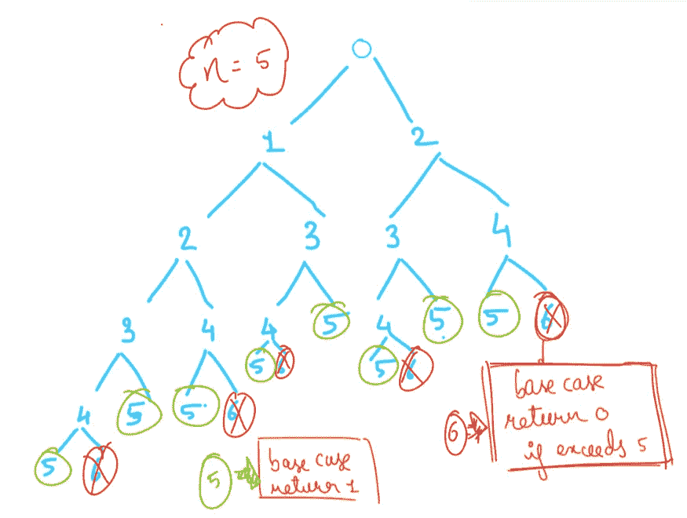

# 10 个日常练习题~第 10 天

> 原文：<https://blog.devgenius.io/10-daily-practice-problems-day-10-9524ef6812bd?source=collection_archive---------4----------------------->


# [***1。最大乘积子阵列***](https://leetcode.com/problems/maximum-product-subarray/)

给定一个整数数组`nums`，在具有最大乘积的数组中找到一个连续的非空子数组，并返回*乘积*。测试用例的生成使得答案适合一个 32 位的整数。

一个**子数组**是该数组的一个连续子序列。


```
if we encounter 0 in subsequence then we convert it to 1 in order to no make other product zero
```

解决方案:


# [***2。最长递增子序列***](https://leetcode.com/problems/longest-increasing-subsequence/)

给定一个整数数组`nums`，返回最长严格递增子序列的长度。**子序列**是可以通过删除一些元素或不删除元素而不改变剩余元素的顺序从数组中导出的序列。例如，`[3,6,2,7]`是数组`[0,3,1,6,2,2,7]`的子序列。

```
**Input:** nums = [10,9,2,5,3,7,101,18]
**Output:** 4
**Explanation:** The longest increasing subsequence is [2,3,7,101], therefore the length is 4.
```


***解决方案:***


# [***3。最小路径和***](https://leetcode.com/problems/minimum-path-sum/)

给定一个填充了非负数的`m x n` `grid`，找出一条从左上到右下的路径，使沿其路径的所有数字之和最小。

**注意:**在任何时间点你只能向下或向右移动。


***解决方案:***


# [***4。硬币零钱***](https://leetcode.com/problems/coin-change/)

给你一个整数数组`coins`代表不同面值的硬币，一个整数`amount`代表钱的总数。

返回*你需要的最少数量的硬币来补足*的数量。如果硬币的任何组合都无法补足该金额，则返回`-1`。

你可以假设每种硬币都有无限个。

```
**Input:** coins = [1,2,5], amount = 11
**Output:** 3
**Explanation:** 11 = 5 + 5 + 1
```



**解决方案:**


# [5。断字](https://leetcode.com/problems/word-break/)

给定一个字符串`s`和一个字符串字典`wordDict`，如果`s`可以被分割成一个空格分隔的一个或多个字典单词的序列，则返回`true`。**注意**词典中的同一个单词可能会在切分中重复使用多次。

```
**Input:** s = "leetcode", wordDict = ["leet","code"]
**Output:** true
**Explanation:** Return true because "leetcode" can be segmented as "leet code".
```



解决方案:


# [***6。入室抢劫犯***](https://leetcode.com/problems/house-robber/)

你是一个专业的强盗，计划沿街抢劫房屋。每栋房子都藏了一定数量的钱，阻止你抢劫每栋房子的唯一限制是相邻的房子都连接了安全系统，如果两栋相邻的房子在同一个晚上被闯入，它会自动联系警察。

给定一个整数数组`nums`代表每栋房子的钱数，返回*你今晚可以抢劫的最大金额* ***而不惊动警察*** 。


```
Recurrence Relation:rob = max( arr[0] + rob[2:n] , rob[1:n])
```


# [***7。*** 入室抢劫犯三](https://leetcode.com/problems/house-robber-iii/)

小偷又为自己找到了一个新的行窃地点。这个区域只有一个入口，叫`root`。

除了`root`之外，每个房子都有且只有一个母房子。一巡之后，聪明的小偷意识到，这个地方所有的房子组成了一棵二叉树。如果**两个直接相连的房子在同一个晚上被闯入**，它会自动联系警察。

给定二叉树的`root`，返回*小偷可以抢劫* ***而不报警*** 的最大金额。


```
**Input:** root = [3,2,3,null,3,null,1]
**Output:** 7
**Explanation:** Maximum amount of money the thief can rob = 3 + 3 + 1 = 7.
```

解决方案:


# ***8。爬楼梯***

你正在爬楼梯。到达顶端需要`n`步。

每次你可以爬`1`或`2`台阶。有多少种不同的方式可以让你爬上顶峰？

```
Approach:
At every given point you have to choose to climb either 1 step or 2 step and count the number of ways we could get to that result
```



*   **记忆:每个子问题解决一次，保存起来以后用。**


***解决方案:***


# [***9。独特路径***](https://leetcode.com/problems/unique-paths/)

在一个`m x n`网格上有一个机器人。机器人初始位于**左上角**(即`grid[0][0]`)。机器人试图移动到**右下角**(即`grid[m - 1][n - 1]`)。机器人在任何时候只能向下或向右移动。

给定两个整数`m`和`n`，返回*机器人可以到达右下角*的可能唯一路径的数量。

生成测试用例，使得答案将小于或等于`2 * 109`。


解决方案:


# 10。完美的正方形

给定一个整数`n`，返回*与* `n`之和最小的完美平方数。

一个**完美平方**是一个整数，它是一个整数的平方；换句话说，它是某个整数与自身的乘积。例如，`1`、`4`、`9`和`16`是完美的正方形，而`3`和`11`不是。

```
**Input:** n = 13
**Output:** 2
**Explanation:** 13 = 4 + 9.
```


***解决方案:***


参考资料:

[***Neet 代码***](https://www.youtube.com/c/NeetCode)