# 10 个日常练习题~第 12 天

> 原文：<https://blog.devgenius.io/10-daily-practice-problems-day-12-619934ae6e98?source=collection_archive---------14----------------------->


# [1。除自身之外的数组乘积](https://leetcode.com/problems/product-of-array-except-self/)

给定一个整数数组`nums`，返回*一个数组* `answer` *使得* `answer[i]` *等于* `nums` *中除* `nums[i]`之外的所有元素的乘积。

`nums`的任何前缀或后缀的乘积**保证**适合一个 **32 位**整数。你必须写一个在`O(n)`时间内运行并且不使用除法运算的算法。

```
**Input:** nums = [1,2,3,4]
**Output:** [24,12,8,6]
```

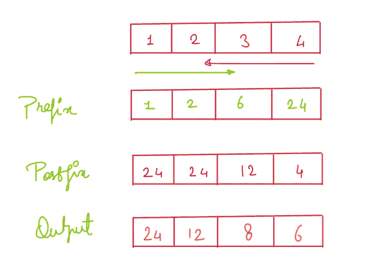

解决方案:

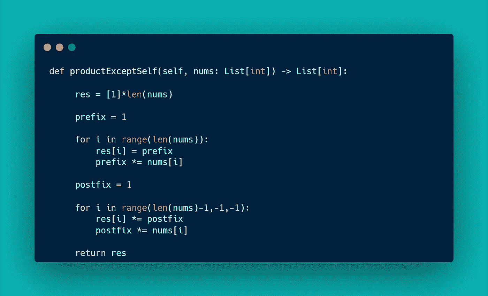

# [2。最长连续序列](https://leetcode.com/problems/longest-consecutive-sequence/)

给定一个未排序的整数数组`nums`，返回*最长连续元素序列的长度。你必须写一个在`O(n)`时间内运行的算法。*

```
**Input:** nums = [100,4,200,1,3,2]
**Output:** 4
**Explanation:** The longest consecutive elements sequence is [1, 2, 3, 4]. Therefore its length is 4.
```

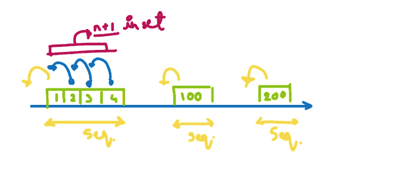

解决方案:

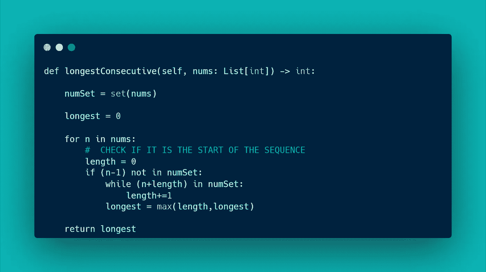

# [3。没有重复字符的最长子串](https://leetcode.com/problems/longest-substring-without-repeating-characters/)

给定一个字符串`s`，找出**中没有重复字符的最长子串**的长度。

```
**Input:** s = "abcabcbb"
**Output:** 3
**Explanation:** The answer is "abc", with the length of 3.
```

解决方案:

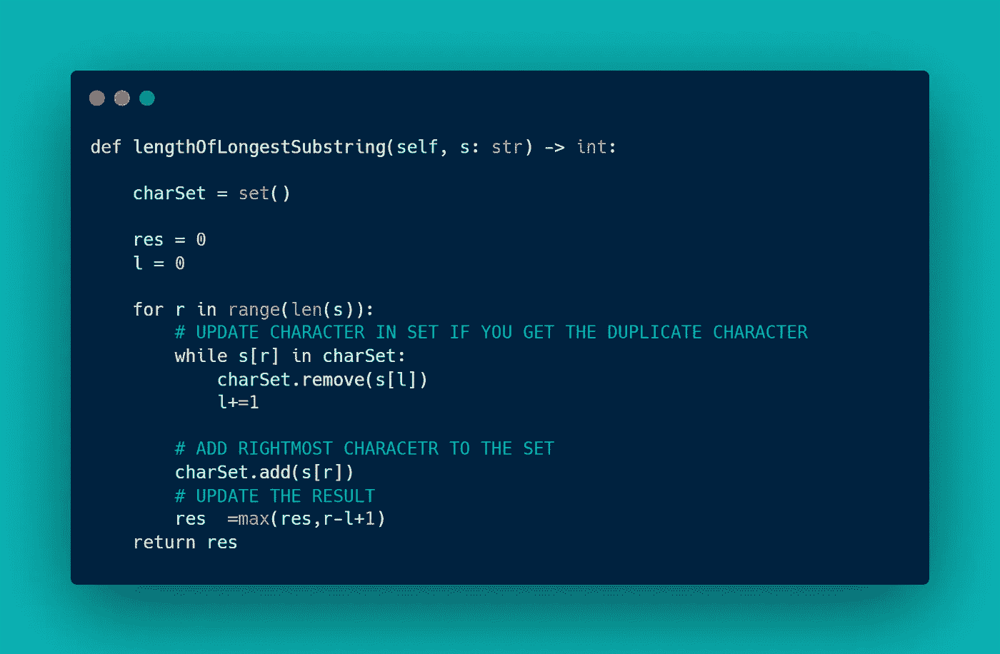

# [4。合并两个排序列表](https://leetcode.com/problems/merge-two-sorted-lists/)

给你两个排序链表的头`list1`和`list2`。将两个列表合并成一个**排序的**列表。应该通过将前两个列表的节点拼接在一起来制作列表。返回*合并链表*的头。

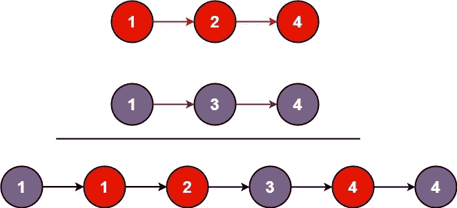

```
**Input:** list1 = [1,2,4], list2 = [1,3,4]
**Output:** [1,1,2,3,4,4]
```

解决方案:

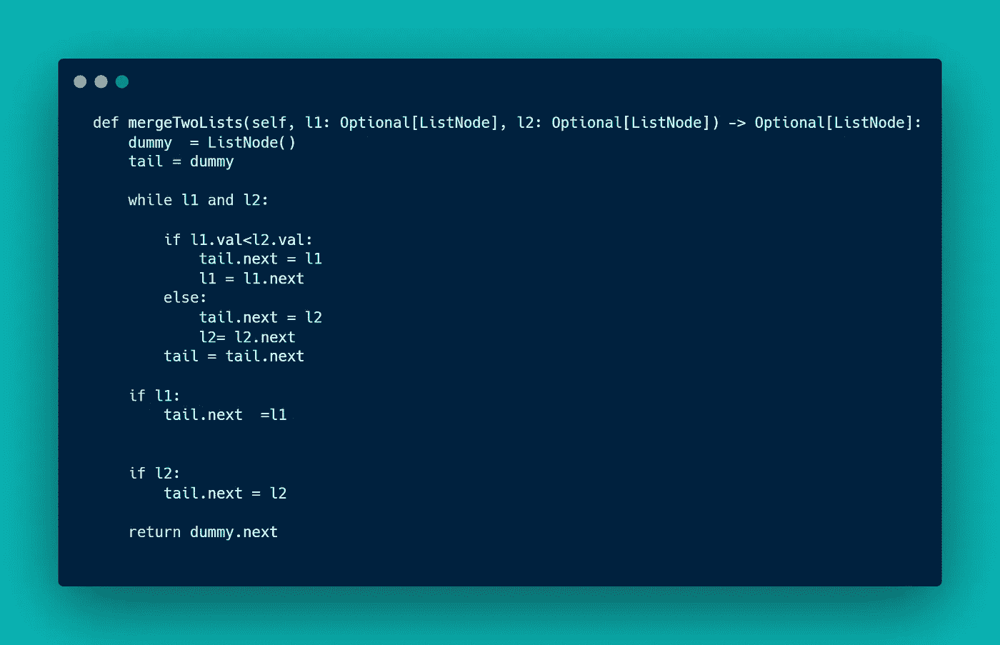

# [5。合并 k 个排序列表](https://leetcode.com/problems/merge-k-sorted-lists/)

给你一个`k`链表`lists`的数组，每个链表按升序排序。*将所有链表合并成一个排序后的链表并返回。*

```
**Input:** lists = [[1,4,5],[1,3,4],[2,6]]
**Output:** [1,1,2,3,4,4,5,6]
**Explanation:** The linked-lists are:
[
  1->4->5,
  1->3->4,
  2->6
]
merging them into one sorted list:
1->1->2->3->4->4->5->6
```

解决方案:

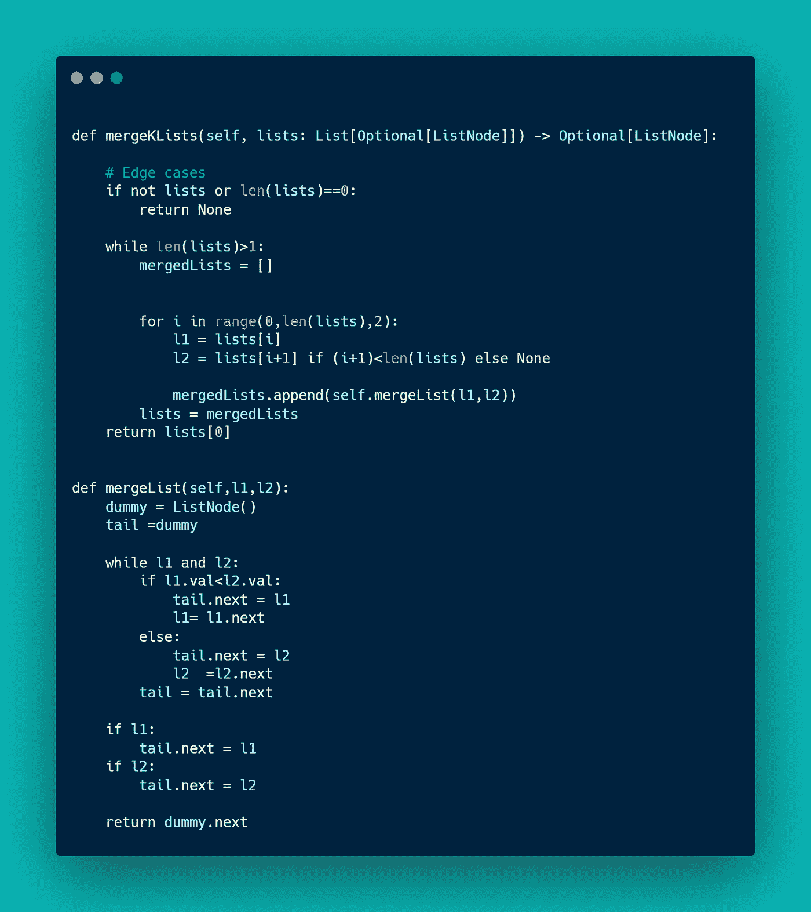

# [6。分组字谜](https://leetcode.com/problems/group-anagrams/)

给定一个字符串数组`strs`，将变位词组合在一起**。可以在**任意顺序**返回答案。**变位词**是通过重新排列不同单词或短语的字母形成的单词或短语，通常使用所有原始字母一次。**

```
**Input:** strs = ["eat","tea","tan","ate","nat","bat"]
**Output:** [["bat"],["nat","tan"],["ate","eat","tea"]]
```

解决方案:

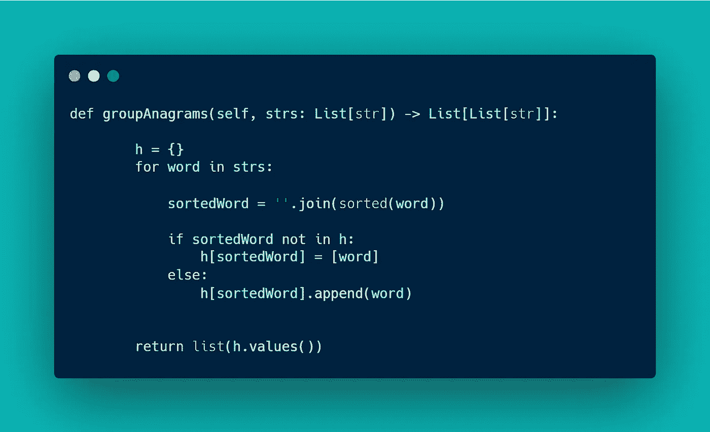

# [7。合并间隔](https://leetcode.com/problems/merge-intervals/)

给定一个数组`intervals`其中`intervals[i] = [starti, endi]`，合并所有重叠区间，返回*一个非重叠区间数组，覆盖输入*中的所有区间。

```
**Input:** intervals = [[1,3],[2,6],[8,10],[15,18]]
**Output:** [[1,6],[8,10],[15,18]]
**Explanation:** Since intervals [1,3] and [2,6] overlap, merge them into [1,6].
```

解决方案:

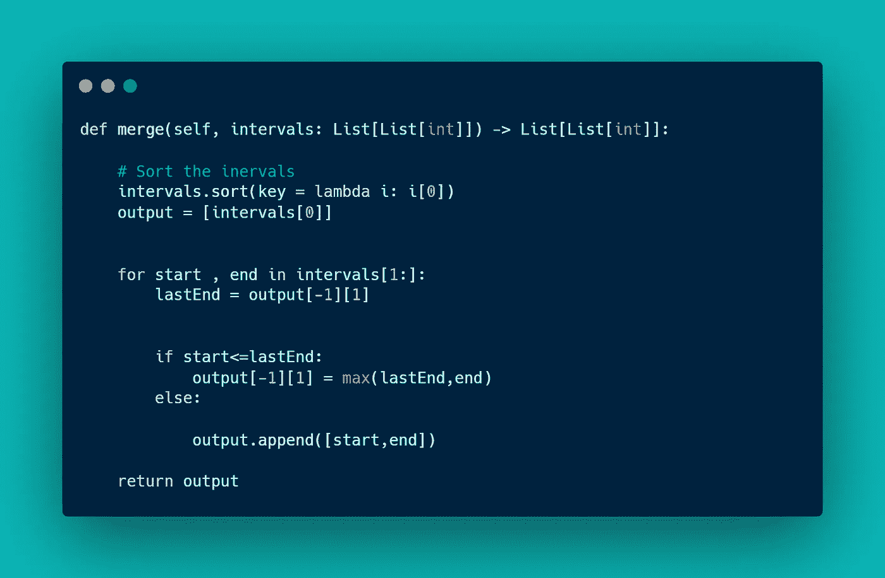

# [8。非重叠区间](https://leetcode.com/problems/non-overlapping-intervals/)

给定一个区间数组`intervals`，其中`intervals[i] = [starti, endi]`，返回*您需要移除的最小区间数，以使其余区间不重叠*。

```
**Input:** intervals = [[1,2],[2,3],[3,4],[1,3]]
**Output:** 1
**Explanation:** [1,3] can be removed and the rest of the intervals are non-overlapping.
```

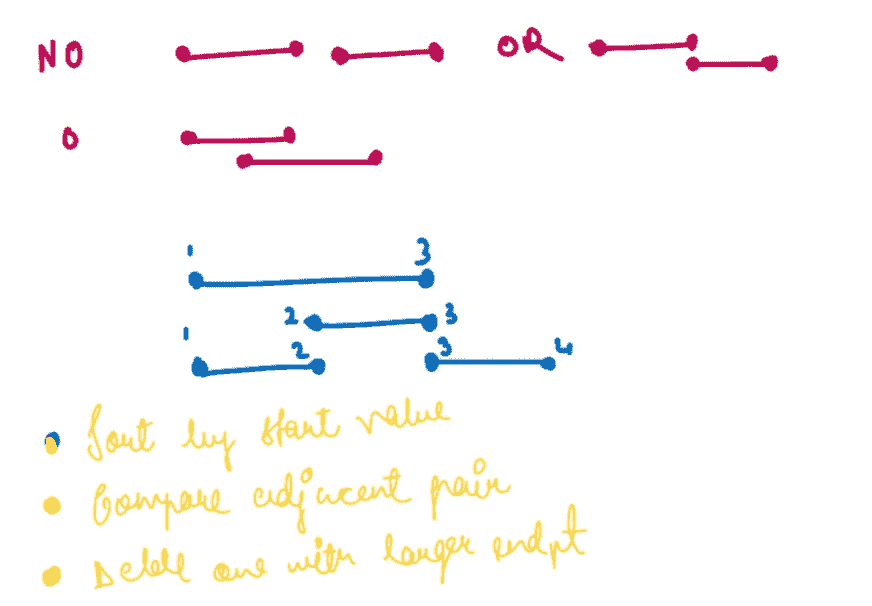

解决方案:

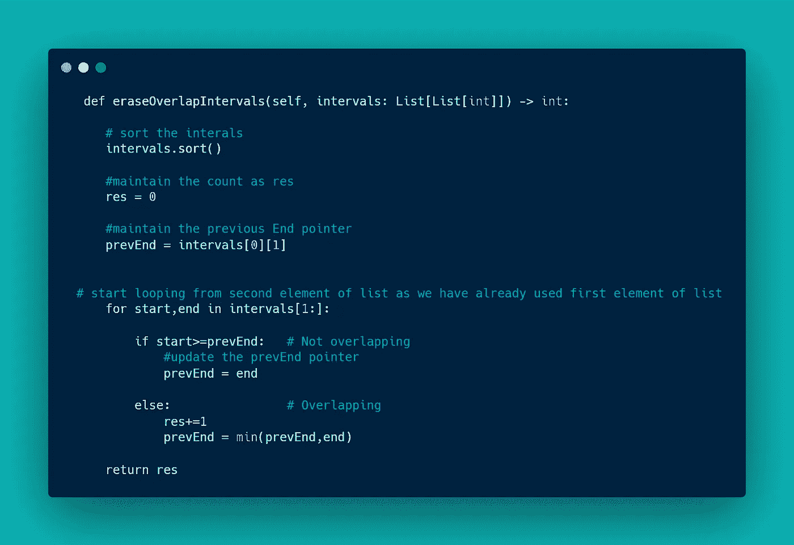

# [9。插入间隔](https://leetcode.com/problems/insert-interval/)

给你一个非重叠区间`intervals`的数组，其中`intervals[i] = [starti, endi]`代表`ith`区间的开始和结束，而`intervals`由`starti`按升序排序。还会给你一个区间`newInterval = [start, end]`，代表另一个区间的开始和结束。

将`newInterval`插入`intervals`中，使`intervals`仍然按照`starti`升序排序，并且`intervals`仍然没有任何重叠区间(必要时合并重叠区间)。

插入后返回`intervals` *。*

```
**Input:** intervals = [[1,3],[6,9]], newInterval = [2,5]
**Output:** [[1,5],[6,9]]
```

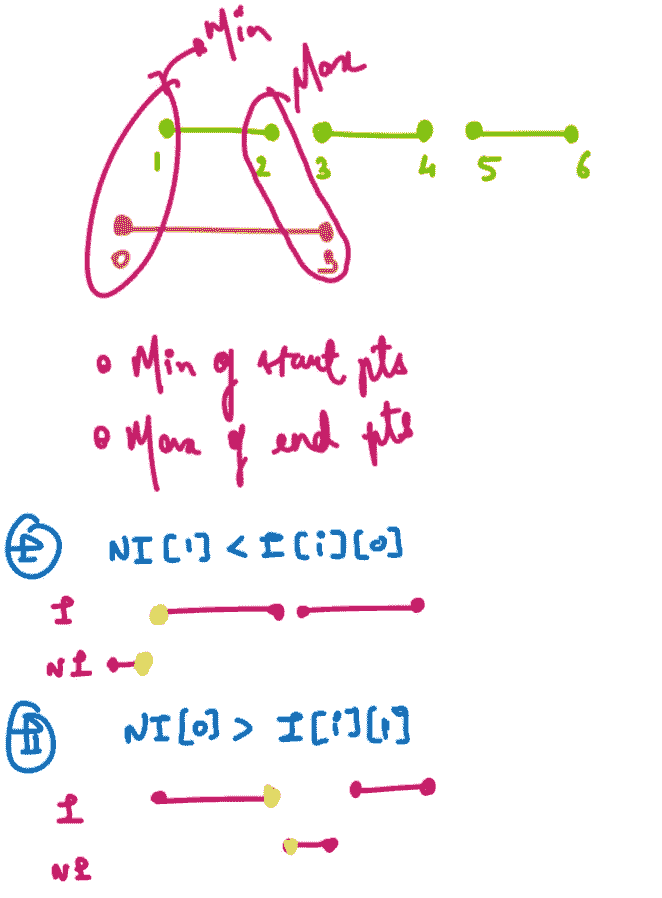

解决方案:

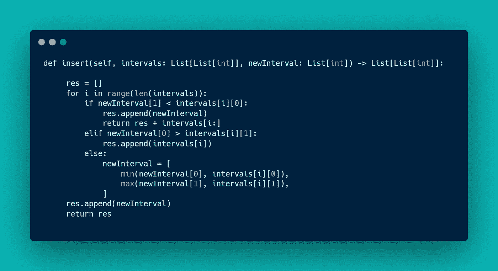

# [10。跳跃游戏](https://leetcode.com/problems/jump-game/)

给你一个整数数组`nums`。您最初位于数组的第一个索引**处，数组中的每个元素代表您在该位置的最大跳转长度。**

如果能达到最后一个指标，返回`true` *，否则返回*`false`*。*

```
***Input:** nums = [2,3,1,1,4]
**Output:** true
**Explanation:** Jump 1 step from index 0 to 1, then 3 steps to the last index.*
```

*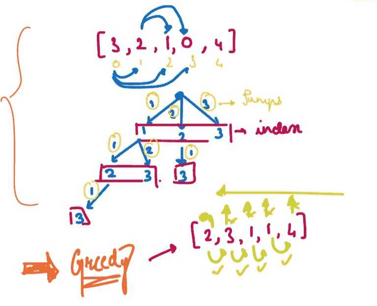*

*解决方案:*

*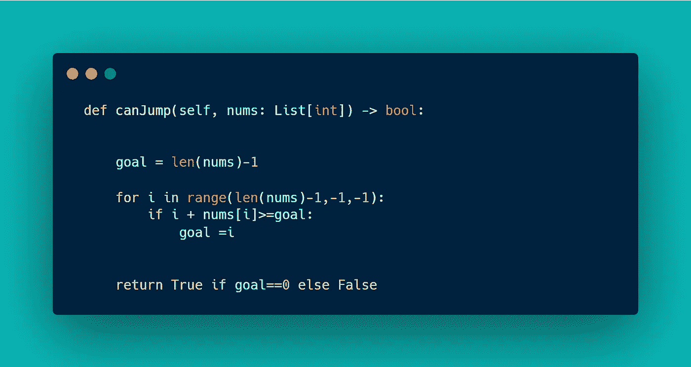*