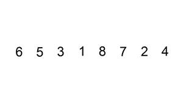

# 10 个日常练习题~第 13 天

> 原文：<https://blog.devgenius.io/10-daily-practice-problems-day-13-fabf79e76f36?source=collection_archive---------13----------------------->


# [1。合并排序后的数组](https://leetcode.com/problems/merge-sorted-array/)

给你两个整数数组`nums1`和`nums2`，按**非降序排列**，还有两个整数`m`和`n`，分别代表`nums1`和`nums2`中元素的个数。**将** `nums1`和`nums2`合并成一个按**非降序排列的数组**。最终排序后的数组不应该被函数返回，而是被*存储在*数组`nums1`里面。为了适应这种情况，`nums1`的长度为`m + n`，其中第一个`m`元素表示应该合并的元素，最后一个`n`元素被设置为`0`并应该被忽略。`nums2`的长度为`n`。

```
**Input:** nums1 = [1,2,3,0,0,0], m = 3, nums2 = [2,5,6], n = 3
**Output:** [1,2,2,3,5,6]
**Explanation:** The arrays we are merging are [1,2,3] and [2,5,6].
The result of the merge is [1,2,2,3,5,6] with the underlined elements coming from nums1.
```


解决方案:


# [2。排序列表](https://leetcode.com/problems/sort-list/)

给定一个链表的`head`，按照 ***升序*** 排序后返回*链表。*


```
**Input:** head = [4,2,1,3]
**Output:** [1,2,3,4]
```


解决方案:


# [3。插入排序列表](https://leetcode.com/problems/insertion-sort-list/)

给定单链表的`head`，使用**插入排序**对链表进行排序，并返回*排序后的链表头*。

**插入排序**算法的步骤:

1.  插入排序迭代，每次重复消耗一个输入元素，并生成一个排序后的输出列表。
2.  在每次迭代中，插入排序从输入数据中删除一个元素，找到它在排序列表中的位置，并将其插入到那里。
3.  它重复进行，直到没有输入元素。

以下是插入排序算法的图形示例。部分排序的列表(黑色)最初只包含列表中的第一个元素。在每次迭代中，从输入数据中删除一个元素(红色)并将其插入到排序列表中。



```
**Input:** head = [4,2,1,3]
**Output:** [1,2,3,4]
```

解决方案:


# [4。反向线对](https://leetcode.com/problems/reverse-pairs/)

给定一个整数数组`nums`，返回*数组*中 ***反向对*** *的个数。*

一个**反向副**是一个副`(i, j)`其中:

*   `0 <= i < j < nums.length`和
*   `nums[i] > 2 * nums[j]`。

```
**Input:** nums = [1,3,2,3,1]
**Output:** 2
**Explanation:** The reverse pairs are:
(1, 4) --> nums[1] = 3, nums[4] = 1, 3 > 2 * 1
(3, 4) --> nums[3] = 3, nums[4] = 1, 3 > 2 * 1
```

解决方案:


# [5。收集雨水](https://leetcode.com/problems/trapping-rain-water/)

给定代表高程图的非负整数`n`，其中每个条形的宽度为`1`，计算雨后它可以收集多少水。


```
**Input:** height = [0,1,0,2,1,0,1,3,2,1,2,1]
**Output:** 6
**Explanation:** The above elevation map (black section) is represented by array [0,1,0,2,1,0,1,3,2,1,2,1]. In this case, 6 units of rain water (blue section) are being trapped.
```


而不使用额外的空间


解决方案:


# [6。最小平台](https://practice.geeksforgeeks.org/problems/minimum-platforms-1587115620/1#)

给定到达火车站的所有列车的到达和离开时间。找出火车站所需的最少站台数，这样就不会有火车一直等着。考虑所有的火车在同一天到达，在同一天离开。一列火车的到达和离开时间永远不会相同，但是我们可以让一列火车的到达时间等于另一列火车的离开时间。在任何给定的时刻，同一站台不能同时用于一列火车的出发和另一列火车的到达。在这种情况下，我们需要不同的平台**。**

```
**Input**: n = 6 
arr[] = {0900, 0940, 0950, 1100, 1500, 1800}
dep[] = {0910, 1200, 1120, 1130, 1900, 2000}
**Output**: 3
**Explanation**: 
Minimum 3 platforms are required to 
safely arrive and depart all trains.
```


解决方案:


# 7。作业排序问题

给定一组 **N** 作业，其中每个**作业 i** 都有一个期限和与之相关的利润。每个作业需要 ***1*** 单位时间完成，一次只能调度一个作业。当且仅当工作在截止日期前完成，我们才能获得与工作相关的利润。找出完成的工作数量和**最大利润**。

**注意:**工作将在与该工作相关的表格(工作 id、截止日期、利润)中给出。

```
**Input:** N = 4
Jobs = {(1,4,20),(2,1,10),(3,1,40),(4,1,30)}
**Output:** 2 60 **Explanation:** Job1 and Job3 can be done with
maximum profit of 60 (20+40).
```


解决方案:


# [8。最小硬币数贪婪方法](https://www.geeksforgeeks.org/greedy-algorithm-to-find-minimum-number-of-coins/)

给定一个 **V** Rs 的值和每种面值{1、2、5、10、20、50、100、500、1000}的硬币/纸币的无限供应量，任务是找出进行兑换所需的最少数量的硬币和/或纸币？

```
***Input:*** *V = 70* ***Output:*** *2* ***Explanation:*** *We need a 50 Rs note and a 20 Rs note.*
```

解决方案:


# [9。在一个房间里举行 n 次会议](https://practice.geeksforgeeks.org/problems/n-meetings-in-one-room-1587115620/1)

在一家公司里有一个会议室。以 **(start[i]，end[i])** 的形式有 **N** 个会议，其中 **start[i]** 是会议 **i** 的开始时间，**end[I】**是会议 **i 的结束时间，**当一个会议室在特定时间只能召开一个会议时，该会议室可以容纳的**最大**会议数量是多少

**注意:**一个选定会议的开始时间不能等于另一个选定会议的结束时间。

```
**Input:** N = 6
start[] = {1,3,0,5,8,5}
end[] =  {2,4,6,7,9,9}
**Output:** 
4 **Explanation:** Maximum four meetings can be held with
given start and end timings.
The meetings are - (1, 2),(3, 4), (5,7) and (8,9)
```

解决方案:


# 10。回文分割

给定一个字符串`s`，划分`s`，使得划分的每个子串都是一个**回文**。返回所有可能的回文分割`s`。一个**回文**字符串是一个向后读和向前读一样的字符串。

```
**Input:** s = "aab"
**Output:** [["a","a","b"],["aa","b"]]
```


解决方案:


***参考文献:***

[***neet code***](https://www.youtube.com/c/NeetCode)