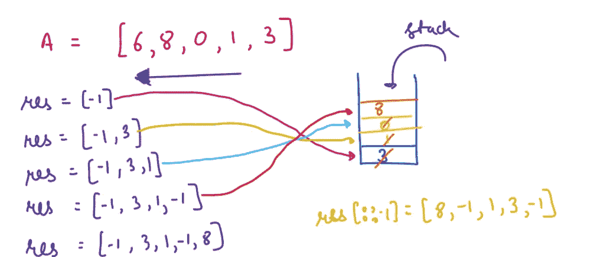

# 10 个日常练习题~第 14 天

> 原文：<https://blog.devgenius.io/10-daily-practice-problems-day-14-44e33e267d13?source=collection_archive---------6----------------------->


# [1。合并 k 个排序列表](https://leetcode.com/problems/merge-k-sorted-lists/)

给你一个`k`链表`lists`的数组，每个链表按升序排序。*将所有链表合并成一个排序后的链表并返回。*

```
**Input:** lists = [[1,4,5],[1,3,4],[2,6]]
**Output:** [1,1,2,3,4,4,5,6]
**Explanation:** The linked-lists are:
[
  1->4->5,
  1->3->4,
  2->6
]
merging them into one sorted list:
1->1->2->3->4->4->5->6
```


解决方案:


# 2.使用数组实现堆栈


[**来源**](https://www.codingninjas.com/codestudio/problems/implement-stack-with-linked-list_630475)


# 3.使用数组实现队列


[**来源**](https://www.codingninjas.com/codestudio/problems/2099908?topList=striver-sde-sheet-problems&utm_source=striver&utm_medium=website)


# [4。下一个更大的元素 II](https://leetcode.com/problems/next-greater-element-ii/)

给定一个循环整数数组`nums`(即`nums[nums.length - 1]`的下一个元素是`nums[0]`)，对于 `nums`中的每个元素，返回****下一个更大的数字*** *。**

*数字`x`的**下一个更大的数字**是数组中下一个遍历顺序的第一个更大的数字，这意味着您可以循环搜索以找到它的下一个更大的数字。如果不存在，返回`-1`这个数。*

```
***Input:** nums = [1,2,1]
**Output:** [2,-1,2]
Explanation: The first 1's next greater number is 2; 
The number 2 can't find next greater number. 
The second 1's next greater number needs to search circularly, which is also 2.*
```

****

*解决方案:*

**

# *[5。左边最小的数字](https://practice.geeksforgeeks.org/problems/smallest-number-on-left3403/1)*

*给定一个长度为 **n** 的整数数组 **a** ，为每个元素找出最近的较小数，使较小的元素位于左侧。如果左边没有小元素，打印-1。*

```
***Input:** n = 3
a = {1, 6, 2}
**Output:** -1 1 1
**Explaination:** There is no number at the 
left of 1\. Smaller number than 6 and 2 is 1.*
```

**

*解决方案:*

**

# *[6。帮助同学](https://practice.geeksforgeeks.org/problems/fab3dbbdce746976ba35c7b9b24afde40eae5a04/1)(同下一个小右)*

*X 教授希望他的学生在化学实验室互相帮助。他建议每个学生都应该帮助一个化学分数比他低、学号排在他后面的同学。但是学生们很懒，他们不想搜索太远。他们各自挑选符合标准的第一个卷号。找出每个学生选择的同学的分数。
**注:**一个学生可能被多个同学选中。*

```
***Input:** N = 5, arr[] = {3, 8, 5, 2, 25}
**Output:** 2 5 2 -1 -1
**Explanation:** 
1\. Roll number 1 has 3 marks. The first person 
who has less marks than him is roll number 4, 
who has 2 marks.
2\. Roll number 2 has 8 marks, he helps student 
with 5 marks.
3\. Roll number 3 has 5 marks, he helps student 
with 2 marks.
4\. Roll number 4 and 5 can not pick anyone as 
no student with higher roll number has lesser 
marks than them. This is denoted by -1.
Output shows the marks of the weaker student that 
each roll number helps in order. ie- 2,5,2,-1,-1*
```

**

*解决方案:*

**

# *[7。下一个更大的元素](https://practice.geeksforgeeks.org/problems/next-larger-element-1587115620/1)*

*给定一个大小为 **N** 的数组 **arr[ ]** 有元素，任务是按照元素在数组中出现的顺序为数组中的每个元素找到下一个更大的元素。数组中一个元素的下一个更大的元素是右边比当前元素更大的最近的元素。
如果不存在当前元素的下一个更大元素，则当前元素的下一个更大元素为-1。例如，最后一个元素的 next greater 始终为-1。*

```
***Input**: 
N = 4, arr[] = [1 3 2 4]
**Output**:
3 4 4 -1
**Explanation**:
In the array, the next larger element 
to 1 is 3 , 3 is 4 , 2 is 4 and for 4 ? 
since it doesn't exist, it is -1.*
```

**

*解决方案:*

**

# *[8。库存跨度问题](https://practice.geeksforgeeks.org/problems/stock-span-problem-1587115621/1)*

*股票跨度问题是一个财务问题，我们有一个股票的一系列 **n** 日报价，我们需要计算所有 **n** 日的股票价格跨度。股票当日价格跨度**Si****I**定义为股票当日价格低于或等于当日价格的最大连续天数。*

```
***Input**:
N = 7, price[] = [100 80 60 70 60 75 85]
**Output**:
1 1 1 2 1 4 6
**Explanation**:
Traversing the given input span for 100 
will be 1, 80 is smaller than 100 so the 
span is 1, 60 is smaller than 80 so the 
span is 1, 70 is greater than 60 so the 
span is 2 and so on. Hence the output will 
be 1 1 1 2 1 4 6.*
```

**

*解决方案:*

**

# *9。名人问题*

*名人就是在聚会上所有人都认识但谁都不认识的人。如果你去参加一个 N 人的聚会，找出聚会中是否有名人。正方形 n×n 矩阵 M[][]用于表示聚会中的人，使得如果第 I 行和第 j 列的元素被设置为 1，则意味着第 I 个人认识第 j 个人。这里 M[i][i]永远是 0。
**注:**遵循 0 基索引。
**跟进:**能优化到 O(N)吗*

***例 1:***

```
***Input:**
N = 3
M[][] = {{0 1 0},
         {0 0 0}, 
         {0 1 0}}
**Output:** 1
**Explanation:** 0th and 2nd person both
know 1\. Therefore, 1 is the celebrity.*
```

*解决方案:*

**

# *[10。腐烂的橙子](https://leetcode.com/problems/rotting-oranges/)*

*给你一个`m x n` `grid`，其中每个单元格可以有三个值之一:*

*   *`0`代表一个空的细胞，*
*   *`1`代表新鲜的橙子，或*
*   *`2`代表腐烂的橙子。*

*每一分钟，任何与腐烂的橙子在四个方向上相邻的新鲜橙子都会腐烂。*

*返回*没有单元格显示新鲜橙色之前必须经过的最少分钟数*。如果*这是不可能的，返回*T5。*

**

```
***Input:** grid = [[2,1,1],[1,1,0],[0,1,1]]
**Output:** 4*
```

*解决方案:*

**

****参考文献:****

*[***啃老族***](https://www.youtube.com/c/NeetCode)*