# 10 个日常练习题~第 15 天

> 原文：<https://blog.devgenius.io/10-daily-practice-problems-day-15-7ab6a2670b2e?source=collection_archive---------12----------------------->


# [1。有序数组中的楼层](https://practice.geeksforgeeks.org/problems/floor-in-a-sorted-array-1587115620/1)

给定一个大小为 **N** 的无重复的排序数组 **arr** []，并给定值 **x** 。x 的 Floor 定义为 arr[]中最大的元素 **K** 使得 K 小于等于 x，求 K 的索引(基于 0 的索引)。

```
**Input:** N = 7, x = 0 
arr[] = {1,2,8,10,11,12,19}
**Output:** -1 **Explanation:** No element less 
than 0 is found. So output 
is "**-1**".
```

解决方案:

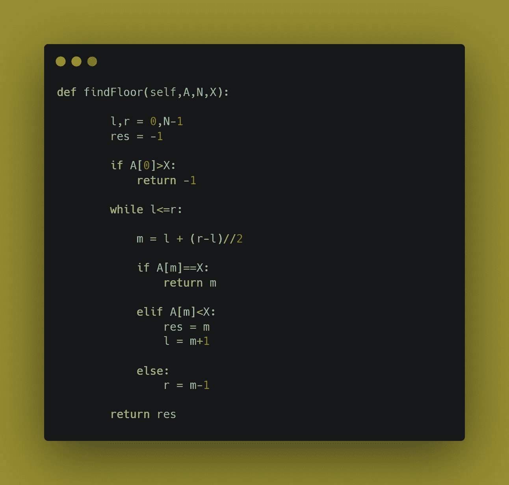

# 2.排序数组的上限

给定一个排序后的数组，值为 x，x 的上限是大于等于 x 的数组中最小的元素，下限是小于等于 x 的最大元素，假设数组按非递减顺序排序。写高效函数求 x 的地板和天花板。

解决方案:

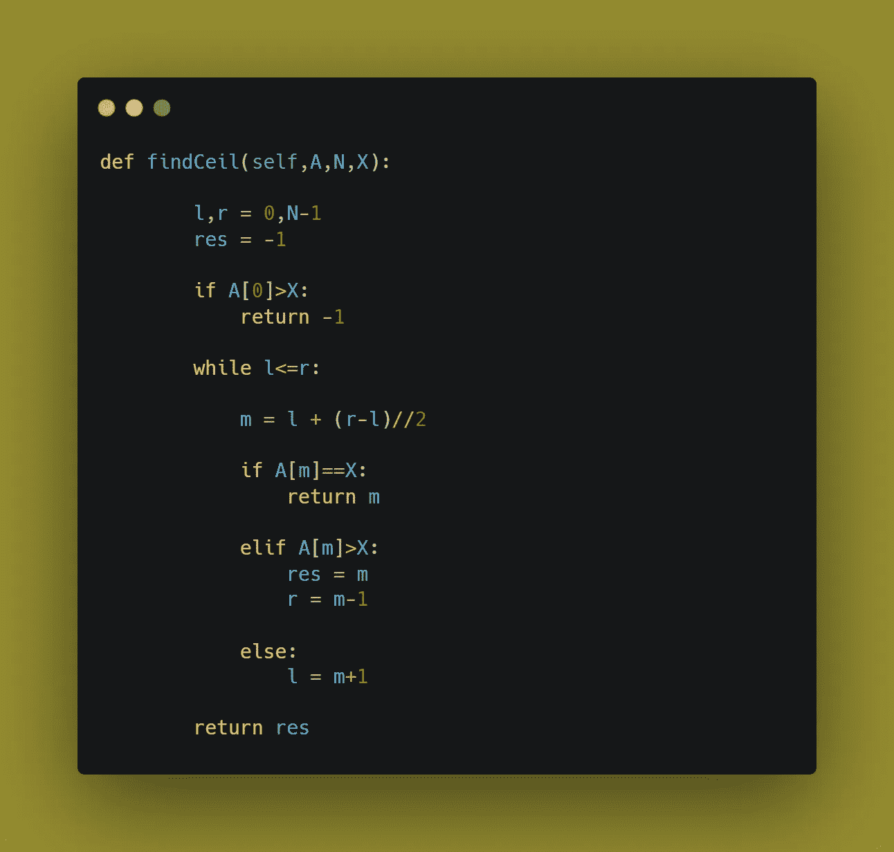

# [3。查找比目标大的最小字母](https://leetcode.com/problems/find-smallest-letter-greater-than-target/)

给你一个按**非降序排列的字符数组`letters`和一个字符`target`。《T2》中至少有两个不同的角色。**

返回 `letters` *中比* `target`大的最小字符*。如果这样的字符不存在，返回`letters`中的第一个字符。*

```
**Input:** letters = ["c","f","j"], target = "a"
**Output:** "c"
**Explanation:** The smallest character that is lexicogrpahically greater than 'a' in letters is 'c'.
```

解决方案:

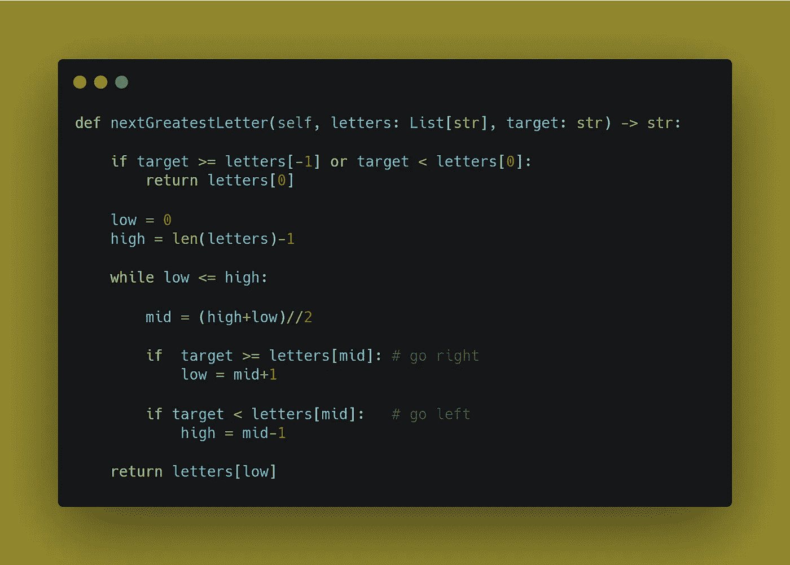

# [4。回文子字符串](https://leetcode.com/problems/palindromic-substrings/)

给定一个字符串`s`，返回*中* ***回文子字符串*** *的个数*。

当一个字符串向后读和向前读一样时，它就是一个回文。

**子串**是字符串中连续的字符序列。

```
**Input:** s = "abc"
**Output:** 3
**Explanation:** Three palindromic strings: "a", "b", "c".
```

解决方案:

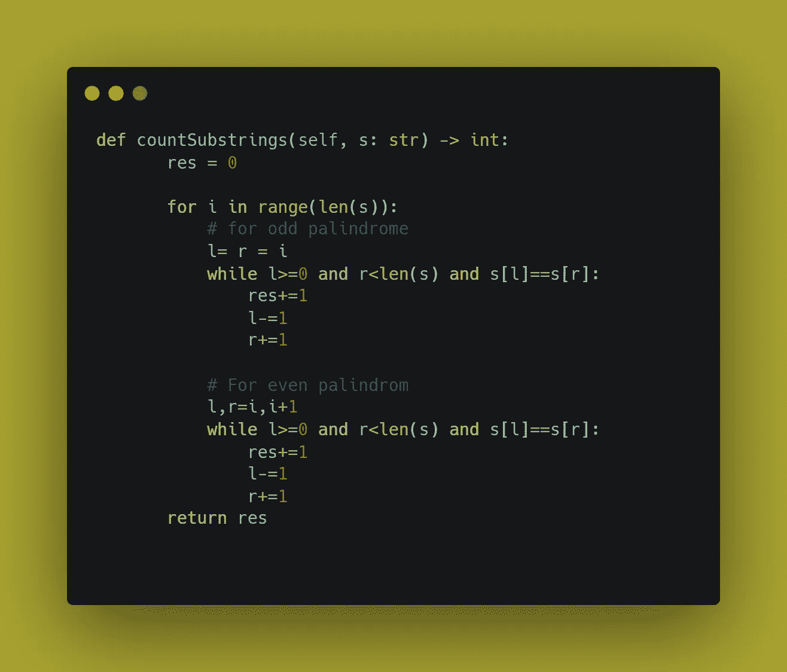

# [5。最长连续序列](https://leetcode.com/problems/longest-consecutive-sequence/)

给定一个未排序的整数数组`nums`，返回*最长连续元素序列的长度。你必须写一个在 T8 时间内运行的算法。*

```
**Input:** nums = [100,4,200,1,3,2]
**Output:** 4
**Explanation:** The longest consecutive elements sequence is [1, 2, 3, 4]. Therefore its length is 4.
```

解决方案:

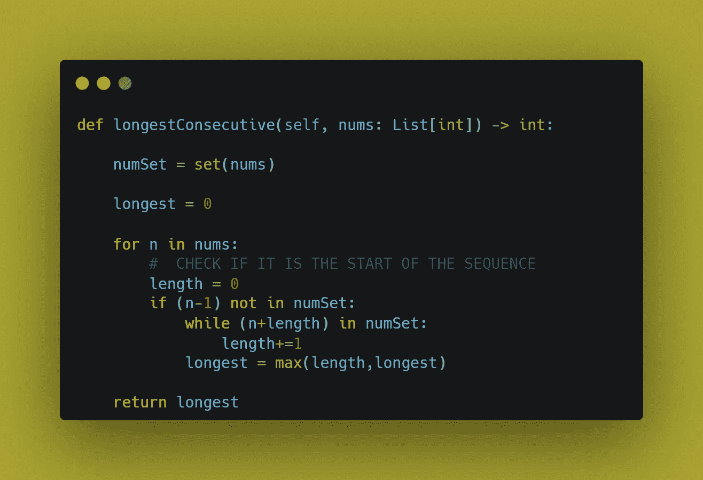

# [6。排列](https://leetcode.com/problems/permutations/)

给定不同整数的数组`nums`，返回*所有可能的排列*。可以在**任意顺序**返回答案。

```
**Input:** nums = [1,2,3]
**Output:** [[1,2,3],[1,3,2],[2,1,3],[2,3,1],[3,1,2],[3,2,1]]
```

解决方案；

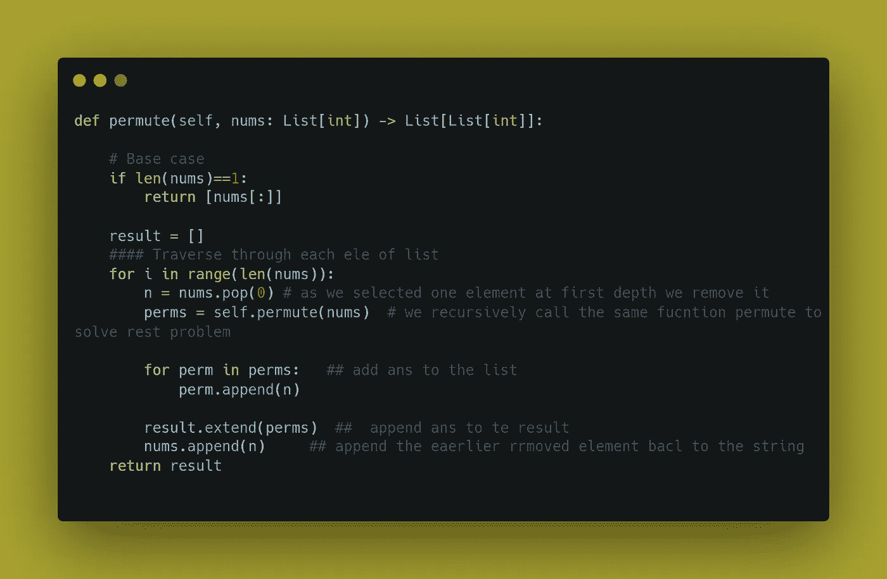

# [7。算术切片](https://leetcode.com/problems/arithmetic-slices/)

如果一个整数数组由至少三个元素组成，并且任意两个连续元素之间的差相同，那么这个整数数组称为算术数组。

*   例如，`[1,3,5,7,9]`、`[7,7,7,7]`、`[3,-1,-5,-9]`都是等差数列。

给定一个整数数组`nums`，返回****子数组****`nums`的个数。**

**一个**子数组**是该数组的一个连续子序列。**

```
****Input:** nums = [1,2,3,4]
**Output:** 3
**Explanation:** We have 3 arithmetic slices in nums: [1, 2, 3], [2, 3, 4] and [1,2,3,4] itself.**
```

**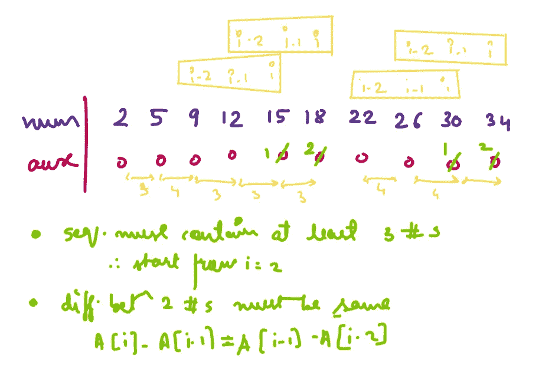**

*****解决方案:*****

**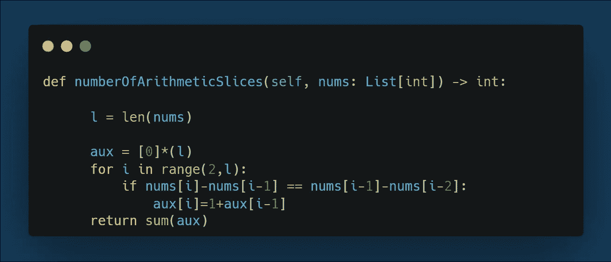**

# **8.[没有重复字符的最长子串](https://leetcode.com/problems/longest-substring-without-repeating-characters/)**

**给定一个字符串`s`，求**最长的子串**的长度，不含重复字符。**

```
****Input:** s = "abcabcbb"
**Output:** 3
**Explanation:** The answer is "abc", with the length of 3.**
```

**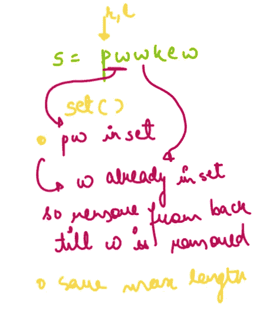**

**解决方案:**

**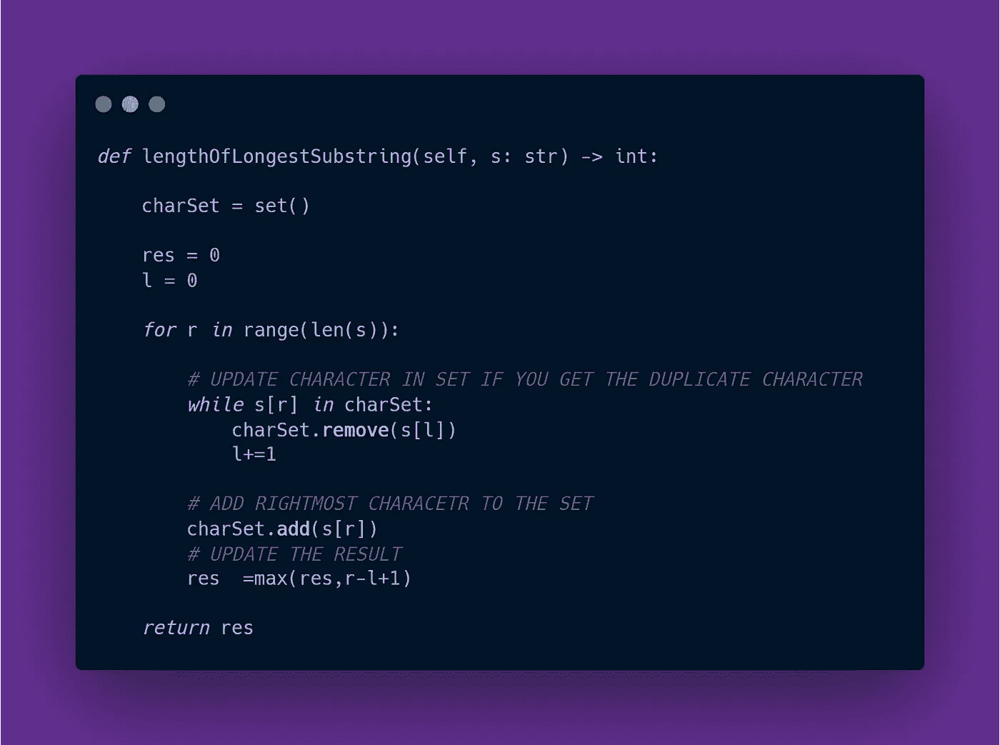**

# **[9。您可以从卡中获得的最高点数](https://leetcode.com/problems/maximum-points-you-can-obtain-from-cards/)**

**有几张牌**排成一排**，每张牌都有相关的点数。这些点在整数数组`cardPoints`中给出。**

**在一个步骤中，您可以从该行的开头或结尾抽取一张牌。你必须拿准确的`k`牌。你的分数是你所拿的牌的分数之和。给定整数数组`cardPoints`和整数`k`，返回你能获得的最大分数*。***

```
*****Input:** cardPoints = [1,2,3,4,5,6,1], k = 3
**Output:** 12
**Explanation:** After the first step, your score will always be 1\. However, choosing the rightmost card first will maximize your total score. The optimal strategy is to take the three cards on the right, giving a final score of 1 + 6 + 5 = 12.***
```

***解决方案:***

***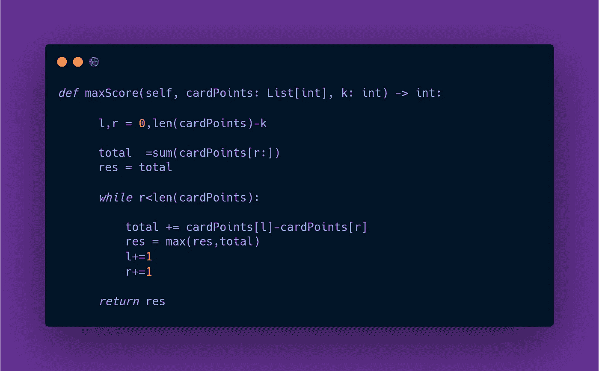***

# ***[9。查找字符串](https://www.geeksforgeeks.org/python-find-duplicate-characters-string/)中的所有重复字符***

***给定一个字符串，找出所有彼此相似的重复字符。让我们看看这个例子。***

```
***Input : hello
Output : lInput : geeksforgeeeks
Output : e g k s***
```

***查看其他类似的博客:***

***[](https://medium.com/@Mr.DataScientist/taking-input-in-python-language-f0e154ddcc5c) [## 用 Python 语言接受输入

### 让我们来学习如何接受用户的输入

medium.com](https://medium.com/@Mr.DataScientist/taking-input-in-python-language-f0e154ddcc5c) [](https://medium.com/@Mr.DataScientist/python-hacks-ef73b49587b3) [## Python 黑客

### 让我们来看一些优化代码的技巧和诀窍

medium.com](https://medium.com/@Mr.DataScientist/python-hacks-ef73b49587b3) [](/10-daily-practice-problems-day-14-44e33e267d13) [## 10 个日常练习题~第 14 天

### 1.合并 k 个排序列表

blog.devgenius.io](/10-daily-practice-problems-day-14-44e33e267d13) [](https://medium.com/@Mr.DataScientist/10-daily-practice-problems-day-3-6470449e5cd5) [## 10 个日常练习题~第三天

### 1.K-组中的反向节点

medium.com](https://medium.com/@Mr.DataScientist/10-daily-practice-problems-day-3-6470449e5cd5)***