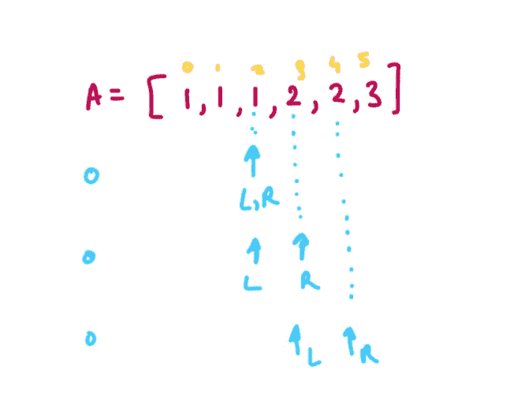

# 10 个日常练习题~第 16 天

> 原文：<https://blog.devgenius.io/10-daily-practice-problems-day-16-66a148f4017a?source=collection_archive---------8----------------------->


# [(1)合并相似项](https://leetcode.com/problems/merge-similar-items/)

返回*一个 2D 整数数组* `ret` *其中* `ret[i] = [valuei, weighti]` *，**`weighti`*为所有值为* `valuei`的项的**的权重之和。***

****注意:** `ret`应按值从**升序**返回。**

```
****Input:** items1 = [[1,1],[4,5],[3,8]], items2 = [[3,1],[1,5]]
**Output:** [[1,6],[3,9],[4,5]]
**Explanation:** 
The item with value = 1 occurs in items1 with weight = 1 and in items2 with weight = 5, total weight = 1 + 5 = 6.
The item with value = 3 occurs in items1 with weight = 8 and in items2 with weight = 1, total weight = 8 + 1 = 9.
The item with value = 4 occurs in items1 with weight = 5, total weight = 5\.  
Therefore, we return [[1,6],[3,9],[4,5]].**
```

**解决方案:**

****

# **[(2)数素数](https://leetcode.com/problems/count-primes/)**

**给定一个整数`n`，返回*严格小于*T6 的素数个数。**

```
****Input:** n = 10
**Output:** 4
**Explanation:** There are 4 prime numbers less than 10, they are 2, 3, 5, 7.**
```

****

**[来源](https://en.wikipedia.org/wiki/Sieve_of_Eratosthenes)**

**解决方案:**

****

# **[(3)公因数个数](https://leetcode.com/problems/count-primes/)**

**给定两个正整数`a`和`b`，返回***`a`*`b`的公因数。******

***如果`x`除了`a`和`b`，则整数`x`是`a`和`b`的公因数。***

```
*****Input:** a = 12, b = 6
**Output:** 4
**Explanation:** The common factors of 12 and 6 are 1, 2, 3, 6.***
```

***解决方案:***

******

***[**来源**](https://leetcode.com/problems/number-of-common-factors/discuss/2649159/C%2B%2B-Python3-JavaScript-Solution-with-Comments-and-Dry-Run)***

# ***[(4)包含重复的 II](https://leetcode.com/problems/contains-duplicate-ii/)***

***给定一个整数数组`nums`和一个整数`k`，如果数组中有两个**不同的索引** `i`和`j`，则返回`true`，使得`nums[i] == nums[j]`和`abs(i - j) <= k`。***

```
*****Input:** nums = [1,2,3,1], k = 3
**Output:** true***
```

******

***解决方案:***

******

# ***[(5)从排序后的数组 II 中移除重复项](https://leetcode.com/problems/remove-duplicates-from-sorted-array-ii/)***

***将最终结果放入 `nums`的第一个 `k` *槽后，返回`k` *。*****

*不要**不要**为另一个数组分配额外的空间。你必须用 O(1)个额外内存通过**修改输入数组** [**就地**](https://en.wikipedia.org/wiki/In-place_algorithm) 来做到这一点。*

```
***Input:** nums = [1,1,1,2,2,3]
**Output:** 5, nums = [1,1,2,2,3,_]
**Explanation:** Your function should return k = 5, with the first five elements of nums being 1, 1, 2, 2 and 3 respectively.
It does not matter what you leave beyond the returned k (hence they are underscores).*
```

**

***解决方案:***

**

# *[(6)两笔总和](https://leetcode.com/problems/two-sum/)*

*给定一个整数数组`nums`和一个整数`target`，返回这两个数的索引*，使它们相加为* `*target*`。*

*你可以假设每个输入都有 ***恰好*一个解**，你不能两次使用*相同的*元素。*

```
***Input:** nums = [2,1,5,3], target = 4
**Output:** [1,3]
**Explanation:** Because nums[1] + nums[3] == 4, we return [1, 3].*
```

**

*解决方案:*

**

# *[(7)数好饭菜](https://leetcode.com/problems/count-good-meals/)*

*一顿**好饭**是一顿包含**恰好两种不同食物**的饭，其美味总和等于 2 的幂。*

*你可以选择任何两种不同的食物来做一顿大餐。给定一个整数数组`deliciousness`，其中`deliciousness[i]`是食物`i​​​​​​th​​​​`的美味程度，返回*你可以从这个列表中模* `109 + 7`做出的不同 ***美食的数量。****

*注意，具有不同指数的项目被认为是不同的，即使它们具有相同的美味值。*

**

```
***Input:** deliciousness = [1,3,5,7,9]
**Output:** 4
**Explanation:** The good meals are (1,3), (1,7), (3,5) and, (7,9).
Their respective sums are 4, 8, 8, and 16, all of which are powers of 2.*
```

****由于约束小于 2 ** 20，在最坏的情况下两个数字都在 2**20 的范围内，数字的总范围可以是 2**21****

*解决方案:*

**

# *[(8)比当前数小多少个数](https://leetcode.com/problems/how-many-numbers-are-smaller-than-the-current-number/)*

*给定数组`nums`，对于每个`nums[i]`，找出数组中有多少个数字比它小。也就是说，对于每个`nums[i]`，你必须计算有效`j's`的数量，这样`j != i` **和** `nums[j] < nums[i]`。*

*以数组形式返回答案。*

```
***Input:** nums = [8,1,2,2,3]
**Output:** [4,0,1,1,3]
**Explanation:** 
For nums[0]=8 there exist four smaller numbers than it (1, 2, 2 and 3). 
For nums[1]=1 does not exist any smaller number than it.
For nums[2]=2 there exist one smaller number than it (1). 
For nums[3]=2 there exist one smaller number than it (1). 
For nums[4]=3 there exist three smaller numbers than it (1, 2 and 2).*
```

**

*解决方案:*

**

# *[(9)在一个数组中找到所有 K 距离的索引](https://leetcode.com/problems/find-all-k-distant-indices-in-an-array/)*

*给你一个 **0 索引的**整数数组`nums`和两个整数`key`和`k`。**k-distance index**是`nums`的 index `i`，至少存在一个 index `j`使得`|i - j| <= k`和`nums[j] == key`。*

*返回*按* ***升序*** 排序的所有 k-distance 索引列表。*

```
***Input:** nums = [3,4,9,1,3,9,5], key = 9, k = 1
**Output:** [1,2,3,4,5,6]
**Explanation:** Here, nums[2] == key and nums[5] == key.
- For index 0, |0 - 2| > k and |0 - 5| > k, so there is no j where |0 - j| <= k and nums[j] == key. Thus, 0 is not a k-distant index.
- For index 1, |1 - 2| <= k and nums[2] == key, so 1 is a k-distant index.
- For index 2, |2 - 2| <= k and nums[2] == key, so 2 is a k-distant index.
- For index 3, |3 - 2| <= k and nums[2] == key, so 3 is a k-distant index.
- For index 4, |4 - 5| <= k and nums[5] == key, so 4 is a k-distant index.
- For index 5, |5 - 5| <= k and nums[5] == key, so 5 is a k-distant index.
- For index 6, |6 - 5| <= k and nums[5] == key, so 6 is a k-distant index.
Thus, we return [1,2,3,4,5,6] which is sorted in increasing order.*
```

*解决方案:*

**

# *[(10)检查相同字母之间的距离](https://leetcode.com/problems/check-distances-between-same-letters/)*

*给你一个 **0 索引的**字符串`s`，仅由小写英文字母组成，其中`s`中的每个字母出现**两次****。您还会得到一个长度为`26`的 **0 索引的**整数数组`distance`。***

***字母表中的每个字母从`0`到`25`(即`'a' -> 0`、`'b' -> 1`、`'c' -> 2`，...，`'z' -> 25`)。***

***在**间距良好的**字符串中，两次出现`ith`字母之间的字母数为`distance[i]`。如果`ith`字母没有出现在`s`中，那么`distance[i]`可以被**忽略**。***

***返回`true` *如果* `s` *是一个***字符串，否则返回* `false`。****

```
******Input:** s = "abaccb", distance = [1,3,0,5,0,0,0,0,0,0,0,0,0,0,0,0,0,0,0,0,0,0,0,0,0,0]
**Output:** true
**Explanation:**
- 'a' appears at indices 0 and 2 so it satisfies distance[0] = 1.
- 'b' appears at indices 1 and 5 so it satisfies distance[1] = 3.
- 'c' appears at indices 3 and 4 so it satisfies distance[2] = 0.
Note that distance[3] = 5, but since 'd' does not appear in s, it can be ignored.
Return true because s is a well-spaced string.****
```

****解决方案:****

********

****点击这里查看其他一些有用的博客:****

****[](https://medium.com/@Mr.DataScientist/subarray-problems-d515e1f0fbbf) [## 子阵列问题

### 1.最大乘积子阵列

medium.com](https://medium.com/@Mr.DataScientist/subarray-problems-d515e1f0fbbf) [](https://medium.com/@Mr.DataScientist/backtracking-problems-fe63e60867dd) [## 回溯问题…！！！！

### 让我们解决一些回溯问题。

medium.com](https://medium.com/@Mr.DataScientist/backtracking-problems-fe63e60867dd) [](https://medium.com/@Mr.DataScientist/data-structures-level-problems-c1bb51709fa9) [## 数据结构级别++问题

### BST 的排序链接列表

medium.com](https://medium.com/@Mr.DataScientist/data-structures-level-problems-c1bb51709fa9) [](https://medium.com/@Mr.DataScientist/sql-queries-problems-b74979def422) [## SQL 查询问题…！！！！！

### 让我们解决一些与 SQL 相关的问题

medium.com](https://medium.com/@Mr.DataScientist/sql-queries-problems-b74979def422) [](https://medium.com/@Mr.DataScientist/10-daily-practice-problems-day-7-c49c32defd65) [## 10 个日常练习题~第 7 天

### 1.二叉树有序遍历

medium.com](https://medium.com/@Mr.DataScientist/10-daily-practice-problems-day-7-c49c32defd65) [](https://medium.com/@Mr.DataScientist/taking-input-in-python-language-f0e154ddcc5c) [## 用 Python 语言接受输入

### 让我们来学习如何接受用户的输入

medium.com](https://medium.com/@Mr.DataScientist/taking-input-in-python-language-f0e154ddcc5c) 

## 参考资料:

## [NeetCode](https://www.youtube.com/c/NeetCode)****