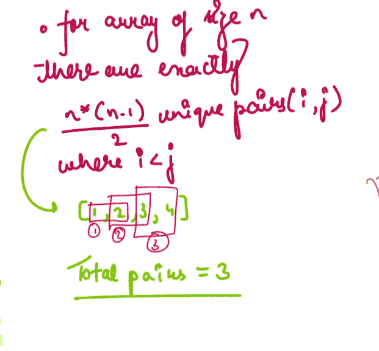

# 10 个日常练习题~第 17 天

> 原文：<https://blog.devgenius.io/10-daily-practice-problems-day-17-c0b8e35555cc?source=collection_archive---------15----------------------->


# [(1)反向整数](https://leetcode.com/problems/reverse-integer/)

给定一个带符号的 32 位整数`x`，返回`x` *，其位数反转*。如果反转`x`导致值超出带符号的 32 位整数范围`[-231, 231 - 1]`，则返回`0`。

**假设环境不允许存储 64 位整数(有符号或无符号)。**

```
**Input:** x = 123
**Output:** 321**Input:** x = -123
**Output:** -321
```

解决办法


# [(2)计算逆序运算后不同整数的个数](https://leetcode.com/problems/count-number-of-distinct-integers-after-reverse-operations/)

给你一个由正整数组成的数组。你必须取数组中的每个整数，**反转它的数字**，并把它加到数组的末尾。您应该将该操作应用于`nums`中的原始整数。

返回*最终数组*中 ***相异*** *整数的个数。*

```
**Input:** nums = [1,13,10,12,31]
**Output:** 6
**Explanation:** After including the reverse of each number, the resulting array is [1,13,10,12,31,1,31,1,21,13].
The reversed integers that were added to the end of the array are underlined. Note that for the integer 10, after reversing it, it becomes 01 which is just 1.
The number of distinct integers in this array is 6 (The numbers 1, 10, 12, 13, 21, and 31).
```

解决方案:


# [(3)到一个字符的最短距离](https://leetcode.com/problems/shortest-distance-to-a-character/)

给定一个字符串`s`和一个出现在`s`中的字符`c`，返回*一个整数数组* `answer` *其中* `answer.length == s.length` *和* `answer[i]` *是从索引* `i` *到最近的* *出现的字符*

**两个指标`i`和`j`之间的**距离**为`abs(i - j)`，其中`abs`为绝对值函数。**

```
****Input:** s = "loveleetcode", c = "e"
**Output:** [3,2,1,0,1,0,0,1,2,2,1,0]
**Explanation:** The character 'e' appears at indices 3, 5, 6, and 11 (0-indexed).
The closest occurrence of 'e' for index 0 is at index 3, so the distance is abs(0 - 3) = 3.
The closest occurrence of 'e' for index 1 is at index 3, so the distance is abs(1 - 3) = 2.
For index 4, there is a tie between the 'e' at index 3 and the 'e' at index 5, but the distance is still the same: abs(4 - 3) == abs(4 - 5) = 1.
The closest occurrence of 'e' for index 8 is at index 6, so the distance is abs(8 - 6) = 2.**
```

****

**解决方案:**

****

# **[(4)完成所有任务的最小回合数](https://leetcode.com/problems/minimum-rounds-to-complete-all-tasks/)**

**给你一个 **0 索引的**整数数组`tasks`，其中`tasks[i]`代表一个任务的难度等级。每一轮，你可以完成**相同难度等级**的 2 到 3 个任务。**

**返回***完成所有任务所需的最小回合数，如果不可能完成所有任务则返回* `-1` *。*****

```
****Input:** tasks = [2,2,3,3,2,4,4,4,4,4]
**Output:** 4
**Explanation:** To complete all the tasks, a possible plan is:
- In the first round, you complete 3 tasks of difficulty level 2\. 
- In the second round, you complete 2 tasks of difficulty level 3\. 
- In the third round, you complete 3 tasks of difficulty level 4\. 
- In the fourth round, you complete 2 tasks of difficulty level 4\.  
It can be shown that all the tasks cannot be completed in fewer than 4 rounds, so the answer is 4.**
```

****

**[**来源**](https://leetcode.com/problems/minimum-rounds-to-complete-all-tasks/discuss/1955400/Python-or-O(n)-or-Explanation)**

**解决方案:**

****

**[来源](https://leetcode.com/problems/minimum-rounds-to-complete-all-tasks/discuss/1955622/JavaC%2B%2BPython-Sum-up-(freq-%2B-2)-3)**

# **[(5)将数组大小减半](https://leetcode.com/problems/reduce-array-size-to-the-half/)**

**给你一个整数数组`arr`。您可以选择一组整数，并删除数组中出现的所有这些整数。**

**返回*集合的最小大小，使* ***数组中至少有*** *一半的整数被移除*。**

```
****Input:** arr = [3,3,3,3,5,5,5,2,2,7]
**Output:** 2
**Explanation:** Choosing {3,7} will make the new array [5,5,5,2,2] which has size 5 (i.e equal to half of the size of the old array).
Possible sets of size 2 are {3,5},{3,2},{5,2}.
Choosing set {2,7} is not possible as it will make the new array [3,3,3,3,5,5,5] which has a size greater than half of the size of the old array.**
```

****

**解决方案:**

****

# **[(6)数组中的 K-diff 对](https://leetcode.com/problems/k-diff-pairs-in-an-array/)**

**给定一个整数数组`nums`和一个整数`k`，返回*数组*中 ***唯一*** *k-diff 对的个数。***

**一个 **k-diff** 对是一个整数对`(nums[i], nums[j])`，以下为真:**

*   **`0 <= i, j < nums.length`**
*   **`i != j`**
*   **`nums[i] - nums[j] == k`**

****注意**`|val|`表示`val`的绝对值。**

```
****Input:** nums = [3,1,4,1,5], k = 2
**Output:** 2
**Explanation:** There are two 2-diff pairs in the array, (1, 3) and (3, 5).
Although we have two 1s in the input, we should only return the number of **unique** pairs.**
```

****

**解决方案:**

****

**[来源](https://leetcode.com/problems/k-diff-pairs-in-an-array/discuss/2552791/Python-Simple-Solution-Using-Dictionary)**

# **[(7)寻找常用字符](https://leetcode.com/problems/find-common-characters/)**

**给定一个字符串数组`words`，返回*一个在* `words` *(包括重复)*内所有字符串中出现的所有字符的数组。你可以在**任何一个订单**中返回答案。**

```
****Input:** words = ["bella","label","roller"]
**Output:** ["e","l","l"]**
```

**解决方案:**

****

> **注意:**
> 
> **Counter 是一个无序的集合，其中元素存储为`Dict`键，它们的计数存储为 dict 值。— [来源](https://www.digitalocean.com/community/tutorials/python-counter-python-collections-counter)**

# **[(8)计数不良对的数量](https://leetcode.com/problems/count-number-of-bad-pairs/)**

**给你一个 **0 索引的**整数数组`nums`。一对指数`(i, j)`如果`i < j`和`j - i != nums[j] - nums[i]`是一对**坏对**。**

**返回*中* ***不良对*** *的总数。***

```
****Input:** nums = [4,1,3,3]
**Output:** 5
**Explanation:** The pair (0, 1) is a bad pair since 1 - 0 != 1 - 4.
The pair (0, 2) is a bad pair since 2 - 0 != 3 - 4, 2 != -1.
The pair (0, 3) is a bad pair since 3 - 0 != 3 - 4, 3 != -1.
The pair (1, 2) is a bad pair since 2 - 1 != 3 - 1, 1 != 2.
The pair (2, 3) is a bad pair since 3 - 2 != 3 - 3, 1 != 0.
There are a total of 5 bad pairs, so we return 5.**
```

********

**解决方案:**

****

# **[(9)在一个数组中计算好的配对](https://leetcode.com/problems/count-nice-pairs-in-an-array/)**

**您得到了一个由非负整数组成的数组`nums`。让我们将`rev(x)`定义为非负整数`x`的倒数。比如`rev(123) = 321`，还有`rev(120) = 21`。满足以下所有条件的一对指标`(i, j)`是**好的**:**

*   **`0 <= i < j < nums.length`**
*   **`nums[i] + rev(nums[j]) == nums[j] + rev(nums[i])`**

**返回*好的索引对的数量*。因为那个数字可能太大，所以返回它**模**。**

```
****Input:** nums = [42,11,1,97]
**Output:** 2
**Explanation:** The two pairs are:
 - (0,3) : 42 + rev(97) = 42 + 79 = 121, 97 + rev(42) = 97 + 24 = 121.
 - (1,2) : 11 + rev(1) = 11 + 1 = 12, 1 + rev(11) = 1 + 11 = 12.**
```

****

**解决方案:**

****

**[来源](https://leetcode.com/problems/count-nice-pairs-in-an-array/discuss/1140639/JavaC%2B%2BPython-Straight-Forward)**

# **[(10)计算数组中相等且可整除的对](https://leetcode.com/problems/count-equal-and-divisible-pairs-in-an-array/)**

**给定一个长度为`n`的 **0 索引的**整数数组`nums`和一个整数`k`，返回*的* ***对数*** `(i, j)` *其中* `0 <= i < j < n`，*使得*`nums[i] == nums[j]`*`(i * j)`*能被* `k`整除。***

```
****Input:** nums = [3,1,2,2,2,1,3], k = 2
**Output:** 4
**Explanation:**
There are 4 pairs that meet all the requirements:
- nums[0] == nums[6], and 0 * 6 == 0, which is divisible by 2.
- nums[2] == nums[3], and 2 * 3 == 6, which is divisible by 2.
- nums[2] == nums[4], and 2 * 4 == 8, which is divisible by 2.
- nums[3] == nums[4], and 3 * 4 == 12, which is divisible by 2.**
```

**解决方案:**

****