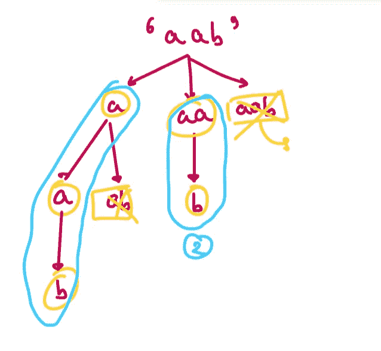

# 10 个日常练习题~第 18 天

> 原文：<https://blog.devgenius.io/10-daily-practice-problems-day-18-f7293b55224d?source=collection_archive---------5----------------------->


# [(1)生成括号](https://leetcode.com/problems/generate-parentheses/)

给定`n`对括号，写一个函数给*生成所有格式良好的括号组合*。

```
**Input:** n = 3
**Output:** ["((()))","(()())","(())()","()(())","()()()"]
```


解决方案:


# [(2)成对交换节点](https://leetcode.com/problems/swap-nodes-in-pairs/)

给定一个链表，交换每两个相邻的节点并返回它的头。您必须在不修改列表节点中的值的情况下解决问题(即，只能更改节点本身。)


```
**Input:** head = [1,2,3,4]
**Output:** [2,1,4,3]
```


解决方案:

方法 1


方法 2


# [(3)旋转阵列](https://leetcode.com/problems/rotate-array/)

给定一个数组，将数组向右旋转`k`步，其中`k`为非负。

```
**Input:** nums = [1,2,3,4,5,6,7], k = 3
**Output:** [5,6,7,1,2,3,4]
**Explanation:**
rotate 1 steps to the right: [7,1,2,3,4,5,6]
rotate 2 steps to the right: [6,7,1,2,3,4,5]
rotate 3 steps to the right: [5,6,7,1,2,3,4]
```


解决方案:


# [(4)回文分割](https://leetcode.com/problems/palindrome-partitioning/)

给定一个字符串`s`，划分`s`，使得划分的每个子串都是一个**回文**。返回`s`所有可能的回文划分。一个**回文**字符串是一个向后读和向前读一样的字符串。

```
**Input:** s = "aab"
**Output:** [["a","a","b"],["aa","b"]]
```



解决方案:


# [(5)幂(x，n)](https://leetcode.com/problems/powx-n/)

实现 [pow(x，n)](http://www.cplusplus.com/reference/valarray/pow/) ，计算`x`的`n`次方(即`x^n`)。

```
**Input:** x = 2.00000, n = 10
**Output:** 1024.00000
```


解决方案:


# [(6) Sqrt(x)](https://leetcode.com/problems/sqrtx/)

给定一个非负整数`x`，返回*`x`*的平方根，向下舍入到最接近的整数*。返回的整数也应该是非负的整数。*

*您**不得使用**任何内置指数函数或运算符。*

*   *例如，不要在 c++中使用`pow(x, 0.5)`或者在 python 中使用`x ** 0.5`。*

```
***Input:** x = 4
**Output:** 2
**Explanation:** The square root of 4 is 2, so we return 2.*
```

**

*解决方案:*

**

# *[(7)有效回旋镖](https://leetcode.com/problems/valid-boomerang/)*

*给定一个数组`points`，其中`points[i] = [xi, yi]`表示 **X-Y** 平面上的一个点，如果这些点是一个 ***回旋镖*** ，则返回`true` *。**

*一个**回旋镖**是一组三个点**都不同**和**不在一条直线上**。*

```
***Input:** points = [[1,1],[2,3],[3,2]]
**Output:** true*
```

*解决方案:*

**

# *[(8)丑陋的数字](https://leetcode.com/problems/ugly-number/)*

*一个**丑数**是正整数，其质因数限于`2`、`3`、`5`。给定一个整数`n`，如果 `n` *是一个* ***丑数*** ，则返回`true`。*

```
***Input:** n = 6
**Output:** true
**Explanation:** 6 = 2 × 3*
```

*解决方案:*

**

# *(9) [下一个更大的元素](https://practice.geeksforgeeks.org/problems/next-larger-element-1587115620/1)*

*给定一个大小为 **N** 的数组 **arr[ ]** 有元素，任务是按照元素在数组中出现的顺序为数组中的每个元素找到下一个更大的元素。数组中一个元素的下一个更大的元素是右边比当前元素更大的最近的元素。
如果不存在当前元素的下一个更大元素，则当前元素的下一个更大元素为-1。例如，最后一个元素的 next greater 始终为-1。*

```
***Input**: 
N = 4, arr[] = [1 3 2 4]
**Output**:
3 4 4 -1
**Explanation**:
In the array, the next larger element 
to 1 is 3 , 3 is 4 , 2 is 4 and for 4 ? 
since it doesn't exist, it is -1.*
```

**

*解决方案:*

**

# *[(10)下一个小右](https://practice.geeksforgeeks.org/problems/fab3dbbdce746976ba35c7b9b24afde40eae5a04/1)*

*X 教授希望他的学生在化学实验室互相帮助。他建议每个学生都应该帮助一个化学分数比他低、学号排在他后面的同学。但是学生们很懒，他们不想搜索太远。他们各自挑选符合标准的第一个卷号。找出每个学生选择的同学的分数。
**注:**一个学生可能被多个同学选中。*

```
***Input:** N = 5, arr[] = {3, 8, 5, 2, 25}
**Output:** 2 5 2 -1 -1
**Explanation:** 
1\. Roll number 1 has 3 marks. The first person 
who has less marks than him is roll number 4, 
who has 2 marks.
2\. Roll number 2 has 8 marks, he helps student 
with 5 marks.
3\. Roll number 3 has 5 marks, he helps student 
with 2 marks.
4\. Roll number 4 and 5 can not pick anyone as 
no student with higher roll number has lesser 
marks than them. This is denoted by -1.
Output shows the marks of the weaker student that 
each roll number helps in order. ie- 2,5,2,-1,-1*
```

**

*解决方案:*

**

*看看其他一些类似的博客*

*[](/10-daily-practice-problems-day-13-fabf79e76f36) [## 10 个日常练习题~第 13 天

### 1.合并排序数组

blog.devgenius.io](/10-daily-practice-problems-day-13-fabf79e76f36) [](https://medium.com/@Mr.DataScientist/recursion-bc418aeb8aed) [## 递归基本问题

### 让我们学习编码一些递归问题

medium.com](https://medium.com/@Mr.DataScientist/recursion-bc418aeb8aed) [](https://medium.com/@Mr.DataScientist/binary-search-problems-11ca36818ae1) [## 二分搜索法问题

### 让我们解决二进制搜索中的几个问题

medium.com](https://medium.com/@Mr.DataScientist/binary-search-problems-11ca36818ae1) [](https://medium.com/@Mr.DataScientist/binary-tree-problems-e74bb9887cd5) [## 二叉树问题

### 让我们解决几个关于二叉树的问题

medium.com](https://medium.com/@Mr.DataScientist/binary-tree-problems-e74bb9887cd5) 

# 参考资料:

# [没有代码](https://www.youtube.com/c/NeetCode)*