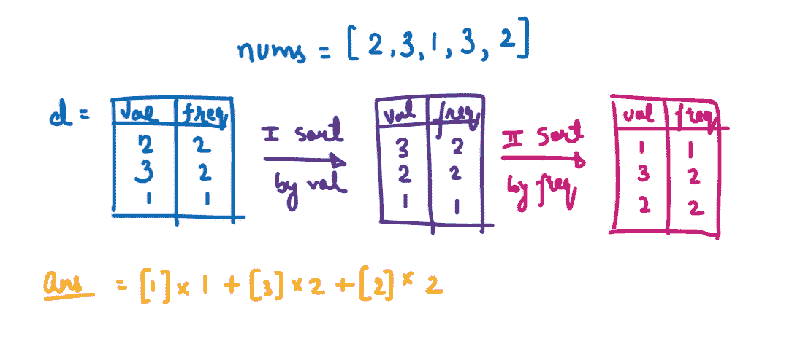
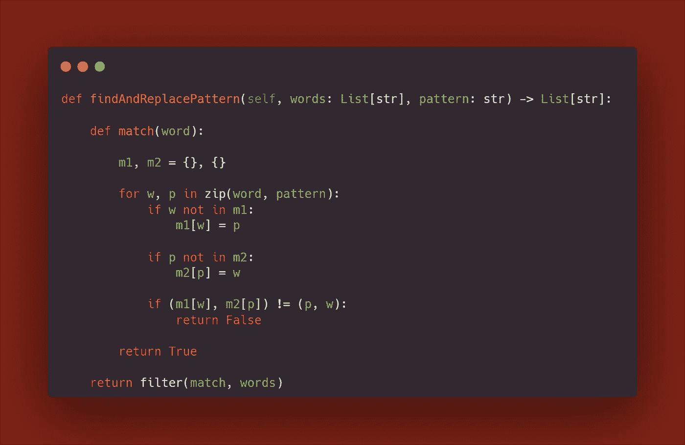

# 10 个日常练习题~第 19 天

> 原文：<https://blog.devgenius.io/10-daily-practice-problems-day-19-30756475ba35?source=collection_archive---------11----------------------->

字符串、数组、Lambda 函数、字典顺序、曼哈顿距离和欧几里德距离问题


# [(1)分数加减](https://leetcode.com/problems/fraction-addition-and-subtraction/)

给定一个表示分数加减表达式的字符串`expression`，以字符串格式返回计算结果。

最终结果应该是一个[不可约分数](https://en.wikipedia.org/wiki/Irreducible_fraction)。如果你的最终结果是一个整数，把它转换成分母为`1`的分数格式。所以在这种情况下，`2`应该转换成`2/1`。

```
**Input:** expression = "-1/2+1/2"
**Output:** "0/1"
```

解决方案:


[**来源**](https://leetcode.com/problems/fraction-addition-and-subtraction/discuss/205958/Simple-Python-solution-no-Fraction-and-for-people-who-are-not-familiar-with-Regular-Expression.)

# [(2)唯一路径的数量](https://practice.geeksforgeeks.org/problems/number-of-unique-paths5339/1?utm_source=gfg&utm_medium=article&utm_campaign=bottom_sticky_on_article)

给定一个矩阵，你的初始位置在左上角的单元，找出从初始位置到达矩阵右下角单元的可能唯一路径的数量。

**注:**在任何时间点，可能的移动可以是**向下**或**向右**，即我们可以从矩阵[i][j]移动到矩阵[i+1][j]或矩阵[i][j+1]。

```
**Input:** A = 2, B = 2
**Output:** 2 **Explanation:** There are only two unique
paths to reach the end of the matrix of
size two from the starting cell of the
matrix.
```

解决方案:


# [(3)算术三元组的个数](https://leetcode.com/problems/number-of-arithmetic-triplets/)

给你一个 **0 索引的**、**严格递增的**整数数组`nums`和一个正整数`diff`。如果满足以下条件，三元组`(i, j, k)`就是**算术三元组**:

*   `i < j < k`，
*   `nums[j] - nums[i] == diff`，以及
*   `nums[k] - nums[j] == diff`。

返回*唯一的数字* ***算术三胞胎*** *。*

```
**Input:** nums = [0,1,4,6,7,10], diff = 3
**Output:** 2
**Explanation:**
(1, 2, 4) is an arithmetic triplet because both 7 - 4 == 3 and 4 - 1 == 3.
(2, 4, 5) is an arithmetic triplet because both 10 - 7 == 3 and 7 - 4 == 3.
```

解决方案:


# [(4)数组中的最大对数](https://leetcode.com/problems/maximum-number-of-pairs-in-array/)

给你一个索引为 0 的整数数组。在一个操作中，您可以执行以下操作:

*   选择`nums`中**等于**的两个整数**。**
*   从`nums`中移除两个整数，形成一个**对**。

尽可能多的在`nums`上进行操作。

返回大小为 `2` *的 *a* ***0 索引的*** *整数数组* `answer` *其中* `answer[0]` *是形成的对数，* `answer[1]` *是尽可能多次运算后* `nums` *中剩余整数的个数*。*

```
**Input:** nums = [1,3,2,1,3,2,2]
**Output:** [3,1]
**Explanation:**
Form a pair with nums[0] and nums[3] and remove them from nums. Now, nums = [3,2,3,2,2].
Form a pair with nums[0] and nums[2] and remove them from nums. Now, nums = [2,2,2].
Form a pair with nums[0] and nums[1] and remove them from nums. Now, nums = [2].
```

解决方案:


# [(5)按频率递增对数组排序](https://leetcode.com/problems/sort-array-by-increasing-frequency/)

给定一个整数数组`nums`，根据值出现的频率按**升序**排序数组。如果多个值具有相同的频率，则按照**递减**的顺序对其进行排序。

返回*排序后的数组*。

```
**Input:** nums = [1,1,2,2,2,3]
**Output:** [3,1,1,2,2,2]
**Explanation:** '3' has a frequency of 1, '1' has a frequency of 2, and '2' has a frequency of 3.
```



解决方案:


助手:


> 注意:
> 
> append()在列表末尾添加一个元素。 **extend()可以将多个单独的元素添加到列表的末尾**。~ [来源](https://www.freecodecamp.org/news/python-list-append-vs-python-list-extend/#:~:text=append()%20adds%20a%20single,the%20end%20of%20the%20list.)

# [(6)查找并替换图案](https://leetcode.com/problems/find-and-replace-pattern/)

给定一个字符串列表`words`和一个字符串`pattern`，返回*一个匹配* `pattern`的 `words[i]` *列表。您可以在**中以任何顺序**返回答案。*

如果存在字母`p`的排列，则一个单词匹配该模式，因此在用`p(x)`替换模式中的每个字母`x`后，我们得到想要的单词。

回想一下，字母排列是从字母到字母的双射:每个字母映射到另一个字母，没有两个字母映射到同一个字母。

```
**Input:** words = ["abc","deq","mee","aqq","dkd","ccc"], pattern = "abb"
**Output:** ["mee","aqq"]
```


解决方案:



> `filter()`函数返回一个迭代器，其中条目通过一个函数进行过滤，以测试条目是否被接受。
> 
> 句法
> 
> 过滤器(*功能*，*可迭代*)
> 
> [来源](https://www.w3schools.com/python/ref_func_filter.asp)

# [(7)排名前 K 的常用词](https://leetcode.com/problems/top-k-frequent-words/)

给定一个字符串数组`words`和一个整数`k`，返回*`k`*最频繁出现的字符串*。*

*返回按**排序**的答案**频率**从高到低。将出现频率相同的单词按其**字典顺序**排序。*

```
***Input:** words = ["i","love","leetcode","i","love","coding"], k = 2
**Output:** ["i","love"]
**Explanation:** "i" and "love" are the two most frequent words.
Note that "i" comes before "love" due to a lower alphabetical order.*
```

*解决方案:*

**

***助手***

**

```
*When you sort 2-tuples, they are sorted based on* The first element* If the first elements are equal, then the second element[Source](https://stackoverflow.com/questions/62208185/what-does-arr-sortkey-lambda-x-x0-x1-mean)*
```

# *[(8)字数最多的发送者](https://leetcode.com/problems/sender-with-largest-word-count/)*

*你有一个`n`消息的聊天记录。给你两个字符串数组`messages`和`senders`，其中`messages[i]`是由`senders[i]`发送的**消息**。*

*一条**消息**是由单个空格分隔的**单词**的列表，没有前导或尾随空格。发送方的**字数**是发送方发送的**字数**的总数。请注意，发送者可以发送多条消息。*

*返回*发送方与* ***最大*** *字数*。如果有多个字数最多的发件人，则返回*中按字典顺序最大的***名*的发件人。**

****注:****

*   **按字典顺序，大写字母在小写字母之前。**
*   **`"Alice"`和`"alice"`截然不同。**

```
****Input:** messages = ["Hello userTwooo","Hi userThree","Wonderful day Alice","Nice day userThree"], senders = ["Alice","userTwo","userThree","Alice"]
**Output:** "Alice"
**Explanation:** Alice sends a total of 2 + 3 = 5 words.
userTwo sends a total of 2 words.
userThree sends a total of 3 words.
Since Alice has the largest word count, we return "Alice".**
```

**解决方案:**

****

**(9) K 个离原点最近的点**

**给定一个`points`数组，其中`points[i] = [xi, yi]`代表 **X-Y** 平面上的一个点和一个整数`k`，返回离原点`(0, 0)`最近的`k`点。**

****X-Y** 平面上两点之间的距离为欧氏距离(即`√(x1 - x2)2 + (y1 - y2)2`)。**

**您可以按照**中的任意顺序**返回答案。答案是**保证**是**唯一的**(除了它所在的顺序)。**

****

```
****Input:** points = [[1,3],[-2,2]], k = 1
**Output:** [[-2,2]]
**Explanation:**
The distance between (1, 3) and the origin is sqrt(10).
The distance between (-2, 2) and the origin is sqrt(8).
Since sqrt(8) < sqrt(10), (-2, 2) is closer to the origin.
We only want the closest k = 1 points from the origin, so the answer is just [[-2,2]].**
```

**解决方案:**

****

**助手:**

****

# **[(10)寻找具有相同 X 或 Y 坐标的最近点](https://leetcode.com/problems/find-nearest-point-that-has-the-same-x-or-y-coordinate/)**

**给你两个整数，`x`和`y`，它们代表你在笛卡尔坐标上的当前位置:`(x, y)`。你还会得到一个数组`points`，其中每个`points[i] = [ai, bi]`代表一个点存在于`(ai, bi)`。如果一个点和你的位置有相同的 x 坐标或 y 坐标，那么这个点就是有效的**。****

****返回 ***的*索引* ***(0 索引)*** *有效**** *点与您当前位置*的最小 ***曼哈顿距离*** *。如果有多个，用* ***最小的*** *索引*返回*有效点。如果没有有效的点，返回`-1`。*****

***两点`(x1, y1)`和`(x2, y2)`之间的**曼哈顿距离**为`abs(x1 - x2) + abs(y1 - y2)`。***

```
*****Input:** x = 3, y = 4, points = [[1,2],[3,1],[2,4],[2,3],[4,4]]
**Output:** 2
**Explanation:** Of all the points, only [3,1], [2,4] and [4,4] are valid. Of the valid points, [2,4] and [4,4] have the smallest Manhattan distance from your current location, with a distance of 1\. [2,4] has the smallest index, so return 2.***
```

***解决方案:***

******

***[来源](https://leetcode.com/problems/find-nearest-point-that-has-the-same-x-or-y-coordinate/discuss/1096346/JavaPython-3-Straight-forward-codes.)***

***查看其他相关的博客***

***[](/dp-basic-problems-part-1-5d21e1b2c213) [## DP 基本问题第 1 部分

### (1)0-1 背包问题

blog.devgenius.io](/dp-basic-problems-part-1-5d21e1b2c213) [](https://medium.com/@Mr.DataScientist/subarray-problems-d515e1f0fbbf) [## 子阵列问题

### 1.最大乘积子阵列

medium.com](https://medium.com/@Mr.DataScientist/subarray-problems-d515e1f0fbbf) [](https://medium.com/@Mr.DataScientist/taking-input-in-python-language-f0e154ddcc5c) [## 用 Python 语言接受输入

### 让我们来学习如何接受用户的输入

medium.com](https://medium.com/@Mr.DataScientist/taking-input-in-python-language-f0e154ddcc5c) [](https://medium.com/@Mr.DataScientist/python-hacks-ef73b49587b3) [## Python 黑客

### 让我们来看一些优化代码的技巧和诀窍

medium.com](https://medium.com/@Mr.DataScientist/python-hacks-ef73b49587b3) [](/10-daily-practice-problems-day-12-619934ae6e98) [## 10 个日常练习题~第 12 天

### 1.除自身以外的数组乘积

blog.devgenius.io](/10-daily-practice-problems-day-12-619934ae6e98) [](/10-daily-practive-problems-day-11-a4c42ffbcdb4) [## 10 个日常实践问题~第 11 天

### 1.回文链表

blog.devgenius.io](/10-daily-practive-problems-day-11-a4c42ffbcdb4)***