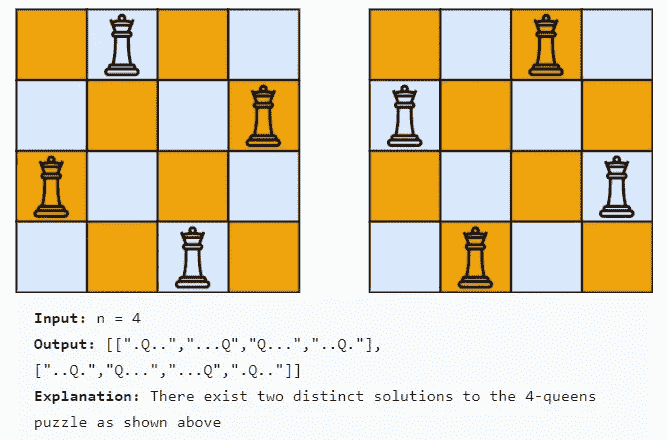
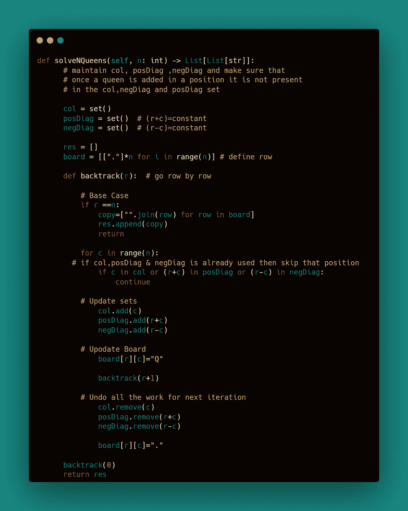

# 10 个日常练习题~第 5 天

> 原文：<https://blog.devgenius.io/10-daily-practice-problems-day-5-e3dfcf08ba12?source=collection_archive---------8----------------------->


# [**1。子集和**](https://practice.geeksforgeeks.org/problems/subset-sums2234/1)

给定一个列表 **arr** of **N** 整数，打印其中所有子集的和。

```
**Input:**
N = 2
arr[] = {2, 3}
**Output:**
0 2 3 5
**Explanation:**
When no elements is taken then Sum = 0.
When only 2 is taken then Sum = 2.
When only 3 is taken then Sum = 3.
When element 2 and 3 are taken then 
Sum = 2+3 = 5.
```


***解:***


# [2。子集](https://leetcode.com/problems/subsets/)

给定一个由**唯一**元素组成的整数数组`nums`，返回*所有可能的子集(幂集)*。

解决方案集合**不得**包含重复子集。返回**任意顺序**中的溶液。

```
**Input:** nums = [1,2,3]
**Output:** [[],[1],[2],[1,2],[3],[1,3],[2,3],[1,2,3]]
```


***解决方案:***


***优化方案:***


# [3。第二子集](https://leetcode.com/problems/subsets-ii/)

给定一个可能包含重复项的整数数组`nums`，返回*所有可能的子集(幂集)*。

解决方案集**不得包含重复子集**。返回**中任意顺序**的溶液。

```
**Input:** nums = [1,2,2]
**Output:** [[],[1],[1,2],[1,2,2],[2],[2,2]]
```


解决方案:


# [4。组合和](https://leetcode.com/problems/combination-sum/)

给定一个由**不同的**整数`candidates`和一个目标整数`target`组成的数组，返回*所有* ***唯一组合****`candidates`*的列表，其中所选数字的总和为* `target` *。*您可以以任何顺序返回**中的组合**。同一个**数字可以从`candidates`和**中无限次选择**。如果至少一个所选数字的频率不同，则两个组合是唯一的。***

```
***Input:** candidates = [2,3,6,7], target = 7
**Output:** [[2,2,3],[7]]
**Explanation:**
2 and 3 are candidates, and 2 + 2 + 3 = 7\. Note that 2 can be used multiple times.
7 is a candidate, and 7 = 7.
These are the only two combinations.*
```

**

****解决方案:****

**

# *[5。组合和二](https://leetcode.com/problems/combination-sum-ii/)*

*给定一组候选数字(`candidates`)和一个目标数字(`target`)，找出`candidates`中所有唯一的组合，其中候选数字的总和为`target`。*

*`candidates`中的每个数字在组合中只能使用**一次**。*

***注意:**解集不能包含重复的组合。*

```
***Input:** candidates = [10,1,2,7,6,1,5], target = 8
**Output:** 
[
[1,1,6],
[1,2,5],
[1,7],
[2,6]
]*
```

**

****解决方案:****

**

# *[6。排列](https://leetcode.com/problems/permutations/)*

*给定一个不同整数的数组`nums`，返回*所有可能的排列*。可以在**任意顺序**返回答案。*

```
***Input:** nums = [1,2,3]
**Output:** [[1,2,3],[1,3,2],[2,1,3],[2,3,1],[3,1,2],[3,2,1]]*
```

**

****解决方案:****

**

# *7。n 皇后*

***n 皇后**难题是将`n`皇后放在`n x n`棋盘上的问题，这样就不会有两个皇后互相攻击。给定一个整数`n`，返回 ***n 皇后谜题*** 的所有不同解。您可以在**中以任意顺序**返回答案。每种解决方案都包含不同的 n 皇后布局板配置，其中`'Q'`和`'.'`分别表示一个皇后和一个空位。*

****

****解决方案:****

**

# *[8。排序数组中的单个元素](https://leetcode.com/problems/single-element-in-a-sorted-array/)*

*给你一个仅由整数组成的排序数组，其中每个元素出现两次，只有一个元素出现一次。返回*只出现一次的单个元素*。你的解决方案必须在`O(log n)`时间和`O(1)`空间中运行。*

```
***Input:** nums = [1,1,2,3,3,4,4,8,8]
**Output:** 2*
```

**

*解决方案:*

*方法 1 使用 XOR*

**

*方法 2 使用二分搜索法*

**

## *[解释和来源](https://leetcode.com/problems/single-element-in-a-sorted-array/discuss/628036/Python-Binary-Search-O(logn)-explained)*

# *[9。在旋转排序数组中寻找最小值](https://leetcode.com/problems/find-minimum-in-rotated-sorted-array/)*

*给定排序后的**唯一**元素的旋转数组`nums`，返回该数组的最小元素*。**

```
***Input:** nums = [3,4,5,1,2]
**Output:** 1
**Explanation:** The original array was [1,2,3,4,5] rotated 3 times.*
```

**

*解决方案:*

**

# *[10。在旋转排序数组中搜索](https://leetcode.com/problems/search-in-rotated-sorted-array/)*

*给定数组`nums` **在**后可能的旋转和一个整数`target`，如果在 `nums` *中则返回*`target`*的索引，如果不在* `nums`中则返回* `-1` *。***

*你必须写一个运行时复杂的算法。*

```
***Input:** nums = [4,5,6,7,0,1,2], target = 0
**Output:** 4*
```

**

****解决方案:****

**

****参考文献:****

*[***neet code***](https://www.youtube.com/c/NeetCode)*