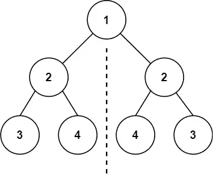
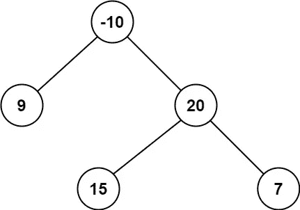

# 10 个日常练习题~第 8 天

> 原文：<https://blog.devgenius.io/10-daily-practice-problems-day-8-c303db2bd1ef?source=collection_archive---------19----------------------->


# [1。同一棵树](https://leetcode.com/problems/same-tree/)

给定两个二叉树`p`和`q`的根，写一个函数检查它们是否相同。

如果两个二叉树在结构上相同，并且节点具有相同的值，则认为它们是相同的。


```
**Input:** p = [1,2,3], q = [1,2,3]
**Output:** true
```

解决方案:


# [2。对称树](https://leetcode.com/problems/symmetric-tree/)

给定二叉树的`root`，*检查它是否是自身的镜像*(即围绕其中心对称)。



```
**Input:** root = [1,2,2,3,4,4,3]
**Output:** true
```

解决方案:


# [3。将二叉树展平为链表](https://leetcode.com/problems/flatten-binary-tree-to-linked-list/)

给定一棵二叉树的`root`，将该树展平成一个“链表”:

*   “链表”应该使用相同的`TreeNode`类，其中`right`子指针指向列表中的下一个节点，而`left`子指针总是`null`。
*   “链表”的顺序应该与二叉树的 [**前序遍历**](https://en.wikipedia.org/wiki/Tree_traversal#Pre-order,_NLR) 相同。


```
**Input:** root = [1,2,5,3,4,null,6]
**Output:** [1,null,2,null,3,null,4,null,5,null,6]
```

解决方案:


# [4。**镜像树**镜像树](https://practice.geeksforgeeks.org/problems/mirror-tree/1)

给定一棵二叉树，把它转换成它的镜像。


```
**Input:
**      1
    /  \
   2    3
**Output:** 3 1 2 **Explanation:** The tree is
   1    (mirror)  1
 /  \    =>      /  \
2    3          3    2
The inorder of mirror is 3 1 2
```

解决方案:


# [5。二叉树最大路径和](https://leetcode.com/problems/binary-tree-maximum-path-sum/)

二叉树中的**路径**是节点序列，其中序列中的每对相邻节点都有连接它们的边。一个节点在序列**中最多只能出现一次**。请注意，路径不需要通过根。路径的**路径和**是路径中节点值的和。

给定二叉树的`root`，返回*最大* ***路径和*** *任意* ***非空*** *路径*。



```
**Input:** root = [-10,9,20,null,null,15,7]
**Output:** 42
**Explanation:** The optimal path is 15 -> 20 -> 7 with a path sum of 15 + 20 + 7 = 42.
```

解决方案:


# [6。路径总和](https://leetcode.com/problems/path-sum/)

给定一棵二叉树的`root`和一个整数`targetSum`，如果该树有一条**根到叶的**路径，使得沿着该路径的所有值相加等于`targetSum`，则返回`true`。*一个* ***叶*** *是一个没有子节点的节点。*


```
**Input:** root = [5,4,8,11,null,13,4,7,2,null,null,null,1], targetSum = 22
**Output:** true
**Explanation:** The root-to-leaf path with the target sum is shown.
```

解决方案:


# [7。二叉树的垂直顺序遍历](https://practice.geeksforgeeks.org/problems/print-a-binary-tree-in-vertical-order/1)

给定一棵二叉树，求它从最左到最右的垂直遍历。
如果有多个节点穿过一条垂直线，那么它们应该按照**层级顺序**遍历树的顺序打印。

```
**Input:**
           1
         /   \
       2       3
     /   \   /   \
   4      5 6      7
              \      \
               8      9           
**Output:** 
4 2 1 5 6 3 8 7 9 
**Explanation:**
```


解决方案:


# 8。**二叉树**仰视图

给定一棵二叉树，从左到右打印底部视图。
如果当我们从底部看树时，一个节点可以被看到，则该节点被包括在底部视图中。

```
**Input:
**       1
     /   \
    3     2
**Output:** 3 1 2 **Explanation:**
First case represents a tree with 3 nodes
and 2 edges where root is 1, left child of
1 is 3 and right child of 1 is 2.
```


```
Thus nodes of the binary tree will be
printed as such 3 1 2.
```

解决方案:


# 9。**二叉树**顶视图

下面给出的是一棵二叉树。任务是打印二叉树的顶视图。二叉树的顶视图是当从顶部查看该树时可见的节点集。对于下面给定的树

```
**Input:
**       10
    /      \
  20        30
 /   \    /    \
40   60  90    100**Output:** 40 20 10 30 100
```

解决方案:


# 10。**反转二叉树**

给定二叉树的`root`，反转该树，并返回其根*。*


```
**Input:** root = [4,2,7,1,3,6,9]
**Output:** [4,7,2,9,6,3,1]
```

解决方案:

