# 10 个日常练习题~第 9 天

> 原文：<https://blog.devgenius.io/10-daily-practice-problems-day-9-ba8906cbf09e?source=collection_archive---------9----------------------->


# [1。BST 中的第 k 个最小元素](https://leetcode.com/problems/kth-smallest-element-in-a-bst/)

给定一个二叉查找树的`root`和一个整数`k`，返回*`kth`*的最小值(****1-索引*** *)树*中所有节点的值。*

*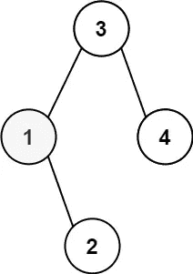*

```
***Input:** root = [3,1,4,null,2], k = 1
**Output:** 1*
```

*解决方案:*

*M1*

*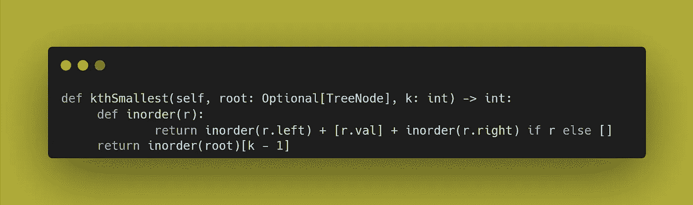*

*货币供应量之二*

**

> *注意:*
> 
> *`nonlocal`关键字用于处理嵌套函数中的变量，其中变量不应属于内部函数。使用关键字`nonlocal`声明该变量不是局部变量。*
> 
> *[来源](https://www.w3schools.com/python/ref_keyword_nonlocal.asp#:~:text=The%20nonlocal%20keyword%20is%20used,the%20variable%20is%20not%20local.)*

# *[2。**BST 中第 k 个最大元素**](https://practice.geeksforgeeks.org/problems/kth-largest-element-in-bst/1)*

*给定一个二叉查找树。你的任务是完成返回第 k 个最大元素的函数，而不用在二叉查找树做任何修改。*

```
***Input:
      4**
    /   \
2     9
k = 2 **Output:** 4*
```

*解决方案:*

*M1。*

*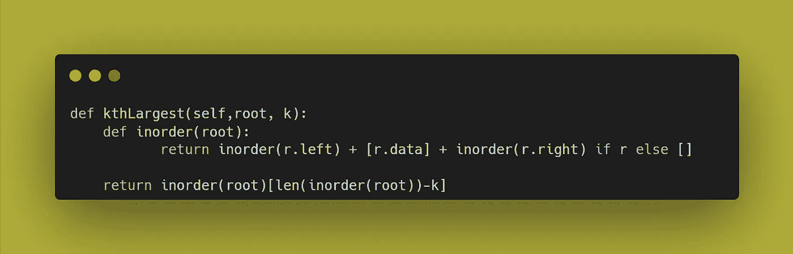*

*M2。*

*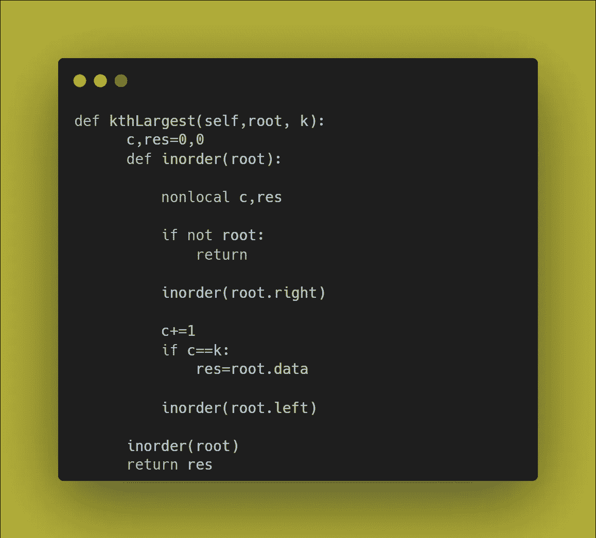*

# *[3。未排序数组中的第 k 个最大元素](https://leetcode.com/problems/kth-largest-element-in-an-array/)*

*给定一个整数数组`nums`和一个整数`k`，返回数组中 `kth` *最大的元素*。***

*请注意，它是排序顺序中最大的`kth`元素，而不是`kth` distinct 元素。你必须在`O(n)`时间复杂度内解决。*

```
***Input:** nums = [3,2,1,5,6,4], k = 2
**Output:** 5*
```

*解决方案:*

*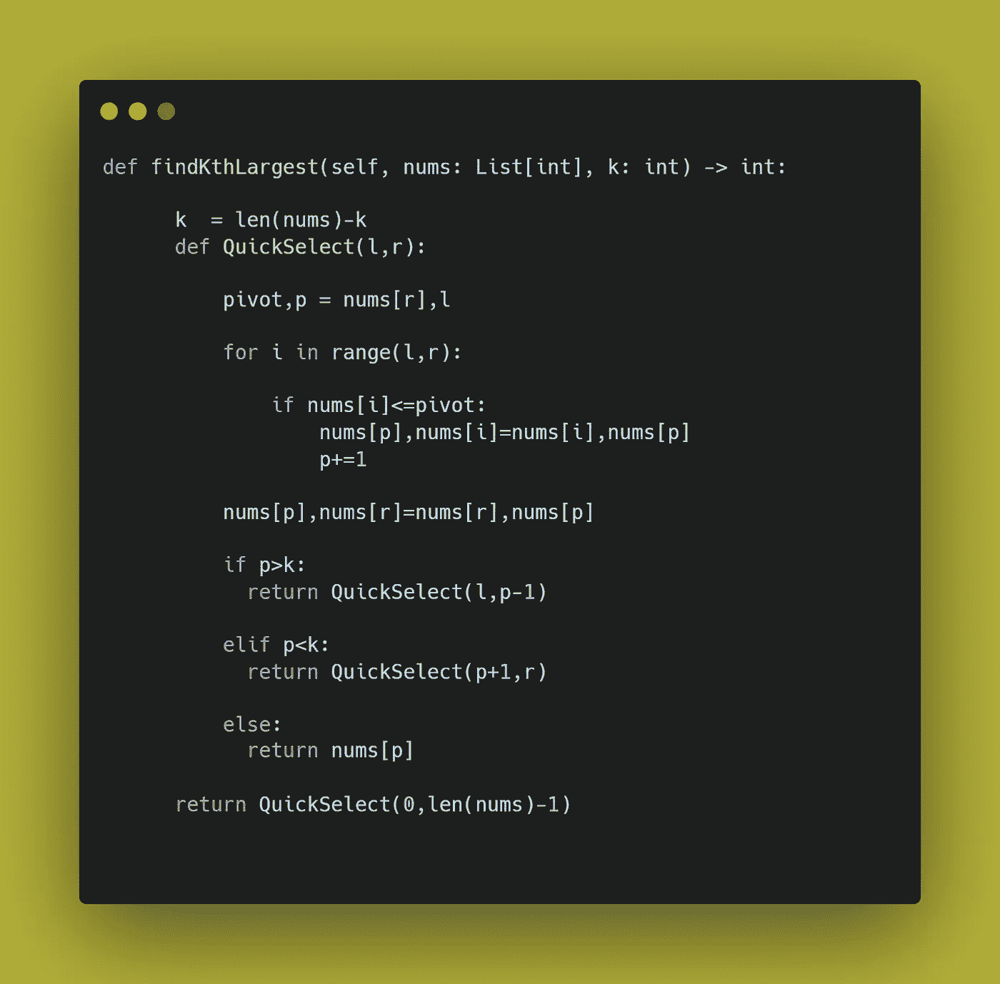*

# *[4。将排序列表转换为二叉查找树](https://leetcode.com/problems/convert-sorted-list-to-binary-search-tree/)*

*给定一个单链表的`head`，其中元素按照升序**排序**，将其转换为高度平衡的 BST。对于这个问题，高度平衡的二叉树被定义为每个节点的*的两个子树的深度相差不超过 1 的二叉树。**

*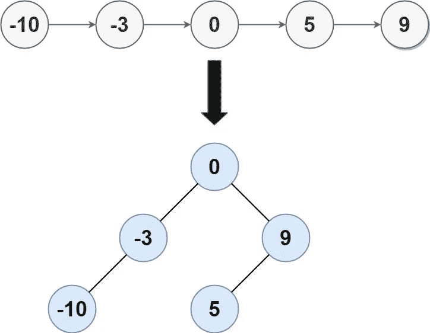*

```
***Input:** head = [-10,-3,0,5,9]
**Output:** [0,-3,9,-10,null,5]
**Explanation:** One possible answer is [0,-3,9,-10,null,5], which represents the shown height balanced BST.*
```

*解决方案:*

*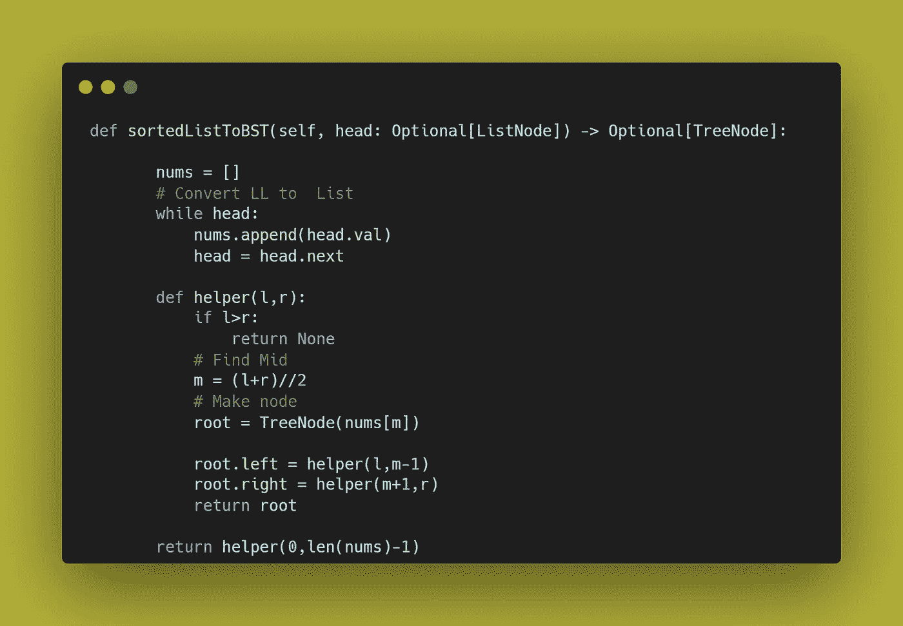*

# *[5。二叉查找树的最低共同祖先](https://leetcode.com/problems/lowest-common-ancestor-of-a-binary-search-tree/)*

*给定一个二叉查找树(BST)，找出 BST 中两个给定节点的最低共同祖先(LCA)节点。根据维基百科上的[对 LCA 的定义:“最低的共同祖先被定义在两个节点`p`和`q`之间，作为`T`中同时拥有`p`和`q`作为后代的最低节点(这里我们允许**节点是自身**的后代)。”](https://en.wikipedia.org/wiki/Lowest_common_ancestor)*

*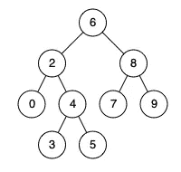*

```
***Input:** root = [6,2,8,0,4,7,9,null,null,3,5], p = 2, q = 8
**Output:** 6
**Explanation:** The LCA of nodes 2 and 8 is 6.*
```

*解决方案:*

*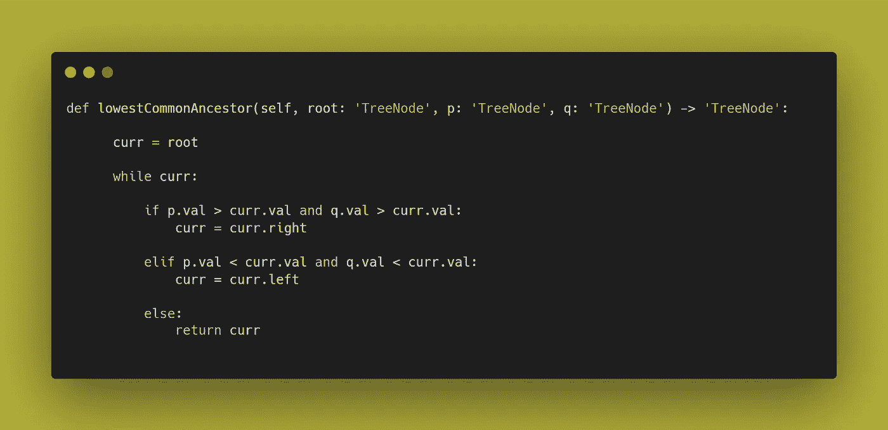*

# *[6。从前序遍历构建二叉查找树](https://leetcode.com/problems/construct-binary-search-tree-from-preorder-traversal/)*

*给定一个整数前序数组，表示 BST 的**前序遍历**(即**二叉查找树**)，构造树并返回*它的根*。保证总有可能为给定的测试用例找到具有给定需求的二叉查找树。*

*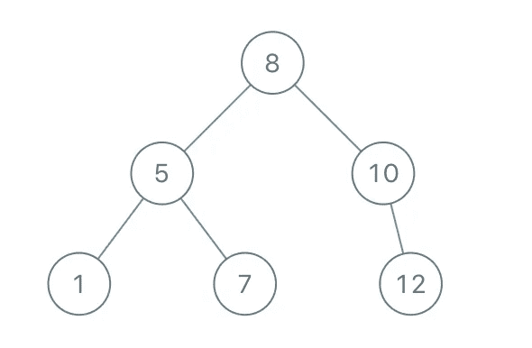*

```
***Input:** preorder = [8,5,1,7,10,12]
**Output:** [8,5,10,1,7,null,12]*
```

*解决方案:*

*M1。最佳方式*

*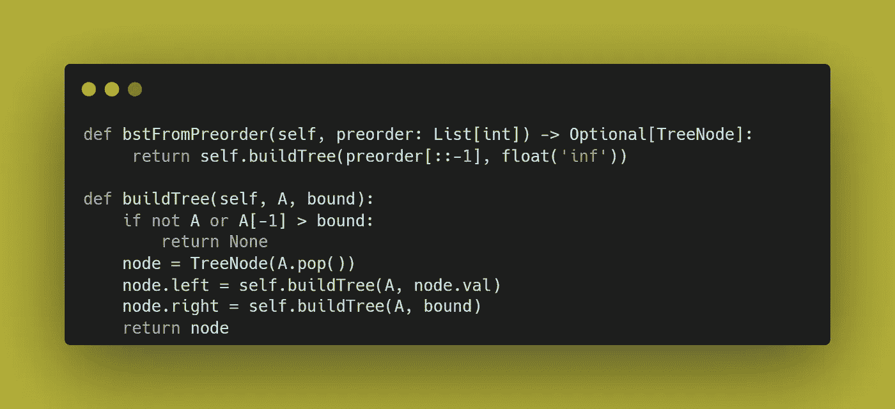*

****来源:***[***1***](https://www.youtube.com/watch?v=UmJT3j26t1I)***和***[***2***](https://leetcode.com/problems/construct-binary-search-tree-from-preorder-traversal/discuss/252232/JavaC%2B%2BPython-O(N)-Solution)*

*货币供应量之二*

*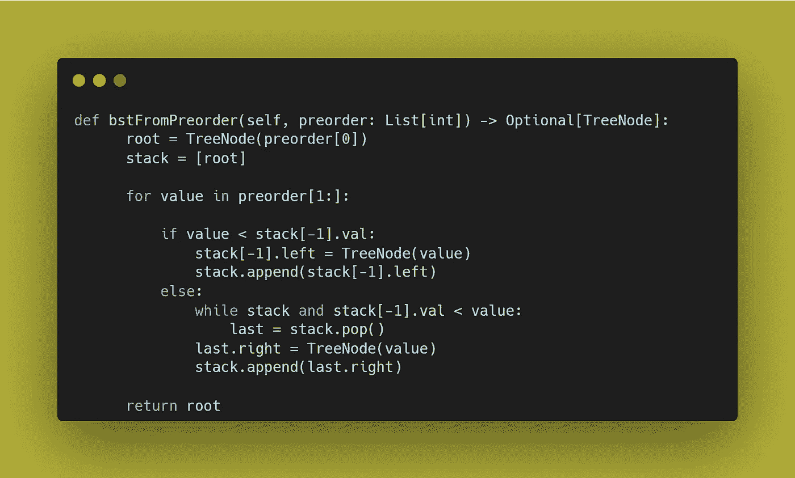*

> *[来源:](https://leetcode.com/problems/construct-binary-search-tree-from-preorder-traversal/discuss/252722/Python-stack-solution-beats-100-on-runtime-and-memory)*

*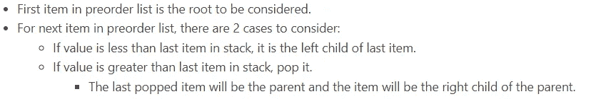*

*M3:*

*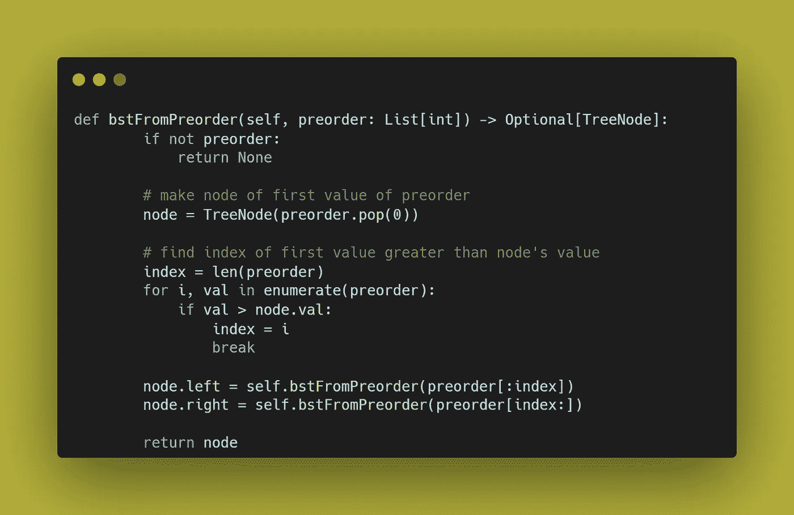*

> *[***来源:***](https://leetcode.com/problems/construct-binary-search-tree-from-preorder-traversal/discuss/589389/Python-Concise-Solution)*
> 
> *弹出列表中的第一个值，并使其成为节点。接下来，将值列表拆分为小于节点左侧的值和大于节点右侧的值。继续下去，直到没有可用的数字。**注意**，如果没有大于节点的数字，你必须将`index`变量设置为列表的长度。*

# *[7。在每个节点中填充右下指针](https://leetcode.com/problems/populating-next-right-pointers-in-each-node/)*

*给你一棵**完美的二叉树**，其中所有的叶子都在同一层，每个父母都有两个孩子。二叉树具有以下定义:*

```
*struct Node {
  int val;
  Node *left;
  Node *right;
  Node *next;
}*
```

*填充每个下一个指针以指向它的下一个右节点。如果没有下一个右节点，下一个指针应该设置为`NULL`。*

*最初，所有后续指针都被设置为`NULL`。*

*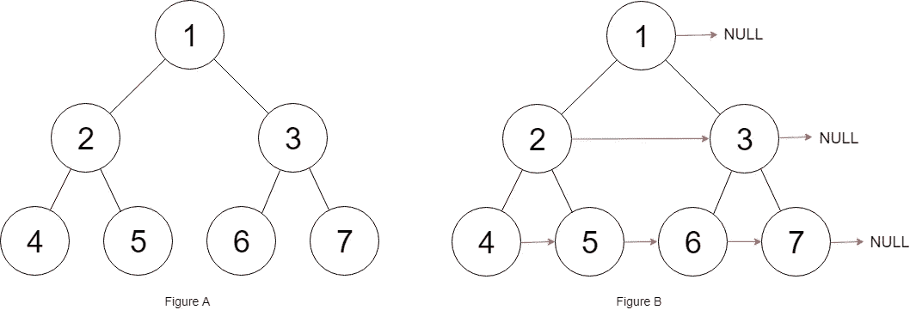*

```
***Input:** root = [1,2,3,4,5,6,7]
**Output:** [1,#,2,3,#,4,5,6,7,#]
**Explanation:** Given the above perfect binary tree (Figure A), your function should populate each next pointer to point to its next right node, just like in Figure B. The serialized output is in level order as connected by the next pointers, with '#' signifying the end of each level.*
```

*解决方案:*

*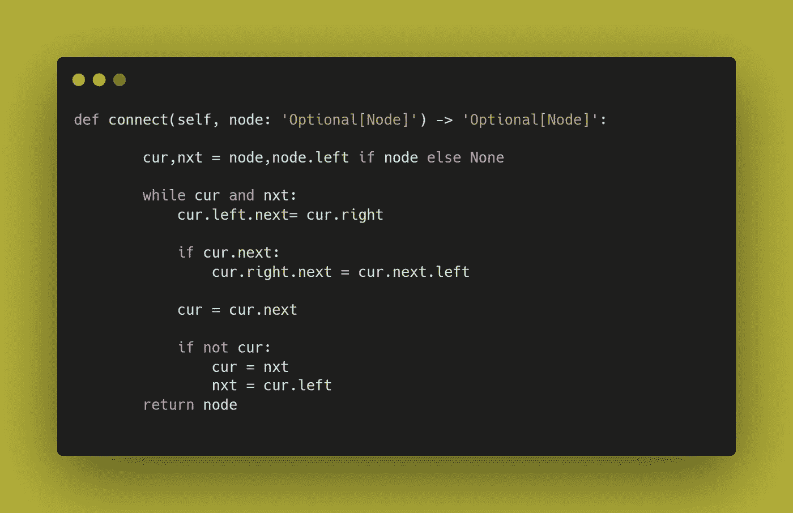*

# *[8。在二叉查找树搜索](https://leetcode.com/problems/search-in-a-binary-search-tree/)*

*给你一个二叉查找树(BST)的`root`和一个整数`val`。*

*在 BST 中找到值等于`val`的节点，并返回以该节点为根的子树。如果这样的节点不存在，返回`null`。*

*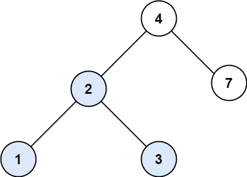*

```
***Input:** root = [4,2,7,1,3], val = 2
**Output:** [2,1,3]*
```

*解决方案:*

*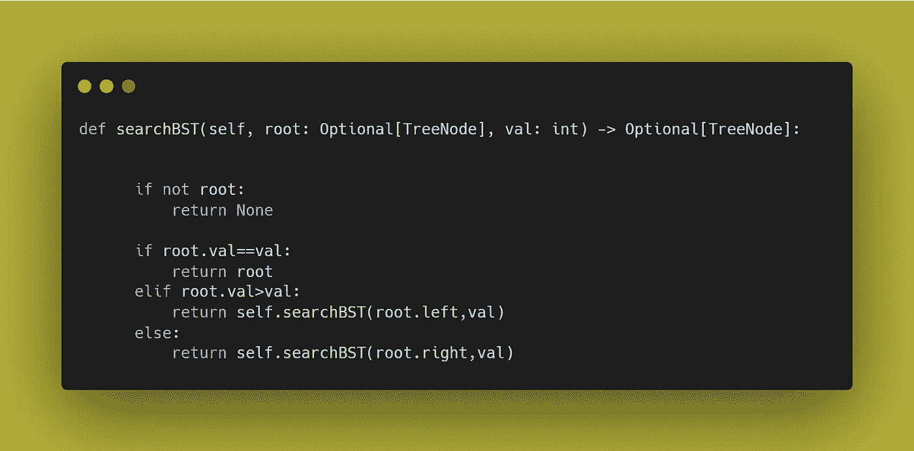*

# *[9。将排序后的数组转换为二叉查找树](https://leetcode.com/problems/convert-sorted-array-to-binary-search-tree/)*

*给定一个整数数组`nums`，其中的元素按照**升序**排序，将*转换成一个***二叉查找树*。**

**高度平衡的二叉树是这样的二叉树，其中每个节点的两个子树的深度相差不超过 1。**

****

```
****Input:** nums = [-10,-3,0,5,9]
**Output:** [0,-3,9,-10,null,5]
**Explanation:** [0,-10,5,null,-3,null,9] is also accepted:**
```

**解决方案:**

**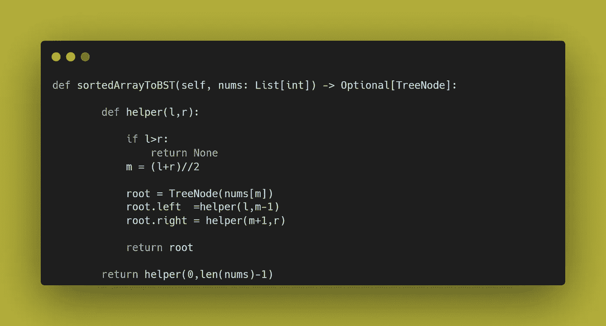**

# **10。验证二叉查找树**

**给定二叉树的`root`，*确定它是否是有效的二叉查找树(BST)* 。**

**一个**有效 BST** 定义如下:**

*   **节点的左子树只包含键**小于节点键**的节点。**
*   **节点的右边子树只包含键**大于节点键**的节点。**
*   **左右子树也必须是二分搜索法树。**

**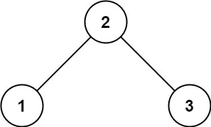**

```
****Input:** root = [2,1,3]
**Output:** true**
```

**解决方案:**

**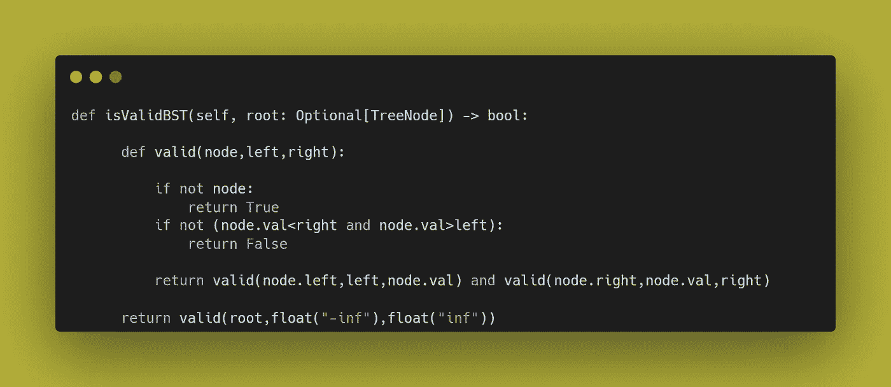**