# 10 个日常实践问题~第 11 天

> 原文：<https://blog.devgenius.io/10-daily-practive-problems-day-11-a4c42ffbcdb4?source=collection_archive---------12----------------------->


# [1。回文链表](https://leetcode.com/problems/palindrome-linked-list/)

给定单链表的`head`，如果是回文则返回`true` *，否则返回*`false`*。*

*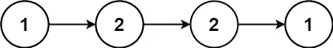*

```
***Input:** head = [1,2,2,1]
**Output:** true***Approach:***
make the two half 
reverse the first one 
compare both*
```

****解决方案:****

*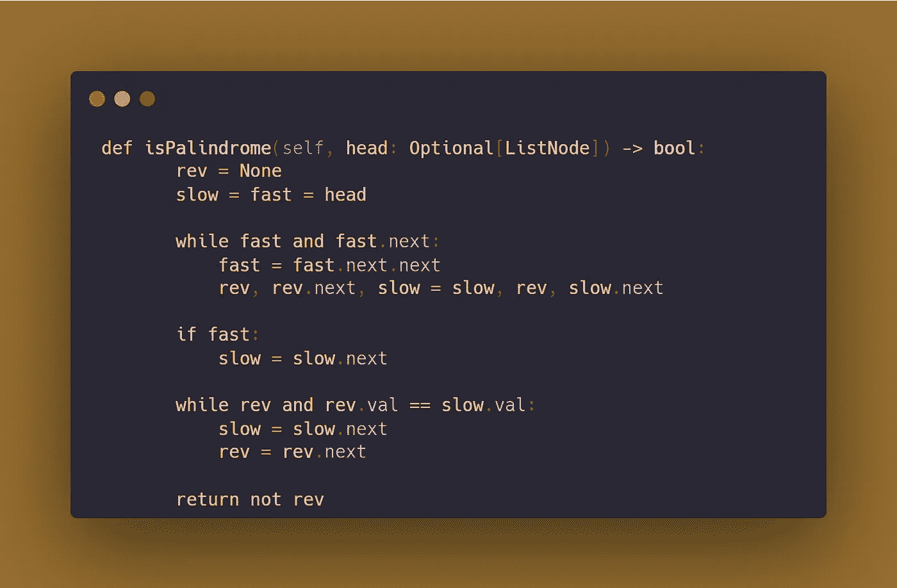*

# *[2。两个链表的交集](https://leetcode.com/problems/intersection-of-two-linked-lists/)*

*给定两个单链表的头`headA`和`headB`，返回*两个链表相交的节点*。如果两个链表没有交集，返回`null.`*

*测试用例的生成使得整个链接结构中的任何地方都没有循环。*

***注意**在函数返回后，链表必须**保持它们原来的结构**。*

**

```
***Input:** intersectVal = 8, listA = [4,1,8,4,5], listB = [5,6,1,8,4,5], skipA = 2, skipB = 3
**Output:** Intersected at '8'*
```

***解决方案:***

*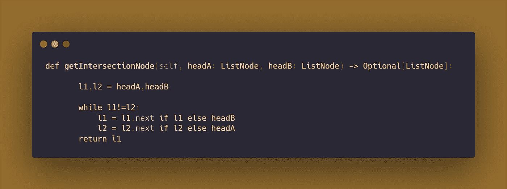*

# *[3。重新排序列表](https://leetcode.com/problems/reorder-list/)*

*给你一个单链表的头。该列表可以表示为:*

```
*L0 → L1 → … → Ln - 1 → Ln*
```

**将列表重新排序为以下形式:**

```
*L0 → Ln → L1 → Ln - 1 → L2 → Ln - 2 → …*
```

*您不能修改列表节点中的值。只有节点本身可以更改。*

*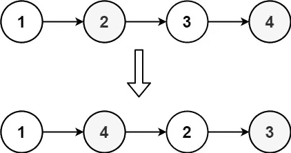*

```
***Input:** head = [1,2,3,4]
**Output:** [1,4,2,3]*
```

****解决方案:****

*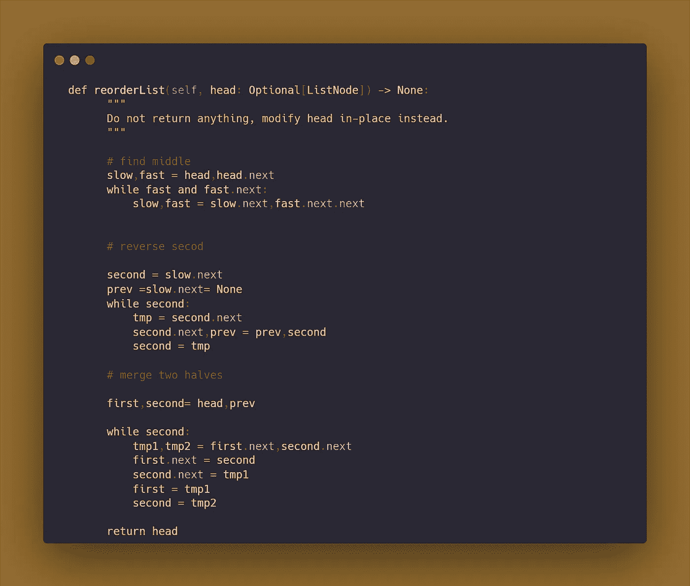*

# *[4。老鼠算房子](https://prepinsta.com/accenture/coding/)*

*该函数接受两个正整数“r”和“unit ”,以及一个大小为“n”的正整数数组“arr”作为其参数,“r”表示一个区域中存在的老鼠数量，“unit”是每只老鼠消耗的食物数量，数组“arr”的每个第 I 个元素表示“i+1”门牌号中存在的食物数量，其中 0 <= i*

***注:***

*   *如果数组为空，则返回-1*
*   *如果所有房屋的食物总量不足以满足所有老鼠的需求，则返回 0。*
*   *计算值在整数范围内。*

***例如:***

```
***Input:** r: 7 
unit: 2
n: 8
arr: 2 8 3 5 7 4 1 2**Output:** 4***Explaination:**** First find the food required by all rats
* Iterate through the array and sum them 
* Check if the food required is greater than or equal to food in   houses*
```

*解决方案:*

*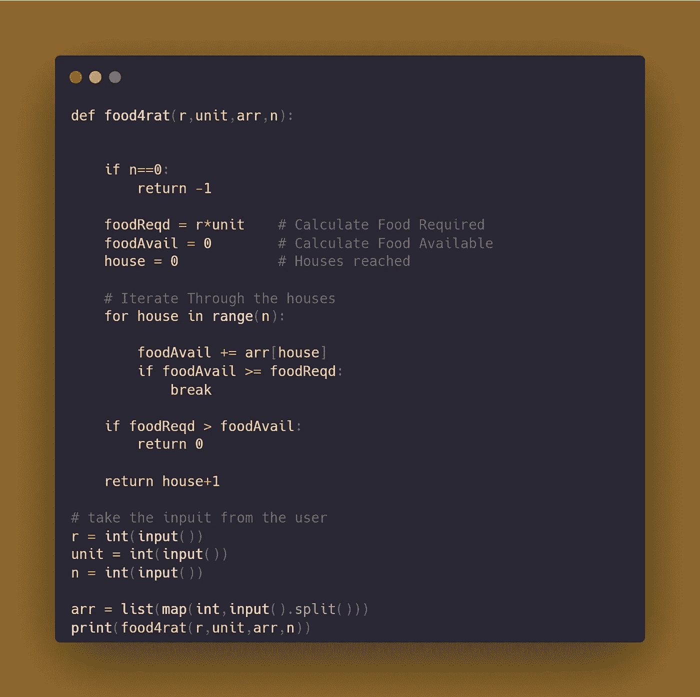*

# *[5。二元运算](https://prepinsta.com/accenture/coding/)*

*二进制数制只用 0 和 1 两个数字，数制可以称为二进制串。要求你实现以下函数:int OperationsBinaryString(char * str)；*

*该函数接受字符串 str 作为其参数。字符串 str 由字母分隔的二进制数字组成，如下所示:*

*   *–A 表示与运算*
*   *–B 表示 OR 操作*
*   *–C 表示异或运算*

*您需要计算字符串的结果，一次执行一个操作，向右扫描字符串，然后返回相同的结果。*

***注:***

*   *不需要操作的优先级顺序*
*   *字符串长度是奇数*
*   *如果 str 为空或无(在 Python 的情况下)，则返回-1*

```
***Input:** s: 1C0C1C1A0B1**Output:** 1*
```

*解决方案:*

*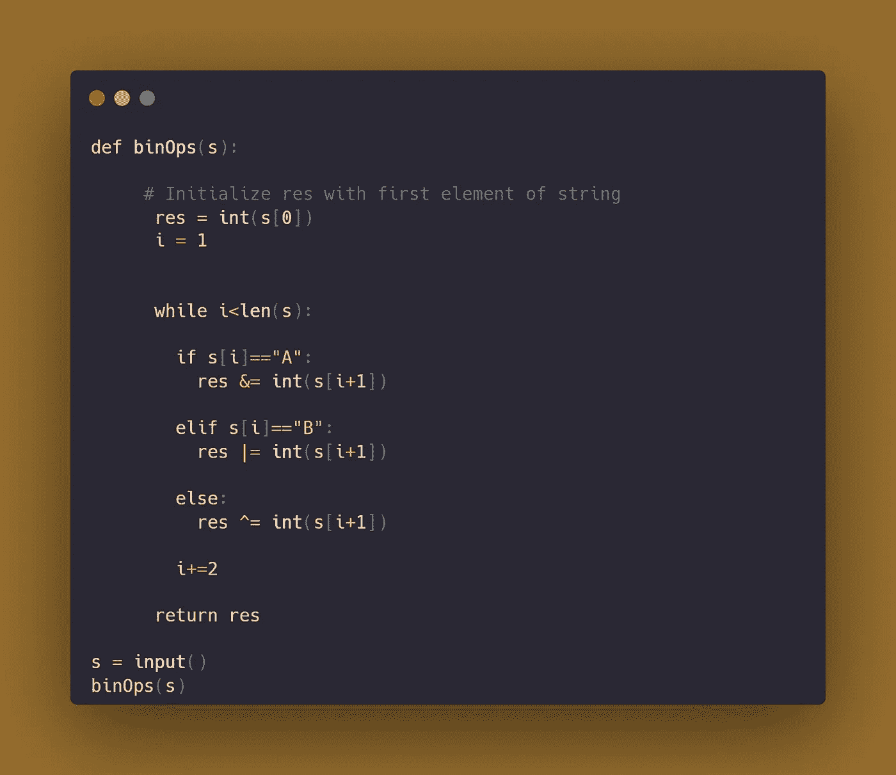*

# *[6 .密码检查器](https://prepinsta.com/accenture/coding/)*

*你被赋予了一个功能。int CheckPassword(char str[]，int n)；
函数接受大小为 n 的字符串作为参数。如果给定的字符串是有效的密码，则实现返回 1 的函数，否则返回 0。
满足以下条件的 str 为有效密码:*

*   *–至少 4 个字符*
*   *–至少一个数字*
*   *–至少一个大写字母*
*   *–不得有空格或斜线(/)*
*   *–起始字符不能是数字*

***假设:**
输入字符串不为空。*

```
***Input:**
aA1_67**Output:**
1*
```

*解决方案:*

*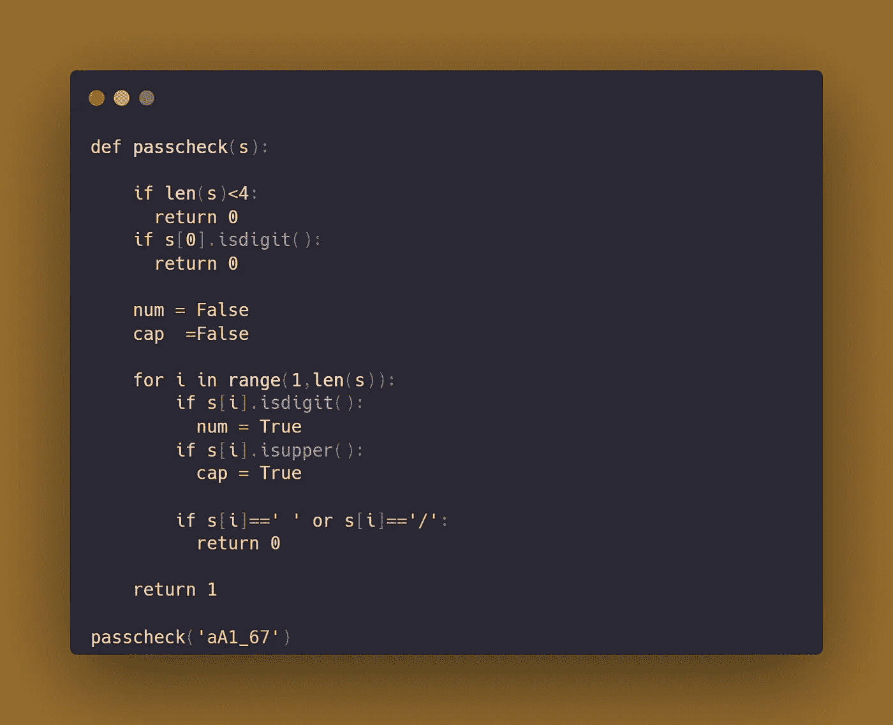*

# *[7。移动催眠](https://prepinsta.com/accenture/coding/)*

*该函数接受长度为“n”的字符串“str”，该字符串包含字母和连字符(-)。实现函数，将字符串中的所有连字符(-)移动到给定字符串的前面。*

***注意** :-如果字符串为空，则返回空。*

***示例:-***

```
***Input**:str.Move-Hyphens-to-Front**Output:**— MoveHyphenstoFront*
```

*解决方案:*

*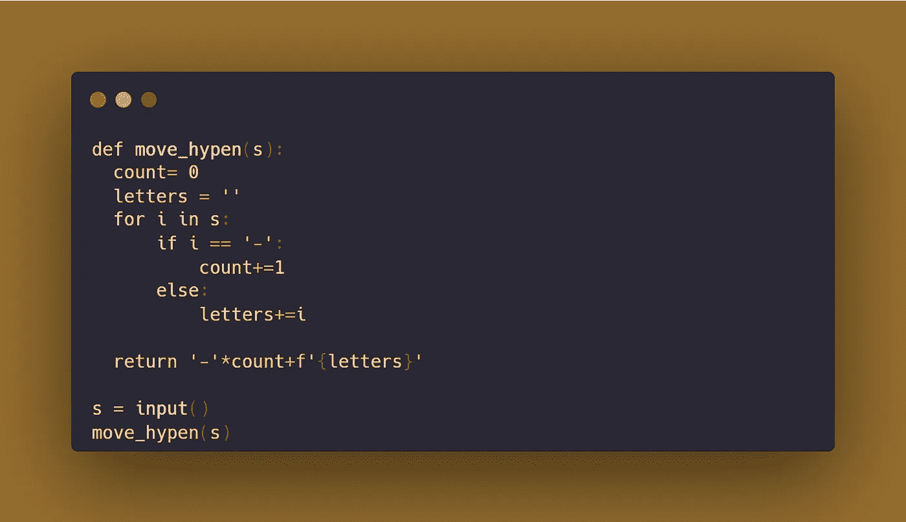*

# *[T21 8。两个排序数组的第 k 个元素](https://practice.geeksforgeeks.org/problems/k-th-element-of-two-sorted-array1317/1)*

*给定两个大小分别为 **N** 和 **M** 的排序数组 **arr1** 和 **arr2** 以及一个元素 **K** 。任务是找到最终排序数组的第 k 个位置的元素。*

```
***Input:**
arr1[] = {2, 3, 6, 7, 9}
arr2[] = {1, 4, 8, 10}
k = 5**Output:**
6*
```

****溶液:****

*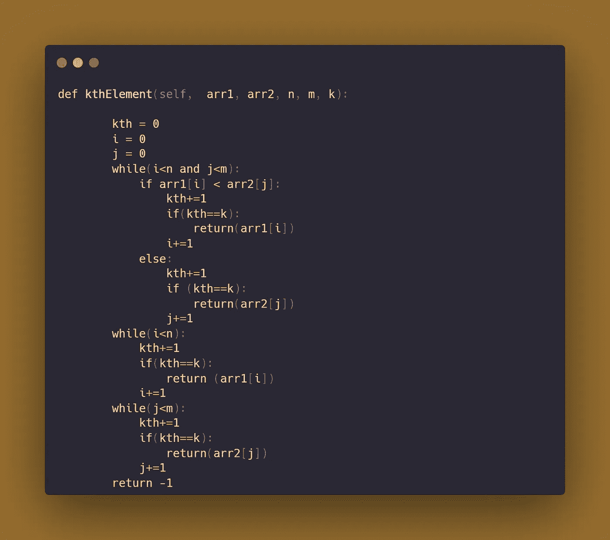*

# *[9。前 K 个常用元素](https://leetcode.com/problems/top-k-frequent-elements/)*

*给定一个整数数组`nums`和一个整数`k`，返回*`k`*最频繁元素*。您可以按**任意顺序**返回答案。**

```
****Input:** nums = [1,1,1,2,2,3], k = 2
**Output:** [1,2]**
```

**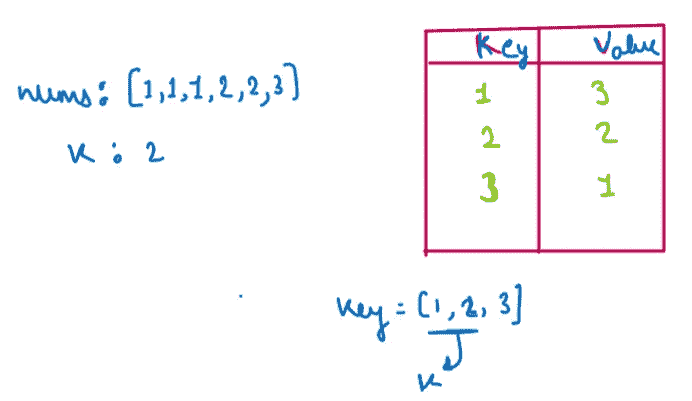**

*****溶液:*****

**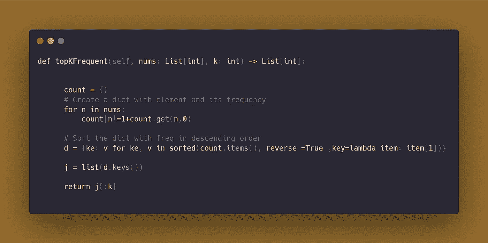**

# **[10。下一个更大的元素 I](https://leetcode.com/problems/next-greater-element-i/)**

**数组中某个元素`x`的**下一个更大的元素**是同一数组中`x`右边**的**第一个更大的**元素。****

****给你两个**不同的 0 索引**整数数组`nums1`和`nums2`，其中`nums1`是`nums2`的子集。****

****对于每个`0 <= i < nums1.length`，找到索引`j`使得`nums1[i] == nums2[j]`确定`nums2`中`nums2[j]`的下一个更大的元素**。如果没有下一个更大的元素，那么这个查询的答案是`-1`。******

****返回长度为 `nums1.length` *的*数组* `ans` *使得* `ans[i]` *是上面描述的* ***下一个更大的元素*** *。******

```
*****Input:** nums1 = [4,1,2], nums2 = [1,3,4,2]
**Output:** [-1,3,-1]
**Explanation:** The next greater element for each value of nums1 is as follows:
- 4 is underlined in nums2 = [1,3,4,2]. There is no next greater element, so the answer is -1.
- 1 is underlined in nums2 = [1,3,4,2]. The next greater element is 3.
- 2 is underlined in nums2 = [1,3,4,2]. There is no next greater element, so the answer is -1.***
```

***解决方案:***

***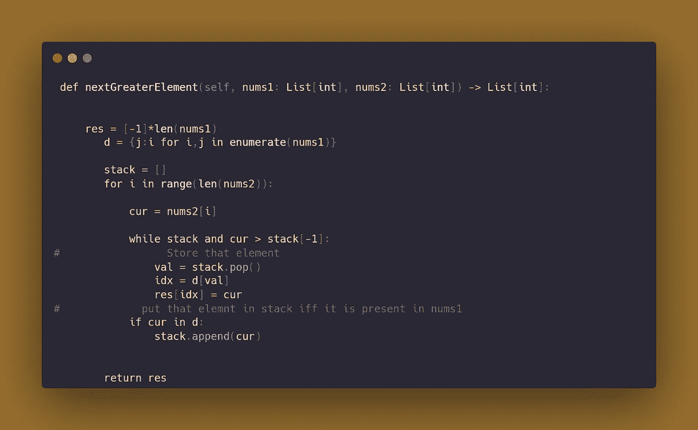***

***参考资料:***

***[***啃老族***](https://www.youtube.com/c/NeetCode)***

***[预备期](https://prepinsta.com/accenture/coding/)***