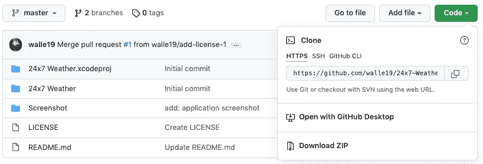
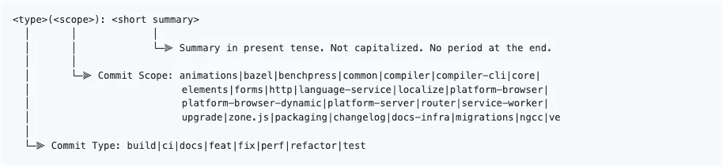

# 开发人员的 10 个日常 Git 命令

> 原文：<https://blog.devgenius.io/10-day-to-day-git-commands-for-developer-f6d4598baa1d?source=collection_archive---------6----------------------->

## 了解方便的 Git 命令


由[罗曼·辛克维奇](https://unsplash.com/@synkevych?utm_source=unsplash&utm_medium=referral&utm_content=creditCopyText)在 [Unsplash](https://unsplash.com/s/photos/git?utm_source=unsplash&utm_medium=referral&utm_content=creditCopyText) 上拍摄的照片

Git 是全球最常用的版本控制系统🌐在软件行业。

现在，在进行**之前，什么是版本控制？**

> *版本控制也称为源代码控制，在任何开发项目中都起着至关重要的作用。它提供了一种媒介来跟踪和控制源代码中的变更。*

现在，掌握 Git 可能需要时间，因为有各种各样的命令覆盖不同的场景。今天，让我们从日常开发项目中非常方便的基本命令开始学习。

# 1.git 初始化

> 创建一个空的 Git 存储库或重新初始化一个现有的存储库

有时，我们在本地系统上开始开发工作，然后我们希望将项目推到一个远程平台上，如 Github 或 Gitlab，以便共享或跟踪我们的学习进度。要执行此操作，我们可以运行下面的命令。

```
git init
```

基本上，上面的命令将创建一个空的 Git 存储库，即一个带有子目录`objects, refs/heads, refs/tags and template files.`的`.git`目录

> **提示**:在现有的存储库中运行`git init`是安全的，因为它不会覆盖已经存在的任何东西。

# 2.git 克隆

> 将存储库克隆到新目录中

现在，当像 Github、Gitlab 或 Stash 这样的远程平台上已经存在存储库时。为了克隆那些现有的远程源代码，我们运行下面这个我最喜欢的命令。

```
git clone <https url>
```

还有两种方法可以克隆远程源代码，如下所示:

```
git clone <ssh url>gh repo clone <project-name>
```

此外，您还可以下载`ZIP`格式的项目。对于 Github 源代码，你也可以用 Github 桌面工具打开它。

请参考下面的截图了解上述方法。



# 3.git 分支

> 通过允许并行开发工作，分支在开发世界中扮演着至关重要的角色

通常，项目有不同的分支，如:

dev —用于正在进行的开发工作

QA——用于测试和错误修复工作

发布—对于稳定的产品代码

以及更多用于跟踪和区分开发或固定或稳定生产或特征的独立分支。

我们将研究创建、列出和删除分支命令。

要创建新分支:

```
git branch <branch_name>
```

要列出现有分支:

```
git branch or git branch --list // list local branchesgit branch -r // list remote branchesgit branch -a // list local and remote branches
```

要删除分支:

```
git branch -d <branch_name> // delete branch locallygit branch -D <branch_name> // forcefully delete branch locallygit push origin --delete <branch_name> // delete branch remotely
```

您可以一次删除多个分支:

```
git branch -D <branch_1> <branch_2> ... <branch_n>
```

# 4.git 检验

> 创建新分支或切换到现有的本地或远程分支

由于我们在前面的命令中创建了新的分支，同样，我们也可以使用该命令来创建新的分支，如下所示:

```
git checkout -b <branch_name>
```

此外，如果我们希望切换到现有的本地或远程分支机构，我们可以通过以下方式实现:

```
git checkout <branch_name>
```

# 5.git 添加

> 向索引添加文件内容

随着开发工作的进展，我们会执行创建、更新或删除文件或文件内容等操作。现在，要跟踪这些操作，我们必须执行以下命令:

**添加单个文件:**

```
git add <file>
```

**添加所有文件:**

```
git add.orgit add -A
```

> IMP: git add 命令在提交之前不会保存更改。

# 6.git 差异

> 允许开发人员查看未分级或分级的更改

**查看未分级的变更:**

```
git diff
```

**查看阶段性变更:**

```
git diff --staged
```

# 7.git 贮藏

> 将脏工作目录中的更改删除

当我们想要转移到一个干净的工作目录，但是要保留工作目录和索引的当前状态的记录时，这是一个方便的命令。

```
git stash
```

要查看库存列表:

```
git stash list
```

检查一个藏匿点:

```
git stash show
```

要恢复库存:

```
git stash apply
```

> 注意:不带任何参数调用`git stash`等同于`git stash push`

# 8.git 状态

> 显示当前工作树的状态

提供了索引文件和当前头提交之间的路径差异、工作树中不由 Git 跟踪的路径以及索引文件和工作树的列表。

```
git status
```

# **9。git 提交**

> 将变更提交给存储库

现在我们已经到了开发的一个阶段，我们希望保存我们通过`git add`添加的、通过`git diff`和`git stash`审核的变更

提交时，我们需要提供有意义信息来反映我们的变更

```
git commit -m "meaningful message"
```

对于描述性提交消息，最好遵循一些模式，最常用的模式是:



[角度提交消息](https://github.com/angular/angular/blob/master/CONTRIBUTING.md)

# 10。git 推送

> 用本地提交更新远程引用

由于我们在本地保存了我们的更改，现在我们希望将这些更改推送到远程源代码，以用于不同的目的，如代码审查或代码发布。

因此，要执行此操作，我们需要运行以下命令:

```
git push -u origin <branch_name>
```

如果是新创建的，这也会将分支推到远程。

# 参考

 [## 推送文档

### “远程”存储库是推送操作的目的地。这个参数可以是一个 URL(参见…

git-scm.com](https://git-scm.com/docs/git-push) 

# **直到下一次**

希望这篇文章对你有用，感谢你阅读它。如果您有任何反馈，也请分享。

我在@buymeacoffee 上。如果你喜欢我的作品，你可以给我买一幅☕，分享你的想法🎉[https://www.buymeacoffee.com/nikhilwali2](https://www.buymeacoffee.com/nikhilwali2)