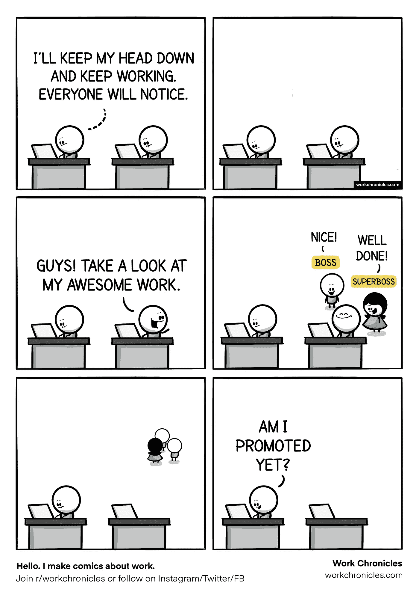

# 10 幅描述程序员现实生活问题的搞笑漫画

> 原文：<https://blog.devgenius.io/10-hilarious-cartoons-that-depict-real-life-problems-of-programmers-36b2287679e8?source=collection_archive---------0----------------------->

以及他们如何处理这些问题…

图片来源:[depositphotos.com](https://depositphotos.com/stock-photos/programmer-cartoon.html?filter=all&qview=43641985)

# 1.判断

[*估算完成自己的工作所需的时间简直是一项艰巨的任务。*](https://levelup.gitconnected.com/the-art-of-eta-6ec69664ee89)

但是当你在等式中加入更多的人时，乐趣就开始了。

然后，评估变成了一项投掷飞镖的运动(在黑暗中也是如此):

图片来源:[workchronicles.com](https://workchronicles.com/adding-more-people-to-a-project/)

# 2.修复 bug

*人类更喜欢即时的满足，这意味着我们选择沉溺于(或投资于)能够迅速给我们带来回报的活动，而同时却忽略了我们未来可能要付出的(沉重)代价。*

*但是，当我们在工作场所这样做时，最终付出代价的可能不是我们:*

**

*图片来源:[workchronicles.com](https://workchronicles.com/long-term-thinking/)*

# *3.与雄心勃勃的销售代表打交道*

*销售代表有要达到的目标。我们理解。*

*但是当一些过分热情的销售代表向客户许下难以实现的诺言时，程序员首当其冲:*

**

*图片来源:[workchronicles.com](https://workchronicles.com/just-signed-a-new-client/)*

# *4.交际*

> *"极客有福了，因为他们将统治世界."*

*科技行业对我们的生活产生了巨大的影响:人们可以在谷歌上搜索任何东西，并在 Tinder 和 Bumble 等网站上与任何人联系。*

*作为建立科技产业的人，我们是它的阿尔法和欧米茄。*

*然而，当涉及到面对面的互动和形成对话时，我们却无话可说:*

**

*图片来源:[workchronicles.com](https://workchronicles.com/hobbies/)*

# *5.寻找新工作*

*实际上，有数百个网站承诺将潜在雇员和雇主结合成神圣的婚姻😂。*

*但是没有一个能帮你躲过听起来更像销售代表的招聘人员。破译他们话语背后的真实含义是一门神秘的艺术:*

**

*图片来源:[workchronicles.com](https://workchronicles.com/fast-paced-environment/)*

# *6.功能请求*

> *“XYZ 应用程序的‘故事’功能非常受欢迎。我们也应该引进它。”*
> 
> *“如果我们的用户可以同时在欧洲找到约会对象、预订出租车和租别墅，会怎么样？”*

*关于我们可以提供给用户的新功能的讨论也是如此。*

*我们知道需要试验和改进，但是仅仅为了添加而添加功能并不酷:*

**

*图片来源:[workchronicles.com](https://workchronicles.com/constant-changes/)*

# *7.状态更新*

*在[敏捷](https://www.agilealliance.org/agile101/)的[每日站立会议](https://www.agilealliance.org/glossary/daily-meeting/)是团队讨论他们工作的整体进展和任何可能阻碍他们的障碍的绝佳方式。*

*但是一旦我们完成了，我们就完成了状态更新。*

*五分钟前，这个“关键”功能没有任何实质性进展，从现在起五分钟内也不会有任何进展:*

**

*图片来源:[workchronicles.com](https://workchronicles.com/just-checking-in/)*

# *8.展示我们的作品*

*我们是极客。我们很多人都很内向。不是所有人都喜欢向全世界大声宣布我们的工作。*

*但这并不意味着我们工作不够努力，或者我们不值得被提拔:*

**

*图片来源:[workchronicles.com](https://workchronicles.com/getting-noticed-at-work/)*

# *9.正确处理我们的优先事项*

*产品经理们，请理解这一点:*

> *如果所有特征都是优先的，那么它们都不是优先的:*

**

*图片来源:[workchronicles.com](https://workchronicles.com/priorities/)*

# *10.满足(不切实际的)期望*

*还需要我多说吗:*

*(好吧，我承认这不是专门针对程序员的，但它描述了一个令人不寒而栗的现实)*

**

*图片来源:[workchronicles.com](https://workchronicles.com/i-slog-you-should-too/)*

*我希望你喜欢读这篇文章！*

*欢迎在下面的评论区留下你的建议(如果有的话)👇*