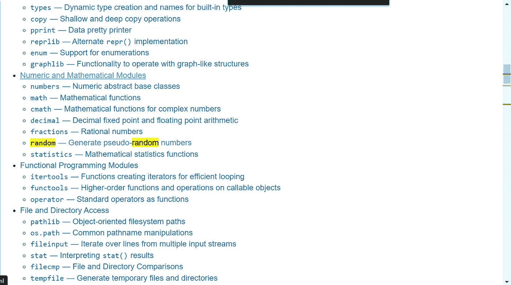

# #10 导入模块和 sys.exit()

> 原文：<https://blog.devgenius.io/10-importing-modules-and-sys-exit-98146308ae3c?source=collection_archive---------13----------------------->

## 在我们的代码中使用他人的作品

副标题可能看起来有点奇怪，但是在我们的代码中使用模块是节省我们工作和时间的好方法。在这篇文章中，我将向你展示如何*导入*随机模块并创建一个随机数。接下来，我还将展示什么是 *sys.exit()* 以及如何使用它。


简·kopřiva 摄于 [Pexels](https://www.pexels.com/photo/photo-of-a-red-snake-3280908/?utm_content=attributionCopyText&utm_medium=referral&utm_source=pexels)

## 什么是模块？

我们已经使用了一些 Python 的**内置函数** ( *print()* ， *input()* )。它们是内置的(顾名思义)。此外，Python 有几个**模块**，下载 Python 时会安装在你的 PC 上。模块是 Python 的一大部分。Python 以其众多的模块而闻名。就像引言中提到的，模块可以节省我们的工作和时间。有几个内置模块—**python 标准库**。你可以在这里找到:[https://docs.python.org/3/library/index.html](https://docs.python.org/3/library/index.html)。在所有模块下我们都要向下滚动找到“[](https://docs.python.org/3/library/random.html)*”(或者使用 *CTRL+F* )下的“ [*数值和数学模块*](https://docs.python.org/3/library/numeric.html) ”:*

**

*python 标准库网站上的随机模块*

*您可以了解该模块的功能。下一部分，我们将使用它来获得一个随机数。*

## *如何导入模块？*

*如果你想使用一个模块，你必须**导入它**。我们通过简单地说出*导入模块*来做到这一点。*

```
*import random # Importing the module random*
```

*导入模块后，我们可以使用**中的**功能。在这个例子中，我们使用函数 *randint()* (模块 random 的)，它给出了从 a 到 b(包括两个端点)—*rand . randint(a，b)* 的一个**随机整数。***

```
*import random # Import the module random
random_number = random.randint(1, 3) # Storing a random number between 1 and 3 into the variable random_number
print(random_number) # Printing out the random number*
```

*使用这段代码，我们可以打印出一个介于 1 和 3 之间的数字(1，2，3)——随机选择！有了这个，我们可以得到我们想要的范围内的随机数。那超级有用！在下一篇文章中，我将向您展示这种方法的一个很好的用法。*

```
*# Another example usage: Getting 5 random numbers from 1 to 5
import random
for i in range(5):
    print(random.randint(1, 5))*
```

> *对模块的警告:永远不要用 python(内置)模块或内置函数的名字来调用普通的 python 程序。比如永远不要调用自己的 python 程序 random.py 或者 print.py！否则，当您想要使用内置函数或(内置)模块时，将会出现错误。*

*要导入多个模块，可以使用逗号或多行。为了让它看起来更好，你应该按字母顺序排列。*

```
*# Using one line with comma
import datetime, math, random

# Using multiple lines
import datetime
import math
import random*
```

## *从模块导入功能*

*使用模块导入函数中的*可以从模块中导入特定的函数。对于我们的例子，我们可以使用随机导入 randint* 中的*。**

```
*from random import randint
print(randint(1, 3)) # We do not have to put random. in front of randint as we said we want to import randint FROM random*
```

***如果你只需要一个模块的特定功能，使用这个。***

## *从模块导入**

*使用*从模块导入** 我们从模块导入每个函数。这样，我们就不必放*模块了。*在一个函数前。比如 *random.randint()* 现在是 *randint()* :*

```
*from random import *
print(randint(1, 3)) # We do not have to put random. in front of randint as we said we want to import everything (*) FROM random*
```

*即使这种方法看起来花费更少，你也不应该使用它，因为这会使代码更难阅读。只要坚持正常的*导入模块，module.function* 的方式。我只是想展示给你看，这样如果你读了别人的代码，看到这个，你就能理解了。*

## *使用 sys.exit()*

*使用 *sys.exit()* 是在程序结束前退出程序的一种方式。要使用它，我们必须导入 sys。*

```
*import sys # Importing sys
while True:
    print('Hello! Enter action:') # Greeting the user
    user_action = input() # Getting user input
    if user_action == 'exit': # If user input is exit
        sys.exit() # Using sys.exit() to exit the program
    print('Well, here we go again...') # Printing out a message when loop runs again*
```

*就像我说的，接下来的文章我们将使用*随机导入*一些不错的程序。敬请关注，祝您假期愉快！*

*和往常一样，如果你有任何关于 Python 或编码的问题，请在下面的评论中提出。*

***直到那时！***

**l0ckD2wN**