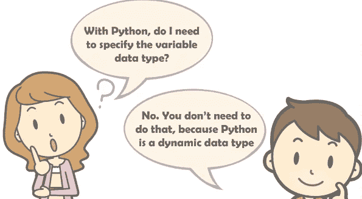
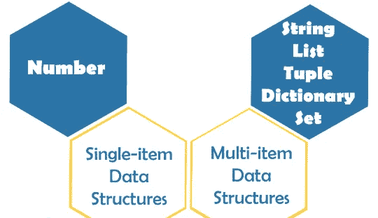
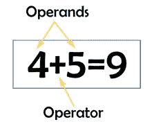

# 变量、数据结构和运算符简介:Python 完整教程—第 10 部分

> 原文：<https://blog.devgenius.io/10-introduction-to-variables-data-structures-and-operators-in-python-1d434a401f71?source=collection_archive---------16----------------------->

[https://www . hitalent . co/blog/2019/12/tech-jobs-python-programming-language-and-AWS-skills-demand-has-explosed](https://www.hitalent.co/blog/2019/12/tech-jobs-python-programming-language-and-aws-skills-demand-has-exploded)

**在我们开始之前，让我告诉你:**

*   这篇文章是 Python 完全初学者到专家课程
    的一部分，你可以在这里[找到它](https://medium.com/@samersallam92/python-complete-beginner-to-expert-course-f7626916df30)。
*   这篇文章在 YouTube 上也有视频[点击这里](https://www.youtube.com/watch?v=DQ_H0WWHzLs)。

[https://www.youtube.com/watch?v=DQ_H0WWHzLs](https://www.youtube.com/watch?v=DQ_H0WWHzLs)

## 介绍

在您学习了如何在 Python 中识别变量，以及如何在代码中添加注释之后。现在，是时候学习 Python 中支持哪些数据类型以及如何处理它们了。

**因此，本文将涵盖以下要点:**

1.  [变量](#99cf)
2.  [数据结构](#9d82)
3.  [Python 中可用的数据结构](#d0f1)
4.  [操作员](#88a3)
5.  [操作员详情](#c47b)

## **1。变量**

变量是内存中用于存储值的保留位置，值可以是任何类型，如 **integer** 、 **float** 、 **string** 或 Python 中任何其他支持的数据结构。

照片由 [Fredy Jacob](https://unsplash.com/@thefredyjacob?utm_source=unsplash&utm_medium=referral&utm_content=creditCopyText) 在 [Unsplash](https://unsplash.com/s/photos/memory?utm_source=unsplash&utm_medium=referral&utm_content=creditCopyText) 上拍摄

要知道 Python 是一个**动态数据类型**，意思是基于值的数据类型，解释器分配需要的内存空间，不需要变量数据类型的显式声明。此外，它不同于其他编程语言，例如 Java，在 Java 中，您必须显式指定变量数据类型。

作者图片

此外，请记住，您必须使用等号(=)为变量赋值，根据该值，解释器将理解该变量的类型。

现在让我们来谈谈数据结构。

## **2。数据结构**

它是一种特殊的变量格式，定义了如何处理变量本身。换句话说，如何在变量内部组织、处理、检索和存储数据。
在 Python 中，像任何其他编程语言一样，数据结构是为了安排数据以适合特定目的而设计的。**比如说**，

*   如果你想要一个数据结构来定义一个有序条目的集合，你必须使用一个 ***列表。***
*   如果你想让你的数据结构成为一个只读的内存，你必须使用一个元组。

> 如果您现在不熟悉 tuple 和 list，请不要担心，您将在以后的文章中详细了解这两种数据结构。😊

对于每个数据结构，都有一组被定义用来处理该数据结构的操作符**集合，并且一个操作符可以在多个数据结构之间通用，对于这些数据结构中的每一个，它可以有不同的工作。那么，Python 中有哪些可用的数据结构呢？**

## **3。Python 中可用的数据结构**

Python 主要支持六种主要的数据结构，分为两大类:

*   **单项数据结构**:当定义这些数据结构的一个变量时，它应该只有**一项**，就像一个**号**一样。
*   **多项数据结构**:在 Python 中也称为**集合**，如字符串、列表、元组、字典、集合等。所有这些数据结构**可能有不止一个条目**，参见图 1。

图 Python 中支持的数据结构(图片由作者提供)

现在，让我们继续讨论运营商。

[https://unsplash.com/photos/JLW-T4LiJCw](https://unsplash.com/photos/JLW-T4LiJCw)

## **4。操作员**

运算符是一种由符号表示的结构，它处理操作数的值以产生最终结果。

例如，考虑下面的表达式:

作者图片

在这个表达式中， **4** 和 **5** 是**操作数**，而**+**符号是**运算符**。这里算符的工作是 4 加 5，最后的结果是 9。

## **5。操作员详细信息:**

对于每个操作员，您必须了解一些细节，如:

1.  **操作数个数:**你要传递给这个操作符多少个操作数，才能正常工作。
2.  **操作数的数据类型:**每个操作数的数据类型。如果传递的数据类型不同于预期的类型，将会出现错误。
3.  **这个运算符如何工作:**比如一个运算符把一个数加到另一个数上，一个运算符把一个数从另一个数上减去，等等。
4.  **最终结果数据类型:**运算符一旦工作，就会给你一个结果。所以，你得知道这个结果的数据类型。

## 现在，让我们总结一下我们在这篇文章中学到的内容:

照片由[安 H](https://www.pexels.com/@ann-h-45017/) 在[像素](https://www.pexels.com/)上拍摄

在本文中，您已经了解到:

*   **变量**是存储器中的一个保留位置，用于存储数值。
*   **数据结构**是一种变量格式，在变量内部组织、处理、检索和存储数据。
*   **Python** 支持多种数据结构，这些数据结构分为单项数据结构和多项数据结构。
*   **单项**数据结构:数字。
*   多项数据结构:字符串、列表、元组、字典和集合。
*   **运算符**是一个用(符号)表示的构造，用来处理操作数。
*   **操作符细节:**操作数个数，操作数的数据类型，该操作符如何工作，以及最终结果数据类型。

***附言*** *:万分感谢您花时间阅读我的故事。在你离开之前，让我快速地提两点:*

*   *首先，要想直接在你的收件箱里看到我的帖子，请在这里订阅***，你可以在这里关注我***。***
*   ***第二，作家在媒介上制造了数以千计的****$****。为了无限制地访问媒体故事并开始赚钱，* [***现在就注册成为媒体会员***](https://medium.com/@samersallam92/membership)**其中* *每月只需花费 5 美元。通过此链接* *报名* [***，可以直接支持我，不需要你额外付费。***](https://medium.com/@samersallam92/membership)***

**

萨梅尔·萨拉姆** 

## **Python 初学者到专家的完整课程**

**[View list](https://medium.com/@samersallam92/list/python-complete-beginner-to-expert-course-32d3a941c05e?source=post_page-----1d434a401f71--------------------------------)****21 stories**************

**要回到上一篇文章，您可以使用以下链接:**

**[第 9 部分:Python 中的注释](https://medium.com/@samersallam92/9-comments-in-python-f8fed1dc9b88)**

**要阅读下一篇文章，您可以使用以下链接:**

**[第 11 部分:Python 数字](https://medium.com/@samersallam92/11-python-numbers-2ecb942ee525)**