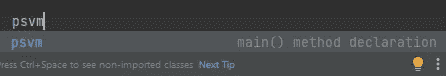
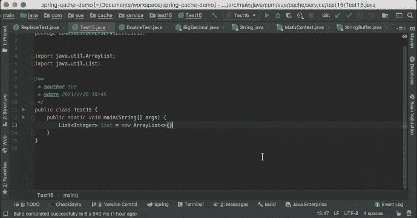
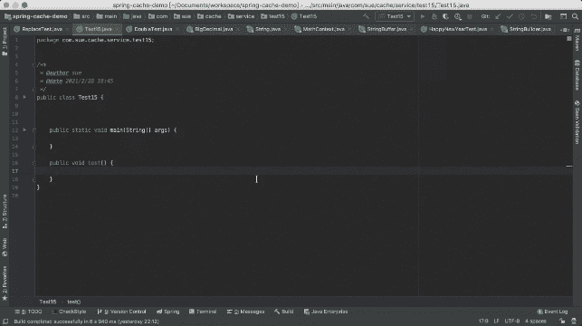

# IntelliJ IDEA 中的 10 个 Java 快捷方式

> 原文：<https://blog.devgenius.io/10-java-shortcuts-in-intellij-idea-5ee3a8caa02d?source=collection_archive---------2----------------------->

我上一篇关于我最喜欢的 5 个 IntelliJ 插件的文章得到了很好的反馈。

 [## 我最喜欢的 5 个 IntelliJ 插件可以提高你的工作效率

### IntelliJ 已经成为 2022 年 Java 开发中使用最多的 IDE。

blog.devgenius.io](/my-favorite-5-intellij-plugins-that-can-boost-your-productivity-b30ac73389ce) 

其实不仅仅是插件，IntelliJ IDEA 还提供了 Java 快捷方式，可以帮助我们提高开发效率。

## 1.通过 *psvm/main* 快速生成 main()方法

很多人都知道*主*命令可以帮助你创建一个*主*()方法。您也可以使用 *psvm* 命令来实现同样的目的。

## 2.快速 println()方法由 *sout* 生成

代替 *System.out.println* ，可以使用 *sout* 命令打印内容。

## 3.通过以下方式为新对象分配参数。定义变量

与 1 和 2 相比，这可能不太为人所知。其实可以用*。var* 快速赋值快捷键。

## 4.快速 for 循环通过。为

## 5.快速条件语句

对于条件语句中常见的布尔和字符串操作，以下是一些快捷方式示例:

*   *布尔值. if* - > if(布尔值)
*   *boolean.else* - > if(！布尔型)
*   *string . null*->if(string = = null)
*   *string . nn-*>if(string！=空)
*   *串开关* - >开关(串)

## 6.快速尝试…赶上了。尝试

## 7.快速铸造。卡斯特瓦尔

有时我不得不通过逐个输入类名和值来将一个对象转换为另一个对象。我不知道你可以通过*做到这一点。castvar* 直到最近。

## 8.属性的快速范围改变。领域

使用*，将局部变量提升到全局范围变得更加容易。字段*。

## 9.快速可选由定义。选择

## 10.快速 lambda 语句生成。希腊字母的第 11 个

我希望这篇文章对你有所帮助。

我是后端软件工程师。如果你渴望了解技术，请关注我的频道，了解我在日常工作和生活中获得的灵感。

> **获取连接:**
> [我的 LinkedIn](https://www.linkedin.com/in/daini-wang-5127b2182)
> 
> **图片来源:**
> 苏
> 
> **阅读更多:**

 [## IntelliJ 中的主调试

### 有一天我读到一个评论，我发现它既好笑又真实:

medium.com](https://medium.com/geekculture/master-debugging-in-intellij-9115d03f895a)  [## 我最喜欢的 5 个 IntelliJ 插件可以提高你的工作效率

### IntelliJ 已经成为 2022 年 Java 开发中使用最多的 IDE。

blog.devgenius.io](/my-favorite-5-intellij-plugins-that-can-boost-your-productivity-b30ac73389ce)  [## 系统设计面试需要知道的一个重要定理

### 当您在 Amazon 上下订单时，您的请求可能会由基于…的分布式计算机节点之一来处理

medium.com](https://medium.com/geekculture/a-important-theorem-to-know-for-system-design-interviews-9bceaa07daf2)