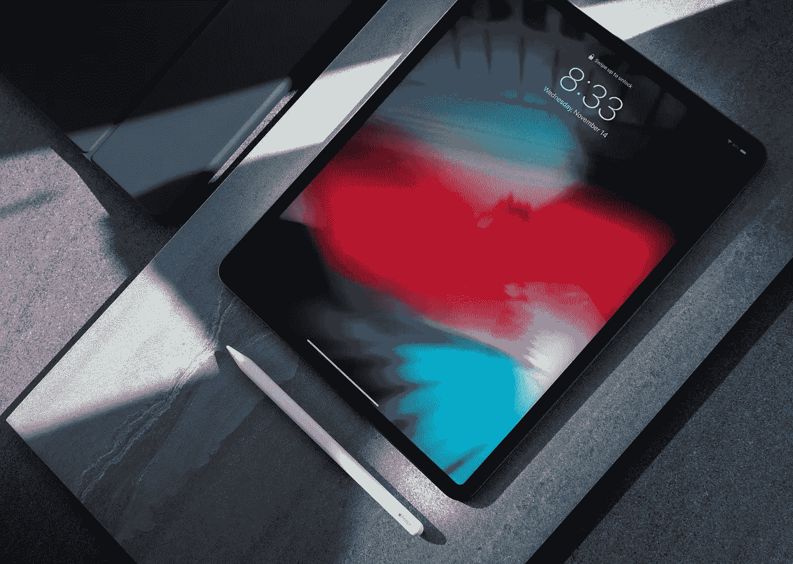

# 高管必备的 10 款 iPad 应用

> 原文：<https://blog.devgenius.io/10-must-have-ipad-apps-for-executives-5a26bbd8957d?source=collection_archive---------2----------------------->

## 无论是在家、在飞机上、在会议室还是在我的办公室工作，iPad 都是一个能提供我所需要的灵活性的工具。

[https://unsplash.com/photos/gYVNvRygCUw](https://unsplash.com/photos/gYVNvRygCUw)

人们经常问，“你怎么能那样工作呢”？答案是，我在 iPad 上掌握了 10 个应用，并尽可能自动化。这 10 款应用分别是(按顺序排列):

**选秀**

“草稿”提供了一种使用 iPad (iPhone 和 AppleWatch 也一样)的新方法，让你先写作，然后再考虑如何使用它。它可以超快地捕捉一切(输入或通过 Siri)，然后用强大的脚本操作(任何人都可以设置)处理它。

【https://apps.apple.com/ca/app/drafts/id1236254471 

**快捷键**

苹果的快捷方式应用程序帮助我自动化了许多日常事务。我用它来处理会议笔记，更新我的空闲状态，与我的团队分享信息，更新 Twitter，甚至汇总我的每日新闻。有这么多免费样品，我相信你会找到一个“捷径”！

[https://apps.apple.com/ca/app/shortcuts/id1462947752](https://apps.apple.com/ca/app/shortcuts/id1462947752)

**火花**

标准的 iOS 邮件应用程序非常出色。它在每个版本中都在改进，但仍然赶不上 Spark。从设置提醒到安排电子邮件，Spark 是必备的电子邮件工具！如果你和我一样，还在处理邮件，看看 Spark 吧。我喜欢这些模板、智能收件箱、搜索速度(苹果的原生应用在这方面很糟糕)、锁定消息、提醒、打盹消息、可定制的手势和第三方集成。

[https://apps . apple . com/ca/app/spark-email-app-by-readdle/id 997102246](https://apps.apple.com/ca/app/spark-email-app-by-readdle/id997102246)

**好笔记**

Apple Pencil + iPad Pro + GoodNotes =记笔记的 1–2–3 punch。使用 GoodNotes，我可以导入 pdf、网页和其他文本。我可以评论、标记、呈现、说明和捕捉一切。它是可搜索的(包括手写)，可以将手写笔记转换成文本(是的，最乱的写法)，还有一个 macOS 版本。这个应用程序取代了 Evernote 和 Apple Notes 应用程序！是必备的！

[https://apps.apple.com/ca/app/goodnotes-5/id1444383602](https://apps.apple.com/ca/app/goodnotes-5/id1444383602)

**松弛**

有懈怠就不需要办公室。当人们问我的办公室在哪里时，我通常会回答:“Slack。”我用它进行办公室间的交流、办公室公告、语音通话、视频通话等等。我已经为 Salesforce、Gmail、Calendar、Google Drive、Trello 等等设置了挂钩/集成。对我的公司和我来说都是不可或缺的。

[https://apps.apple.com/ca/app/slack/id618783545](https://apps.apple.com/ca/app/slack/id618783545)

**天马行空**

难以置信，这个名字说明了一切。这是 iOS 上最好的日历体验。自然语言输入、快速搜索、多日历支持、提醒集成、内置天气数据、today widget 和语音转文本功能使所有其他日历应用程序看起来都像玩具一样。我喜欢的一个功能是位置感知的定制视图——不同的日历集可以在多个位置和时间显示，偏好设置可以在我的所有设备(iPad、iPhone 和 Apple Watch)上同步

[https://apps . apple . com/ca/app/fantastic-calendar-tasks/id 718043190](https://apps.apple.com/ca/app/fantastical-calendar-tasks/id718043190)

**事情**

Things 不仅仅是一款提醒应用。如果你是 GTD 方法论的粉丝，那么 Things 就是适合你的应用。我喜欢它提供了我所需要的焦点和注意力，基于我当前的背景。它捕捉任务的速度快如闪电，总体表现优于苹果的提醒应用。当然，还有配套的 iPhone、watchOS 和 macOS 应用程序。

[https://apps.apple.com/ca/app/things-3-for-ipad/id904244226](https://apps.apple.com/ca/app/things-3-for-ipad/id904244226)

**第一天**

我发现写日记很有挑战性。第一天让它变得更容易接近。它捕捉位置、天气和其他关于你一天的数据，然后你添加内容。各种内容！图片、歌曲、文本、图画、推文、网站、音频注释等等。我有一本工作和个人日志。我喜欢反思生活两个方面的能力。我也很欣赏它所提供的“这一天”的记忆之旅。第一天已经把我的正念练习提升到了一个新的水平。

[https://apps.apple.com/ca/app/day-one-journal/id1044867788](https://apps.apple.com/ca/app/day-one-journal/id1044867788)

**卡铺**

CardHop 以一种有意义的方式改变了我的工作流程。它不仅捕捉联系信息的速度快如闪电(使用自然语言)，也是我向人们发送大部分信息的起点。它连接了我所有的服务，允许我从一个起点发送短信、iMessage、电子邮件、打电话、Slack 等等。

[https://apps.apple.com/ca/app/cardhop/id1448744070](https://apps.apple.com/ca/app/cardhop/id1448744070)

**1 密码**

拥有一个强而唯一的密码是保护您私人信息的第一步。1 密码使这成为可能。它在 iOS 上集成了全系统，有了 FaceID，很容易让一切都有密码保护。当然，它有一个 macOS 和 watchOS 配套应用程序。它还允许在整个团队中使用共享存储库，以确保合规性和安全性。

[https://apps . apple . com/ca/app/1 password-password-manager/id 568903335](https://apps.apple.com/ca/app/1password-password-manager/id568903335)

当然，这些应用程序中的每一个都可以单独成为一篇博客文章。如果你想看看我的一些工作流程，我很乐意做更深入的探讨。请在评论中给我留言。

记住，向日葵不会在阴凉处生长——JT