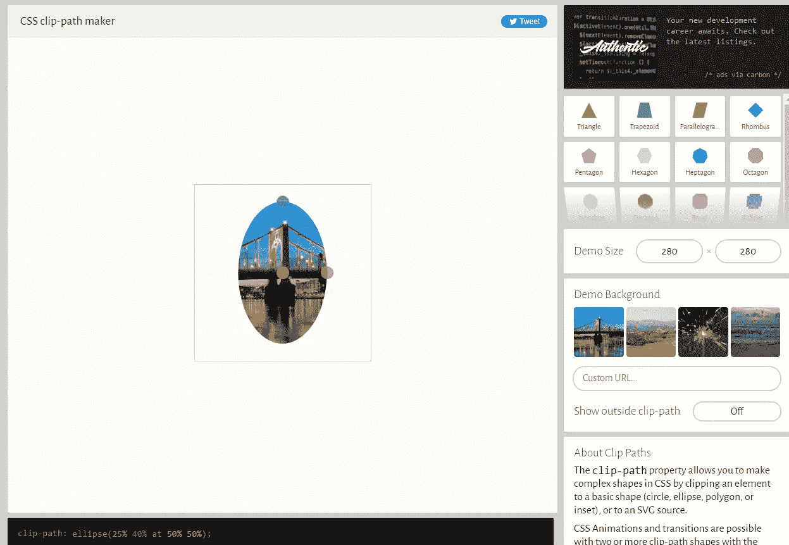

# 你可能不知道的 10 个强大的 CSS 属性

> 原文：<https://blog.devgenius.io/10-powerful-css-properties-that-you-probably-dont-know-1c0c3c2d9406?source=collection_archive---------0----------------------->

## 2022 年，作为一名 web 开发人员，你应该知道的有帮助的 CSS 属性列表。


照片由[穆罕默德·拉赫马尼](https://unsplash.com/@afgprogrammer?utm_source=medium&utm_medium=referral)在 [Unsplash](https://unsplash.com?utm_source=medium&utm_medium=referral) 上拍摄

如今，每个网站和 web 应用程序都需要大量的 CSS 代码来使事物在视觉上具有吸引力和独特性。当然，如果你不使用 CSS，你永远不可能有一个像样的网站设计让你脱颖而出。

CSS 是每个 web 开发人员的基本样式表语言。它有很多属性，用来改变网页的外观和样式。

因此，CSS 使我们能够轻松地设计网页样式，并使它们具有响应性。

在过去的几年里，CSS 有了很大的改进，新的有趣的特性也在不断地被引入。

CSS 现在提供了大量的新功能和属性，这将使你的项目编码变得更加容易。

这就是为什么在这篇文章中，我想与你分享一些强大的 CSS 属性，你应该知道作为一个开发人员。所以让我们开始吧。

# 1.属性用户选择

如果你想阻止用户高亮显示或选择网页上的文本，CSS 属性`user-select`会很有帮助。属性确定是否可以选择元素的文本。

如果您不希望用户从您的网站复制和粘贴文本，此属性非常有用。

下面是代码示例:

```
p{
 user-select: none;
}
```

# 2.物业位置-项目

CSS 属性`place-items`是 align-items 和 justify-items 属性的简称。它使得在 Flexbox 或 Grid 等布局系统中以两种方式(内嵌和块)对齐项目变得简单。

属性可以同时有两个值。但是，如果您只使用一个值，那么该值将被用作第二个值。

属性`place-items`可以有许多不同的值，包括中心、起点、终点、拉伸等等。

查看下面的代码示例:

```
div{
 place-items: center;
}
```

*结果:*


# 3.剪辑路径属性

属性非常有用和有趣，因为它允许我们使用 CSS 来设计各种复杂的形状(椭圆、多边形、圆形和更多不同的形状)。

属性允许您通过指定应显示元素的哪个部分来设计复杂的形状。剪辑路径可以有几个值，包括一个形状函数和一个剪辑源。关于该酒店的更多信息可在 [MDN 文档](https://developer.mozilla.org/en-US/docs/Web/CSS/clip-path)中找到。

下面是一个代码示例:

```
div{
 clip-path: ellipse(25% 40% at 50% 50%);
}
```

如果你想用属性 clip-path 快速生成复杂的形状，我强烈推荐使用 [clip-path-maker](https://bennettfeely.com/clippy/) 。



作者从 bennettfeely 获取的图像。

这个工具是完全免费的，允许您通过拖放元素来构建形状。当您完成创建形状时，该工具将为您生成 CSS 代码，您可以在您的代码中使用它。

# 4.CSS 属性对象适合

属性让你指定或者定义一个[的内容如何替换元素](https://developer.mozilla.org/en-US/docs/Web/CSS/Replaced_element) (IMG，视频等)。)应调整大小以适合其容器。

所有主流浏览器都支持该属性。它有以下可能值:*填充*、*包含*、*覆盖*、*缩小*、*无*。关于这些值的更多信息可在本 [MDN 页面](https://developer.mozilla.org/en-US/docs/Web/CSS/object-fit)中找到。

让我们看看下面的代码示例:

```
img{
 object-fit: cover;
}
```

上面的代码示例允许图像在填充指定尺寸时保持其纵横比。这就像是为了适应而对图像进行剪裁。

您可以查看下面的 Codepen 示例:

Iframe 作者来自 [Codepen](https://codepen.io/) (外链)。

# 5.混合模式属性

另一个很少被提及的有趣的 CSS 属性是`mix-blend-mode`。大多数 web 开发人员并不知道 CSS 的这一惊人特性。

CSS 中这个强大的属性指定并定义了元素的内容应该如何与父元素的内容和背景混合。

简单地说，它定义了一个元素与其后面的另一个元素的融合。

看看下面的代码示例:

```
.parent-element img{
  position: absolute;
}

.parent-element h1 { 
  mix-blend-mode: overlay;
}
```

请查看下面的 Codepen 示例以获得更多理解:

Iframe 作者来自 [Codepen](https://codepen.io/) (外链)。

# 6.属性背景混合模式

CSS 中另一个有趣的混合模式属性是`background-blend-mode`，它允许你在元素的背景图像和背景颜色之间指定和放置一种混合。

该属性带有几个值，如*正常*、*乘*、*屏幕*等等。它使您能够定义各种混合模式。

下面是一些例子，以便更好地理解:

*正常混合模式:*

```
.element{
 background: url("trees.png"), url("papers.png");
 background-blend-mode: normal;
}
```

*输出:*


该图像由作者捕获。

*叠加混合模式:*

```
.element{
 background: url("trees.png"), url("papers.png");
 background-blend-mode: overlay;
}
```

*输出*:


该图像由作者捕获。

# 7.属性调整大小

CSS 属性`resize`允许用户通过点击并拖动元素的右上角来调整网页上元素的大小。因此，它指定用户是否可以以及如何调整元素的大小。

这个很酷的属性经常用在像`textarea`这样的元素上，允许用户平滑地扩展文本区域来输入长格式文本。除此之外，它还可以用来调整任何元素的大小。

resize 属性有四个可能的值:

*   *垂直*:用户可以垂直调整元素的大小。
*   *水平*:用户可以水平调整元素大小。
*   *both* :该元素能够以两种方式缩放。
*   *无*:元素不可调整大小。

以下是此属性的代码示例:

```
textarea{
 resize: none;
}
```

# 8.背面可见度

在 CSS 中，backface-visibility 属性指定当面向用户时是否显示元素的背面。

当制作具有悬停效果的翻转卡时，通常会利用这一特性。它有两个可能的值:`visible`或`hidden`。

看看下面的代码示例:

```
.element{
 backface-visibility: hidden;
}
```

您可以查看下面的 Codepen 示例以了解更多信息:

Iframe 作者来自 [Codepen](https://codepen.io/) (外链)。

# 9.平滑滚动属性

如果你想在你的网页上有一个平滑的滚动功能，那么 CSS 中的属性`scroll-behavior`可以完成这项工作。

您所要做的就是使用标签`html`作为属性的选择器。然后给它赋值`smooth`。

下面是代码示例:

```
html{
 scroll-behavior: smooth;
}
```

单击下面代码栏中的链接，观察页面如何在各部分之间平滑滚动:

作者来自 [Codepen](https://codepen.io/) (外链)。

# 10.插入符号颜色属性

CSS 也可以用来改变文本输入中插入符号的颜色。您可以使用属性`caret-color`来实现这一点。

下面是代码示例:

```
input{
 caret-color: red;
}
```

*输出:*

Iframe 作者来自 Codepen。

# 结论

从上面的列表中可以看出，CSS 包含了许多有用的特性和属性，而许多开发人员并没有利用或意识不到这些特性和属性。你越了解 CSS，你就越意识到有多少东西需要学习。

所以 CSS 是一种很棒的样式表语言，它有许多强大的属性，可以使 web 在视觉上更具吸引力。我们只需要不断学习新事物来保持更新。

*感谢您阅读本文。此外，如果你觉得我的内容有用，而你不是一个媒体成员，你可以抓住你的媒体成员* [***这里***](https://mehdiouss.medium.com/membership) *(媒体推荐链接)获得无限制的访问媒体上的所有文章，并支持我们作为作家。*

[](https://mehdiouss.medium.com/membership) [## 通过我的推荐链接加入 Medium-Mehdi Aoussiad

### 阅读 Mehdi Aoussiad(以及媒体上成千上万的其他作家)的每一个故事。您的会员费直接支持…

mehdiouss.medium.com](https://mehdiouss.medium.com/membership) 

**延伸阅读:**

[](/5-awesome-projects-every-frontend-developer-should-build-in-2022-fbe2575f88aa) [## 每个前端开发者应该在 2022 年建设的 5 个令人敬畏的项目

### 前端开发人员提高技能的有用项目思路列表。

blog.devgenius.io](/5-awesome-projects-every-frontend-developer-should-build-in-2022-fbe2575f88aa) [](/7-useful-html-elements-that-nobody-is-talking-about-4b76ee877688) [## 没人谈论的 7 个有用的 HTML 元素

### 作为一名 web 开发人员，你应该知道的一系列很棒的 HTML 元素和标签。

blog.devgenius.io](/7-useful-html-elements-that-nobody-is-talking-about-4b76ee877688)