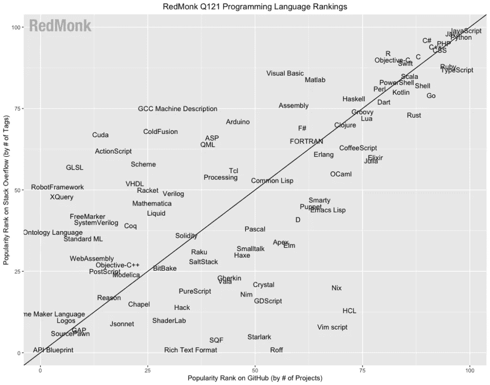
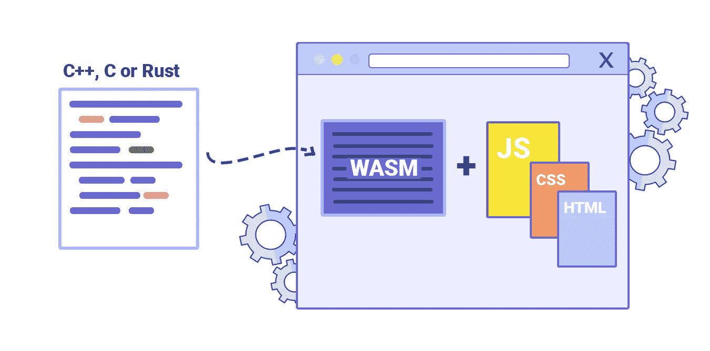
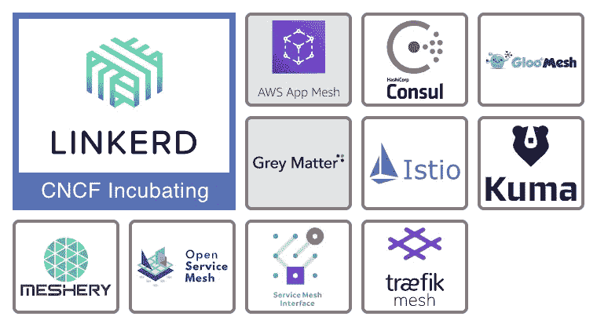

# 对 2021 年云原生的 10 个预测

> 原文：<https://blog.devgenius.io/10-predictions-for-cloud-native-in-2021-38796ad60bc3?source=collection_archive---------1----------------------->

谢丽尔·洪在 DevOps 大会上发表的主题演讲要点

由[马克西姆·霍普曼](https://unsplash.com/@nampoh?utm_source=medium&utm_medium=referral)在 [Unsplash](https://unsplash.com?utm_source=medium&utm_medium=referral) 上拍摄的照片

早在一月份，我写了一篇关于 2020 年 CNCF 年度报告的[摘要，总结了云计算原生计算基金会(CNCF)的关键更新。最近在 2021 年 DevOps 大会上，CNCF 生态系统副总裁 Cheryl Hung 给出了她对 2021 年云原生的预测。谢丽尔在 CNCF 的角色有着独特的视角，她监督 CNCF 的所有活动，并与积极构建或寻求迁移到云的贡献者和公司联系。在这篇文章中，我将简要回顾一下她的演讲，并补充一些我作为这个领域的工程师的想法。](https://yitaek.medium.com/recap-of-2020-cncf-annual-report-6be25166f99d)

# 科技趋势

谢丽尔在演讲开始时给出了对更广阔的科技空间的四个预测:

1.  **云原生多锈**
2.  **十字云变得(更)真实**
3.  **网络装配和 eBPF**
4.  **边缘上的 Kubernetes**

从生态系统的角度来看， [devstats.cncf.io](http://devstats.cncf.io/) 上列出的绝大多数云原生项目都是用 Go 编写的。有趣的是，作为一名每天使用 Kubernetes 的工程师，我使用的几乎所有工具都是用 Go 编写的，其中散布着一些 NodeJs/TypeScript 和 shell 脚本。然而，我已经看到了对 Rust 的极大兴趣和活动，尤其是在 Web 组装方面。

图片鸣谢:[https://red monk . com/sogrady/2021/03/01/language-rankings-1-21/](https://redmonk.com/sogrady/2021/03/01/language-rankings-1-21/)

尽管 JavaScript 在 web 开发中很受欢迎并占据主导地位，但大多数 web 开发人员都会同意，JS/CSS/HTML 的现状还有许多不足之处。流行的前端框架和越来越多的 TypeScript 的采用解决了这些缺点，但是 Web Assembly 允许那些强调类型安全的开发人员用 C++、C 或 Rust 编写代码，并在 Web 上为客户端和服务器应用程序部署这些代码。随着越来越多需要大量计算的应用(例如区块链/加密、游戏、3D 建模)转向云原生，我同意 Cheryl 关于 Rust 和 Web Assembly 的采用会增加的预测。

图片来源:[日志火箭](http://blog.logrocket.com/webassembly-how-and-why-559b7f96cd71/)

接下来，Cheryl 预测，我们将会看到更多的云计算部署。到目前为止，主要的云玩家都专注于迁移或支持混合云部署，以增加他们的总可寻址市场(例如[谷歌云 Anthos](https://cloud.google.com/anthos/) 、 [Azure Arc](https://azure.microsoft.com/en-us/services/azure-arc/) 和 [AWS 前哨](https://aws.amazon.com/outposts/))。但是，随着 Kubernetes 的全面采用以及云供应商的新产品促进跨云移动数据，我们将看到更多公司利用真正的多云部署进行灾难恢复，或者在选择不同供应商的特定产品时更加灵活(例如，使用 Azure 的 Digital Twins、Google AI 产品和 AWS Lambda)。我之前在“[为什么 BigQuery Omni 很重要](https://medium.com/dataseries/why-bigquery-omni-is-a-big-deal-e7e696b4cd60)”一文中提到了这一趋势:

 [## 为什么 BigQuery Omni 很重要

### 随着 Anthos 和 BigQuery Omni 的出现，谷歌云对开放平台的押注开始实现。

medium.com](https://medium.com/dataseries/why-bigquery-omni-is-a-big-deal-e7e696b4cd60) 

最后，谢丽尔分享了她对 Kubernetes on the edge 的积极看法。在演讲中，她还展示了美国空军在 F-16 喷气式飞机上运行 Kubernetes 和 Istio 的视频。从我个人在物联网领域的经验来看，我认为我们离大量采用 Kubernetes on the edge 还很远。我见过一些项目利用 k3s 或定制的 Kubernetes 裸机安装，但这里的阻碍因素不在计算层，而是延迟的协议推出(即 5G、LPWAN)和安全问题。

# DevOps 趋势

Cheryl 涉及的下一个类别是 DevOps:

1.  **GitOps 显著增长**
2.  **混沌工程实践**
3.  **FinOps 的崛起**

这里没有真正的惊喜。CI/CD 领域的大多数 CNCF 项目都非常倾向于 GitOps(如 Argo、Tekton)，混沌工程正成为可靠性工程团队的重要组成部分。Cheryl 在她的演讲中提到的有趣的一点是与服务网格集成的新混沌工程工具的兴起。我在“[Technologies&Tools to Watch in 2021](https://medium.com/dev-genius/technologies-tools-to-watch-in-2021-a216dfc30f25)”中写了各种混沌工程工具，包括 Litmus、chaoskube、kube-monkey 和 PowerfulSeal，但我将在未来测试[混沌网格](https://chaos-mesh.org/)。

最后，关于 FinOps 的话题，我认为它将与开发过程更紧密地结合在一起，就像安全性以 DevSecOps 的形式融入 DevOps 过程一样。目前，云支出大多是不透明的，“FinOps”涵盖了添加阈值、警报和仪表板等简单操作。我见过许多团队在将他们的架构设计为 HA 之后，或者从一个未终止的负载测试工作的数据库调用中获得一笔巨额账单，而被跨区域的入口/出口费用弄得焦头烂额。为了补充谢丽尔的预测，我认为 FinOps 将演变为预先生成计算的云成本，并与 ML 系统集成以实现智能警报和缓解。

 [## 2021 年值得关注的技术和工具

### 为开发运维工程师和 sre 评估的技术意见列表

medium.com](https://medium.com/dev-genius/technologies-tools-to-watch-in-2021-a216dfc30f25) 

# 生态系统趋势

谢丽尔以生态系统的总体趋势结束了她的演讲:

1.  **可插拔开发者和运营商体验**
2.  **服务网状整合**
3.  **终端用户驱动的开源**

演讲的这一部分强调的工具是[后台](https://backstage.io/)，Spotify 捐赠的一个开放平台，用于构建开发者门户。Backstage 是一个可插拔的门户网站，带有针对常见开发人员需求的预建小部件，如指标、CI/CD 状态、警报、云成本和文档。我个人很高兴能在后台进行尝试，并将我们的一系列内部工具整合到一个单独的开发人员门户。

在服务网格整合的话题上，Cheryl 没有宣布 Istio 是赢家，但从我的角度来看，来自 Google、Lyft 和 RedHat 的行业支持已经推动 Istio 成为与 Kubernetes 合作良好的首选服务网格实现。

图片来源: [CNCF 风景](https://landscape.cncf.io/)

# 结论

去年，微软首席执行官分享说，由于疫情，世界被迫转向在线，世界在两个月内经历了“两年的数字转型”。云原生空间的发展势头依然强劲，Cheryl 的预测证明了这一点。