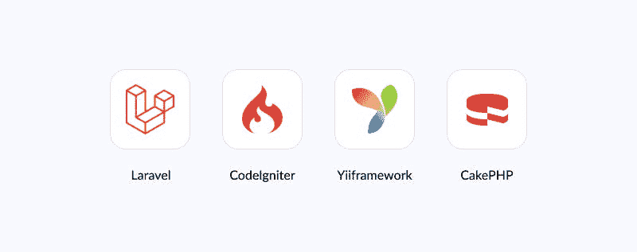

# PHP 最适合创业公司的 10 个理由！

> 原文：<https://blog.devgenius.io/10-reasons-why-php-is-best-for-startups-f45362350ad9?source=collection_archive---------7----------------------->

在这个竞争激烈的数字时代，大多数初创公司更喜欢与最好的技术团队合作，以取得成功并领先于竞争对手。

PHP 是使用最广泛的语言之一，它不断地改变着 IT 行业。它是一种服务器端脚本语言，允许软件开发人员创建动态、高质量的网站，使其成为最好的 web 开发语言之一。

无论你是刚刚起步还是正在考虑发展你的业务，这里有十个 PHP 最适合创业的理由！

## **PHP 给创业企业带来的好处**

PHP 为各种规模的企业提供了许多好处，包括希望从头开始建立网站的初创公司，而不必投资昂贵的软件或开发人员。PHP 还可以有效地管理和更新现有的网站，节省时间和金钱。无论你是在建立你的第一个网站还是重新启动它，这里有 10 个 PHP 非常适合创业的理由。

## **PHP 开源&性价比高**

PHP 最好的特性之一是它是一种开源编程语言。开发人员可以对语言做出贡献并做出自己的改变。简而言之，PHP 将不断发展以满足您的需求和愿望。

这意味着你不必担心支付许可费，可以自由地使用它。

*也可以阅读:* [*对于 Web 项目来说，PHP 比它的其他替代品好得多*](https://www.valuecoders.com/blog/technology-and-apps/how-is-php-better-than-its-other-alternatives-for-web-projects/)

## **PHP 遍布网络**

目前，超过 79%的网站运行在 PHP 上。它表明 PHP 在许多现代 web 开发项目中扮演着重要的角色，并且会一直更新。

因此，对于那些不愿意冒险经营业务的初创公司来说，使用 PHP 是一个福音。

随着支持 PHP 的开发人员和公司社区的不断扩大，可以肯定的是，这种语言一直在不断发展。对于一个创业企业来说，PHP 允许你从庞大的 PHP 生态系统中构建，并利用许多内置工具。

## **PHP 非常适合快速开发**

PHP 是初创公司的绝佳选择，因为它易于启动并快速发展。您不仅可以使用 PHP 来构建后端功能，而且大量的框架将帮助您从头构建整个网站。

当你刚刚起步，需要更多的时间或资源来[雇佣专门的开发团队](https://www.valuecoders.com/dedicated-development-teams)时，会更容易发展你的想法。

你可能会觉得这很有趣: [*雇佣专门的开发团队——小时工资、技能等等。完全指南！*](https://www.valuecoders.com/blog/technology-and-apps/hire-dedicated-development-team/)

## **PHP 很好用**

PHP 易于使用的特性使其非常适合初创企业。易用性可以归因于它不需要太多的配置，不像其他语言如 Ruby 或 Python。

与不同的编程语言相比，代码行更少，您可以在几个小时内开始构建您的网站，而不是几天或几周！此外，作为一种开源语言，意味着有大量资源可以帮助您解决任何编程问题。

如果你正在寻找一种流行的编程语言，可以让你尽可能快地成长，这可能就是你要找的！

## **PHP 快速&安全**

表明 PHP 最适合创业的一个特征是它的速度。这种语言对资源非常有效，因此，它是当今最快的语言之一。

在特定任务上，PHP 甚至比 Python 和 Ruby 运行得更快。此外，它还是一种安全的语言，因为与 Perl 或 JavaScript 等其他脚本语言相比，它的安全漏洞更少。

如果你想为你的创业建立一个有效的网站，你可以[雇佣有合适技能和经验的 php 开发人员](https://www.valuecoders.com/hire-developers/hire-angularjs-developers)。

## **PHP 有一个标准库**

PHP 中有许多库可以帮助你创建一个原型或 MVP 来测试你的想法。这意味着您可以找到完美的库，并在您的项目中使用它，而不必搜索或花费数小时试图弄清楚它是如何工作的。

此外，如果您需要这些库的帮助，您可以在网上找到教程和其他资源。你将能够从几行代码开始，最终得到一个可以在应用商店展示的应用。

您可以使用像 Codeigniter 或 Laravel 这样的框架，通过内置函数和模板使事情变得更简单。

在这些工具的帮助下，创业用户节省了时间和金钱。因此，使用 PHP 是值得的。

## **PHP 节省时间**

PHP 的另一个好处是节省时间，因为它是一种比其他语言如 Java 或 C++更快的编程语言。

今天，时间和金钱是企业家最重要的两个因素。如上所述，PHP 不仅能为你省钱，还能节省你的时间。作为一种面向对象的语言，开发人员可以在需要时重用 PHP 代码。

因此，使用 PHP 的可重用组件和代码可以节省时间和精力。WordPress、Joomla、Laravel、Symfony 和 CodeIgniter 是流行的基于 PHP 的 web 框架。

这些框架中的大多数简化了开发并节省了时间。

## **PHP 有广泛的托管选项**

创业的一个重要部分是选择正确的虚拟主机公司。许多主机选项可以满足您的需求，所以在您做出决定之前进行研究是有好处的。

您可以找到一台包含您需要的所有功能或少数功能的主机。此外，有不同价格范围的主机，以适应任何预算。

一些 PHP 托管提供商包括 Bluehost、HostPapa、HostGator、iPage、SiteGround、DreamHost 等。

*必读:* [*PHP 指南:关于 PHP 你应该知道的至关重要的事情*](https://www.valuecoders.com/blog/technology-and-apps/php-guide-vital-things-you-should-know-about-php/)

## **PHP 运行在多个平台上**

PHP 非常适合创业公司的一个原因是它的多功能性。PHP 可以在各种平台上使用，这意味着你可以在 Windows、Mac OSX、Linux 和 Unix 上创建你的网站或应用程序。

你的创业不需要购买不同操作系统的电脑来完成这项工作！

如果你正在创业，在确定什么最适合你的商业环境之前，你不需要在硬件上花太多钱。

## **PHP 是可扩展的**

PHP 是一种高度可扩展的编程语言，允许您轻松地管理重要的流量或处理。可扩展性是创业企业的关键。这将使他们成长，并跟上他们的竞争。

根据您的业务需求，您可以对代码进行更改，而不会影响程序的其他部分。这意味着如果你需要在一个地方改变一个函数或脚本，它不会破坏你网站上的其他东西。

此外，您可以添加功能和新特性，而无需更改网站上的任何其他内容。

# **2023 年最佳 PHP 框架选择&超越**

以下是四个最受欢迎的 PHP 框架，你可以考虑用于你的创业:

*   拉勒韦尔
*   代码点火器
*   CakePHP
*   Yii

然而，所有的框架都是建立网站的最佳选择，但 Laravel 是全球最受欢迎的。如果你不精通所有这些框架，你可以联系 php web 应用开发公司来为你的创业公司获得快速的商业解决方案。

*你可能会觉得这很有趣:* [*排名前 21 的 PHP Web App 开发公司*](https://www.valuecoders.com/blog/outsourcing-and-off-shoring/top-php-web-development-companies/)

# **最后的话！**

PHP 的流行和广泛的可用性使它成为初创公司的绝佳选择。它是轻量级的，容易学习，所以你可以花更少的时间学习 PHP 的基础知识，而有更多的时间来建立你的创业。

PHP 提供了许多框架和开发工具，这使得它成为创业公司的安全赌注。

毫无疑问，我们应该将 PHP 纳入您的语言候选名单，以考虑您的技术堆栈。

如果你在开发网站时遇到任何困难，你可以找一家领先的 PHP web 开发公司来构建最佳的商业解决方案。