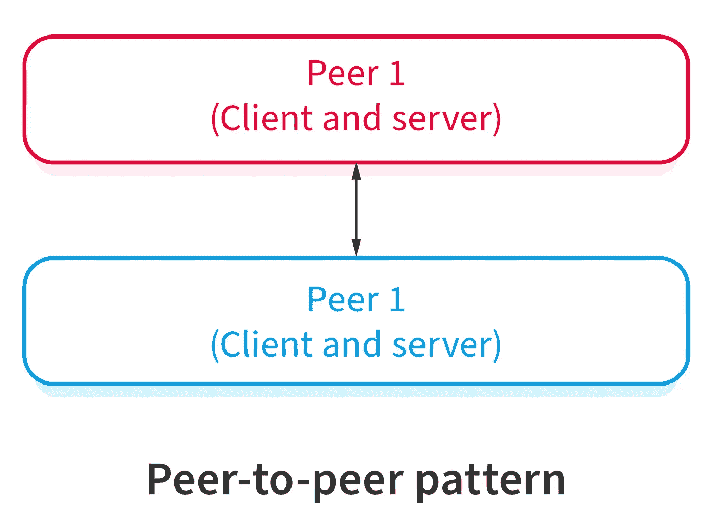

# 企业软件开发中的 10 种软件架构模式

> 原文：<https://blog.devgenius.io/10-software-architecture-patterns-in-enterprise-software-development-fabacb5ed0c8?source=collection_archive---------0----------------------->

如果你喜欢这篇文章，请鼓掌并分享

1.  **分层架构**

*   每一层都向下一个高层提供服务。每一层都是抽象的。
*   **表示层** (UI 层)
*   **应用层**(服务层)
*   **业务逻辑层**(领域层)
*   **数据访问层**(持久层)

**现实生活中的应用**

*   电子商务 web 应用程序
*   通用桌面应用程序

**2。客户端-服务器架构**

*   由一台服务器+多个客户端组成
*   服务器向多个客户端提供服务。
*   客户请求特定的服务，服务器将提供相关的服务

**现实生活中的应用**

*   银行业务
*   电子邮件

**3。主从架构**

*   主组件将在相同的从组件之间分配工作，并从从组件返回的结果中计算出最终结果

**现实生活中的应用**

*   在数据库复制中，主数据库被视为权威来源，从数据库与主数据库同步
*   计算机体系结构中连接到总线的外围设备

**4。管道过滤器架构**

*   数据将被处理、过滤并通过管道传递。它用于缓冲或同步目的。

**现实生活中的应用**

*   一种编译器，包括词法分析、语法分析、语义分析和代码生成
*   生物信息学的工作流程

**5。代理架构**

*   分布式系统将分离组件
*   代理组件协调服务器之间的通信
*   客户端向代理请求服务，代理将请求重定向到相关的服务器，以从其注册中心触发合适的服务

**现实生活中的应用**

*   Apache ActiveMQ
*   阿帕奇卡夫卡
*   兔子 q
*   JBoss 消息传递

6。点对点模式

*   对等体可以充当客户端或服务器或两者兼而有之，它根据角色随时间动态变化
*   对等体可以向其他对等体请求服务。

**现实生活中的应用**

*   文件共享网络(Gnutella 和 G2)
*   多媒体协议(P2PTV 和 PDTP)
*   基于加密货币的硬币(比特币和区块链)

 [## Gnutella -维基百科

### Gnutella 是一种对等网络协议。成立于 2000 年，它是第一个分散的点对点网络…

en.wikipedia.org](https://en.wikipedia.org/wiki/Gnutella)  [## Gnutella2 -维基百科

### Gnutella2 通常被称为 G2，是一种主要由迈克尔·斯托克斯开发并于 2002 年发布的对等协议…

en.wikipedia.org](https://en.wikipedia.org/wiki/Gnutella2)  [## P2PTV -维基百科

### P2PTV 指的是点对点(P2P)软件应用程序，用于在 P2P 网络上实时重新分发视频流

en.wikipedia.org](https://en.wikipedia.org/wiki/P2PTV)  [## 对等分布式传输协议-维基百科

### 对等分布式传输协议是一种互联网文件传输协议，用于从中央…

en.wikipedia.org](https://en.wikipedia.org/wiki/Peer_Distributed_Transfer_Protocol)  [## 比特币——开源 P2P 货币

### 比特币是一种创新的支付网络，也是一种新的货币。找到您需要知道的一切，并开始…

bitcoin.org](https://bitcoin.org/en/)  [## Blockchain.com-最值得信赖的加密公司

### 立即用信用卡、借记卡或通过链接您的银行购买比特币。用加密和…

www.blockchain.com](https://www.blockchain.com/) 

**7。事件总线架构**

*   4 个主要组件:事件源、事件侦听器、通道和事件总线
*   源通过事件总线向特定通道发布消息
*   听众订阅特定的频道
*   当发布者发布一些消息时，监听器会收到消息通知

**现实生活中的应用**

*   Android 开发
*   Azure DevOps
*   通知服务

**8。模型-视图控制器架构**

*   **MVC 模式**
*   **模型** —包含核心功能和数据(业务逻辑)
    **视图** —向用户显示信息
    **控制器** —处理来自用户的输入

**现实生活中的应用**

*   Web 框架(Django 和 Rails)
*   许多编程语言(C #)

**9。黑板架构**

*   对没有确定性解决方案有好处
*   **黑板** —用于输入
    **知识源**的结构化对象—具有自己的业务逻辑
    **控制组件**的模块—选择、配置和执行模块
*   新的数据对象被添加到黑板上

**现实生活中的应用**

*   蛋白质结构鉴定
*   语音识别
*   车辆识别和跟踪
*   声纳信号解释。

**10。解释器架构**

*   解释用专用语言编写的程序
*   评估程序行

**现实生活中的应用**

*   数据库查询语言(SQL)
*   与语言相关的通信协议

## **每种架构的优缺点**

# **参考文献**

 [## 简而言之，10 种常见的软件架构模式

### 想知道大型企业级系统是如何设计的吗？在主要软件开发开始之前，我们必须…

towardsdatascience.com](https://towardsdatascience.com/10-common-software-architectural-patterns-in-a-nutshell-a0b47a1e9013)  [## 10 个最常见的软件架构模式

### 你是一个计划推出你的 IT 应用程序的企业家吗？或者，您是一名企业 IT 经理，负责…

nix-united.com](https://nix-united.com/blog/10-common-software-architectural-patterns-part-1/) 

如果你发现我的任何文章有帮助或有用，那么请考虑给我一杯咖啡，帮助支持我的工作或给我赞助😊·通过使用和

[**帕特里翁**](https://www.patreon.com/jinlowmedium)

【Ko-fi.com】T5[T6](https://ko-fi.com/jinlowmedium)

[**buymeacoffee**](https://www.buymeacoffee.com/jinlowmedium)

*最后但同样重要的一点是，如果您还不是灵媒会员，并打算成为灵媒会员，我恳请您通过以下链接成为灵媒会员。我将收取你的一部分会员费，不增加你的额外费用。*

 [## 用我的引荐链接-金加入 Medium

### 作为一个媒体会员，你的会员费的一部分会给你阅读的作家，你可以完全接触到每一个故事…

jinlow.medium.com](https://jinlow.medium.com/membership)