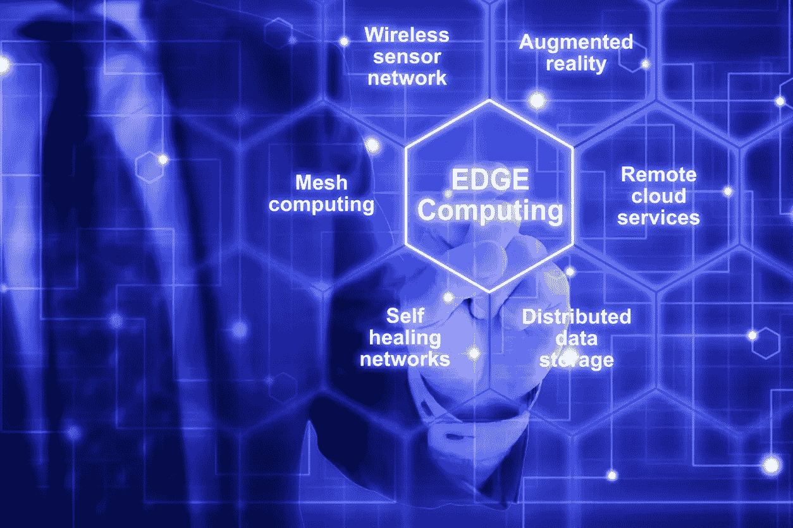

# 将在 2020 年影响我们生活的 10 大技术趋势

> 原文：<https://blog.devgenius.io/10-technology-trends-that-will-impact-our-lives-in-2020-9a358d590855?source=collection_archive---------37----------------------->

智能技术进入了每一个商业和消费领域。2020 年及以后的重点将是通过[数字化转型](http://entradasoft.com/blogs/10-technology-trends-that-will-impact-our-lives-in-2020)、安全卫生和数据驱动动态使业务更加智能。这项技术已经改变了我们的生活和工作方式。物联网服务正在塑造金融、物流、零售和医疗保健。[物联网解决方案提供商](http://entradasoft.com/blogs/10-technology-trends-that-will-impact-our-lives-in-2020)在传感器、网络通信、应用和物联网云领域创造创新的公司，将比那些没有投资于物联网解决方案来解决日常问题的公司获得持久的竞争优势。

全文:[http://entradasoft . com/blogs/10-将影响我们 2020 年生活的技术趋势](http://entradasoft.com/blogs/10-technology-trends-that-will-impact-our-lives-in-2020)

## **预测 IOT 未来的 10 大趋势**

## 人工智能

充分利用数据，甚至在基本层面上理解现代基础设施如何运作，都需要通过人工智能得到计算机的帮助。包括亚马逊、微软和谷歌在内的主要云供应商越来越多地寻求基于其人工智能能力进行竞争。人工智能是理解这些天收集的大量数据并增加其商业价值所需的基本成分。AI 将在以下领域帮助物联网数据分析:数据准备、数据发现、流数据的可视化、数据的时间序列准确性、预测和高级分析。

## 语音用户界面(VUI)

[语音用户界面](http://entradasoft.com/blogs/10-technology-trends-that-will-impact-our-lives-in-2020) (VUIs)允许用户通过语音命令与系统进行交互。虚拟助手，如 Siri、谷歌助手和 Alexa，都是 vui 的例子。VUI 的主要优势在于它允许用户不用手、不用眼睛就能与产品互动，同时将注意力集中在其他地方。发出命令和接收结果的设备不仅会在家庭和企业中变得普遍，也会在汽车和可穿戴设备中变得普遍。

## **自动化到超自动化**

[超自动化](http://entradasoft.com/blogs/10-technology-trends-that-will-impact-our-lives-in-2020)将包括机器人流程自动化(RPA)和智能业务流程管理套件，集成人工智能工具来管理业务流程。允许企业直观地了解职能、流程和关键绩效指标将如何相互作用以推动价值。这将提供有关组织的持续情报，并推动业务机会。以销售和营销职能为例，在这方面自动化已经相当成熟。在营销领域，高度自动化将推动个性化的客户互动。另一方面，在销售中，超自动化客户关系管理(CRMs)的使用将使组织能够预测潜在的消费者，从而获得理想的销售结果。

## **边缘是下一波 AI**

[边缘计算](http://entradasoft.com/blogs/10-technology-trends-that-will-impact-our-lives-in-2020)提供了将人工智能数据转化为几乎所有行业的实时价值的机会。智能边缘是人工智能技术发展和成功的下一个阶段。

随着人工智能和机器学习(ML)的采用率上升，以算法形式处理大量数据以用于计算目的的能力变得越来越重要。为了使跨越数十亿台互联设备的数据应用程序的使用更加高效和有价值，将处理从集中式第三方云服务器迁移到分散和本地化的设备上处理(通常称为边缘计算)的势头越来越强。

## 数字孪生技术

通过使用它，组织可以清楚地了解他们的物联网设备如何与制造流程互动。这使得敏锐的企业能够洞察其机器的生命周期如何运行，并允许他们提前预测可能需要的变化。工业物联网通过数据集成和分析带来了更高的效率和生产力，这种方式在没有互联制造流程的情况下是不可能的。

## 使用区块链的安全性

[设备和物联网网络](http://entradasoft.com/blogs/10-technology-trends-that-will-impact-our-lives-in-2020)黑客攻击将在 2020 年变得司空见惯。物联网目前的集中式架构是物联网网络脆弱性的主要原因之一。随着数十亿设备的连接以及更多设备的加入，物联网成为网络攻击的一大目标，这使得安全性变得极其重要。

[区块链](http://entradasoft.com/blogs/10-technology-trends-that-will-impact-our-lives-in-2020)为[物联网安全](https://www.bbvaopenmind.com/en/technology/digital-world/securing-the-internet-of-things-iot-with-blockchain/)带来新希望，原因有几个。首先，区块链是公开的，参与区块链网络的节点网络的每个人都可以看到存储的块和交易，并批准它们，尽管用户仍然可以有私人密钥来控制交易。第二，区块链是分散的，所以没有一个单一的权力机构可以批准交易，消除单点故障(SPOF)的弱点。第三，也是最重要的，它是安全的，数据库只能扩展，以前的记录不能改变。

## **区块链的未来应用**

*   反盗版中的区块链
*   确保公共选举
*   透明博彩
*   群体机器人
*   资产令牌化
*   区块链即服务(BaaS)

## 全球 5G 采用火箭速度

有了 5G 超级动力网速在手，您将享受零延迟和更少的加载时间。像 Version 和三星这样的大公司已经准备好推出 5G 嵌入式芯片。,

5G 技术像 AR/VR 和游戏区一样改变了整个领域。

*   到 2024 年，5G 技术将占据全球市场的 40%以上
*   管理 25%的移动数据流量
*   5G 连接不仅仅局限于无线技术，而且即将到来
*   预计到 2024 年底，5G 移动用户将达到 50 亿

## **用于决策的高级增强分析**

组织需要继续发掘隐藏在数据中的洞察力，以实现蓬勃发展。[商业智能](http://entradasoft.com/blogs/10-technology-trends-that-will-impact-our-lives-in-2020)和相关分析在过去二十年中发生了转变，并将在未来继续推动业务发展。在下一波[增强分析](http://entradasoft.com/blogs/10-technology-trends-that-will-impact-our-lives-in-2020)中，AI — ML 和 NLP 将扮演主要角色。分析将沉浸在机器学习中，并与 NLP 相结合，以推进整个分析生命周期-智能数据发现，跨生态系统的个性化和可共享的见解。

## **互联云的兴起**

预计到 2022 年，90%的全球组织将使用云技术服务。互联云具有简化运营、提高可靠性和可用性以及经济高效的运营等优势，将成为云计算的下一个突破。2020 年，组织将开始重组其分布式云基础设施，以支持对等云服务的运营。凭借低成本高扩展性的承诺，这种颠覆将特别适合中小型企业。有了公平的竞争环境，中小型企业将能够在更短的部署时间内测试新技术，提高市场渗透率，优化资源，并获得最大回报。

## DIY AI

人工智能需求很大，但由于人工智能人才和技能严重短缺，无法为生产建设和培训现代人工智能，这一需求受到了阻碍。具有自动机器学习功能的人工智能平台将变得越来越受欢迎，因为它们提供了方便的用户界面，使非专家也可以使用人工智能。这将帮助更多的人和组织开发自己的 AI 技术。前景是，普通商业用户将能够在没有专家帮助的情况下使用人工智能，而是通过人工智能进行自我训练。

未来，物联网在推动经济增长方面只会变得更加重要

阅读更多:[http://entradasoft . com/blogs/10-将影响我们 2020 年生活的技术趋势](http://entradasoft.com/blogs/10-technology-trends-that-will-impact-our-lives-in-2020)