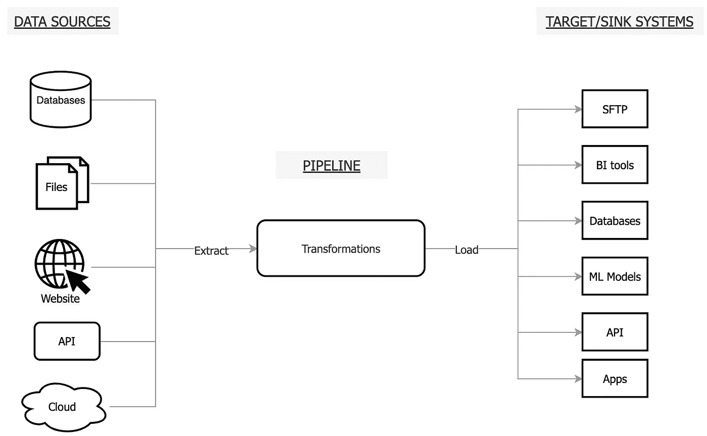
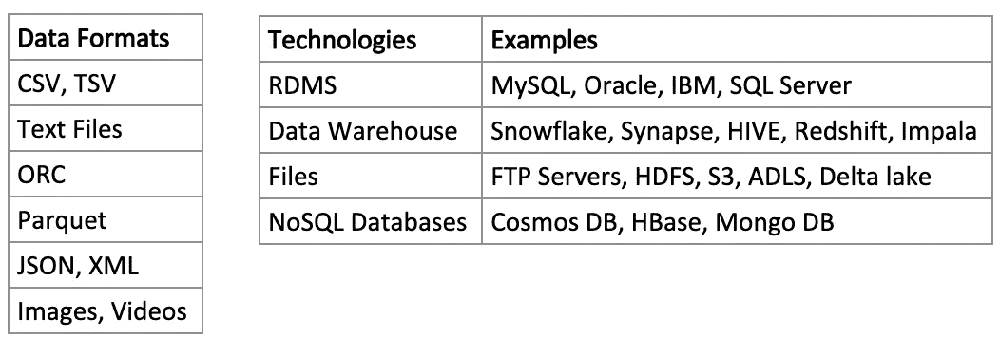
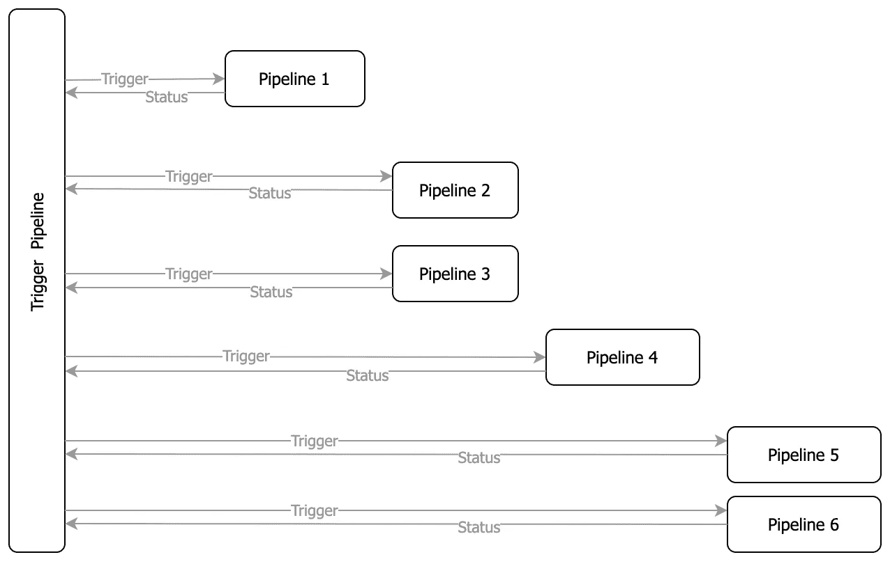

# 构建 ETL 管道之前要知道的 10 件事

> 原文：<https://blog.devgenius.io/10-things-to-know-before-building-etl-pipelines-169e267861f9?source=collection_archive---------7----------------------->


想象你正在建造一座建筑，如果不了解布局、可用材料和计划/进度，你就无法完成这项工作。构建 ETL 管道也不例外。理解基本原理被低估了，但在构建任何东西时都是至关重要的。

作为 ETL 管道开发人员，理解您正在工作的 ETL 框架的组件是很重要的。有时，您会有机会从头开始设计框架或增强现有的框架。

注意:除了 ETL 之外，数据还可以以 ELT 的方式进行处理，在这种方式下，数据被提取并直接加载到目标系统中，然后进行转换。云数据仓库正在涌现出支持大数据的 ELT 特性和扩展功能。本文将探索 ETL 过程，其中大部分也可以应用于 ELT 管道。

# 1.体系结构

下面是所有 ETL 管道的高级架构。



**数据源**是数据的生产者。您从中提取数据的所有系统都是您的数据源。在现实世界中，数据源是不同的。它们可能因数据类型、技术、可用性等而异。

*数据源通常被称为 sor。(记录的来源)但是请记住，您的数据源可能是也可能不是记录的实际来源。它们可以在 SORs 之上一层。*

**管道**是 ETL 架构的关键。这是举重发生的地方。您需要的转换取决于您的项目需求。数据转换的简单例子有，

*   转换数据类型。示例:日期存储为字符串，Date _ str = " 2022–07–16 "转换为日期时间格式 formatted _ Date = 2022–07–16 11:51:4。日期差异和其他日期函数不能在 date_str 上执行。
*   更改属性名称。
*   合并或拆分列。
*   根据需要创建新列。示例:从出生日期列计算和创建年龄。
*   数据混淆:如果你在一个处理安全数据的行业工作，你可能必须为了安全的目的混淆/掩盖数据。

注意:有时术语“属性”和“列”可以互换使用。

**接收或目标系统**是你发送数据的地方。这些系统是转换数据的消费者。您必须以这样一种方式转换数据，即数据可以很容易地被接收系统使用。例如:如果源系统中的数据是行列格式的，而目标系统是 NoSQL 数据库，那么您必须在管道中将数据转换成 JSON 格式。

# 2.数据格式和技术

数据源和目标系统中的数据可以以各种格式和系统存储。



有太多的工具和技术可以用来建造管道。一些跨行业使用的通用技术有 Spark、Databricks、Azure Data Factory、DBT、Informatica、AWS Glue 等..开发人员可能还需要熟悉 Python、Scala、SQL、Shell 脚本等。来开发管道。

# 3.数据管道的类型

管道根据其处理技术分为实时(流)和批处理。

*   批处理管道根据定义的节奏(如每小时/每天等)处理大量数据。当需要处理大数据和执行复杂转换时，以及当数据新鲜度不重要时，开发这些类型的管道。
*   实时管道被设计成在数据产生并被传递到目标系统时立即处理数据，因此，它能够处理的数据量是最小的，但是数据应该被即时处理。建立这些管道的能力取决于 sor 是否能够发送实时流。

有时，这些管道中使用的技术不同。实时管道通常需要一个发布-订阅消息系统，如[卡夫卡](https://kafka.apache.org/)、[事件中心](https://azure.microsoft.com/en-us/services/event-hubs/)等。像 [Databricks](https://databricks.com/) 这样的技术可以用来处理实时和批量数据。

# 4.数据加载的类型

管道的最终目标是从源系统获取数据，并将数据传送到目标系统。有多种方法可以实现这一点。首先，我们必须确定用例所需的数据元素/属性，并以下列方式之一加载这些数据属性，

*   *初始加载*
    当开发一个管道时，管道的第一次运行将总是针对历史数据，直到 CURRENT_DATE。数据的第一次加载通常被称为“初始加载”。
*   *增量加载*
    如果您的数据源维护哪些元素发生了变化的元数据(如日期)，我们可以开发一个管道来提取增量/增量数据，将其转换并加载到目标系统中。增量流水线应该考虑，
    **插入* —如果数据元素是新的，即不存在于目标系统中
    * *更新* —如果数据元素存在于目标系统中并且在中有变化。一个或多个属性)
    * *删除/关闭* *记录* —如果数据元素过期或不再需要
    您必须根据需求审查和实施 SCDs(渐变维度)。这是一篇很棒的[文章](https://towardsdatascience.com/data-analysts-primer-to-slowly-changing-dimensions-d087c8327e08)，解释了所有类型以及何时使用它们。
*   *满载*
    有时，您必须构建一个管道来提取 SOR 中的全部数据。在这些情况下，数据通常会在目标系统中被覆盖。如果识别数据源中已更改的记录非常昂贵或不可能，或者为了减少增量数据上载或 SCD 带来的实现或数据维护工作，则首选全加载。

# 5.数据区和层

可以根据转换的级别将数据分为多个组，

1.  *原始区域:*这是第一层数据。从数据源提取的数据可以标记为原始数据。这些数据应该原样保留，不做任何修改。这通常被称为“暂存数据/区域”。
2.  *细化/精选区域*:这是通常在清理原始数据并根据需要应用多种转换后得到的数据层。
3.  *富集区*:该层应该以可消费的格式存储数据。这是目标系统可以直接使用的已准备好并经过处理的数据。

这些层/区域及其术语因组织需求和使用案例而异。有些人把这些区域称为银、铜和金。

# 6.参数化管道

创建全局参数并独立于管道维护这些参数将提供灵活性，并将变量从管道代码中分离出来。我们可以在需要时更新参数，而无需修改管道代码。

例子，

1.实施数据提取管道时，创建日期参数(即 2022 年 1 月 1 日至 2022 年 1 月 4 日之间)是一个好主意。因此可以对多个时间帧执行相同的提取流水线。这种参数化可以在用于从数据库提取数据的 SQL 查询中实现。
样本查询:

```
SELECT attr_1,attr_2,attr_3
FROM table 1
WHERE date between {@start_datetime} and {@end_datetime}
```

这里 start_datetime 和 end_datetime 是参数。

2.如果您的管道使用规则来提取数据，并且如果这些过滤规则经常变化，那么最好将这些规则定义为参数。

# 7.管道编排

大多数时候，管道是相互依赖的。流水线 10 可以依赖于流水线 8 和流水线 9，而流水线 9 可以依赖于流水线 5、6 和 7。这些依赖关系可能会变得复杂，如果管理不当，将会导致失败。这就是编排发挥作用的地方。为了实现无缝的端到端管道执行，以正确的顺序触发工作流非常重要。应该仔细考虑等待时间、依赖性、触发器、调度程序和故障。

*方法 1:一个主触发管道触发所有管道*



*方法 2:在管道内实现触发器*


这些图表涵盖了高层次的管道编排方法。触发依赖管道应该基于前一个管道的成功。如果触发管道失败，流程应该停止，并且应该实现适当的错误处理功能。

编排可以完全在内部构建，或者市场上有大量工具提供编排功能，如[气流](https://airflow.apache.org/)、 [Dagster](https://dagster.io/) 、 [AWS 步骤功能](https://aws.amazon.com/step-functions/)等。

注意:有时术语“管道”、“作业”和“工作流”可以互换使用。

# 8.流水线执行

可以使用触发器来执行管道。触发器基于一个事件。事件可以是 SOR 中的数据变化、在跟踪 SFTP 服务器中上传的新文件等。还可以将管道计划为每天/每小时/每月运行一次，或者在有任何特别请求时手动触发。

# 9.管道和数据验证指标

*   存储管道运行细节总是一个好主意。例如流水线 ID、流水线上次运行的日期和时间、运行状态、流水线执行的总时间等。
*   实施数据验证指标，如从源系统提取的记录数、转换后的记录数以及加载到目标系统的记录总数，对于分析数据量和识别任何数据差异至关重要。
*   当出现管道故障时，建立通知机制(如电子邮件)将有助于在问题出现时迅速采取行动。
*   存储日志还有助于调试错误。

这些指标越精细，在系统出现故障时就越容易调试或追溯。

# 10.数据管道的使用

1.  数据科学和 ML 模型:如果数据是分布式的，并且需要清理、转换和用于特征工程和模型训练，则需要 ETL 管道。
2.  分析:数据可以加载到商业智能系统，如 Tableau，Power BI，Looker 等。使用数据管道。这些数据管道提取原始数据，并将其转换成可消费的格式。
3.  应用程序:组织拥有大量由数据驱动的内部应用程序。ETL 数据管道负责为这些应用程序提供可靠且随时可用的数据。
4.  个性化和推荐:向用户显示个性化内容并向他们推荐相关内容是通过数据驱动的流程和模块实现的。数据管道在这里扮演着重要的角色，它收集关于用户的相关信息，并从数据中创建针对特定受众群体的细分市场。

大数据工程和管道开发的价值正呈指数级增长，公司正在投资于产品、人员和技术，以利用数据和推动决策。