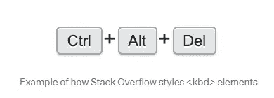

# 你可能不知道的 10 个有用的 HTML 特性

> 原文：<https://blog.devgenius.io/10-useful-html-features-that-you-probably-dont-know-c5878cf34506?source=collection_archive---------8----------------------->

## 每个开发人员都应该知道的很棒的 HTML 特性。


照片由[妮可·沃尔夫](https://unsplash.com/@joeel56?utm_source=medium&utm_medium=referral)在 [Unsplash](https://unsplash.com?utm_source=medium&utm_medium=referral) 上拍摄

HTML 是一种非常有用的标记语言，它允许我们创建网页并定义网页内容的结构。它由几个元素组成，通知浏览器如何在 web 上显示内容。

你在网上看到的每个网站或网络应用程序都使用 HTML 代码来构建模块和页面。这种语言有许多优秀的特性，开发人员可以使用。它有很多有用的标签和属性，我们可以从中受益，以节省时间并在 web 上构建各种功能。

只用一点点 HTML 就能完成很多事情。我们只需要知道这种标记语言提供的强大功能。

这就是为什么在这篇文章中，我想与你分享一些有用的 HTML 特性，你可能从来没有使用过或听说过。所以让我们开始吧。

# 1.fieldset 元素

如果您想在一个表单中组合一组 HTML 元素，标签`<fieldset>`允许您这样做。这是构建表单的好方法。

下面是一个代码示例:

```
<form>
 **<fieldset>**
   <label for="Name">Name:</label>
   <input type="text"><br><br>
   <label for="email">Email:</label>
   <input type="email"><br><br>
   <input type="submit" value="Submit">
 **</fieldset>**
</form>
```

所有主流浏览器都支持这个令人惊叹的标签。它接受不同的属性，比如指定字段集属于哪个表单的属性`form`，以及告诉浏览器应该禁用表单元素组的属性`disabled`。

你可以看看下面的例子:

由作者使用 Codepen(介质之外的外部站点)创建。

# 2.图例标签

标签`<legend>`是我们与 fieldset 元素一起使用的另一个 HTML 元素。

它允许您为 fieldset 元素定义标题。参见下面的代码:

```
<form>
  <fieldset>
    **<legend>Awesome:</legend>**
    <label for="firstName">The first name:</label>
    <input type="text" id="firstName" name="firstName"><br><br>
    <label for="lname">The last name:</label>
    <input type="text" id="lname" name="lname"><br><br>
    <input type="submit" value="Submit">
  </fieldset>
</form>
```

*输出:*

由作者使用 Codepen(介质之外的外部站点)创建。

正如您在上面看到的，当您向 legend 元素添加文本时，它会将该文本放在 fieldset 元素的边框内。除此之外，如果你愿意，你还可以添加一些样式。

legend 标签接受各种属性，所有主流浏览器都支持它。

# 3.手风琴元素

如果你想用 HTML 轻松创建一个简单的手风琴，标签`<details>`可以让你做到这一点。您不必编写任何 JavaScript 代码。

标签`<details>`接受子元素，您可以通过单击元素(`details`)来查看或隐藏这些子元素。

看看下面的代码示例:

```
**<details>**
  **<summary>What is HTML?</summary>**
  <p>HTML stands for Hypertext Markup Language, it's the language of the web.</p>
**</details>**
```

现在，通过单击 details 元素，您可以显示和隐藏该段落。就像手风琴一样。

查看下面的代码笔:

由作者使用 Codepen(介质之外的外部站点)创建。

# 4.颜色选择器功能

您知道吗，您可以轻松地创建一个颜色选择器元素，只需原生 HTML，无需任何 JavaScript 代码。

为了做到这一点，只需编写一个 HTML input 元素，并赋予它一个值为`color`的 type 属性。就是这样。

下面是代码示例:

```
<label for="color-pick">Pick a color you want:</label>
**<input type="color" id="color-pick">**
```

*输出:*

由作者使用 Codepen(介质之外的外部站点)创建。

# 5.元素数据列表

HTML 中的元素`<datalist>`是一个强大的标签，允许您创建一个具有自动完成特性的功能搜索栏。所有这些都只需要 HTML，不需要 JavaScript。当用户在搜索栏上搜索时，datalist 标签显示他/她可能正在寻找的自动建议。

为此，只需创建一个 input 元素，并赋予它一个名为`list`的属性，以搜索栏的名称作为值。

然后在 input 元素之后，创建 datalist 元素并给它一个输入列表名作为 ID。在 datalist 标签中，只需放一些带有用户可以搜索的文本的`<option>`标签。

下面是代码示例:

```
<form>
        <input **list**="**myCars**">
        <**datalist** id="**myCars**">
          <option value="BMW">
          <option value="Mercedes">
          <option value="Toyota">
          <option value="Ford">
          <option value="Mazda">
        </**datalist**>
        <input type="submit" value="Submit">
 </form>
```

请记住，`list`名称必须等于数据列表 ID。为了更好地理解，请看下面的例子:

由作者使用 Codepen(介质之外的外部站点)创建。

# 6.必需的属性

HTML 中的属性`required`指定在用户提交表单之前，必须用*有效数据*填充表单元素。这是一种确保在提交表单之前填写所有元素的方法。

下面是代码示例:

```
<form>
  <label for="name">Name:</label>
  <input type="text" id="name" **required**> <label for="email">Email:</label>
  <input type="email" id="email" **required**> <input type="submit">
</form>
```

*输出:*

由作者使用 Codepen(介质之外的外部站点)创建。

如您所见，如果您试图在没有填写输入内容或没有输入有效数据的情况下提交表单，将会出现一个警告，告诉您输入有效数据。

# 7.隐藏的属性

属性`hidden`给了你在网页上隐藏 HTML 元素的能力。您可以将它添加到任何类型的元素中。

下面是代码示例:

```
<p **hidden**>This paragraph won't show up.</p>
```

# 8.基础元素

HTML 中的标签`<base>`为网页上的所有相对 URL 定义了一个默认的基本 URL 和目标。因此，这个特性使 URL 更容易阅读，并清理您的代码。

这个标签可以用在 HTML 的`<head>`元素中。这里有一个例子:

```
<head>
 **<base href="https://www.medium.com/" target="_blank">** </head>

<body>

<a href="**tags/tag_base.php**">Base Tag HTML</a>
</body>
```

正如你所看到的，拥有一个基本的 URL 可以让你的链接更短，更容易阅读。

# 9.标签缩写

HTML 中的标签`abbr`允许您在用户悬停在文本上时向文本添加缩写。

标签接受一个`title`属性，该属性将文本缩写作为一个值。

看看下面的代码:

```
<p>**<abbr** **title="Cascading Stylesheet"**>CSS**</abbr>** is awesome.</p>
```

下面是一个 Codepen 示例:

由作者使用 Codepen(介质之外的外部站点)创建。

如您所见，当您将鼠标悬停在文本( *HTML* )上时，缩写就会显示出来。

# 10.kbd 元素

HTML 中的标签`<kbd>`允许你将文本标记为键盘按键，如`enter`、`ctrl`等。

当您将文本放入标签`kbd`时，浏览器会以默认的等宽字体呈现该文本，这样它就会显示为键盘按键。

下面是一个代码示例:

```
<p>Press **<kbd>Ctrl</kbd>**+**<kbd>Alt</kbd>** to continue...</p>
```

如果你想有一个独特的风格，你也可以添加一些 CSS 样式到 kbd 元素中。请参见下面的示例:



作者从堆栈溢出中捕获。

# 结论

正如你在上面看到的，这是一个开发者可以使用的 10 个强大的 HTML 特性的列表。这些特性让你只用 HTML 就能完成这么多工作，这样你就能节省时间，写出干净的代码。

*感谢您阅读本文。此外，如果您发现我的内容有用，并且您不是媒体会员，您可以在此处获取您的媒体会员资格*[](https://mehdiouss.medium.com/membership)**(媒体推荐链接)以无限制地访问媒体上的所有文章，并支持我们作为作者。**

*[](https://mehdiouss.medium.com/membership) [## 通过我的推荐链接加入 Medium-Mehdi Aoussiad

### 作为一个媒体会员，你的会员费的一部分会给你阅读的作家，你可以完全接触到每一个故事…

mehdiouss.medium.com](https://mehdiouss.medium.com/membership) 

**延伸阅读:**

[](/11-amazing-frontend-development-tools-that-you-should-use-in-2022-b12c64caa346) [## 你应该在 2022 年使用的 11 个惊人的前端开发工具

### 2022 年每个前端开发者应该使用的有用工具列表。

blog.devgenius.io](/11-amazing-frontend-development-tools-that-you-should-use-in-2022-b12c64caa346) [](/9-powerful-javascript-libraries-that-you-probably-dont-know-e923dff81cac) [## 你需要知道的 9 个强大的 JavaScript 库

### 每个 web 开发人员都应该知道的有用的 JavaScript 库。

blog.devgenius.io](/9-powerful-javascript-libraries-that-you-probably-dont-know-e923dff81cac)*