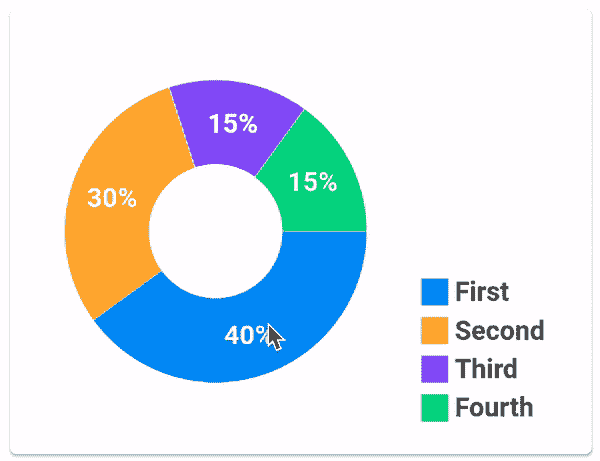
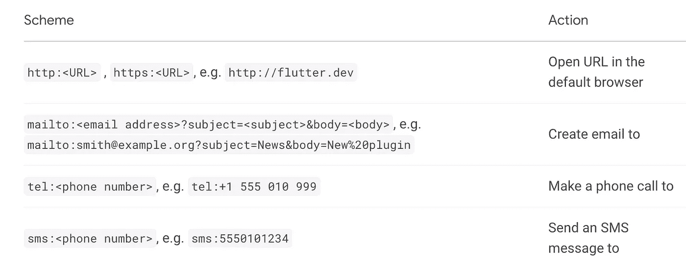
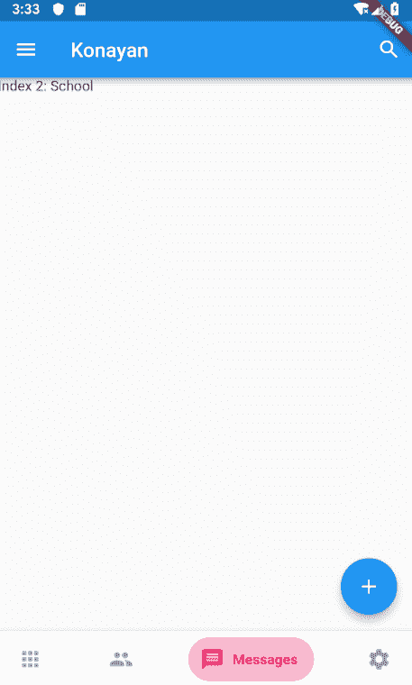

# 开发 Flutter 应用程序时避免复杂性的 10 个有用的库

> 原文：<https://blog.devgenius.io/10-useful-libraries-to-avoid-complexity-when-you-are-developing-a-flutter-app-7004044851ce?source=collection_archive---------0----------------------->

## 我日常使用的 Flutter 库


在 [Unsplash](https://unsplash.com?utm_source=medium&utm_medium=referral) 上由 [Balázs Kétyi](https://unsplash.com/@balazsketyi?utm_source=medium&utm_medium=referral) 拍摄的照片

作为开发者，大家都知道库的重要性。不用说，图书馆使我们的生活更容易。但是我们的图书馆经常没有好的藏书。别担心，我已经列出了一个令人敬畏的 flutter 库集合。事实上，我每天都知道并使用这些库来进行我的 flutter 开发，现在我正在与你分享。

# 1.FL 图表

如果你试图在一个 flutter 项目上创建一个图表，你就会知道创建自己的图表有多困难。但是，如果你想建立一个毫不费力或美丽的图表，那么这个库是给你的。

在 [**fl 图表**](https://pub.dev/packages/fl_chart) **中可以得到你想要的定制图表。你可以在这里看到示例代码和许多类型的图表，如折线图、条形图、饼图。**

假设你想在你的应用程序中添加一个饼图。你可以点击这个库中的 piechart，你可以看到示例代码和如何使用它的文档。您可以从这里选择任何图表，并且可以修改颜色、大小、动画等任何内容。



[图像来源](https://pub.dev/packages/fl_chart)

我在下面给了一个链接，看看吧，我相信你会喜欢的。

[](https://github.com/imaNNeoFighT/fl_chart/blob/master/repo_files/documentations/pie_chart.md#PieChartSectionData) [## fl _ chart/pie _ chart . MD at master imaNNeoFighT/fl _ chart

### PieChart( PieChartData( //在 PieChartData 部分阅读)，swapAnimationDuration: Duration(毫秒…

github.com](https://github.com/imaNNeoFighT/fl_chart/blob/master/repo_files/documentations/pie_chart.md#PieChartSectionData) 

# 2.图像拾取器

[**图像拾取器**](https://pub.dev/packages/image_picker) 是一个有用的插件，我们可以用它让用户从图库中或直接从相机中拾取图像。我们也可以将这些图像用于任何我们想要的应用程序。我们可以将此图像存储在 firebase 存储器中，并且还可以对其进行编辑或过滤。iOS 和 Android 支持该库。以这种方式跟随。

```
import 'package:image_picker/image_picker.dart';...
    final ImagePicker _picker = ImagePicker();
    // Pick an image
    final XFile? image = await _picker.pickImage(source: ImageSource.gallery);
    // Capture a photo
    final XFile? photo = await _picker.pickImage(source: ImageSource.camera);
    // Pick a video
    final XFile? image = await _picker.pickVideo(source: ImageSource.gallery);
    // Capture a video
    final XFile? photo = await _picker.pickVideo(source: ImageSource.camera);
    // Pick multiple images
    final List<XFile>? images = await _picker.pickMultiImage();
    ...
```

下面给出了链接。

[](https://pub.dev/packages/image_picker) [## 图像拾取器| Flutter 包

### 一个适用于 iOS 和 Android 的 Flutter 插件，用于从图像库中拾取图像，并使用…

公共开发](https://pub.dev/packages/image_picker) 

# 3.旋转式滑块

[**旋转滑块**](https://pub.dev/packages/carousel_slider/example) 用于图像幻灯片。如果你有三四张图片，并且你想在你的应用程序中一张一张地显示这张图片，你可以使用这个库。对于图像幻灯片，您也可以在这里使用资产图像或网络图像。


[图像来源](https://pub.dev/packages/carousel_slider)

旋转式滑块示例。

```
CarouselSlider(
  options: CarouselOptions(height: 400.0),
  items: [1,2,3,4,5].map((i) {
    return Builder(
      builder: (BuildContext context) {
        return Container(
          width: MediaQuery.of(context).size.width,
          margin: EdgeInsets.symmetric(horizontal: 5.0),
          decoration: BoxDecoration(
            color: Colors.amber
          ),
          child: Text('text $i', style: TextStyle(fontSize: 16.0),)
        );
      },
    );
  }).toList(),
)
```

旋转式滑块的 URL。

[](https://pub.dev/packages/carousel_slider) [## carousel_slider |颤振包

### 旋转式滑块小部件。无限滚动自定义子部件自动播放颤振安卓颤振 iOS 颤振网络…

公共开发](https://pub.dev/packages/carousel_slider) 

# 4.Url 启动器

这个**库**帮助你在移动平台上午餐 URL。例如，您可以在浏览器上打开一个 URL，或者创建一封电子邮件，打一个电话，或者发送一个 SMS 号码。它可以在 Android 和 iOS 上完美运行。你可以在图书馆的页面上看到例子。

下面是一个示例代码。

```
import 'package:flutter/material.dart';
import 'package:url_launcher/url_launcher.dart';const _url = '[https://flutter.dev'](https://flutter.dev');void main() => runApp(
      const MaterialApp(
        home: Material(
          child: Center(
            child: RaisedButton(
              onPressed: _launchURL,
              child: Text('Show Flutter homepage'),
            ),
          ),
        ),
      ),
    );void _launchURL() async =>
    await canLaunch(_url) ? await launch(_url) : throw 'Could not launch $_url';
```

## 支持的 URL 方案



这是午餐网址的链接。

[](https://pub.dev/packages/url_launcher) [## url_launcher | Flutter 包

### 一个用于启动 URL 的 Flutter 插件。支持 iOS、Android、web、Windows、macOS 和 Linux。要使用此插件，请添加…

公共开发](https://pub.dev/packages/url_launcher) 

# 5.迪奥

这个库支持 Android、IOS、Linus、MACOS、Windows 和 Web。 [Dio](https://pub.dev/packages/dio) 帮助你快速处理 HTTP。例如，你可以有一个 cookie 管理器，拦截器，或者通过这个库来处理错误或许多功能。而且超级好用；您可以如下实现它。

```
**import** 'package:dio/dio.dart';
**void** getHttp() **async** {
  **try** {
    **var** response = **await** Dio().**get**('http://www.google.com');
    print(response);
  } **catch** (e) {
    print(e);
  }
}
```

在下面，我给了一个 dio 的链接。

[](https://pub.dev/packages/dio) [## 飞镖包

### Language: English | 中文简体 A powerful Http client for Dart, which supports Interceptors, Global configuration, FormData…

公共开发](https://pub.dev/packages/dio) 

# 6.Web 视图

[**Web 视图**](https://pub.dev/packages/webview_flutter) 帮助您显示应用程序中的任何网页。假设您需要在应用程序中显示 Google 主页。你可以穿过这个图书馆。以及这样的工具。

```
**import** 'dart:io'; **import** 'package:webview_flutter/webview_flutter.dart'; **class** **WebViewExample** **extends** **StatefulWidget** {
   **@override**
   WebViewExampleState createState() => WebViewExampleState();
 } **class** **WebViewExampleState** **extends** **State**<**WebViewExample**> {
   **@override**
   **void** initState() {
     **super**.initState();
         *// Enable hybrid composition.*
 **if** (Platform.isAndroid) WebView.platform = SurfaceAndroidWebView();
   } **@override**
   Widget build(BuildContext context) {
     **return** WebView(
       initialUrl: 'https://flutter.dev',
     );
   }
 }
```

这是这个图书馆的链接。

[](https://pub.dev/packages/webview_flutter) [## webview _ 颤振|颤振包

### 一个提供 WebView 小部件的 Flutter 插件。在 iOS 上，WebView 小工具由 WKWebView 支持；在 Android 上…

公共开发](https://pub.dev/packages/webview_flutter) 

# 7.路径提供者

[**路径提供者**](https://pub.dev/packages/path_provider/example) 是一个漂亮的 flutter 插件。[路径提供者](https://pub.dev/packages/path_provider/example)允许我们以一种平台无关的方式在设备的文件系统中读写文件或数据。这使得我们在应用程序中存储信息变得相当容易。

假设您想获得下载操作系统中的文件夹的路径，您可以使用这个库，它会向您显示特定文件夹的路径。而且很好用。

```
Directory tempDir = await getTemporaryDirectory();
String tempPath = tempDir.path;Directory appDocDir = await getApplicationDocumentsDirectory();
String appDocPath = appDocDir.path;
```

这是路径提供者的链接。

[](https://pub.dev/packages/path_provider/example) [## path_provider | Flutter 包

### example/lib/main.dart //版权所有 2013 The Flutter 作者。保留所有权利。//这个源代码的用途是…

酒吧](https://pub.dev/packages/path_provider/example) 

# 8.字体太棒了

[**字体牛逼**](https://pub.dev/packages/font_awesome_flutter) 帮助我们给项目添加图标。如果您正在构建一个应用程序，您将需要一个图标，这样您就可以使用这个库。它为我们的项目提供了 1500 个图标。并且可以通过使用这个库带来外部字体。用这个例子。

```
import 'package:font_awesome_flutter/font_awesome_flutter.dart';class MyWidget extends StatelessWidget {
  Widget build(BuildContext context) {
    return IconButton(
      // Use the FaIcon Widget + FontAwesomeIcons class for the IconData
      icon: FaIcon(FontAwesomeIcons.gamepad), 
      onPressed: () { print("Pressed"); }
     );
  }
}
```

这是一个字体库的链接。

[](https://pub.dev/packages/font_awesome_flutter) [## font _ awesome _ 颤振|颤振包

### 字体真棒图标包可作为一套颤振图标。基于字体 Awesome 5.15.3。包括所有免费图标:在…

公共开发](https://pub.dev/packages/font_awesome_flutter) 

# 9.底部海军酒吧

你可以通过这个 [**底部海军条库**](https://pub.dev/packages/bottom_navy_bar) 得到一个导航栏。您可以根据需要进行定制。你也可以在这里看到底部的海军动画栏。



[图像来源](https://pub.dev/packages/bottom_navy_bar)

下面是底部海军酒吧的用法。

```
bottomNavigationBar: BottomNavyBar(
   selectedIndex: _selectedIndex,
   showElevation: true, // use this to remove appBar's elevation
   onItemSelected: (index) => setState(() {
              _selectedIndex = index;
              _pageController.animateToPage(index,
                  duration: Duration(milliseconds: 300), curve: Curves.ease);
    }),
   items: [
     BottomNavyBarItem(
       icon: Icon(Icons.apps),
       title: Text('Home'),
       activeColor: Colors.red,
     ),
     BottomNavyBarItem(
         icon: Icon(Icons.people),
         title: Text('Users'),
         activeColor: Colors.purpleAccent
     ),
     BottomNavyBarItem(
         icon: Icon(Icons.message),
         title: Text('Messages'),
         activeColor: Colors.pink
     ),
     BottomNavyBarItem(
         icon: Icon(Icons.settings),
         title: Text('Settings'),
         activeColor: Colors.blue
     ),
   ],
)
```

该库的 URL 如下所示。

[](https://pub.dev/packages/bottom_navy_bar) [## bottom_navy_bar |颤振包

### 一个美丽而生动的底部导航。导航条使用你当前的主题，但是你可以自由定制…

公共开发](https://pub.dev/packages/bottom_navy_bar) 

# 10.本地授权

这是一个很棒的图书馆。该库在用户设备上提供本地生物识别身份验证。如果您不处理敏感数据，或者您不担心黑客绕过您的身份验证，那么它将满足您的需求。

这是本地 auth 的链接。

[](https://pub.dev/packages/local_auth) [## local_auth | Flutter 包

### 这个 Flutter 插件提供了在本地设备上执行用户认证的方法。这意味着参考…

公共开发](https://pub.dev/packages/local_auth) 

# 最终想法

> 聪明地工作。把事情做好。不废话。动作要快。
> 
> **苏珊·沃西基**

当然，聪明的人聪明地工作，那些库帮助你成为一个聪明的开发者。它真的很容易使用，你可以一步一步地浏览它的文档。这个库让我在开发过程中速度更快，我对它们很着迷。我已经给出了所有图书馆的链接，如果我忘记提到什么，请告诉我。

感谢您的阅读。