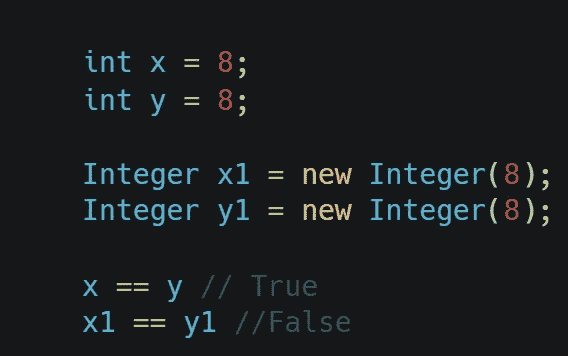

# Java 初学者的 10 个有用技巧

> 原文：<https://blog.devgenius.io/10-useful-tips-for-beginners-in-java-5969116c7c14?source=collection_archive---------2----------------------->

[Unsplash](https://unsplash.com?utm_source=medium&utm_medium=referral) 上 [AltumCode](https://unsplash.com/es/@altumcode?utm_source=medium&utm_medium=referral) 拍摄的照片

Java 是最流行的编程语言之一——无论是 Win 应用程序、Web 应用程序、移动、网络、消费电子产品、机顶盒设备，Java 无处不在。

它是一种通用编程语言，旨在让程序员编写一次，在任何地方运行

这里是给初学者的提示和技巧，这样他们可以发展他们的编程技能。

## **1。单引号-双引号困境:**

在这里，你会注意到第一个打印的是 **AA** ，第二个打印的是 **130** 而不是 **AA。**

原因是，如果使用双引号，字符将被视为字符串，但在单引号的情况下，字符值操作数(“A”和“A”)将通过一个称为扩大原语转换的过程转换为 int 值。

如果你看到 ASCII 表，

char A 将转换为 int 65，

> A' + 'A' => 65 + 65 => 130。

因此，在转换之后，数字返回 130。

## 2.小心使用字符串:

如果在任何循环中使用“+”操作符连接两个字符串，那么每次都会创建一个新的 String 对象。这会造成内存浪费，并增加执行时间。

相反我们应该使用 **StringBuffer** ，

## 3.**总是返回空集合，而不是 NULL** :

如果集合为空，则返回空集合，这将防止我们出现 NullPointerException。

## 4.在字符串中，==和。等于():

这里，==检查两个对象是否指向同一个内存位置，而。equals()计算对象中值的比较。

## 5.尽量避免循环初始化:

如果你在循环中初始化任何变量，它将继续浪费内存，而不是在循环外进行初始化，然后在循环内赋不同的值。

相反，

## 6.如果可能，尽量避免全局变量:

→全局变量是在所有函数或程序块之外声明的变量，可以在程序中全局访问。

→它将保留在内存中，直到该类被垃圾收集。

让我们看下面例子:

在这里，你可以看到结果将被保存在内存中，甚至在 getResult()完成之后，所以这是内存的浪费。

→全局变量的值可能会被意外更改，因为它可以被程序中的任何函数使用。

相反我们应该做的是，

## 7.需要时创建对象:

对象创建对于内存利用来说是非常昂贵的操作。因此，只创建或初始化必要的对象。

## 8.避免在构造函数或函数中创建对象:

我们应该避免在构造函数或函数中创建对象，相反，我们应该将它作为参数传递，

对于 ex，在这里，你可以看到，我们已经创建了 Wheel 类的对象，但是应该避免它，

相反，我们应该这样做:

这将消除依赖性，在单元测试中非常有帮助。

## 9.**偏好原始类**:

包装类通常比基本类慢。虽然基本类只有值，但是包装类存储了整个类的信息。

因为这些类经常处理对象值，所以将它们与基本类进行比较不会得到想要的结果。

首先比较数值，

x == y

其次比较参考文献，

x1 == y1，

所以，它将是假的，

## 10.要检查空字符串，使用。改为 isEmpty()。等于(""):

有几种不同的方法来检查空字符串，但最好的方法是使用。isEmpty()，as。isEmpty()只是使用 length()方法比较给定字符串的长度。所以这样成本就低了。等于("")

我会发布更多关于 **Java 和 Python 技巧和诀窍**的博客。

请在[媒体](https://medium.com/@alexmurphyas8)上关注我，我会像上面一样发布有用的信息。

感谢你阅读这篇文章，❤

如果这篇文章对你有帮助，请鼓掌👏这篇文章。

insta gram→[https://www.instagram.com/alexmurphyas8/](https://www.instagram.com/alexmurphyas8/)

推特→[https://twitter.com/AlexMurphyas8](https://twitter.com/AlexMurphyas8)

如果我做错了什么？让我在评论中。我很想进步。