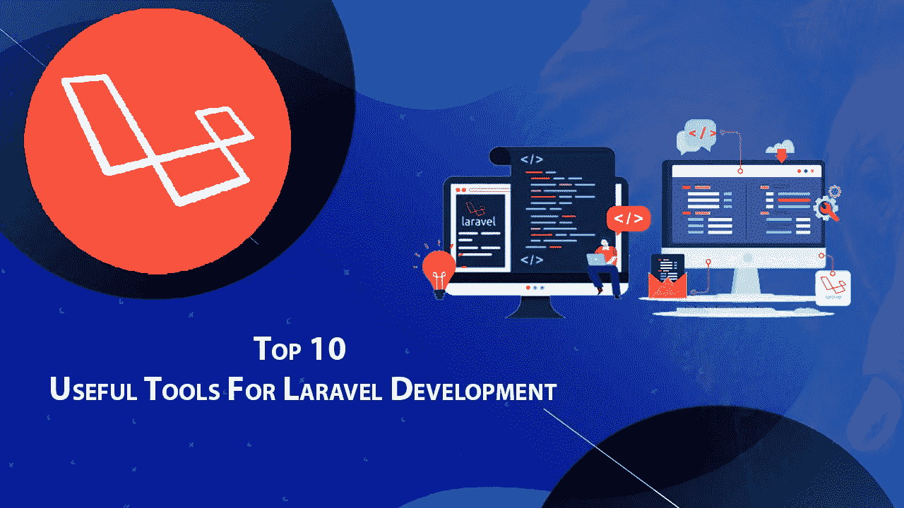

# Laravel 开发的 10 个有用工具，可提升您的业务应用

> 原文：<https://blog.devgenius.io/10-useful-tools-for-laravel-development-to-boost-your-business-app-abe781515f7a?source=collection_archive---------6----------------------->

[来源](https://morioh.com/p/cd8945c4ea21)

Laravel 开发最近一直在兴起，越来越多的企业正在利用这个通用框架来构建具有漂亮用户界面的高质量 web 应用程序。

这个健壮的框架已经帮助无数公司使用 PHP 语言强大的、富于表现力的、优雅的语法创建了伟大的软件。

Laravel 已经证明自己是开发动态 web 应用程序的最佳框架之一，它内置了前端搭建工具和其他令人印象深刻的特性，如路由和会话管理。

[来源](https://technwzs.com/a-comprehensive-guide-to-laravel-the-famous-php-framework/)

如果你也计划开发一个数百万人都会使用的应用程序，这里有一些 Laravel 开发工具可以帮助你达到完美的巅峰。

这些工具将推动您的业务应用开发，并为您的客户提供无缝的用户体验。

所以让我们开始吧！

*又读:* [*拉韦勒综合指南:著名的 PHP 框架*](https://www.valuecoders.com/blog/technology-and-apps/laravel-open-source-php-framework/)

# Laravel 开发的 10 个有用工具，可提升您的业务应用

有许多工具可以帮助 Laravel 开发，从 ide 和代码编辑器到调试和性能监控工具。以下是其中一些关键因素。

**1。PHP 表单**

PHPStorm 是使用 Laravel 框架的开发人员的普遍选择。其直观的界面和强大的功能使其成为构建健壮的 web 应用程序的理想工具。

除了为 PHP 提供代码完成和语法突出显示，PHPStorm 还支持特定于 Laravel 的特性，如刀片模板加载、artisan 命令执行和路由注入。

这使得它成为快速开发 Laravel 应用程序的无价工具。PHPStorm 的内置调试功能允许您快速有效地识别和修复代码中的错误。凭借其丰富的特性和功能，PHPStorm 是开发健壮应用程序不可或缺的工具。

**2。Laravel Debugbar**

Laravel debug bar 是 Laravel 开发中最有用的工具之一，对提升您的业务应用程序非常有帮助。它提供了大量关于应用程序幕后发生的事情的信息，包括性能数据、数据库查询、路线数据等。

这些信息对于故障排除和优化非常有价值。Laravel debugbar 易于安装和使用，并与 Laravel 现有的日志记录工具无缝集成。

**3。拉里韦尔备份**

Laravel 备份包对于那些使用 Laravel 框架构建业务应用程序的人很有用。该软件包提供了一种简单的方法来备份您的应用程序的文件和数据库。它还提供了一个基于 web 的界面来管理和恢复备份。

使用 Laravel Backup，您可以安排定期备份，将备份存储在云中，并在数据丢失时恢复数据。此外，Laravel Backup 还可以通过加密备份来帮助您保护数据免受黑客攻击。

因此，Laravel Backup 是任何依赖数据的企业的必备工具。你也可以 [**在印度雇佣 Laravel 开发者**](https://www.valuecoders.com/hire-developers/hire-laravel-developers) 让你的 app 开发项目成功。

**4。名媛**

Socialite 是 Laravel 为开发商业应用程序提供的最有用的工具之一。它允许开发人员轻松地将社交登录集成到他们的应用程序中。

社交名媛支持许多社交网络平台，如脸书、推特、谷歌、LinkedIn 等。开发者可以根据自己的需求，为自己的业务应用选择合适的社交网络平台。

通过将用户重定向到所选社交网络平台的相应登录页面，Socialite 提供了一种处理用户身份验证的简单方法。一旦用户登录，Socialite 会自动从社交网络平台检索他们的个人资料信息，并将其存储在数据库中。

然后，业务应用程序可以根据需要使用这些信息。Socialite 使开发人员可以轻松开发具有社交登录功能的商业应用程序。它为开发人员节省了大量的时间和精力，您可以将这些时间和精力用于其他重要的任务。

**5。拉勒维尔·廷克**

Laravel Tinker 是 Laravel 开发的一个有用工具，可以提升你的业务应用。它允许您通过在终端中运行命令来与应用程序进行交互。它使您能够测试新功能或调试错误，而不必修改您的代码。

Laravel Tinker 还提供了一种简单的方法来为您的数据库植入虚假数据。它对于测试应用程序的性能或创建演示数据非常有用。总的来说，Laravel Tinker 是一个有价值的工具，可以节省您的时间，帮助您创建更好的应用程序。

**6。Laravel 流明**

Laravel Lumen 是基于 Laravel 全栈框架的 PHP 微框架。它旨在以最小的开销构建快速轻量级的 web 应用程序。

Lumen 框架的核心是一个路由调度器和中间件系统，它使得构建可伸缩的 web 应用程序变得容易。Lumen 还包括一个简单、优雅的语法，使得构建复杂的 web 应用程序变得容易。

Lumen 带有一个内置的命令行界面(CLI ),可以轻松创建和管理您的应用程序。Laravel Lumen 是构建快速轻量级 web 应用程序的优秀工具。它易于使用，并带有各种强大的功能。

7 .**。比特桶**

Bitbucket 是 Laravel 开发的一个很棒的工具。在它的帮助下，您可以轻松地管理您的 Laravel 项目，跟踪变更，并与您的团队协作。Bitbucket 使托管您的代码、管理您的存储库和跟踪您的项目的开发过程变得容易。

它还提供了一个很好的方式来提升您的业务应用程序。您可以轻松地创建一个新的存储库，添加文件并将更改推送到您的团队。Bitbucket 使跟踪项目变得容易，并使与团队的协作变得更容易。

多亏了 Bitbucket，你可以提升你的商业应用，让它更加成功。还可以联系 [**顶级 Laravel 开发公司**](https://www.valuecoders.com/blog/technology-and-apps/top-laravel-development-companies-to-hire-experts/) 打造高效的 Laravel 应用。

**8。拉勒维尔新星**

Laravel Nova 是一个用于管理 Laravel 项目的简洁的单页应用程序。它包括用于搭建、数据库管理和路由的内置工具。Laravel Nova 还可以让您轻松地将 Laravel 应用程序部署到生产环境中，只需点击几下鼠标。

此外，Laravel Nova 包括几个第一方包，使开发 Laravel 应用程序更加容易。例如，Laravel Nova 包含用于处理用户角色和权限的 Laratrust 包。

Laravel Nova 是开发业务应用程序的绝佳选择。它包括您需要开始的一切，其直观的界面使它易于使用。有了 Laravel Nova，您可以轻松推进您的业务应用程序开发。

**9。委托**

Entrust 是 Laravel 开发的一个很棒的工具，可以帮助提升你的业务应用的性能。它提供了一种控制用户权限和角色的简单方法，并提供了一系列有助于简化开发过程的特性。

例如，Entrust 有一个强大的命令行界面，可以轻松创建和管理用户权限。它提供了一个可定制的数据库结构，允许您轻松地将其与现有的数据模型集成。

Entrust 是一个灵活的轻量级授权工具，可以帮助您管理应用程序中的角色和权限。雇佣印度的 Laravel 开发公司也可以帮助你开发强大的应用程序，极大地推动你的业务。

10。用户验证

企业应该考虑 Laravel 来满足其 web 应用程序开发需求的原因有很多。Laravel 的一个重要优势是它的用户验证工具。

该功能允许企业通过各种方法验证其用户的身份，包括电话号码、电子邮件地址和社交媒体帐户。

因此，企业可以确保只有授权用户才能访问他们的应用程序。用户验证工具通过确保只有经过验证的用户才能访问敏感信息，有助于防止数据泄露。

因此，企业可以确信他们的数据不会受到未经授权的访问。总的来说，用户验证是一个有价值的工具，可以帮助企业提高应用程序的安全性，保护他们的数据。

*必读:* [*为什么 Laravel 是 2022 年最好的 PHP 框架？*](https://www.valuecoders.com/blog/technology-and-apps/laravel-best-php-framework/)

# 总结一下！

如上所述，上述 Laravel 开发工具在提高应用程序的速度和性能方面发挥了重要作用。每个 Laravel 开发工具都有独特的特性，可以简化开发过程，使项目管理更加容易。

在这些工具的帮助下，你可以确定你的商业应用是成功的。因此，如果你想在竞争激烈的商业应用中获得优势，考虑使用这些工具来推动你的业务。

也可以联系任何**最好的 laravel 开发公司**，给你的 laravel app 开发项目一个正确的方向。