# Python 中的 10 个有用技巧和提示

> 原文：<https://blog.devgenius.io/10-useful-tricks-tips-in-python-d367a305d1ba?source=collection_archive---------1----------------------->

照片由[思想目录](https://unsplash.com/@thoughtcatalog?utm_source=medium&utm_medium=referral)在 [Unsplash](https://unsplash.com?utm_source=medium&utm_medium=referral) 上拍摄

Python 是最受欢迎的语言之一。它的简洁和高可读性使它在所有程序员中如此受欢迎。

因此，这里的 **10 个技巧和诀窍**可以帮助你提高 Python 编程水平。

1.  **负舍入**

我们可以在 Python 的 **round** 函数中指定一个**可选的第二个参数**。

如果我们在这里传递一个**负值**，这将从小数点左边的**开始**舍入**；这意味着我们可以四舍五入到最接近的 10、100 等等。**

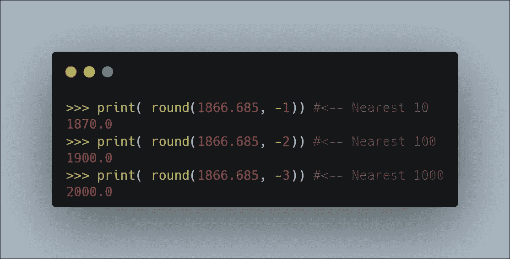

**2。反转字符串**

在 Python 中，有一种非常简单的方法可以使用切片来反转字符串。

下面我们使用 **[::-1]** 这意味着从字符串的末尾开始，到位置 0 结束。

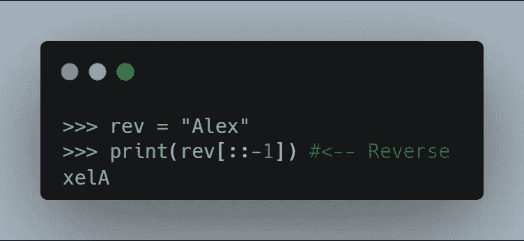

**3。连接字符串**

**join** string 方法使用我们选择的字符串分隔符连接字符串、列表或元组的元素。

如果我们有一个字符串列表，我们想把它连接成一个单独的字符串，这可能是有用的。

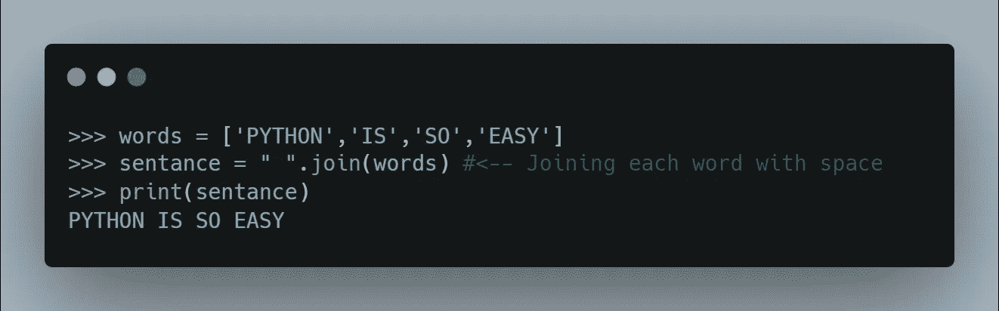

**4。用过滤器连接字符串**

我们也可以使用**过滤器** & **lambda** 从 iterable 中提取条目。

在使用**之前，连接**。**过滤函数**通过函数过滤项目。

下面，我们给它传递一个 **lambda** 函数(没有名字定义的函数)，它过滤我们的列表。

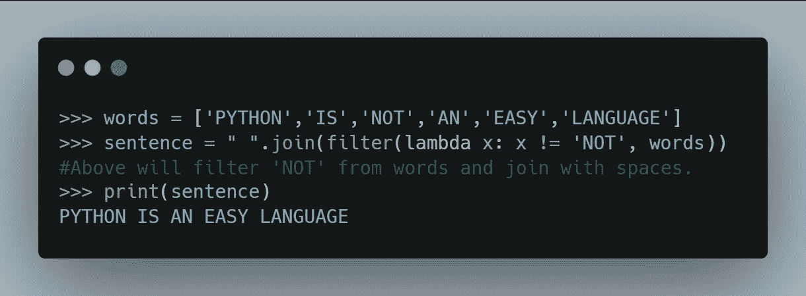

**5。打开一个网址**

我们可以使用 **webbrowser** 模块轻松打开 Python 中的 URL

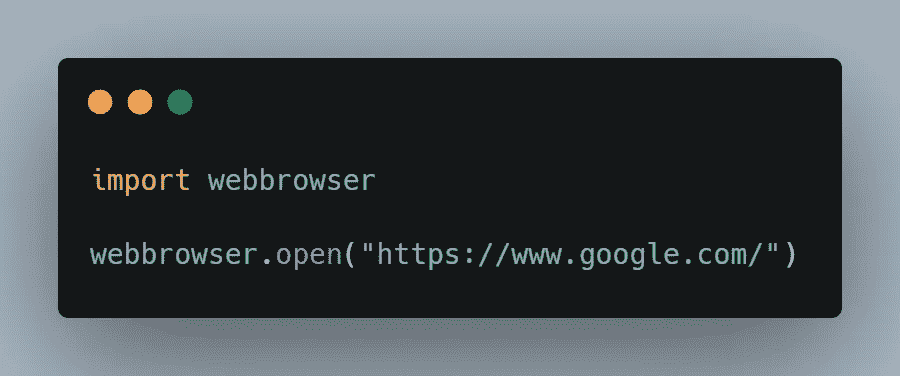

**6。带语句**

当打开文件时，我们可以将**与语句**一起使用。

这将保证文件在代码块的**末端**关闭**，即使**异常**出现。**

首先，我们将看到，**没有 with 语句。**你可以看到，你必须要写 **file.close()** 才能**关闭**那个文件。

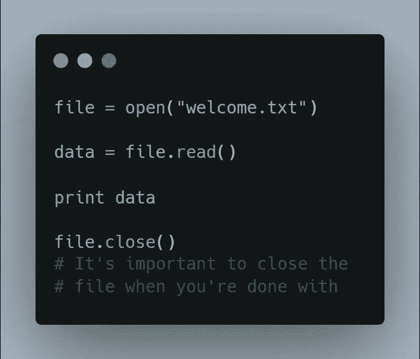

同样的例子，我们将看到 with， **with 语句。**

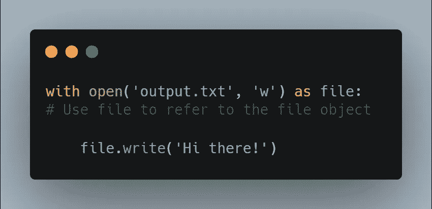

请注意，我们不必编写 **file.close()** 。会被自动调用。

**7。链接比较**

有时我们需要在一个语句中使用多个条件检查。

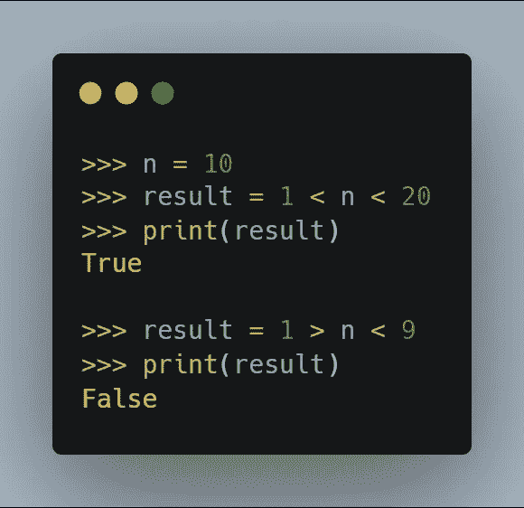

**8。下划线作为“一次性符号”**

下划线(_)可以用作**【一次性】**变量名。

当迭代时，就像下面的例子，它表明循环变量没有被使用。

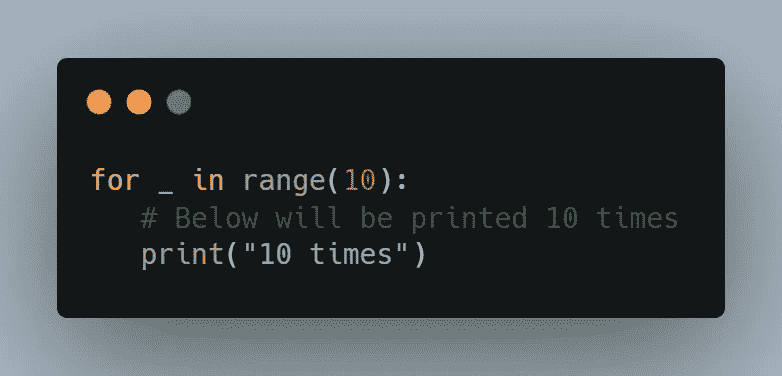

**9。交换变量**

经常在编程中，当我们想要**交换 2 个变量**时，我们需要引入一个**第 3 个临时变量**。

在 Python 中，我们可以做以下事情

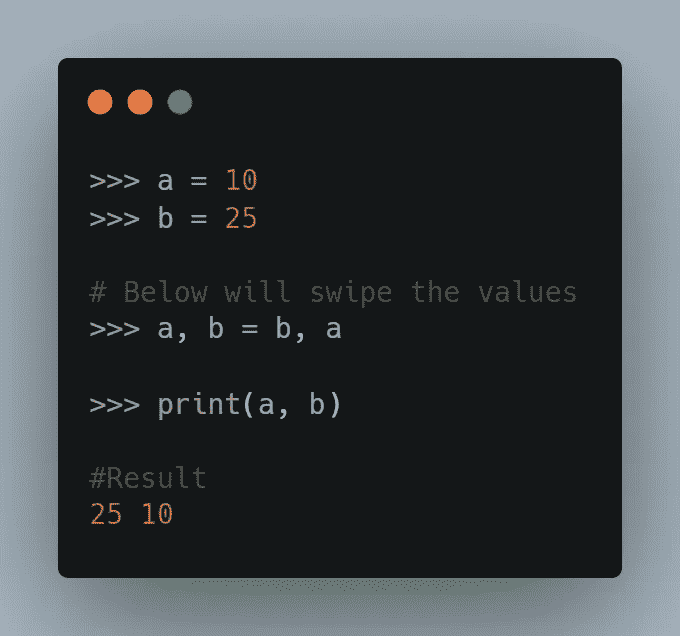

**10。打印字符串的次数。**

乘法运算符(*)在同一行中多次打印一个字符串。

将一个字符串乘以整数 **n** 会将该字符串与其自身 **n** 乘以**连接起来。**

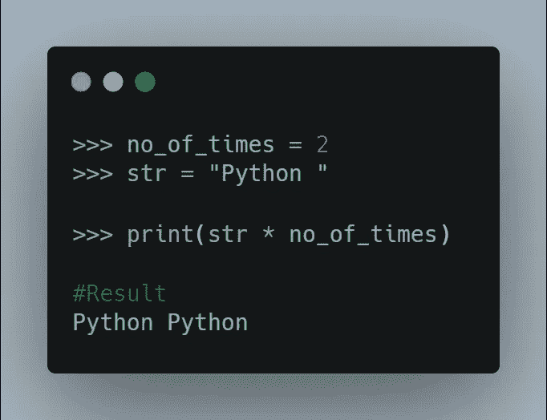

我会发布更多关于 Java 和 Python 技巧的博客。

请在[媒体](https://medium.com/@alexmurphyas8)上关注我，我会像上面一样发布有用的信息。

感谢你阅读这篇文章，❤

如果这篇文章对你有帮助，请鼓掌👏这篇文章。

insta gram→[https://www.instagram.com/alexmurphyas8/](https://www.instagram.com/alexmurphyas8/)

推特→[https://twitter.com/AlexMurphyas8](https://twitter.com/AlexMurphyas8)

如果我做错了什么？让我在评论中。我很想进步。