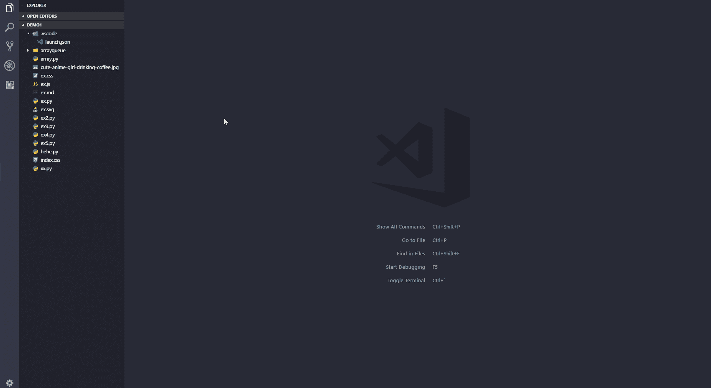

# 10 个有用的 VSCODE 扩展

> 原文：<https://blog.devgenius.io/10-useful-vscode-extensions-792c4eea51f?source=collection_archive---------10----------------------->

**Visual Studio Code【vs Code】**是**一个精简的代码编辑器，支持调试、任务运行、版本控制等开发操作**。它旨在为开发人员提供快速代码构建调试周期所需的工具，并将更复杂的工作流程留给更全面的 ide，如 Visual Studio IDE。

让 VS 代码如此受欢迎的是市场上可用的扩展的数量。随着超过 30，000 个分机在流通，选择感觉几乎是无限的——同时也是势不可挡的。

这里我们讨论一下对开发者和学习者非常有用的 VSCODE 扩展。

**一些扩展，如:**

# 01.PYTHON 预览

# 02.小报

# 03.实时服务器

# 04.REST 客户端

# 05.代码快照

# 06.普里捷

# 07.风筝

# 08.吉特朗斯

# 09.THAIWAND CSS 智能感知

# 10.GITHUB 副驾驶

这些是我个人从众多扩展中挑选出来的，对开发者、学习者或编码者都很有用。

让我们来讨论一下每一个扩展，它们是什么，它们实际上有什么用处。

# 01.PYTHON 预览:

一个 VSCODE 扩展，支持 Python 语言的**调试预览。**

## 要求:

1.  安装一个版本的 **Python 3.6 或 Python 2.7** 。确保您的 **Python 解释器**的位置包含在您的 **PATH 环境变量中。**
2.  最好安装 Python Intellisense 的 Python 扩展。

# 02.TABNINE:

## Tabnine AI 自动完成 Javascript、Python、Typescript、PHP、Go、Java、Ruby 等等

JavaScript、Python、Java、Typescript &所有其他语言——AI 代码完成插件。Tabnine 通过**自动完成他们的代码，让开发人员更有效率。**

## 提高代码质量和一致性

Tabnine 提高了整个项目中代码的一致性，建议与您的代码最佳实践相一致的完成方式，以便于阅读、管理和维护。

# 03.实时服务器:

## 为静态和动态页面启动具有实时重新加载功能的开发本地服务器。

## 启动/停止服务器的快捷方式:

***【注意:如果您的工作区中没有任何*** `***.html***` ***或*** `***.htm***` ***文件，那么您必须按照方法 4 & 5 启动服务器。】***

1.  打开一个项目，点击状态栏上的`Go Live`，打开/关闭服务器。

2.在资源管理器窗口中右击一个`HTML`文件，然后点击`Open with Live Server`。

3.打开一个 HTML 文件，右击编辑器，点击`Open with Live Server`。

4.点击`(alt+L, alt+O)`打开服务器，点击`(alt+L, alt+C)`停止服务器(可以改变快捷键形式按键绑定)。*【在 MAC 上，* `*cmd+L, cmd+O*` *和* `*cmd+L, cmd+C*` *】。*

5.通过按`F1`或`ctrl+shift+P`打开命令 Pallete，并键入`Live Server: Open With Live Server` 启动服务器或键入`Live Server: Stop Live Server`停止服务器。

# 04.REST 客户端:

REST Client 允许您**发送 HTTP 请求，并直接在 Visual Studio 代码中查看响应。**

REST 客户端扩展还提供了**灵活性，您可以在编辑器中发送带有您选择的文本的请求。**

## 安装

按下`F1`，输入`ext install`，然后搜索`rest-client`。

## 提出请求

## 生成代码片段

# 05.代码快照:

它有助于📷对你的代码进行漂亮的截图。

## 使用说明

1.  打开命令面板(Windows 和 Linux 上的 Ctrl+Shift+P，OS X 上的 Cmd+Shift+P)，搜索`CodeSnap`。
2.  选择您想要截屏的代码。
3.  如果需要，调整屏幕截图的宽度。
4.  单击快门按钮将截图保存到您的磁盘。

# 06.普里蒂埃:

## Visual Studio 代码的更漂亮的格式化程序。

漂亮的是一个固执己见的代码格式化程序。它**通过解析你的代码并根据自己的规则重新打印代码来强制执行一致的风格，这些规则考虑了最大行长度，并在必要时换行。**

## Visual Studio 代码设置

可以用 VS 代码设置来配置更漂亮的。将从以下位置读取设置(按优先级列出):

1.  [更漂亮的配置文件](https://prettier.io/docs/en/configuration.html)
2.  `.editorconfig`
3.  Visual Studio 代码设置(如果存在任何其他配置，则忽略)

> *注意:如果存在任何本地配置文件(即* `*.prettierrc*` *)，将使用 VS 代码设置* ***而不是*** *。*

# 07.风筝自动完成人工智能代码:

Kite 是一个由人工智能驱动的编程助手，帮助你在 Visual Studio 代码中更快地编写代码。Kite 可以帮助你更快地编写代码，节省你的击键次数，并在正确的时间向你显示正确的信息。

**Kite 适用于所有主流编程语言:** Python、Java、Go、PHP、C/C#/C++、Javascript、HTML/CSS、Typescript、React、Ruby、Scala、Kotlin、Bash、Vue 和 React。

## 特征

## 由机器学习驱动的完成

Kite 的代码完成由在超过 2500 万个开源代码文件上训练的**机器学习**模型提供支持。**风筝也本地跑**。你的代码是私有的，不会离开你的机器。

## 即时代码文档

获取光标下符号的即时文档，这样可以节省搜索 Python 文档的时间(尚不支持 JavaScript 文档)。

# 08.GITLENS:

GitLens 是 VSCODE 的一个 [o](https://github.com/gitkraken/vscode-gitlens) 笔源扩展。

GitLens 只是帮助你**更好地理解代码**。快速浏览一行或代码块被更改的人、原因和时间。从历史中跳回到**获得关于代码如何以及为什么进化的更深入的见解**。轻松探索代码库的历史和演变。

GitLens 是**强大的**，**功能丰富的**，并且高度可定制以满足您的需求。你是否发现 CodeLens 干扰或当前行责备注释分散注意力——没问题，通过交互式 *GitLens 设置*编辑器快速关闭它们或改变它们的行为。对于高级定制，请参考 GitLens 文档并编辑您的 [u](https://code.visualstudio.com/docs/getstarted/settings) ser 设置。

# 09.顺风 CSS 智能感知:

Tailwind CSS IntelliSense 通过为 Visual Studio 代码用户提供自动完成、语法突出显示和林挺等高级功能，增强了 Tailwind 的开发体验。

## 装置

[**通过 Visual Studio 代码市场安装→**](https://marketplace.visualstudio.com/items?itemName=bradlc.vscode-tailwindcss)

为了激活扩展，你必须在你的工作空间中安装和一个名为`tailwind.config.js`或`tailwind.config.cjs`的 [T](https://tailwindcss.com/docs/installation#create-your-configuration-file) ailwind 配置文件。

自动完成

# 10.GITHUB COPILOT:

GitHub Copilot 是一个 AI pair 程序员，当你输入时**会提示行完成和整个函数体。GitHub Copilot 由 OpenAI Codex AI 系统提供支持，在公共互联网文本和数十亿行代码上进行训练。**

要了解更多关于 GitHub Copilot 的信息，请访问 copilot.github.com。

## 技术预览

在 GitHub Copilot 的技术预览版期间，对 GitHub Copilot 的访问仅限于一小部分测试人员。如果您没有访问技术预览版的权限，当您尝试使用此扩展时会看到一个错误。

还没有权限？[报名加入候补名单](https://github.com/features/copilot/signup)就有机会一试身手。一旦你有权限，GitHub 会通知你的。

这个技术预览版是在 [GitHub 服务条款](https://docs.github.com/en/github/site-policy/github-terms-of-service#j-beta-previews)下的 Beta 预览版。

## 使用

要开始使用 GitHub Copilot，请访问[入门指南](https://github.com/github/copilot-docs/tree/main/docs#getting-started)。有关更多资源，请访问[文档报告](https://github.com/github/copilot-docs)。

就是这样，这是 10 个有用的 VSCODE 扩展。

请到 VSCODE 应用程序，在扩展，你可以检查每一个扩展，阅读，如果你有用，然后安装。

*******************************************************************

我希望你明白这个简单的概念。所以我打算用一种简单的方式写一篇关于 python 的每一个概念的博客，在这里你可以轻松地学习。

*所以请继续支持我们，感谢所有读过这篇完整博客的人。*

*请喜欢并关注本账号。*

***全爱无恨。***

我们有一个 Youtube 频道，我们在那里上传关于编程相关的话题，你可以通过订阅我们的频道来支持。

[**【https://www.youtube.com/channel/UChiEiQ2E3_DUGYDG340si-A】**](https://www.youtube.com/channel/UChiEiQ2E3_DUGYDG340si-A)

***这是我们的 Youtube 频道链接，请订阅。***

*本文概念及作者:*

***赛库马尔和维诺德库马尔。***

*******************************************************************