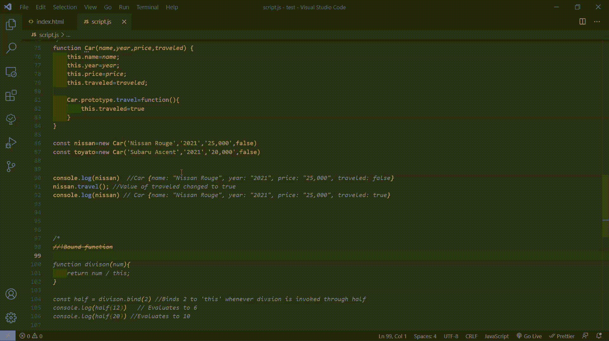
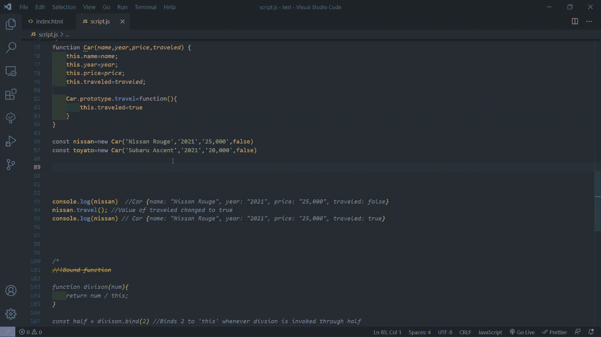
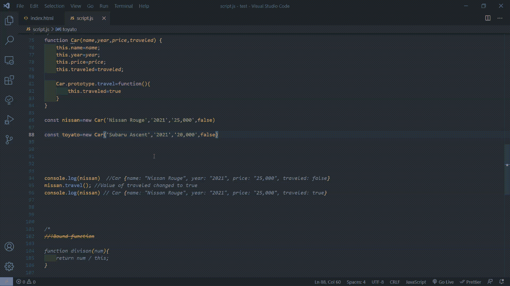
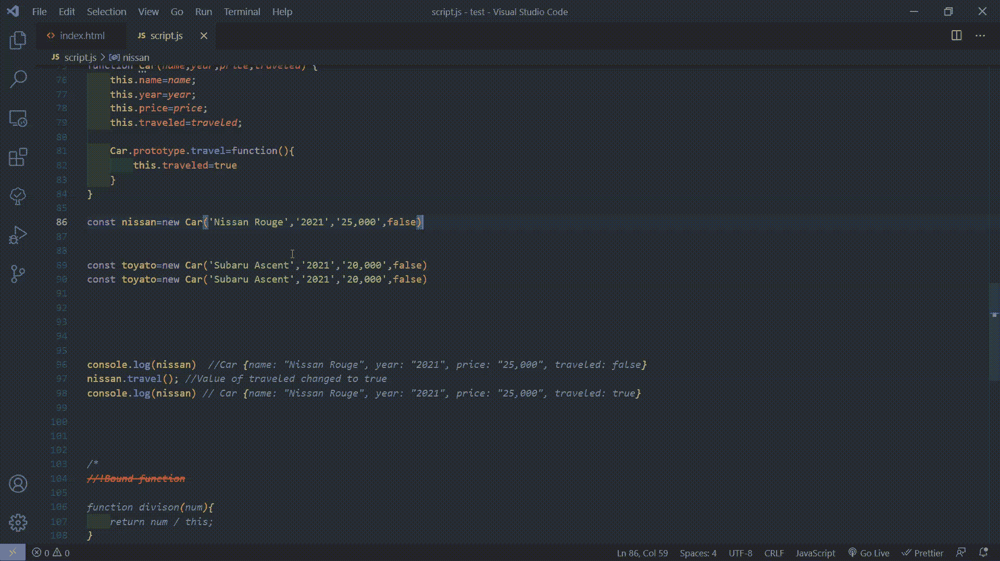
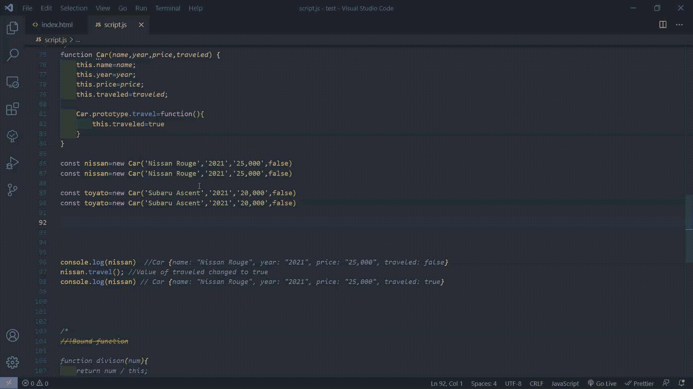
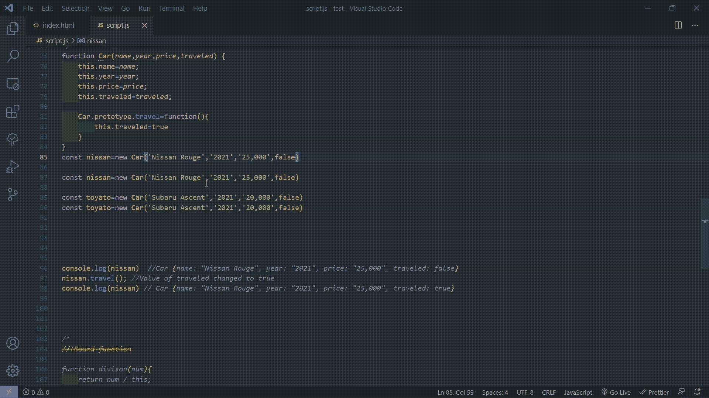
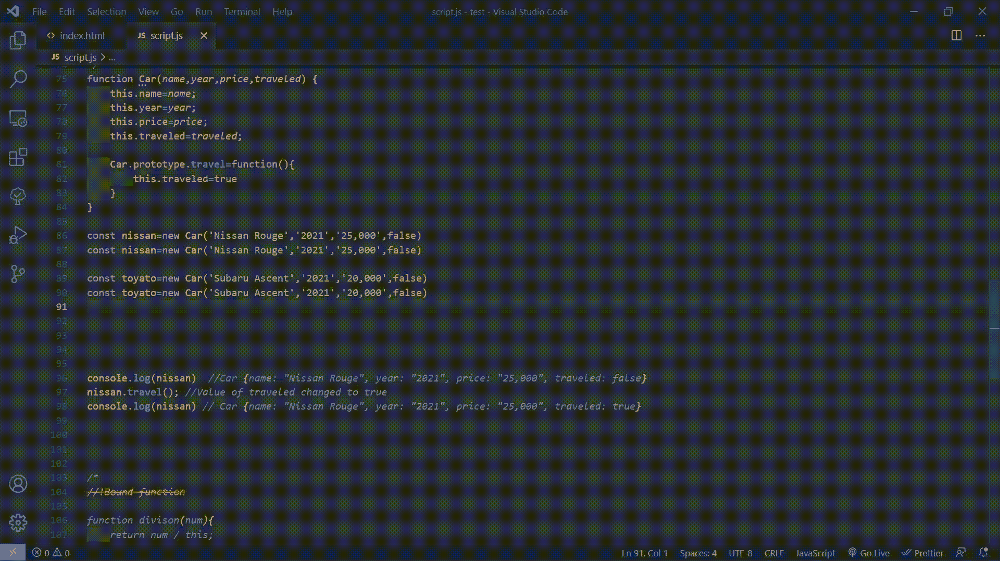
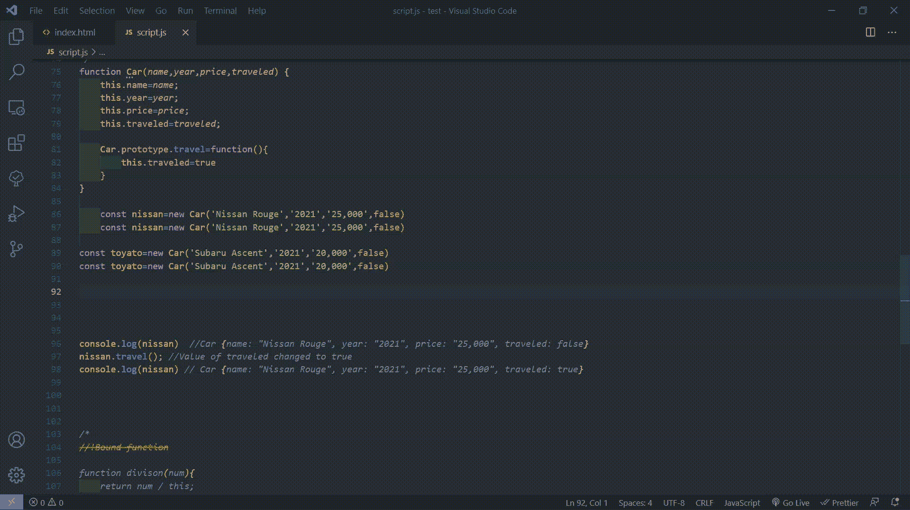
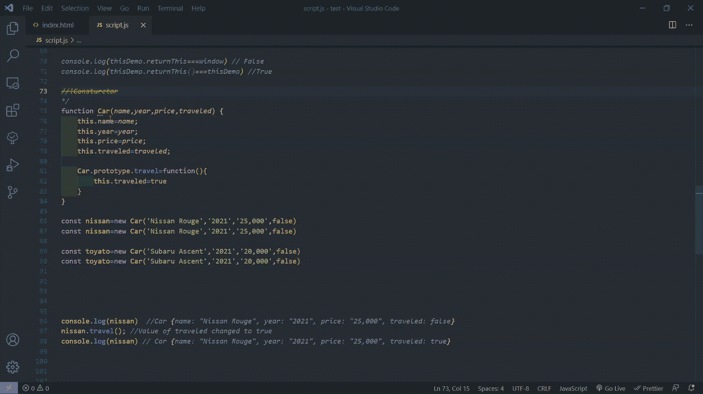

# 每个开发人员都应该知道的 10 个 VS 代码快捷键

> 原文：<https://blog.devgenius.io/10-vs-code-shortcuts-every-developer-should-know-f2d1058cfe8e?source=collection_archive---------3----------------------->

*可以极大提高你工作效率的简单快捷方式*

由 [Avinash Murugappan](https://unsplash.com/@avinash27?utm_source=medium&utm_medium=referral) 在 [Unsplash](https://unsplash.com?utm_source=medium&utm_medium=referral) 上拍摄

开发人员必须掌握许多技能。这些技能之一是生产力。提高效率的最简单的方法之一是在你选择的编辑器中学习快捷键，我已经编辑了一个快捷键列表，我相信每个开发人员都应该知道。

## 1.Shift+Crtl+Enter

*Shift+Control+Enter* 是一个快捷方式，允许你在当前选中的行上面插入一个新的空行。

## 2.crtl+回车

与前面的快捷键类似， *Crtl+Enter* 插入一个新的空行，但不是在当前选中行的下方。

## 3.Shift+Crtl+K

*Shift+Crtl+K* 删除全部选中的行。节省你的时间从垃圾邮件删除按钮

## 4.shift+Alt+向上

按下 *Shift+Alt* 和向上箭头可以复制当前选中行上面的行。

## *5。Shift+Alt+Down*

*Shift+Alt+**向下*箭头允许你复制当前选中行下面的行。

## 6.Alt+Up

按下 *Alt* 和*向上*箭头移动当前选中的阵容。

## 7.Alt +向下

与前面的快捷键类似，按下 *alt* 和 *down* 箭头将当前选中的行下移一格

## 8.Ctrl + ]

*Ctrl+]* 快捷键可以替代 tab 键，因为它用于*缩进*一行或所有选中的行

## 9.Ctrl + [

*Crtl+[* 快捷键与前一个快捷键相反，因为它*比*突出显示当前选中的行。

## 10.Shift+Crtl+\

使用函数时，最后一个快捷键 Shift+Crtl+\非常有用。通过使用此快捷方式，您可以跳转到与括号匹配的括号。你所要做的就是把你的光标放在你希望找到匹配的括号的右边。

## 结论

虽然这些并不是 VS 代码必须提供的所有快捷方式，但远非如此，这些快捷方式是掌握 VS 代码的使用并成为更有生产力的开发人员的重要的第一步。

祝您愉快！