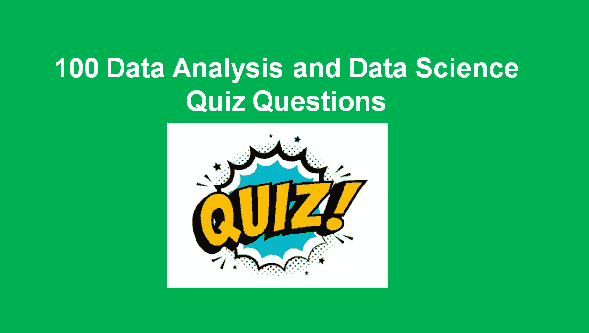

# 帮助你粉碎数据分析和数据科学工作面试的 100 个问题

> 原文：<https://blog.devgenius.io/100-questions-that-will-help-you-smash-your-data-analysis-and-data-science-job-interviews-1fca2bfd1908?source=collection_archive---------17----------------------->



以下是一些常见数据分析和数据科学问题的 100 个列表，并附有动态答案，有助于指导您的数据专业职业探索和知识获取。毫无疑问，数据分析和数据科学技能是需求量很大的技能之一，随着对这些技能的需求逐年增加，也需要人们具备正确的技能和知识，以进行专业工作面试和其他审查流程来担任这些角色。

这些问题旨在帮助[数据科学家网络(DSN)](https://www.datasciencenigeria.org/) 、哈科特港社区成员充分利用他们的数据专业技能，面向应届和有经验的候选人，以提高他们的知识，并为他们获得理想的工作做好准备。

这 100 个问题的结构是目标，答案以粗体显示，以帮助读者掌握问题的答案。读者也可以复制这些问题，并根据他们的个人实践进行重组:

1.  以下哪一项是原始数据的特征？ *A)* 数据已准备好进行分析**B)原始版本的数据** *C)* 易于用于数据分析 *D)* 以上均未提及
2.  以下哪一项不是数据分析的一个步骤？ *A)* 获取数据 *B)* 清理数据***C)*EDA***D)*都没有提到
3.  以下哪种编程语言用于数据分析？*A)*Tkinter*B****)*R*C****)*HTML*D)*都没有提到
4.  数据科学的主要目标是 _____？ *A)* 培养 AI 人才 *B)* 解决数学问题 ***C)* 获得洞察力** *D)* 制造机器
5.  数据科学等于编码？*真*或**或*假*或**
6.  数据科学 *A)* 编码 *B)* 统计 *C)* 领域知识***D)* 都没有提到**
7.  在数据科学领域，我们可以说呈现和探索是不同的？ ***真*** 或*假*
8.  以下哪一项不代表网络数据？*A)*Html*B)*JSON*T5**C)***XLSXD)XML
9.  以下哪一项不是用于数据分析的可视化工具？*A)*Tableau*B****)*YPlot***C)*power BI*D)*都没有提到
10.  哪一个不是数据科学和分析的主要挑战是 *A)* 数据不足 ***B)* 工具差** *C)* 数据质量差 *D)* 无关特性
11.  其中一个不是数据科学使用的主要编程语言*A)*R*B)*Python***C)*MS Excel***D)*SQL
12.  机器学习中的混淆矩阵有两个维度？ *A)* 实际和混合 ***B)* 实际和预测** *C)* 精确和具体 *D)* 预测和混淆
13.  深度学习涉及？ *A)* 涉及标签数据集的系统 *B)* 使用人工自然网络 *C)* 使用 Sklearn 进行机器学习 ***D)* 使用人工神经网络**
14.  以下是监督机器学习在现代商业中的应用，除了: *A)* 情感分析 *B)* 医疗诊断 ***C)* 模式检测** *D)* 欺诈检测
15.  亚马逊能够根据什么向客户推荐产品？ *A)* 由于识别模式的关联算法，客户需要质量参考 ***B)* 。** *C)* 它有一个满足所有客户需求的大平台 *D)* 许多客户访问亚马逊购买并告知他人他们的服务。
16.  以下是回归实例，除了？ *A)* 当变量在本质上是连续的 *B)* 估计一个产品的销售量 *C)* 估计降雨量***D)* 估计一个人的性别**
17.  在训练阶段通过构建多个决策树来运行的算法是？ *A)* 支持向量机 *B)* 决策树**C)随机森林**D)聚类
18.  以下算法可用于分类输出，除了？ *A)* 随机森林**B)K 均值聚类** *C)* KNN D)朴素贝叶斯
19.  给定一个客户数据数据库，要求您自动发现市场细分并将客户分组到不同的市场细分中。你会考虑什么样的机器学习方法？ *A)* 分类 ***B)* 无监督学习算法** *C)* 测试验证 *D)* 回归方法
20.  这种算法哪种可以用于聚类问题:*A)*PCA**B)KNN**C)随机森林 *D)* 决策树
21.  你正在经营一家公司，你想开发学习算法来解决一个软件的问题，以检查单个客户的帐户，并确定它是否已被黑客攻击和破坏。你将如何对待这个问题？ ***A)* 视为分类问题** *B)* 视为分类和回归两者 *C)* 视为回归问题 *D)* 视为无监督问题
22.  一种重要的机器学习，其中代理通过执行动作并查看结果来学习如何在环境中行为，称为？ *A)* 深度学习 *B)* 监督学习 ***C)* 强化学习** *D)* 非监督学习
23.  你想预测在接下来的 3 个月里这些商品会卖出多少，这是什么问题？a)分类与连续问题 *B)* 选择问题 C)决策树问题 **D)回归问题**
24.  给定一个被诊断为糖尿病或非糖尿病患者的数据集，我们可以使用哪种机器学习算法来开发这种模型？ *A)* 主成分分析 *B)* 线性回归***C)* 逻辑回归** *D)* 混淆矩阵
25.  假设你要建立一个程序，通过给定的答案过滤你的邮件，将它们标记为垃圾邮件或非垃圾邮件，在这个设置中的任务是什么？a)这不是机器学习问题 B)将模型答案拟合到一个算法 ***C)* 将邮件分类为垃圾邮件还是非垃圾邮件** *D)* 正确分类的邮件数量。
26.  以下是分类问题的性能指标，除了？ *A)* 混淆矩阵 *B)* F1 得分**C)RMSE**D)AUC
27.  以下是回归问题的性能指标，除了？ *A)* 平均绝对误差 **B)标准误差***C)* 均方差 *D)* R 的平方
28.  在获得数据后建立机器学习模型时，以下哪个步骤是最重要的步骤？ *A)* 模型评估 *B)* 模型训练 ***C)* 数据预处理** *D)* 数据摄取
29.  分类算法的一些最重要的应用如下，除了？ *A)* 语音识别 ***B)* 预测油价** *C)* 手写识别 *D)* 生物识别
30.  关于具有数据功能的机器学习模型的性能，以下哪项陈述是正确的？a)使用相关特征会降低模型的准确性 B)在数据建模之前执行未来选择会降低模型的准确性 **C)机器学习模型的性能与数据特征成正比** D)数据特征会导致模型中的过度拟合
31.  在数据帧中，每个变量都可以被看作？ ***A)* 元组** *B)* 列 C)行 D)实体
32.  下列关于 DataFrame 的说法哪一项是不正确的？a)它的核心 pandas 数据结构 **B)不同的值类型可以存在于单个列中** C)不同的列可以包含不同的数据类型 D)单个列中的值属于相同的数据类型。
33.  该方法的哪个子集数据帧使用行号和列号 A)。。loc[ ] B)。df[ ] **C)。。iloc[ ]** D)。都没有提到
34.  以下将给出数据帧 df 的前 5 个观察值，除了？A) df.head() **B)。df。**头(6)C)。df.head(5) D)。print(df.head())
35.  该方法将返回数字列的汇总统计信息。A) df.summary() B)。df.count() **C)。df.describe()** D)。df.stats()
36.  该属性返回行数后跟列数的元组。a)。df.columns B)。df。('行'，'列')C)。df.columns() **D)。df.shape**
37.  这将提取数据值的形式 2D numpy 数组？a)。df.extract()。 [df.np](http://df.np/) () **C)。这些都没有提到**
38.  这将返回列名。**a . df . columns**b . df . column _ names()c . df(columns)d .都没有提到
39.  要子集化多个列，df 的 column1 和 column2？A. df[(列)B. df.subset(列 1，列 2) **C. df[['列 1 '，'列 2 ']]**d . df[列 1，列 2]
40.  通过添加列 1 和列 2，将列 3 添加到数据帧 df 中，我们有:？a)。column3 = df[column1 + column2] B)。df[列 1+列 2] **C)。df['列 3'] =df['列 1'] +df['列 2']** D)。都没有提到
41.  要删除第 1 列中的重复行，我们使用？**一种)。df . drop _ duplicates(subset = ' column 1 ')**B)。df.drop(column1) C)。df.drop.duplicates.column1 D)。都没有提到
42.  要计算 df 数据帧的列 1 中的唯一值？a)。df.value.counts.column1 B **。df['列']。value_counts()** C)。df.values['column1']。count() D)。都没有提到
43.  要将 column1 设置为 df 的索引列？ *A)* df=column1.set_index B)。df = index _ column()***C)*df . set _ index(' column 1 '**)D)。都没有提到
44.  导入 matplotlib 的正确方法是？a)。将 matplotlib 作为 plt B)导入。导入 Matplotlib.pyplot **C)。导入 matplotlib.pyplot 作为 plt** D)。都没有提到
45.  下列哪一项将给出 df 的每一列中真正缺失值的计数？*A)*df . count _ missing _ values()**B)df . ISNA()。sum()***C)*df . sum(missing _ values)*D)*都没有提到
46.  您可以使用 pandas 函数将 csv 加载到数据帧中？a)。熊猫=load(csv) B)。PD . load _ CSV()***C)*PD . read _ CSV()**D)。都没有提到
47.  您可以使用？ **A) df.to_csv()** B)。df.write_to() C)。df.write_to_csv() D)。都没有提到
48.  这个方法允许变量像 groupby()方法 A)一样被分组。。sum() **B)。。pivot_table()** C)。avg() D)都没有提到
49.  plt.show()的作用是什么？ *A)* 显示类值 *B)* 显示空点 ***C)* 显示绘图** *D)* 以上均未提及
50.  它将一个值作为参数，并替换每个缺少的值。***A)*df . ffillna()***B)*df . fill _ na()*C)*df . replace()*D)*都没有提到
51.  结构化数据的重要特征是什么？a)。一般性 B)。维度 C)。分辨率 **D)。以上所有**
52.  有哪些数据质量问题的例子？ *A)* 噪声和异常值 *B)* 重复数据 *C)* 缺失值 ***D)* 以上所有**
53.  在标准化过程中，要素将使用？a)。均值 0，方差 0 B)。均值 0 和方差 1 **C)。均值 1 和方差 0** D)。均值 1 和方差 1
54.  哪一个是特征提取的例子？a)。构建单词袋模型 B)。缺失值的插补 **C)。主成分分析** D)。上述全部
55.  为什么我们需要特性转换？a)。将非数字特征转换成数字 B)。将输入调整到固定大小**。A 和 B 都** D)。没有人
56.  数据预处理的正确方式应该是？**一种)。插补- >特征缩放- >训练** B)。特征缩放- >插补- >训练 C)。特征缩放- >标签编码- >训练 D)。没有人
57.  一些插补方法有？**一)。平均值/中位数插补** B)。用随机数输入 C)。用一个 D 表示)。上述全部
58.  什么是虚拟变量陷阱？a)。虚拟变量之间的多重共线性 B)。一个变量预测另一个 **C)的值。A 和 B 都** D)。以上都不是
59.  以下哪项是特征缩放技术？a)。标准化 B)。正常化 C)。最小-最大缩放比例 **D)。以上所有**
60.  如何处理数据集中缺失的值？a)删除缺失的行或列 **B)用平均值/中值/众数值进行插补** C)将缺失值放入新的行或列 D)以上所有操作
61.  熊猫代表 _ _ _ _ _ _ _ _ _？ **A)面板数据** B)面板仪表板 C)面板数据分析师 D)面板数据分析
62.  熊猫的关键数据结构叫什么？A)数据框架 B)关键帧 C)统计学 D)计量经济学
63.  熊猫是一个开源的 _ _ _ _ _ _ _ _ _ 库？a)Java**B)Python**C)jquery D)Javascript
64.  Numpy 代表什么？**一)。数值 Python** B)。Python C 语言中的数字)。编号 Python D)。以上都不是
65.  Numpy 由谁开发？a)吉姆·胡古宁 B)韦斯·麦金尼 **C)特拉维斯·奥列芬特** D)吉多·范·罗苏姆
66.  以下哪个或哪些数字运算是正确的？a)与线性代数相关的运算。b)数组上的数学和逻辑运算。c)傅立叶变换和形状处理程序。 **D)以上所有**
67.  NumPy 经常和像？a)node . js B)SciPy C)Matplotlib**D)B 和 C 两者**
68.  NumPy 库中包含以下哪一项？a)傅立叶变换 B) n 维数组对象 C)集成 C/C++和 Fortran 代码的工具 **D)所有提到的**
69.  在检查类型组合输入和输出时，应该使用以下哪个属性？**答。类型** B)。C 类)。D)以上都不是
70.  以下哪个函数将 1D 数组作为列堆叠到 2D 数组中？**一)。列 _ 栈**B)com _ 栈 C)行 _ 栈 D)以上全部
71.  下面的结果是什么:int(3.99)**A)3.99**B)3c)3.9d)3.0
72.  以下运算的结果是什么:11//2a)5.5**B)5**C)5.6d)5.0
73.  下面的结果是什么？“你好迈克”。找(“麦克”)？ *A)* 6，7，8*B)*5**C)6**D)4，4
74.  考虑下面这个元组: *say_what= ('say '，' what '，' you '，' will')* 这是什么结果: *say_what[-1]* ？***A)*‘会’***B)*‘说’*C)*‘什么’*D)*‘你’
75.  考虑下面这个元组:A= (1，2，3，4，5)，这行代码的结果是什么:A[1:4]？*A)*【2，3，4，5】***B)*【2，3，4】***C)*【3，4，5】*D)*【1，2，3，4】
76.  考虑下面这个元组，A=(1，2，3，4，5)，下面这个 len(A)的结果是什么？*A)*4*B)*6**43】C)5**46】D)6
77.  考虑下面的列表，B=[1，2，[3，' a']，[4，' b']]下面的结果是什么:B[3] [1]？A) [4，' b'] B) "c" **C) "b"** D) [a，b]
78.  Dict = {"A" :1，" B" :"2 "，" C" :[3，3，3，]，" D":(4，4，4)，' E':5，' F' :6}下面的运算结果是什么:Dict["D"]？*A)*1*B)*【3，3，3】***C)*【4，4，4】***D)*4
79.  考虑以下集合:{"A "，" A"}，当 s wet 被创建时会有什么结果？***A)*{“A”}***B)*{“A”，“A”}*C)*(“A”，“A”)*D)*{ }
80.  下面的结果是什么:type(set([1，2，3])？A)设置 B)列表 C)字符串 D)字典
81.  你用什么方法将一个元素添加到集合中？a)附加 B)扩展 **C)添加** D)合并
82.  以下操作的结果是什么:{'a '，' b'} & {'a'}？ *A)* {'a '，' b'} *B)* {'a '，' B '，' A ' }***C)*{ ' A ' }***D)*{ }
83.  考虑包含一个元组和一个列表的元组 A= ((1)，[2，3]，[4])，下面这个操作的结果是什么:A[2]？**A)**B)【2，3】C)1d)【1，2，3，4】
84.  考虑包含一个元组和列表的元组 A= ((11，12)，[21，22])，下面的结果是什么:A[0][1]？21 B) 11 **C) 12** D) 22
85.  考虑下面这个列表，A= ["hard rock "，10，1.2]下面这个命令运行后，列表 A 会包含什么:del(A[1])？*A)*【10，1.2】***B)*【《硬摇滚》，1.2】***C)*【《硬摇滚》，10】*D)*【10】
86.  这个逻辑的结果是什么:真还是假？ **A)真** B)假**C)两者都有**D)无****
87.  为什么我们要使用异常处理程序？a)写文件 B)读文件 **C)捕捉**程序中的错误 D)终止程序
88.  以下哪项技能不属于数据科学技能 A)讲故事 B)批判性思维 **C)哲学** D)统计学
89.  以下哪一项最能定义数据科学家？ *A)* 将原始数据转换为可用数据 *B)* 推动有益于业务的决策 ***C)* 使用数据产生洞察力** *D)* 使用洞察力推动业务决策
90.  人工智能是机器学习的子集？真或**假**
91.  以下哪个陈述是正确的？ *A)* 数据科学与人工智能相同 *B)* 深度学习是数据科学的保护伞 ***C)* 数据科学使用 AI，机器学习和深度学习** *D)* 所有提到的
92.  以下是制作数据的方式除: ***A)* 可视化** *B)* Web 报废 *C)* 实验 *D)* 调查
93.  大数据涉及 3v、速度、量和种类，以下哪种说法是正确的？ ***A)* 数据科学与大数据的 3v 有关***B)* 数据科学与大数据无关 *C)* 数据科学只能与大数据的量有关。 *D)* 数据科学只能与各种各样的大数据联系起来
94.  统计学和数据科学有什么共同点？ *A)* 机器学习 ***B)* 分析**C)深度学习 *D)* 编码
95.  分析的最终目的是什么: *A)* 传播数据科学 *B)* 促进销售和营销之间的会议 ***C)* 向相关人员传达调查结果** *D)* 生成报告
96.  数据科学家执行了以下哪项操作？***A)* 定义问题** *B)* 创建可重现的代码 *C)* 挑战结果 *D)* 所有提到的
97.  机器学习模型中的训练集是什么？ *A)* 用于测试准确性 *B)* 是数据集的 30%***C)*是模型中使用的标签数据** *D)* 用于验证数据集
98.  下面几行代码的输出是什么？

```
a=1
def do(x):
  return (x+a)
print(do(1))

A) 2 B) 3 C) 1 D) 0
```

**A)2**B)3**C)1**D)0****

99.以下内容的输出是什么:

```
for x in ['A', 'B', 'C']: 
     print(x+'A')

A) xA
   xB
   xC

B) AA
   BA
   CA

C) A, B, C

D) AA, BA, CA
```

*A)****B)****C)D)*

100.以下几行代码的输出是什么:

```
x=0
while(x<2):
    print(x)
x=x+1

A) 0
   1
B) 0
   1
   2
C) 1, 2, 3
D) 0
```

***A)***B)C)D)

我相信这 100 个问题有助于增强您的数据科学和数据分析专业职业追求。祝你职业生涯好运。

**关于作者**

福音 Orok 是一名数据专家，也是一名 AI 爱好者，拥有电子商务和工程行业的工作经验。他还是数据分析、数据科学和数据工程专业技能的倡导者，以提供高影响力的解决方案。他目前是[数据科学家网络](http://www.datasciencenigeria.org/) (DSN)的社区领导之一。他愿意与组织和个人合作，建立一个人工智能生态系统，开发高人类能力的影响。

欢迎加入 [**DSN**](http://www.datasciencenigeria.org/) 社区，也可以通过 [Linkedin](https://www.linkedin.com/in/orokgospel) 和 Twitter[Orok 福音](https://twitter.com/iamorokgospel)与我联系